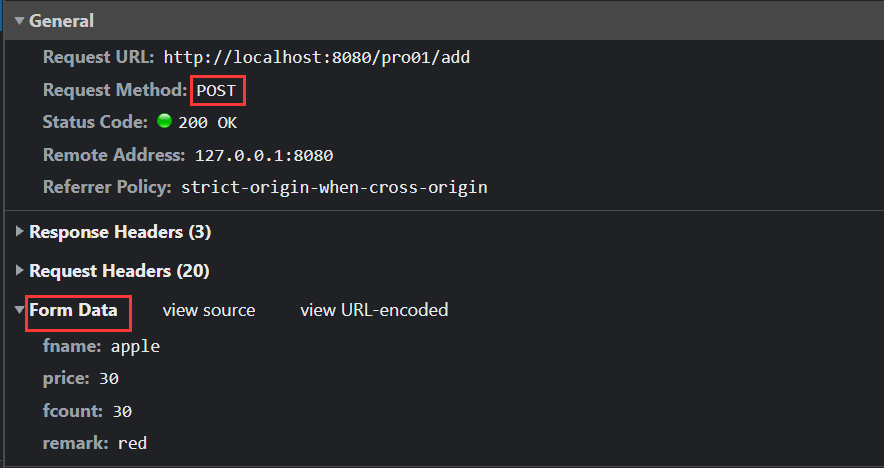
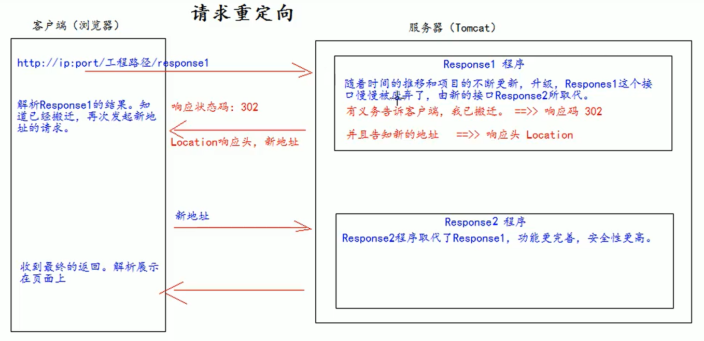

## XML

可扩展的标记性语言


xml 的主要作用有： 

1、用来保存数据，而且这些数据具有自我描述性

2、它还可以做为项目或者模块的配置文件

3、还可以做为网络传输数据的格式（现在 JSON 为主）


## Tomcat

### 启动

运行Bin目录下的startup.bat，用命令行，不然会闪退


### 项目部署

webapps--->新建WEB-INF，一个基本的web项目就建成了

将项目文件放在和WEB-INF同级的文件夹下

通过http://localhost:8080/study-online/index.html访问


### idea新建web项目

新建java项目

new module--->add framework support--->勾选web application

configurations里添加Tomcat

Deployment（部署）中，添加项目模块，Application Context就是上面的context root，即项目在服务器上的访问路径，例如/pro01就是替换http://localhost:8080/study-online/index.html中的/study-online


Server


on ‘update‘ action：当用户主动执行更新的时候更新　快捷键:Ctrl + F9

on frame deactication:在编辑窗口失去焦点的时候更新


### 导包


## Web中的相对路径和绝对路径 

在 javaWeb 中，路径分为相对路径和绝对路径两种

绝对路径： http://ip:port/工程路径/资源路径  

| 相对路径 |                 |
| -------- | --------------- |
| .        | 当前目录        |
| ..       | 上一级目        |
| 资源名   | 当前目录/资源名 |

在实际开发中，路径都使用绝对路径，而不简单的使用相对路径

1、绝对路径 

2、base+相对 

### web中 / 的不同意义 

在 web 中 / 是一种==绝对路径==

/ 如果被浏览器解析，得到的地址是：http://ip:port/ 

```html
<a href="/"> 斜杠 </a> 
```

/ 如果被服务器解析，得到的地址是：http://ip:port/工程路径，==映射到代码的web目录==

```xml
<url-pattern>/servlet1</url-pattern> 

servletContext.getRealPath(“/”); 

request.getRequestDispatcher(“/”); 
```

==特殊情况==：把斜杠发送给浏览器解析，得到 http://ip:port/

```java
response.sendRediect(“/”); 
```


## Http协议

协议：双方，或多方，相互约定好，大家都需要遵守的规则

HTTP协议：

- 超文本传输协议，是客户端和服务器之间通信时，发送的数据，需要遵守的规则
- 协议中的数据又叫报文

- 特点：Http是无状态的

Http请求响应包含两个部分：

- 请求：客户端给服务器发送数据叫请求
  - 请求又分为 GET 请求，和 POST 请求两种 
- 响应：服务器给客户端回传数据叫响应

### 请求

请求行：
- 请求的方式 
- 请求的URL
- 请求的协议（一般都是HTTP1.1）


请求消息头：key:value组成，包含了很多客户端需要告诉服务器的信息，比如：我的浏览器型号、版本、我能接收的内容的类型、我给你发的内容的类型、内容的长度等等

常用请求头：
- Accept：表示客户端可以接收的数据类型 
- Accept-Language：表示客户端可以接收的语言类型 
- User-Agent：表示客户端浏览器的信息 
- Host：表示请求时的服务器 ip 和端口号


请求体：
- get 方式，没有请求体，但有一个 queryString
- post 方式，有请求体，form data
- json 格式，有请求体，request payload





**哪些是** **GET** **请求，哪些是** **POST** **请求** 

GET ： 

​	form 标签 method=get 

​	a 标签 

​	link 标签引入 css 

​	Script 标签引入 js 文件 

​	img 标签引入图片 

​	iframe 引入 html 页面 

​	在浏览器地址栏中输入地址后敲回车 

POST： 

​	form 标签 method=post


### 响应

响应行：

- 响应的协议和版本号 

- 响应状态码

- 响应状态描述符


响应头：

- key:value，包含了服务器的信息，服务器发送给浏览器的信息（内容的媒体类型、编码、内容长度等）

  

响应体：

- 回传给客户端的数据（请求add.html页面时，响应的内容就是<html><head><body><form>....）

  

​	

**常见响应状态码**

作用：以编码的形式告诉浏览器当前请求处理的结果

| 状态码 | 含义                                                      |
| ------ | --------------------------------------------------------- |
| 200    | 服务器成功处理了当前请求，成功返回响应                    |
| 302    | 重定向                                                    |
| 400    | [SpringMVC特定环境]请求参数问题                           |
| 403    | 没有权限                                                  |
| 404    | 找不到目标资源                                            |
| 405    | 请求方式和服务器端对应的处理方式不一致                    |
| 406    | [SpringMVC特定环境]请求扩展名和实际返回的响应体类型不一致 |
| 50X    | 服务器端内部错误，通常都是服务器端抛异常了                |

404产生的具体原因：

- 访问地址写错了，确实是没有这个资源
- 访问了WEB-INF目录下的资源
- Web应用启动的时候，控制台已经抛出异常，导致整个Web应用不可用，访问任何资源都是404
- 服务器端缓存


## Servlet（Server Applet）

**什么是 Servlet** 

Servlet 是 JavaEE 规范之一，规范就是接口 

Servlet 是运行在服务器上的一个 java 小程序，它可以接收客户端发送过来的请求，并响应数据给客户端

Servlet 是 JavaWeb 三大组件之一，三大组件分别是：Servlet 程序、Filter 过滤器、Listener 监听器


### 第一个Servlet程序

1. 编写一个类去实现 Servlet 接口 

2. 实现 service 方法，处理请求，并响应数据 

   ```java
   public class HelloServlet implements Servlet {
       //service 方法是专门用来处理请求和响应的
       @Override
       public void service(ServletRequest servletRequest, ServletResponse servletResponse) throws ServletException, IOException {
           System.out.println("Hello Servlet 被访问了");
       }
   }
   ```

3. 到 web.xml 中去配置 servlet 程序的访问地址

   ```xml
   <?xml version="1.0" encoding="UTF-8"?>
   <web-app xmlns="http://xmlns.jcp.org/xml/ns/javaee" xmlns:xsi="http://www.w3.org/2001/XMLSchema-instance"
            xsi:schemaLocation="http://xmlns.jcp.org/xml/ns/javaee http://xmlns.jcp.org/xml/ns/javaee/web-app_4_0.xsd"
            version="4.0">
       <!-- servlet 标签给 Tomcat 配置 Servlet 程序 -->
       <servlet>
           <!--Servlet 程序起一个别名（一般是类名） -->
           <servlet-name>HelloServlet</servlet-name>
           <!--Servlet 程序的全类名-->
           <servlet-class>com.atguigu.servlet.HelloServlet</servlet-class>
       </servlet>
   
       <!--servlet-mapping 标签给 servlet 程序配置访问地址-->
       <servlet-mapping>
           <!--告诉服务器，我当前配置的地址给哪个 Servlet 程序使用-->
           <servlet-name>HelloServlet</servlet-name>
           <!--配置访问地址 -->
           <url-pattern>/hello</url-pattern>
       </servlet-mapping>
   </web-app>
   ```


#### url 地址到 Servlet 程序的访问


#### GET 和 POST 请求的分发处理 

用get和post请求分别测试下

```java
public class HelloServlet implements Servlet {
  
    @Override
    public void service(ServletRequest servletRequest, ServletResponse servletResponse) throws ServletException, IOException {
        System.out.println("servletRequest的运行类型：" + servletRequest.getClass());
        //向下转型，httpServletRequest有getMethod()
        HttpServletRequest httpServletRequest = (HttpServletRequest) servletRequest;
        String method = httpServletRequest.getMethod();
        System.out.println(method);

        if ("Get".equals(method)) {
            doGet();
        }else if ("POST".equals(method)){
            doPost();
        }
    }

    //做 get 请求的操作
    public void doGet() {
        System.out.println("get 请求");
    }

    //做 post 请求的操作
    public void doPost() {
        System.out.println("post 请求");
    }

		//其余未重写的方法...
}
```


#### 通过继承 HttpServlet 实现 Servlet 程序 

一般在实际项目开发中，都是使用继承 HttpServlet 类的方式去实现 Servlet 程序

```java
public class HelloServlet2 extends HttpServlet {
  
    @Override
    protected void doGet(HttpServletRequest req, HttpServletResponse resp) throws ServletException, IOException {
        System.out.println("HelloServlet2 的 doGet 方法");
    }

    @Override
    protected void doPost(HttpServletRequest req, HttpServletResponse resp) throws ServletException, IOException {
        System.out.println("HelloServlet2 的 doPost 方法");
    }
  
}
```


### Servlet的继承体系

javax.servlet.Servlet接口

​    javax.servlet.GenericServlet抽象类

​        javax.servlet.http.HttpServlet抽象子类


#### 相关方法（重点：service）

javax.servlet.Servlet接口:

​        void init(config) - 初始化方法

​        void service(request,response) - 服务方法

​        void destory() - 销毁方法

javax.servlet.GenericServlet抽象类：

​        void service(request,response) - 仍然是抽象的

​        javax.servlet.http.HttpServlet 抽象子类：

​        void service(request,response) - 不是抽象的


当有请求过来时，service方法会自动响应（其实是tomcat容器调用的）

在HttpServlet中我们会去分析请求的方式：是get、post、head还是delete等等，然后再决定调用哪个do开头的方法

在HttpServlet中这些do方法默认都是405的实现风格：要我们子类去实现对应的方法，否则默认会报405错误

因此，我们在新建Servlet时，我们才会去考虑请求方法，从而决定重写哪个do方法

```java
//HttpServlet.class
protected void service(HttpServletRequest req, HttpServletResponse resp) throws ServletException, IOException {
    String method = req.getMethod(); //获取请求的方式
    long lastModified;
  	//各种if判断，根据请求方式不同，决定去调用不同的do方法
    if (method.equals("GET")) {
        ......
        }
    } else if (method.equals("HEAD")) {
        lastModified = this.getLastModified(req);
        this.maybeSetLastModified(resp, lastModified);
        this.doHead(req, resp);
    } else if (method.equals("POST")) {
        this.doPost(req, resp);
    } else if (method.equals("PUT")) {
        this.doPut(req, resp);
    } else if (method.equals("DELETE")) {
        this.doDelete(req, resp);
    } else if (method.equals("OPTIONS")) {
        this.doOptions(req, resp);
    } else if (method.equals("TRACE")) {
        this.doTrace(req, resp);
    } else {
        String errMsg = lStrings.getString("http.method_not_implemented");
        Object[] errArgs = new Object[]{method};
        errMsg = MessageFormat.format(errMsg, errArgs);
        resp.sendError(501, errMsg);
    }
}
```

在HttpServlet这个抽象类中，do方法都差不多

```java
protected void doPost(HttpServletRequest req, HttpServletResponse resp) throws ServletException, IOException {
    String protocol = req.getProtocol();
    String msg = lStrings.getString("http.method_post_not_supported");
    if (protocol.endsWith("1.1")) {
        resp.sendError(405, msg);
    } else {
        resp.sendError(400, msg);
    }
}

protected void doGet(HttpServletRequest req, HttpServletResponse resp) throws ServletException, IOException {
    String protocol = req.getProtocol();
    String msg = lStrings.getString("http.method_get_not_supported");
    if (protocol.endsWith("1.1")) {
        resp.sendError(405, msg);
    } else {
        resp.sendError(400, msg);
    }
}
```


### Servlet的生命周期

1、执行 Servlet 构造器方法 

2、执行 init 初始化方法 

​		第一、二步，是在第一次访问的时候创建 Servlet 程序会调用。 

​		Servlet实例tomcat只会创建一个，所有的请求都是这个实例去响应。

3、执行 service 方法 

​		第三步，每次访问都会调用。 

4、执行 destroy 销毁方法 

​		第四步，在 web 工程停止的时候调用

```java
public class Demo01Servlet extends HttpServlet {
    public Demo01Servlet(){
        System.out.println("正在实例化");
    }

    @Override
    public void init() throws ServletException {
        System.out.println("正在初始化...");
    }

    @Override
    protected void service(HttpServletRequest req, HttpServletResponse resp) throws ServletException, IOException {
        System.out.println("正在服务");
    }

    @Override
    public void destroy() {
        System.out.println("正在销毁");
    }

```

好处：提高系统的启动速度

缺点：第一次请求时，耗时较长

结论： 如果需要提高系统的启动速度，当前默认情况就是这样。如果需要提高响应速度，我们应该设置Servlet的初始化时机


#### Servlet的初始化时机

默认是第一次接收请求时，实例化，初始化

我们可以通过<load-on-startup>来设置servlet启动的先后顺序，数字越小，启动越靠前，最小值0

```java
<servlet>
    <servlet-name>Demo01Servlet</servlet-name>
    <servlet-class>com.boer.servlets.Demo01Servlet</servlet-class>
    <load-on-startup>1</load-on-startup>
</servlet>
```

可以看到tomcat容器加载完，servlet已经实例化、初始化，第一次请求直接服务

```
正在实例化
正在初始化...
[2022-01-31 11:40:11,234] Artifact 01-javaweb-begin:war exploded: Artifact is deployed successfully
[2022-01-31 11:40:11,235] Artifact 01-javaweb-begin:war exploded: Deploy took 6,237 milliseconds
[2022-01-31 11:40:11,745] Artifact 02-javaweb-servlet:war exploded: Artifact is deployed successfully
[2022-01-31 11:40:11,745] Artifact 02-javaweb-servlet:war exploded: Deploy took 6,746 milliseconds
正在服务
正在服务
正在服务
```


### ServletConfig类

ServletConfig 类从类名上来看，就知道是 Servlet 程序的配置信息类

Servlet 程序和 ServletConfig 对象都是由 Tomcat 负责创建，我们负责使用 

Servlet 程序默认第一次访问时创建，==ServletConfig是每个 Servlet 程序创建时，就创建一个对应的ServletConfig 对象==


#### 三大作用

1. 可以获取 Servlet 程序的别名 servlet-name 的值 
2. 获取初始化参数 init-param 
3. 获取 ServletContext 对象 

```java
public class HelloServlet3 implements Servlet {

    @Override
    public void init(ServletConfig servletConfig) throws ServletException {
        System.out.println("init初始化方法");
        //获取别名
        System.out.println(servletConfig.getServletName()); //HelloServlet3
        //获取初始化参数
        System.out.println(servletConfig.getInitParameter("username")); //root
        System.out.println(servletConfig.getInitParameter("url")); //jdbc:mysql://localhost:3306/test
        //获取servletContext对象
        System.out.println(servletConfig.getServletContext()); //org.apache.catalina.core.ApplicationContextFacade@ae59168
    }
}
```

```xml
<servlet>
    <servlet-name>HelloServlet3</servlet-name>
    <servlet-class>com.boer.servlets.HelloServlet3</servlet-class>
    
    <!-- 初始化参数，可配置多组 -->
    <init-param>
        <param-name>username</param-name>
        <param-value>root</param-value>
    </init-param>
    <init-param>
        <param-name>url</param-name>
        <param-value>jdbc:mysql://localhost:3306/test</param-value>
    </init-param>
</servlet>
```


#### 重写init()方法注意

```java
public class HelloServlet4 extends HttpServlet {
    @Override
    public void init(ServletConfig config) throws ServletException {
        //重写带参init后必须调用父类的init，不然Config传不过来
        super.init(config);
        /* GenericServlet的init(config)
        public void init(ServletConfig config) throws ServletException {
            this.config = config;
            this.init();
        }
         */
    }

    @Override
    protected void doGet(HttpServletRequest req, HttpServletResponse resp) throws ServletException, IOException {
        //这里也可以调用
        ServletConfig servletConfig = getServletConfig();
        System.out.println(servletConfig.getServletName());
    }
}
```


### ServletContext类

ServletContext 是一个接口，它表示 Servlet 上下文对象 

==一个 web 工程，只有一个==ServletContext 对象实例。

ServletContext 对象是一个域对象

ServletContext 是在 web 工程部署启动的时候创建。在 web 工程停止的时候销毁


#### 什么是域对象? 

域对象，是可以像 Map 一样存取数据的对象，叫域对象 

这里的域指的是存取数据的操作范围：整个 web 工程。

|        | 存数据         | 取数据         | 删除数据          |
| ------ | -------------- | -------------- | ----------------- |
| Map    | put()          | get()          | remove()          |
| 域对象 | setAttribute() | getAttribute() | removeAttribute() |


#### 四个作用

1. 获取 web.xml 中配置的上下文参数 context-param 
2. 获取当前的工程路径，格式: /工程路径 
3. 获取工程部署后在服务器硬盘上的绝对路径 
4. 像 Map 一样存取数据

```java
public class ContextServlet extends HttpServlet {
    @Override
    protected void doGet(HttpServletRequest req, HttpServletResponse resp) throws ServletException, IOException {
        ServletContext context = getServletContext();
        //获取上下文参数
        System.out.println(context.getInitParameter("username"));
        System.out.println(context.getInitParameter("password"));
        //获取当前工程路径 /01_javaweb_begin_war_exploded
        System.out.println(context.getContextPath());
        //获取工程部署后在服务器硬盘上的路径
        //  /斜杠被服务器解析地址为 http://ip:port/工程名/ 映射到IDEA代码的web目录
        System.out.println(context.getRealPath("/"));
        // D:\Boer\ideaWork2021\javaweb-learn\out\artifacts\01_javaweb_begin_war_exploded\
        System.out.println("工程下 css 目录的绝对路径是:" + context.getRealPath("/css"));
        System.out.println("工程下 imgs 目录 1.jpg 的绝对路径是:" + context.getRealPath("/imgs/1.jpg"));
    }
}
```

```xml
<!-- 上下文参数（属于整个web项目）-->
<context-param>
    <param-name>username</param-name>
    <param-value>context</param-value>
</context-param>
<context-param>
    <param-name>password</param-name>
    <param-value>root</param-value>
</context-param>
```

像Map一样存取数据

```java
public class ContextServlet2 extends HttpServlet {
    @Override
    protected void doGet(HttpServletRequest req, HttpServletResponse resp) throws ServletException, IOException {
        ServletContext context=getServletContext();
        System.out.println(context.getAttribute("key1"));
        context.setAttribute("key1","value1");
        System.out.println(context.getAttribute("key1"));
    }
}
```

```java
public class ContextServlet3 extends HttpServlet {
    @Override
    protected void doGet(HttpServletRequest req, HttpServletResponse resp) throws ServletException, IOException {
        ServletContext context = getServletContext();
        System.out.println(context.getAttribute("key1"));
    }
}
```


### 单例、线程

Servlet在容器中是：==单例的、线程不安全的==

单例：所有的请求都是同一个实例去响应

线程不安全：一个线程需要根据这个实例中的某个成员变量值去做逻辑判断。但是在中间某个时机，另一个线程改变了这个成员变量的值，从而导致第一个线程的执行路径发生了变化

我们已经知道了servlet是线程不安全的，尽量不要在servlet中定义成员变量。

如果不得不定义成员变量，那么 不要去修改成员变量的值，不要去根据成员变量的值做一些逻辑判断


### HttpServletRequest 类

每次只要有请求进入 Tomcat 服务器，Tomcat 服务器就会把请求过来的 HTTP 协议信息解析好封装到 Request 对象中。 

然后传递到 service 方法（doGet 和 doPost）中给我们使用。我们可以通过 HttpServletRequest 对象，获取到所有请求的信息


#### 常用方法 

> getParameter() 和 getAttribute() 区别：
> 1、getParameter只能返回字符串，getAttribute可以返回任意类型
> 2、getParameter获取的是客户端比如浏览器的数据，getAttribute获取的是服务器设置的数据

获取路径相关方法

```java
getRequestURI() //获取请求的资源路径 

getRequestURL() //获取请求的统一资源定位符（绝对路径） 

getRemoteHost() //获取客户端的 ip 地址 

getContextPath() //返回当前页面所在的应用的名字，即获取当前工程路径，是jsp中获取路径的一种方式
```

getHeader() 获取请求头 

getParameter() 获取请求的参数 

getParameterValues() 获取请求的参数（多个值的时候使用） 

getMethod() 获取请求的方式 GET 或 POST 

setAttribute(key, value); 设置域数据 

getAttribute(key); 获取域数据 

getRequestDispatcher() 获取请求转发对象 

```java
public class HelloServlet2 extends HttpServlet {
    @Override
    protected void doGet(HttpServletRequest req, HttpServletResponse resp) throws ServletException, IOException {
      	System.out.println("URI => " + req.getRequestURI()); 
      	//URI =>/01_javaweb_begin_war_exploded/hello2
    
        System.out.println("URL => " + req.getRequestURL()); 
        //URL => http://localhost:8080/01_javaweb_begin_war_exploded/hello2
      
        System.out.println("客户端 ip 地址 => " + req.getRemoteHost()); 
        //客户端 ip 地址 => 127.0.0.1
      
        System.out.println("请求头 User-Agent ==>> " + req.getHeader("User-Agent"));
      
        System.out.println("请求的方式 ==>> " + req.getMethod());
    }
}
```


#### 获取请求参数

```html
<form action="add" method="get">
    用户名：<input type="text" name="username"><br/>
    密码：<input type="password" name="password"><br/>
    兴趣爱好：
    <input type="checkbox" name="hobby" value="cpp">C++
    <input type="checkbox" name="hobby" value="java">Java
    <input type="checkbox" name="hobby" value="js">JavaScript<br/>
    <input type="submit">
</form>
```

```java
@Override
protected void doPost(HttpServletRequest req, HttpServletResponse resp) throws ServletException, IOException {
    // 获取请求参数
    String username = req.getParameter("username");
    String password = req.getParameter("password");
    String[] hobby = req.getParameterValues("hobby");
    System.out.println("用户名：" + username);
    System.out.println("密码：" + password);
    System.out.println("兴趣爱好：" + Arrays.asList(hobby));
}
```


#### POST 请求的中文乱码解决

在获取请求参数之前调用setCharacterEncoding才有用

```java
@Override
protected void doPost(HttpServletRequest req, HttpServletResponse resp) throws ServletException, IOException {
    // 设置请求体的字符集为 UTF-8，从而解决 post 请求的中文乱码问题
    req.setCharacterEncoding("UTF-8");
    // 获取请求参数
    String username = req.getParameter("username");
    System.out.println("用户名：" + username);
}
```


### 请求的转发

当浏览器向服务器发送请求后，一个servlet接收浏览器发送的请求，这个servlet将该请求又发送到服务器中的其他servlet或其他文件中

```java
request.getRequestDispatcher("...").forward(request,response);
```

**特点：**

- 一次请求响应的过程，对于客户端而言，内部经过了多少次转发，客户端是不知道的

- 地址栏没有变化

- ==共享Request域中的数据==
- 可以转发到WEB-INF目录下

- 不能访问工程以外的资源（http://www.baidu.com）


```java
public class Servlet1 extends HttpServlet {
    @Override
    protected void doGet(HttpServletRequest req, HttpServletResponse resp) throws ServletException, IOException {
        // 获取请求的参数，在url中设置请求参数
        String username = req.getParameter("username");
        System.out.println("在 Servlet1（柜台 1）中查看参数（材料）：" + username);
        // 设置域数据
        req.setAttribute("key1", "柜台 1 的章");
        // 请求转发必须要以斜杠打头，/ 斜杠表示地址为：http://ip:port/工程名/ , 映射到 IDEA 代码的 web 目录
        RequestDispatcher requestDispatcher = req.getRequestDispatcher("/servlet2");
      	// 不能访问工程以外的资源
        //RequestDispatcher requestDispatcher = req.getRequestDispatcher("http://www.baidu.com");
        requestDispatcher.forward(req, resp);
    }
}
```

```java
public class Servlet2 extends HttpServlet {
    @Override
    protected void doGet(HttpServletRequest req, HttpServletResponse resp) throws ServletException, IOException {
        // 获取请求的参数
        String username = req.getParameter("username");
        System.out.println("在 Servlet2（柜台 2）中查看参数（材料）：" + username);
        // 获取获取域数据
        Object key1 = req.getAttribute("key1");
        System.out.println("柜台 1 是否有章：" + key1);
    }
}
```


#### Base标签

在index.html中分别用连接和请求转发的方式跳转到c.html页面

```html
<body>
这是web下的index.html<br>
<a href="a/b/c.html">a/b/c</a><br>
<!--请求转发-->
<a href="forwardC">a/b/c</a>
</body>
```

c.html跳转回index.html

```html
<body>
  这是a下的b下的c.html页面<br>
  <a href="../../index.html">跳回首页</a>
</body>
```

现存问题：

请求转发后浏览器路径会变，导致无法跳转回c.html

base标签可以设置当前页面中所有相对路径工作时，参照哪个路径来跳转

c.html中添加<base href="http://localhost:8080/01_javaweb_begin_war_exploded/a/b/">

```html
<!DOCTYPE html>
<html lang="en">
<head>
    <meta charset="UTF-8">
    <title>Title</title>
    <base href="http://localhost:8080/01_javaweb_begin_war_exploded/a/b/">
</head>
<body>
这是a下的b下的c.html页面<br>
<a href="../../index.html">跳回首页</a>
</body>
</html>
```


### HttpServletResponse 类 

每次请求进来，Tomcat 服务器都会创建一个 Response 对象传递给 Servlet 程序去使用。

HttpServletRequest 表示请求过来的信息，HttpServletResponse 表示所有响应的信息 

我们如果需要设置返回给客户端的信息，都可以通过 HttpServletResponse 对象来进行设置


#### 获取流

字节流	getOutputStream(); 	常用于下载（传递二进制数据） 

字符流 	getWriter(); 	常用于回传字符串（常用） 

两个流同时只能使用一个，使用了字节流，就不能再使用字符流，反之亦然，否则就会报错。 

```java
@Override
protected void doGet(HttpServletRequest req, HttpServletResponse resp) throws ServletException, IOException {
    resp.getWriter();
    resp.getOutputStream();
    //报错：getWriter() has already been called for this response
}
```


#### 往客户端回传数据 

```java
@Override
protected void doGet(HttpServletRequest req, HttpServletResponse resp) throws ServletException, IOException {
    // PrintWriter getWriter() throws IOException;
    PrintWriter writer = resp.getWriter();
    writer.write("response content");
}
```


#### 响应的乱码解决

方式一（不推荐）

```java
@Override
protected void doGet(HttpServletRequest req, HttpServletResponse resp) throws ServletException, IOException {
    //设置服务器字符集为 UTF-8
    resp.setCharacterEncoding("UTF-8");
    //通过响应头，设置浏览器也使用 UTF-8 字符集
    resp.setHeader("Content-Type", "text/html; charset=UTF-8");

    PrintWriter writer = resp.getWriter();
    writer.write("中文");
}
```

方式二

```java
@Override
protected void doGet(HttpServletRequest req, HttpServletResponse resp) throws ServletException, IOException {
    // 它会同时设置服务器和客户端都使用 UTF-8 字符集，还设置了响应头
    // 此方法一定要在获取流对象之前调用才有效
    resp.setContentType("text/html; charset=UTF-8");

    PrintWriter writer = resp.getWriter();
    writer.write("中文");
}
```


### 请求重定向

客户端给服务器发请求，然后服务器告诉客户端说，我给你一些地址，你去新地址访问，叫请求重定向



**特点：**

​	浏览器地址栏会变化

​	两次请求响应的过程，客户端知道请求URL有变化

​	不共享Request域中数据

​	不能访问WEB-INF下的资源（该目录下的资源浏览器是不能直接访问的）

​	可以访问工程外资源（https://www.baidu.com）

方式一

```java
public class Response1 extends HttpServlet {
    @Override
    protected void doGet(HttpServletRequest req, HttpServletResponse resp) throws ServletException, IOException {
        System.out.println("Response1到此一游");
        resp.setStatus(302);
        resp.setHeader("Location","http://localhost:8080/01_javaweb_begin_war_exploded/response2");
        //resp.setHeader("Location","http://localhost:8080/01_javaweb_begin_war_exploded/WEB-INF/index.html");
        //resp.setHeader("Location","https://www.baidu.com");
    }
}
```

```java
public class Response2 extends HttpServlet {
    @Override
    protected void doGet(HttpServletRequest req, HttpServletResponse resp) throws ServletException, IOException {
        resp.getWriter().write("response2");
    }
}
```

方式二（推荐）

```java
public class Response1 extends HttpServlet {
    @Override
    protected void doGet(HttpServletRequest req, HttpServletResponse resp) throws ServletException, IOException {
        System.out.println("Response1到此一游");
       resp.sendRedirect("http://localhost:8080/01_javaweb_begin_war_exploded/response2");
    }
}
```


### 简化xml配置——注解

servlet3.0开始支持注解方式的注册

```java
@WebServlet("/index")
public class IndexServlet extends HttpServlet {}
```


## Session（会话）

Http是无状态的，即服务器无法判断这两次请求是同一个客户端发过来的，还是不同的客户端发过来的

无状态带来的现实问题：第一次请求是添加商品到购物车，第二次请求是结账；如果这两次请求服务器无法区分是同一个用户的，那么就会导致混乱

通过会话跟踪技术来解决无状态的问题


#### 会话跟踪技术

客户端第一次发请求给服务器，服务器获取session，获取不到，则创建新的，然后响应给客户端

下次客户端给服务器发请求时，会把sessionID带给服务器，那么服务器就能获取到了，并判断这一次请求和上次某次请求是同一个客户端，从而能够区分开客户端

常用API：

```java
request.getSession() -> 获取当前的会话，没有则创建一个新的会话
request.getSession(true) -> 效果和不带参数相同
request.getSession(false) -> 获取当前会话，没有则返回null，不会创建新的

session.getId() -> 获取sessionID
session.isNew() -> 判断当前session是否是新的
session.getMaxInactiveInterval() -> session的非激活间隔时长，默认1800秒
session.setMaxInactiveInterval()
session.invalidate() -> 强制性让会话立即失效，例如退出登录
```


#### 演示

第一次发送请求

```java
//演示Session
public class Demo03Servlet extends HttpServlet {
    @Override
    protected void service(HttpServletRequest request, HttpServletResponse response) throws ServletException, IOException {
        //获取session,如果获取不到，则创建一个新的
        HttpSession session = request.getSession() ;
        System.out.println("session ID : " + session.getId());
      	//7B1A90BD52720616695AD9CBDCF5E902
    }
}
```


第二次发送请求


#### session保存作用域

session保存作用域是和具体的某一个session对应的

常用API：

```java
void session.setAttribute(k,v) //键值对

Object session.getAttribute(k)

void removeAttribute(k)
```


演示:

两次请求的sessionId相同就可以获取保存作用域的键值对

```java
//演示向HttpSession保存数据
public class Demo04Servlet extends HttpServlet {
    @Override
    protected void service(HttpServletRequest request, HttpServletResponse response) throws ServletException, IOException {
        HttpSession session = request.getSession();
        System.out.println("Demo04_sessionId:" + session.getId());
        session.setAttribute("uname", "lina");
    }
}
```

```java
public class Demo05Servlet extends HttpServlet {
    @Override
    protected void service(HttpServletRequest request, HttpServletResponse response) throws ServletException, IOException {
        HttpSession session = request.getSession();
        System.out.println("Demo05_sessionId:" + session.getId());
        Object unameObj = session.getAttribute("uname");
        System.out.println("uname=" + unameObj);
    }
}
```


## JAVAEE三层架构


分层的目的是为了解耦，解耦就是为了降低代码的耦合度，方便项目后期的维护和升级

| 分层           |                                     |                    |
| -------------- | ----------------------------------- | ------------------ |
| web 层         | com.atguigu.web/servlet/controller  |                    |
| service 层     | com.atguigu.service                 | Service 接口包     |
|                | com.atguigu.service.impl            | Service 接口实现类 |
| dao 持久层     | com.atguigu.dao                     | Dao 接口包         |
|                | com.atguigu.dao.impl                | Dao接口实现类      |
| 实体 bean 对象 | com.atguigu.pojo/entity/domain/bean | JavaBean 类        |
| 测试包         | com.atguigu.test/junit              |                    |
| 工具类         | com.atguigu.utils                   |                    |


## BaseServlet

在实际的项目开发中，一个模块，一般只使用一个 Servlet 程序

一个 Servlet 程序只有一个请求路径，如何处理不同的业务呢？

前端需要设置隐藏域，在请求参数中加入action=方法名

后端利用反射，通过请求参数中的方法名，调用不同的方法

```java
public abstract class BaseServlet extends HttpServlet {
    /**
     * 通过反射处理对应的业务
     */
    @Override
    protected void doPost(HttpServletRequest req, HttpServletResponse resp) throws ServletException, IOException {
        //通过隐藏域发的参数，获取需要调用的方法名称（登录、注册、对book的操作等等）
        String action = req.getParameter("action");
        try {
            Method method = this.getClass().getDeclaredMethod(action, HttpServletRequest.class, HttpServletResponse.class);
            //this代表了对应的Servlet
            method.invoke(this, req, resp);
        } catch (Exception e) {
            e.printStackTrace();
        }
    }

    @Override
    protected void doGet(HttpServletRequest req, HttpServletResponse resp) throws ServletException, IOException {
        doPost(req, resp);
    }
}
```


## JSP

jsp 的全称是 java server pages，Java 的服务器页面

jsp 的主要作用是代替 Servlet 程序回传 html 页面的数据

因为 Servlet 程序回传 html 页面数据是一件非常繁锁的事情，开发成本和维护成本都极高

> 为什么用jsp详解，关于jsp的故事
>
> https://zhuanlan.zhihu.com/p/42343690


Servlet 回传 html 页面数据的代码

```java
@Override
protected void doGet(HttpServletRequest req, HttpServletResponse resp) throws ServletException, IOException {
    // 通过响应的回传流回传 html 页面数据 
    resp.setContentType("text/html; charset=UTF-8");
    PrintWriter writer = resp.getWriter();
    writer.write("<!DOCTYPE html>\r\n");
    writer.write(" <html lang=\"en\">\r\n");
    writer.write(" <head>\r\n");
    writer.write(" <meta charset=\"UTF-8\">\r\n");
    writer.write(" <title>Title</title>\r\n");
    writer.write(" </head>\r\n");
    writer.write(" <body>\r\n");
    writer.write(" 这是 html 页面数据 \r\n");
    writer.write(" </body>\r\n");
    writer.write("</html>\r\n");
    writer.write("\r\n");
}
```

 jsp 回传一个简单 html 页面的代码

```jsp
<%@ page contentType="text/html;charset=UTF-8" language="java" %>
<html>
<head>
    <title>Title</title>
</head>
<body>
a.jsp页面
</body>
</html>
```


### jsp 的本质

==jsp 页面本质上是一个 Servlet 程序==

当我们第一次访问 jsp 页面，Tomcat 服务器会帮我们把 jsp 页面翻译成为一个 java 源文件，并且对它进行编译成 

为.class 字节码程序，打开 java 源文件发现其里面的内容是

```java
public final class a_jsp extends org.apache.jasper.runtime.HttpJspBase
```

HttpJspBase 类直接继承了 HttpServlet 类，也就是说jsp 翻译出来的 java 类间接了继承了 HttpServlet 类，翻译出来的是一个 Servlet 程序 

观察翻译出来的 Servlet 程序的源代码，其底层实现也是通过输出流把 html 页面数据回传给客户端

```java
try {
    response.setContentType("text/html;charset=UTF-8");
    pageContext = _jspxFactory.getPageContext(this, request, response,
            null, true, 8192, true);
    _jspx_page_context = pageContext;
    application = pageContext.getServletContext();
    config = pageContext.getServletConfig();
    session = pageContext.getSession();
    out = pageContext.getOut();
    _jspx_out = out;

    out.write("\r\n");
    out.write("\r\n");
    out.write("<html>\r\n");
    out.write("<head>\r\n");
    out.write("    <title>Title</title>\r\n");
    out.write("</head>\r\n");
    out.write("<body>\r\n");
    out.write("a.jsp页面\r\n");
    out.write("</body>\r\n");
    out.write("</html>\r\n");
} catch (Throwable t) {
    if (!(t instanceof SkipPageException)) {
        out = _jspx_out;
        if (out != null && out.getBufferSize() != 0)
            try {
                if (response.isCommitted()) {
                    out.flush();
                } else {
                    out.clearBuffer();
                }
            } catch (java.io.IOException e) {
            }
        if (_jspx_page_context != null) _jspx_page_context.handlePageException(t);
        else throw new ServletException(t);
    }
} finally {
    _jspxFactory.releasePageContext(_jspx_page_context);
}
```


## 文件的上传和下载

### 文件的上传

要有一个 form 标签，method=post 请求 

form 标签的 encType 属性值必须为 multipart/form-data 值 

> encType=multipart/form-data 表示提交的数据，以多段（每一个表单项一个数据段）的形式进行拼 
>
> 接，然后以==二进制流==的形式发送给服务器

在 form 标签中使用 input type=file 添加上传的文件 

编写服务器代码（Servlet 程序）接收，处理上传的数据

```jsp
<form action="uploadServlet" method="post" enctype="multipart/form-data">
    用户名：<input type="text" name="username"/> <br>
    头像：<input type="file" name="photo"> <br>
    <input type="submit" value="上传">
</form>
```


#### 文件上传时发送的HTTP协议内容


#### 处理上传的文件

导入jar包 

commons-fileupload-1.2.1.jar

commons-io-1.4.jar

> commons-fileupload.jar 需要依赖 commons-io.jar 这个包，所以两个包都要引入


jar包中常用的类：

​		`ServletFileUpload` 类，用于解析上传的数据

​		`FileItem` 类，表示每一个表单项

```java
//常用方法
boolean ServletFileUpload.isMultipartContent(HttpServletReshiquest request); //判断当前上传的数据格式是否是多段的格式 
public List<FileItem> parseRequest(HttpServletRequest request); //解析上传的数据 
boolean FileItem.isFormField(); //判断当前这个表单项，是否是普通的表单项，还是上传的文件类型，true 表示普通类型的表单项，false 表示上传的文件类型 
String FileItem.getFieldName(); //获取表单项的 name 属性值
String FileItem.getString(); //获取当前表单项的值。 
String FileItem.getName(); //获取上传的文件名 
void FileItem.write( file ); //将上传的文件写到 参数 file 所指向抽硬盘位置
```

**实例：**

```java
public class UploadServlet extends HttpServlet {
    @Override
    protected void doPost(HttpServletRequest req, HttpServletResponse resp) throws ServletException, IOException {
        //只有是多段的数据，才是文件上传的
        if (ServletFileUpload.isMultipartContent(req)) {
            //创建FileItemFactory工厂实现类
            FileItemFactory fileItemFactory = new DiskFileItemFactory();
            //创建用于解析上传数据的工具类ServletFileUpload
            ServletFileUpload servletFileUpload = new ServletFileUpload(fileItemFactory);

            try {
                //解析上传的数据，得到每一个表单项FileItem
                List<FileItem> list = servletFileUpload.parseRequest(req);
                System.out.println(list.getClass()); //class java.util.ArrayList
                //循环判断每一个表单项是普通类型还是上传的文件
                for (FileItem fileItem : list) {
                    if (fileItem.isFormField()) {
                        //普通表单项
                        System.out.println("表单项的name属性值=" + fileItem.getFieldName());
                        //解决乱码问题
                        System.out.println("表单项的value属性值=" + fileItem.getString("UTF-8"));
                    } else {
                        //上传的文件
                        System.out.println("表单项的name属性值=" + fileItem.getFieldName());
                        System.out.println("上传的文件名=" + fileItem.getName());
                        fileItem.write(new File("D:\\Boer\\学习笔记\\java\\java web\\" + fileItem.getName()));
                    }
                }
            } catch (Exception e) {
                e.printStackTrace();
            }
        }
    }
}
```


### 文件的下载

```java
@Override
protected void doGet(HttpServletRequest req, HttpServletResponse resp) throws ServletException, IOException {
    //1、获取要下载的文件名
    String downloadFileName = "01.jpg";
    // 2、读取要下载的文件内容 (通过 ServletContext 对象可以读取)
    ServletContext servletContext = getServletContext();
    // 获取要下载的文件类型
    String mimeType = servletContext.getMimeType("/file/" + downloadFileName);
    System.out.println("下载的文件类型：" + mimeType);
    // 4、在回传前，通过响应头告诉客户端返回的数据类型
    resp.setContentType(mimeType);
    // 5、还要告诉客户端收到的数据是用于下载使用（还是使用响应头），而不是直接展示
    // Content-Disposition 响应头，表示收到的数据怎么处理
    // attachment 表示附件，表示下载使用
    // filename= 表示指定下载的文件名，可以和原文件名不一致
  	// resp.setHeader("Content-Disposition", "attachment; filename=自己取的文件名.jpg");
    resp.setHeader("Content-Disposition", "attachment; filename=" + downloadFileName);
    InputStream resourceAsStream = servletContext.getResourceAsStream("/file/" + downloadFileName);
    // 获取响应的输出流
    OutputStream outputStream = resp.getOutputStream();
    // 3、把下载的文件内容回传给客户端
    // 读取输入流中全部的数据，复制给输出流，输出给客户端
    IOUtils.copy(resourceAsStream, outputStream);
}
```


#### 附件中文名乱码问题解决方案

下载文件是没问题了，但是如果我们要下载的文件是中文名的话，下载无法正确显示出正确的中文名

原因是在响应头中，不能包含有中文字符，只能包含 ASCII 码


**URLEncoder 解决 IE 和谷歌浏览器的 附件中文名问题**

IE 浏览器和谷歌浏览器收到含有编码后的字符串后会以 UTF-8 字符集进行解码显示

```java
// 把中文名进行 UTF-8 编码操作。
String str = "attachment; fileName=" + URLEncoder.encode("中文.jpg", "UTF-8");
// 然后把编码后的字符串设置到响应头中
resp.setHeader("Content-Disposition", str);
```


**BASE64 编解码 解决 火狐浏览器的附件中文名问题**

略，火狐好像改进了


们如何解决上面两种不同编解码方式呢，只需要通过判断请求头中 User-Agent 这个请求头携带过来的 浏览器信息即可判断出是什么浏览器

```java
String ua = req.getHeader("User-Agent");
// 判断是否是火狐浏览器 
if (ua.contains("Firefox")) {
    // 使用下面的格式进行 BASE64 编码后 
    String str = "attachment; fileName=" + "=?utf-8?B?" + new BASE64Encoder().encode("中文.jpg".getBytes("utf-8")) + "?=";
    // 设置到响应头中 
    resp.setHeader("Content-Disposition", str);
} else {
    // 把中文名进行 UTF-8 编码操作 
    String str = "attachment; fileName=" + URLEncoder.encode("中文.jpg", "UTF-8");
    // 然后把编码后的字符串设置到响应头中 
    resp.setHeader("Content-Disposition", str);
}
```


## Cookie

Cookie 翻译过来是饼干的意思

Cookie 是服务器通知客户端保存键值对的一种技术

客户端有了 Cookie 后，每次请求都发送给服务器 

每个 Cookie 的大小不能超过 4kb 


### 创建一个Cookie

```java
protected void createCookie(HttpServletRequest req, HttpServletResponse resp) throws IOException {
    Cookie cookie = new Cookie("key1", "value1");
    resp.addCookie(cookie);
    resp.getWriter().write("Cookie创建成功");
}
```


### 浏览器中查看Cookie


### 获取Cookie

```java
protected void getCookie(HttpServletRequest req, HttpServletResponse resp) throws IOException {
    Cookie[] cookies = req.getCookies();
    for (Cookie cookie : cookies) {
        //resp.getWriter().write("Cookie[" + cookie.getName() + "=" + cookie.getValue() + "] <br/>");
        System.out.println(cookie.getName() + "=" + cookie.getValue());
    }

    //获取指定的cookie
    Cookie iWantCookie= CookieUtils.findCookie("key1",cookies);

    if (iWantCookie!=null){
        //resp.getWriter().write("找到了需要的cookie");
        System.out.println(iWantCookie.getName() + "=" + iWantCookie.getValue());
    }
}
```


### 修改Cookie

**方案一：** 同Cookie的创建没有区别

​		先创建一个要修改的同名（ key相同）的 Cookie 对象 

​		在构造器中赋于新的 Cookie 值

​		调用 response.addCookie( Cookie ); 


**方案二：** 

​		先查找到需要修改的 Cookie 对象 

​		调用 setValue()方法赋于新的 Cookie 值

​		调用 response.addCookie()通知客户端保存修改

```java
protected void updateCookie(HttpServletRequest req, HttpServletResponse resp) throws IOException {
    //找到要修改的Cookie
    Cookie cookie = CookieUtils.findCookie("key2", req.getCookies());
    if (cookie != null) {
        //调用 setValue()方法赋于新的 Cookie 值
        cookie.setValue("newValue2");
        resp.addCookie(cookie);
    }
}
```


### Cookie 生命控制 

Cookie 的生命控制指的是如何管理 Cookie 什么时候被销毁（删除） 


`setMaxAge() `方法

​		正数，表示在指定的秒数后过期 

​		负数，表示浏览器一关，Cookie 就会被删除（默认值是-1） 

​		零，表示马上删除 Cookie 


立即删除Cookie

```java
protected void deleteNow(HttpServletRequest req, HttpServletResponse resp) throws IOException {
    //找到要修改的Cookie
    Cookie cookie = CookieUtils.findCookie("key1", req.getCookies());
    if (cookie != null) {
        //调用 setValue()方法赋于新的 Cookie 值
        cookie.setMaxAge(0);
        resp.addCookie(cookie);
    }
}
```

设置存活时间为1h

```java
protected void life3600(HttpServletRequest req, HttpServletResponse resp) throws IOException {
    //找到要修改的Cookie
    Cookie cookie = CookieUtils.findCookie("key2", req.getCookies());
    if (cookie != null) {
        //调用 setValue()方法赋于新的 Cookie 值
        cookie.setMaxAge(3600);
        resp.addCookie(cookie);
    }
}
```


### Cookie 有效路径 Path 的设置

Cookie 的 path 属性可以有效的过滤哪些 Cookie 可以发送给服务器，哪些不发

path 属性是通过请求的地址来进行有效的过滤。 


**例：**

CookieA	path=/工程路径 

CookieB	path=/工程路径/abc 

​	请求地址： http://ip:port/工程路径/a.html 

​			CookieA 发送 

​			CookieB 不发送 

​	请求地址：http://ip:port/工程路径/abc/a.html 

​			CookieA 发送 

​			CookieB 发送 


```java
protected void testPath(HttpServletRequest req, HttpServletResponse resp) throws IOException {
    Cookie cookie = new Cookie("path1", "path1");
  	//设置有效路径Path 
    cookie.setPath(req.getContextPath() + "/abc");
    resp.addCookie(cookie);
}
```


### 免用户名登陆


login.jsp

```jsp
<%@ page contentType="text/html;charset=UTF-8" language="java" %>
<html>
<head>
    <title>Title</title>
</head>
<body>
    <form action="/pro01/loginServlet" method="get">
        用户名：<input type="text" name="username" value="${cookie.username.value}"> <br>
        密码：<input type="password" name="password"> <br>
        <input type="submit" value="登录">
    </form>
</body>
</html>
```

```java
public class LoginServlet extends HttpServlet {
    @Override
    protected void doGet(HttpServletRequest req, HttpServletResponse resp) throws ServletException, IOException {
        String username = req.getParameter("username");
        String password = req.getParameter("password");

        if (username.equals("jack") && password.equals("123456")) {
            Cookie cookie = new Cookie("username", "jack");
            cookie.setMaxAge(60 * 60 * 24 * 7); //一周
            resp.addCookie(cookie);
            System.out.println("登录成功");
        } else {
            System.out.println("登陆失败");
        }
    }
}
```

第二次访问login.jsp后，用户名输入框中会自带username


## Session会话（重要）

Session 就是一个接口（HttpSession）。 

Session 就是会话，它是用来维护一个客户端和服务器之间关联的一种技术

每个客户端都有自己的一个 Session 会话

Session 会话中，我们经常用来保存用户登录之后的信息


### 创建 Session 和获取 Session 及其相关信息

```java
request.getSession() 
//第一次调用是：创建 Session 会话 
//之后调用都是：获取前面创建好的 Session 会话对象
  
session.isNew();
//判断是不是刚创建出来的，true 表示刚创建，false 表示获取之前创建 

session.getId(); //得到 Session 的会话的 id 值，每个会话都有一个身份证号，也就是 ID 值，ID 唯一
```

```java
protected void createOrGetSession(HttpServletRequest req, HttpServletResponse resp) {
    HttpSession session = req.getSession();

    boolean isNew = session.isNew();
    System.out.println(isNew);

    String id = session.getId();
    System.out.println(id);
}
```


### Session域数据的存取

```java
protected void setAttribute(HttpServletRequest req, HttpServletResponse resp) {
    req.getSession().setAttribute("key1", "value1");
}

protected void getAttribute(HttpServletRequest req, HttpServletResponse resp) {
    Object attribute = req.getSession().getAttribute("key1");
    System.out.println(attribute);
}
```


### **Session** **生命周期控制** 

Session的超时指的是客户端两次请求的最大间隔时长


**相关方法**

```java
public void setMaxInactiveInterval(int interval) 
//设置 Session 的超时时间（以秒为单位），超过指定的时长，Session 就会被销毁
//值为正数的时候，设定 Session 的超时时长，负数表示永不超时（极少使用） 

public int getMaxInactiveInterval()
//获取 Session 的超时时间 

public void invalidate()
//让当前 Session 会话马上超时无效。
```


获取Session的默认时长

```java
protected void defaultLife(HttpServletRequest req, HttpServletResponse resp) {
    int maxInactiveInterval = req.getSession().getMaxInactiveInterval();
    System.out.println("session的默认时长" + maxInactiveInterval); //1800秒=30分钟
}
```


修改web工程所有 Session 的默认超时时长默认时长

```xml
<!--  当前web工程创建出来的所有Session默认是20分钟  -->
<session-config>
    <session-timeout>20</session-timeout>
</session-config>
```


修改个别 Session 的超时时长

测试方法：用createOrGetSession创建Session，再设置3秒生命时长，3秒后再createOrGetSession，发现是新的Session

```java
protected void life3(HttpServletRequejavast req, HttpServletResponse resp) {
    HttpSession session = req.getSession();
    // 设置当前 Session3 秒后超时
    session.setMaxInactiveInterval(3);
}
```


设置Session为立即超时（删除）

```java
protected void deleteNow(HttpServletRequest req, HttpServletResponse resp) {
    HttpSession session = req.getSession();
    // 立即删除
    session.invalidate();
}
```


### **浏览器和** **Session** **之间关联的技术内幕** 

Http是无状态的，即服务器无法判断这两次请求是同一个客户端发过来的，还是不同的客户端发过来的

无状态带来的现实问题：第一次请求是添加商品到购物车，第二次请求是结账；如果这两次请求服务器无法区分是同一个用户的，那么就会导致混乱

Session 技术，底层其实是基于 Cookie 技术来实现的。==查看浏览器cookie的`jsessionid`值和服务端`session.id()`的值是一样的==


## 表单重复提交——验证码的实现

表单重复提交有三种常见的情况： 

1. 提交完表单。服务器使用请求转来进行页面跳转。这个时候，用户按下功能键 F5，就会发起最后一次的请求

   解决方法：使用重定向来进行跳转 

2. 用户正常提交服务器，但是由于网络延迟等原因，迟迟未收到服务器的响应，这个时候，用户以为提交失败， 

   就会着急，然后多点了几次提交操作

3. 用户正常提交服务器且服务器没有延迟，但是提交完成后，用户回退浏览器，重新提交


验证码底层原理：


**谷歌验证码 kaptcha 使用步骤**

导入jar包：kaptcha-2.3.2.jar（谷歌图片验证码）

在 web.xml 中去配置用于生成验证码的 Servlet 程序

```xml
<servlet>
    <servlet-name>KaptchaServlet</servlet-name>
    <servlet-class>com.google.code.kaptcha.servlet.KaptchaServlet</servlet-class>
</servlet>
<servlet-mapping>
    <servlet-name>KaptchaServlet</servlet-name>
    <url-pattern>/kaptcha.jpg</url-pattern>
</servlet-mapping>
```

在表单中使用 img 标签去显示验证码图片并使用它

```jsp
<%@ page contentType="text/html;charset=UTF-8" language="java" %>
<html>
<head>
    <title>$Title$</title>
</head>
<body>
<form action="http://localhost:8080/book/registServlet" method="get">
    用户名：<input type="text" name="username"> <br>
    验证码：<input type="text" style="width: 60px;" name="code">
     <br>
    <input type="submit" value="登录">
</form>
</body>
</html>
```

在服务器获取谷歌生成的验证码和客户端发送过来的验证码比较使用

```java
public class RegistServlet extends HttpServlet {
    @Override
    protected void doGet(HttpServletRequest req, HttpServletResponse resp) throws ServletException, IOException {
        //获取Session中的验证码
        String token = (String) req.getSession().getAttribute(KAPTCHA_SESSION_KEY);
        //删除Session中的验证码
        //如果用户回退，再次提交，由于第一次已经将Session删了，所以会提交失败
        req.getSession().removeAttribute(KAPTCHA_SESSION_KEY);

        String username = req.getParameter("username");
        String code = req.getParameter("code");

        if (token != null && token.equalsIgnoreCase(code)) {
            System.out.println("保存到数据库:" + username);
            //resp.sendRedirect(req.getContextPath()+"/yanzhengma/ok.jsp");
        } else {
            System.out.println("请不要重复提交表单");
        }
    }
}
```


## Filter过滤器

JavaWeb 的三大组件之一，三大组件分别是：Servlet 程序、Listener 监听器、Filter 过滤器 

它是 JavaEE 的规范，也就是接口 

它的作用是：**拦截请求**，过滤响应

> 拦截请求常见的应用场景有： 权限检查、日记操作、事务管理……


### Filter的使用

要求：在你的 web 工程下，有一个 admin 目录，这个 admin 目录下的所有资源（html 页面、jpg 图片、jsp 文件、等等）都必须是用户登录之后才允许访问

思考：用户登录之后都会把用户登录的信息保存到 Session 域中，所以要检查用户是否登录，可以判断 Session 中否包含有用户登录的信息即可


Filter 过滤器的使用步骤： 

1. 编写一个类去实现 Filter 接口 
2. 实现过滤方法 doFilter() 
3. 到 web.xml 中去配置 Filter 的拦截路径


web/admin/a.jsp

```jsp
<body>
    hello world
</body>
```

web/login.jsp

```jsp
<body>
    这是登录页面
</body>
```

```java
public class AdminFilter implements Filter {
    @Override
    public void init(FilterConfig filterConfig) throws ServletException {

    }

    @Override
    public void doFilter(ServletRequest servletRequest, ServletResponse servletResponse, FilterChain filterChain) throws IOException, ServletException {
        HttpServletRequest httpServletRequest = (HttpServletRequest) servletRequest;
        HttpSession session = httpServletRequest.getSession();
        Object user = session.getAttribute("user");
        // 如果等于 null，说明还没有登录
        if (user == null) {
            servletRequest.getRequestDispatcher("/login.jsp").forward(servletRequest, servletResponse);
            return;
        } else {
            // 让程序继续往下访问用户的目标资源
            filterChain.doFilter(servletRequest, servletResponse);
        }
    }

    @Override
    public void destroy() {

    }
}
```

```xml
<filter>
    <filter-name>AdminFilter</filter-name>
    <filter-class>com.boer.filter.AdminFilter</filter-class>
</filter>

<!--filter-mapping 配置 Filter 过滤器的拦截路径-->
<filter-mapping>
    <!--filter-name 表示当前的拦截路径给哪个 filter 使用-->
    <filter-name>AdminFilter</filter-name>
    <!--
    url-pattern 配置拦截路径
    / 表示请求地址为：http://ip:port/工程路径/，映射到 IDEA 的 web 目录
    /admin/* 表示请求地址为：http://ip:port/工程路径/admin/*
    -->
    <url-pattern>/admin/*</url-pattern>
</filter-mapping>
```

访问a.jsp会被拦截，然后跳转到login.jsp


### Filter 的生命周期 

1. 构造器方法 

2. init 初始化方法 

   > 第 1，2 步，在 web 工程启动的时候执行（Filter 已经创建） 

3. doFilter 过滤方法 

   > 第 3 步，每次拦截到请求，就会执行 

4. destroy 销毁 

   > 第 4 步，停止 web 工程的时候，就会执行（停止 web 工程，也会销毁 Filter 过滤器）


### FilterConfig 类 

Filter 过滤器的配置文件类

Tomcat 每次创建 Filter 的时候，也会同时创建一个 FilterConfig 类，这里包含了 Filter 配置文件的配置信息

作用是获取 filter 过滤器的配置内容，包括：

1. 获取 Filter 的名称 filter-name 的内容 
2. 获取在 Filter 中配置的 init-param 初始化参数 
3. 获取 ServletContext 对象 

```java
public class AdminFilter implements Filter {
    @Override
    public void init(FilterConfig filterConfig) throws ServletException {
        System.out.println("Filter 的 init(FilterConfig filterConfig)初始化");
        // 1、获取 Filter 的名称 filter-name 的内容
        System.out.println("filter-name 的值是：" + filterConfig.getFilterName());
        // 2、获取在 web.xml 中配置的 init-param 初始化参数
        System.out.println("初始化参数 username 的值是：" + filterConfig.getInitParameter("username"));
        System.out.println("初始化参数 url 的值是：" + filterConfig.getInitParameter("url"));
        // 3、获取 ServletContext 对象
        System.out.println(filterConfig.getServletContext());
    }
}
```

```xml
<filter>
    <filter-name>AdminFilter</filter-name>
    <filter-class>com.boer.filter.AdminFilter</filter-class>
    <!--初始化参数-->
    <init-param>
        <param-name>username</param-name>
        <param-value>root</param-value>
    </init-param>
    <init-param>
        <param-name>url</param-name>
        <param-value>jdbc:mysql://localhost3306/test</param-value>
    </init-param>
</filter>
```


### FilterChain 过滤器链 

Filter：过滤器 

Chain：链，链条 

FilterChain 就是过滤器链（多个过滤器如何一起工作）


假如Filter1没有调用doFilter方法，就会访问不到目标资源


测试：http://localhost:8080/pro01/target.jsp?username=boer

target.jsp

```jsp
<%@ page contentType="text/html;charset=UTF-8" language="java" %>
<html>
<head>
    <title>Title</title>
</head>
<body>
<%
    System.out.println("target.jsp执行了");
    System.out.println("target.jsp当前线程" + Thread.currentThread().getName());
    System.out.println("target.jsp的username：" + request.getParameter("username"));
%>
</body>
</html>
```

```java
public class Filter1 implements Filter {
    @Override
    public void init(FilterConfig filterConfig) throws ServletException {
    }

    @Override
    public void doFilter(ServletRequest servletRequest, ServletResponse servletResponse, FilterChain filterChain) throws IOException, ServletException {
        System.out.println("Filter1前置代码");
        System.out.println("Filter1当前线程" + Thread.currentThread().getName());
        System.out.println("Filter1的username：" + servletRequest.getParameter("username"));

        filterChain.doFilter(servletRequest, servletResponse);

        System.out.println("Filter1当前线程" + Thread.currentThread().getName());
        System.out.println("Filter1后置代码");
    }

    @Override
    public void destroy() {
    }
}
```

```java
public class Filter2 implements Filter {
    @Override
    public void init(FilterConfig filterConfig) throws ServletException {
    }

    @Override
    public void doFilter(ServletRequest servletRequest, ServletResponse servletResponse, FilterChain filterChain) throws IOException, ServletException {
        System.out.println("Filter2前置代码");
        System.out.println("Filter2当前线程" + Thread.currentThread().getName());
        System.out.println("Filter2的username：" + servletRequest.getParameter("username"));

        filterChain.doFilter(servletRequest, servletResponse);

        System.out.println("Filter2当前线程" + Thread.currentThread().getName());
        System.out.println("Filter2后置代码");
    }

    @Override
    public void destroy() {
    }
}
```

结果：

Filter1前置代码
Filter1当前线程http-apr-8080-exec-78
Filter1的username：boer
Filter2前置代码
Filter2当前线程http-apr-8080-exec-78
Filter2的username：boer
target.jsp执行了
target.jsp当前线程http-apr-8080-exec-78
target.jsp的username：boer
Filter2当前线程http-apr-8080-exec-78
Filter2后置代码
Filter1当前线程http-apr-8080-exec-78
Filter1后置代码


### Filter 的拦截路径 

==Filter 过滤器它只关心请求的地址是否匹配，不关心请求的资源是否存在==

精确匹配 

```xml
<url-pattern>/target.jsp</url-pattern> 
表示请求地址必须为：http://ip:port/工程路径/target.jsp 
```

目录匹配

```xml
<url-pattern>/admin/*</url-pattern>
表示请求地址必须为：http://ip:port/工程路径/admin/* 
```

后缀名匹配

```xml
<url-pattern>*.html</url-pattern>
表示请求地址必须以.html 结尾才会拦截到 
```

```xml
<url-pattern>*.do</url-pattern>
表示请求地址必须以.do 结尾才会拦截到 
```


## Tomcat 展示友好的错误信息页面

```xml
<!--error-page 标签配置，服务器出错之后，自动跳转的页面-->
<error-page> <!--error-code 是错误类型-->
    <error-code>500</error-code> <!--location 标签表示。要跳转去的页面路径-->
    <location>/pages/error/error500.jsp</location>
</error-page> <!--error-page 标签配置，服务器出错之后，自动跳转的页面-->
<error-page> <!--error-code 是错误类型-->
    <error-code>404</error-code> <!--location 标签表示。要跳转去的页面路径-->
    <location>/pages/error/error404.jsp</location>
</error-page>
```


## Json

导包gson-2.2.4.jar


### javaBean 和 json 的互转 

```java
public void test1() {
    Person person = new Person("boer", 20, "cooker");
  
    // 创建 Gson 对象实例
    Gson gson = new Gson();
  
    // toJson 方法可以把 java 对象转换成为 json 字符串
    String personToJson = gson.toJson(person);
    System.out.println(personToJson);
  
    // fromJson 把 json 字符串转换回 Java 对象
    Person person1 = gson.fromJson(personToJson, Person.class);
    System.out.println(person1);
}
```


### List 和 json 的互转

```java
public class PersonListType extends TypeToken<ArrayList<Person>> {}

public void test2() {
    List<Person> list = new ArrayList<>();
    list.add(new Person("boer", 20, "cooker"));
    list.add(new Person("boer", 20, "cooker"));

    // 创建 Gson 对象实例
    Gson gson = new Gson();

    String personListToJson = gson.toJson(list);
    System.out.println(personListToJson);

    List<Person> list1 = gson.fromJson(personListToJson, new PersonListType().getType());
    System.out.println(list1);
}
```

采用匿名内部类优化

```java
List<Person> list1 = gson.fromJson(personListToJson, new TypeToken<ArrayList<Person>>() {
}.getType());
```


### Map 和 json 的互转

这里直接采用匿名内部类，原始方式看上面的list

```java
public void test3() {
    Map<Integer, Person> map = new HashMap<>();
    map.put(1, new Person("boer", 20, "cooker"));
    map.put(2, new Person("boer1", 21, "cooker1"));

    // 创建 Gson 对象实例
    Gson gson = new Gson();

    String personMapToJson = gson.toJson(map);
    System.out.println(personMapToJson);

    Map<Integer, Person> map1 = gson.fromJson(personMapToJson, new TypeToken<HashMap<Integer, Person>>() {
    }.getType());
    System.out.println(map1);
    System.out.println(map1.get(1));
}
```


## Ajax

“Asynchronous Javascript And XML”（异步 JavaScript 和 XML），是一种创建交互式网页应用的网页开发技术

是一种浏览器通过 js 异步发起请求，局部更新页面的技术

浏览器地址栏不会发生变化 

不会舍弃原来页面的内容


具体实践看课件中书城项目的实践


