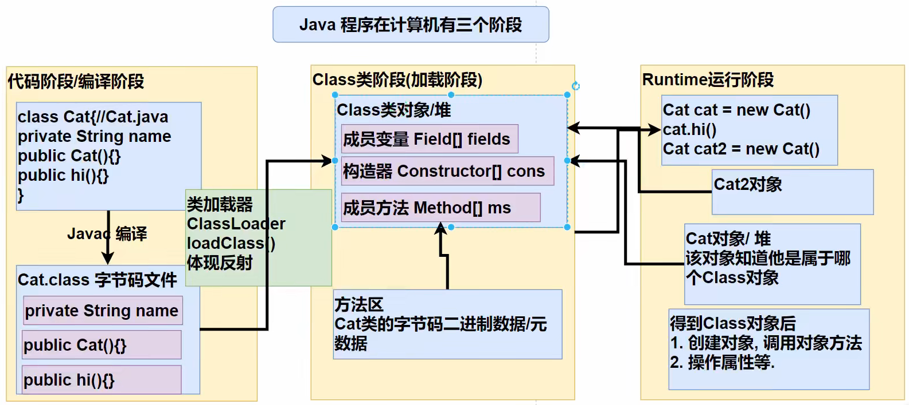
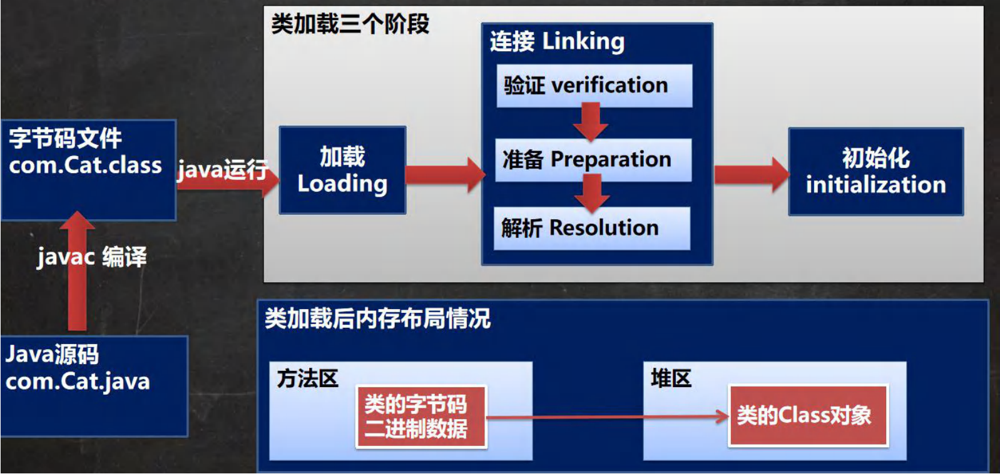
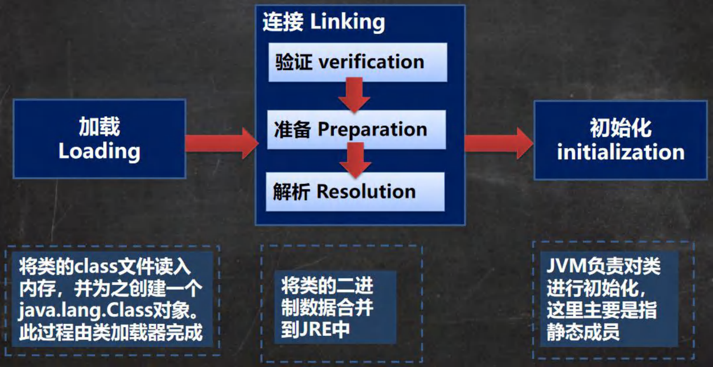
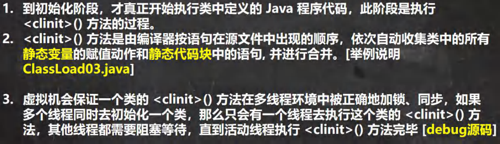

        
# 类和对象_基础
## 包

包的三大作用：

- 区分相同名字的类
- 当类很多时可以很好地管理类
- 控制访问范围

## 封装

好处：

- 隐藏实现细节
- 对数据进行验证，保证安全合理

实现步骤（三部曲）：

1. 将属性进行私有化（不能直接修改）
2. 提供一个公共的 set 方法，用于对属性判断和赋值
3. 提供一个公共的 get 方法，用于获取属性的值（权限判断）

将构造器和 setXxx 结合

```java
package demo1;

public class Person {
    public String name;
    private int age;

    public Person(){}

    public Person(String name, int age) {
//        this.name = name;
//        this.age = age;
        // 防止构造器跳过验证
        setName(name);
        setAge(age);
    }

    public String getName() {
        return name;
    }

    public void setName(String name) {
        //加入数据校验
        if (name.length() >= 2 && name.length() <= 6)
            this.name = name;
        else {
            System.out.println("名字长度为2-6个字符");
            this.name = "无名人士";
        }
    }

    public int getAge() {
        return age;
    }

    public void setAge(int age) {
        if (age > 0 && age < 120)
            this.age = age;
        else {
            System.out.println("年龄范围不符合");
            this.age = 18;
        }
    }

}
```

## 继承

继承可以解决代码复用

**好处：**

- 代码复用性提高了
- 代码的扩展性和维护性提高了

不能滥用继承，子类和父类必须满足 is a 的逻辑关系

子类继承了所有的方法和属性，但是私有属性不能直接在子类访问，要通过公共的方法去访问

```java
public class Father {
    private int n2 = 200;

    private void test400() {
        System.out.println("400");
    }

    public void callTest400() {
        test400();
    }

    public int getN2() {
        return n2;
    }
}

public class Son extends Father {
    public void test() {
        System.out.println(n1);
//        System.out.println(n2);
        //通过公共的方法访问父类私有属性
        System.out.println(getN2());
        callTest400();
    }
}
```

> 子类**必须调用**父类的构造器，完成父类的初始化

当创建子类对象时，不管使用子类的哪个构造器，默认情况下总会去调用**父类的无参**构造

```java
public class Father {
    public Father() {
        System.out.println("父类构造器被调用");
    }
}

public class Son extends Father {
    public Son(){
      //隐含super();
        System.out.println("子类构造器被调用");
    }
}

//父类构造器被调用
//子类构造器被调用
```

如果父类没有提供无参构造，必须在子类构造器中用 super ()指定使用父类的哪个构造器完成对父类的初始化工作，否则编译不通过

```java
public class Father {
    public String name;
    public int age;

//    public Father() {
//        System.out.println("父类无参构造器");
//    }

    public Father(String name, int age) {
        System.out.println("父类有参构造");
    }
}
```

```java
public class Son extends Father {
    public int height;

    public Son(String name, int age, int height) {
      //父类的构造器完成父类属性初始化，子类的构造器完成子类属性的初始化
        super(name, age);
        this.height = height;
    }
}
```

**继承设计的基本思想：**

父类的构造器完成父类属性初始化，子类的构造器完成子类属性的初始化


构造器调用顺序：

```java
public class Father {
    public String name;
    public int age;

//    public Father() {
//        System.out.println("父类无参构造器");
//    }

    public Father(String name, int age) {
        System.out.println("父类有参构造");
    }
}

public class Son extends Father {
    //不写super会报错
    public Son(){
      //父类的构造器完成父类属性初始化，子类的构造器完成子类属性的初始化
        super("tom",36);
        System.out.println("子类无参构造");
    }

    public Son(String name){
        super("tom",36);
        System.out.println("子类有参构造");
    }
}

//父类有参构造
//子类无参构造
//父类有参构造
//子类有参构造
```


所有类都是 object 子类（ctrl+h 看类的继承关系）

父类构造器的调用不限于直接父类，将一直往上追溯到 Object 类


子类最多只能继承一个父类，java 是单继承

如何让 A 类继承 B 类和 C 类呢？B 继承 C，A 继承 B


习题：

```java
public class A {
    A() {
        System.out.println("A无参"); //1
    }
}

public class B extends A {
    B() {
        System.out.println("B无参");
    }

    B(String name) {
        System.out.println("B有参"); //2
    }
}

public class C extends B{
    public C(){
        this("hello"); 
        System.out.println("c无参"); //4
    }

    public C(String name){
        super("aa");
        System.out.println("c有参"); //3
    }
}

// C c = new C();结果？
A无参
B有参
c有参
c无参
```


### Super 关键字

Super 代表父类的引用，用于防问父类的属性、方法、构造器

访问父类的属性和方法，不能访问私有的

访问父类的构造器，只能放在构造器的第一句，只能出现一次


调用父类构造器的好处：

​	分工明确，父类属性由父类初始化，子类属性由子类初始化


当子类有和父类中成员重名时，为了访问父类成员必须通过 super

```java
public class A {
    public void cal(){
        System.out.println("A类的cal方法");
    }
}
```

```java
public class B extends A {
    public void cal() {
        System.out.println("A类的cal方法");
    }

    public void sum() {
        System.out.println("B类的sum方法");
        super.cal();
    }
}
```

如果没有重名，super、this、直接访问的效果是一样的

找 cal 的顺序：本类没有就逐级向上找父类，找到了就调用

```java
public class A {
    public void cal(){
        System.out.println("A类的cal方法");
    }
}
```

```java
public class B extends A {
    public void sum(){
        System.out.println("B类的sum方法");
        //super.cal();
        //cal();
        this.cal();
    }
}
```

Super 的访问不限于直接父类，如果爷爷类和本类有同名的成员，按就近原则访问爷爷类的成员


**this 和 super 的比较**

| this                                 | super                                  |
| ------------------------------------ | -------------------------------------- |
| 访问本类的属性和方法，没有从父类中找 | 访问父类的属性和方法                   |
| 调用本类构造器，必须放在构造器首行   | 调用父类构造器，必须放在子类构造器首行 |
| 表示当前对象                         | 子类中访问父类对象                     |

Super ()在使用时必须放在构造器第一行，this 也只能放第一行，所以这两个方法不能共存于一个构造器


### 方法重写/覆盖（override）

子类方法的参数、方法名称和父类完全一样

返回类型可以和父类一样，也可以是父类返回类型的子类

子类方法不能缩小父类的访问权限（public>protected>默认>private）


**重写和重载的比较**

|      | 发生范围 | 方法名   | 形参列表                     | 返回类型 | 修饰符 |
| ---- | -------- | -------- | ---------------------------- | -------- | ------ |
| 重载 | 本类     | 必须一样 | 类型、个数、顺序至少一个不同 | 无要求   | 无要求 |
| 重写 | 父子类   | 必须一样 | 相同                         |          |        |


## 多态

**问题引出：**

​	有 Master 类、Animal 类和 Food 类，Master 类中有一个 feed 方法，可以给动物喂食物，但因为有不同动物和事物，需要写很多 feed 方法，feed (Dog dog, Bone bone)、feed (Cat cat, Fish fish)，代码复用性很差


**多态的具体体现**

方法的多态：重写和重载

对象的多态（核心）：

- 一个对象的编译类型和运行类型可以不同
- 编译类型在定义对象时就确定了，不能改变
- 运行类型时可以变化的
- 编译类型看=的左边，运行类型看右边


### 多态的向上转型

本质：父类的引用指向子类的对象

语法：父类类型引用 = new 子类类型 (); 

特点：

- 可以调用父类中的所有成员（遵循访问权限）
- 不能调用子类中特有成员
- 最终运行效果看子类的具体实现（编译阶段能调用哪些成员，由编译类型决定）

```java
public class Animal {
    public String name;

    public Animal(String name) {
        this.name = name;
    }

    public void eat(){
        System.out.println("吃");
    }

    public void run() {
        System.out.println("跑");
    }
}
```

```java
public class Cat extends Animal {
    public Cat(String name) {
        super(name);
    }

    //重写
    public void eat(){
        System.out.println("猫吃鱼");
    }

    //特有成员
    public void catchMouse(){
        System.out.println("猫抓老鼠");
    }
}
```

```java
public class Test {
    public static void main(String[] args) {
        Animal animal = new Cat("咪咪");
        animal.run();
        // 猫吃鱼，运行效果看子类的具体实现
        animal.eat();
        // 编译阶段能调用哪些成员，由编译类型决定
//        cat.catchMouse();
    }
}
```


### 多态的向下转型

语法：子类类型引用 = （子类类型）父类引用;

特点：

- 只能强转父类的引用，不能强转父类的对象
- 要求父类的引用必须指向的是当前目标类型的对象
- 可以调用子类类型中的所有成员

```java
public class Test {
    public static void main(String[] args) {
        Animal animal = new Cat("咪咪");
        // 希望可以调用catchMouse方法
        // 此时cat的编译和运行类型都是cat
        // animal本来指向的是cat类型的对象
        Cat cat = (Cat) animal;
        cat.catchMouse();
        // 错误：
//        Dog dog=(Dog) animal;
    }
}
```


### 属性问题

属性的值看编译类型

```java
public class Test2 {
    public static void main(String[] args) {
        Base base = new Sub();
        System.out.println(base.count);//10
        Sub sub = new Sub();
        System.out.println(sub.count);//20
    }
}

class Base {
    int count = 10;
}

class Sub extends Base {
    int count = 20;
}
```


### Instance of

比较操作符，用于判断对象的类型是否为 xx 类型或其子类型

```java
public class tes {
    public static void main(String[] args) {
        BB bb = new BB();
        System.out.println(bb instanceof BB);
        System.out.println(bb instanceof AA);
        AA aa = new BB();
        System.out.println(aa instanceof BB);
        System.out.println(aa instanceof AA);
        // 全是true
    }
}

class AA {
}

class BB extends AA {
}
```


### Java 动态绑定机制

1. 当调用对象方法时，刚方法会和该对象的内存地址/运行类型绑定
2. 当调用对象属性时，没有动态绑定机制，哪里声明哪里使用

```java
public class Test3 {
    public static void main(String[] args) {
        A a = new B();
        System.out.println(a.sum());//40
        System.out.println(a.sum1());//30
    }
}

class A {
    public int i = 10;

    public int sum() {
        return getI() + 10;
    }

    public int sum1() {
        return i + 10;
    }

    public int getI() {
        return i;
    }
}

class B extends A {
    public int i = 20;

    public int sum() {
        return getI() + 20;
    }

    public int sum1() {
        return i + 10;
    }

    public int getI() {
        return i;
    }
}
```

```java
public class Test3 {
    public static void main(String[] args) {
        A a = new B();
        //区别：一个调方法，一个调属性
        // 用A类的sum，其中的getI调用的是B类的
        System.out.println(a.sum());//30
        // 用A类的sum1，属性值在A类声明，用A的
        System.out.println(a.sum1());//20
    }
}

class A {
    public int i = 10;

    public int sum() {
        return getI() + 10;
    }

    public int sum1() {
        return i + 10;
    }

    public int getI() {
        return i;
    }
}

class B extends A {
    public int i = 20;
    
    public int getI() {
        return i;
    }
}
```


### 多态数组

数组的定义类型为父类类型，里面保存的是子类类型

```java
public class Person {
    public String name;
    public int age;

    //构造，get，set
    public String say() {
        return name + "\t" + age;
    }
}
```

```java
public class Student extends Person {
    private double score;

    //构造，get，set
    @Override
    public String say() {
        return super.say() + "score=" + score;
    }
}
```

```java
public class Teacher extends Person {
    private double salary;

    //构造，get，set
    @Override
    public String say() {
        return super.say() + "salary=" + salary;
    }
}
```

```java
public class Test {
    public static void main(String[] args) {
        Person[] persons = new Person[3];
        persons[0] = new Person("aa", 20);
        persons[1] = new Student("bb", 30, 60);
        persons[2] = new Teacher("ee", 33, 4000);

        for (int i = 0; i < persons.length; i++) {
            System.out.println(persons[i].say());
        }
    }
}
```

调用子类特有的方法

```java
public class Test {
    public static void main(String[] args) {
        Person[] persons = new Person[5];
        persons[0] = new Person("aa", 20);
        persons[1] = new Student("bb", 30, 60);
        persons[2] = new Student("cc", 21, 70);
        persons[3] = new Teacher("dd", 33, 2000);
        persons[4] = new Teacher("ee", 33, 4000);

        for (int i = 0; i < persons.length; i++) {
            System.out.println(persons[i].say());
            if (persons[i] instanceof Student) {
//                Student student=(Student) persons[i];
//                student.study();
                ((Student) persons[i]).study();
            } else if (persons[i] instanceof Teacher) {
                ((Teacher) persons[i]).teach();
            } else {
                System.out.println("类型有误");
            }
        }

    }
}
```


## Object 类详解

### Equals 方法

**==运算符**：一个比较运算符

- 判断基本类型，比较值是否相等
- 判断引用类型，比较地址是否相等，即判断是不是同一个对象

```java
public class Test {
    public static void main(String[] args) {
        B a = new B();
        B b = a;
        B c = b;
        System.out.println(a == b); //true
        System.out.println(b == c); //true
        A a1 = a;
        System.out.println(a1 == c); //true
    }
}

class A {}

class B extends A {}
```

**equals 方法**是 Object 类中的方法，只能判断==引用类型==

==默认判断的是地址是否相等==，子类中往往会重写该方法，判断内容是否相等，如 Integer、String

```java
//Object
public boolean equals(Object obj) {
    return (this == obj);
}
```

```java
//Integer
public boolean equals(Object obj) {
  	//传入对象不是Integer类型，直接false
    if (obj instanceof Integer) {
        return value == ((Integer)obj).intValue();
    }
    return false;
}
```

判断一下

```java
public class Test {
    public static void main(String[] args) {
        Integer integer1 = new Integer(1000);
        Integer integer2 = new Integer(1000);
        System.out.println(integer1 == integer2); //false，不是同一个对象
        System.out.println(integer1.equals(integer2)); //true，Integer重写了equals，比较内容
    }
}
```


**重写 equals 方法**

```java
public class Person {
    private String name;
    private int age;
    private char gender;

    @Override
    public boolean equals(Object o) {
        // 两个对象是同一个对象
        if (this == o) return true;
        if (o instanceof Person) {
            // 向下转型后可以调用子类的全部成员
            Person p = (Person) o;
            return this.name.equals(p.name) && this.age == p.age && this.gender == p.gender;
        }
        // 不是Person
        return false;
    }

    //......
}
```


### HashCode 方法

提高具有哈希结构的容器的效率

两个引用指向同一个对象，哈希值一定相同，指向不同对象，哈希值一定不同

哈希值主要根据地址号来的，但不完全等价于地址

在集合中，hashCode ()如果需要，也会重写


### ToString 方法

默认返回：全类名（包名+类名）+ @ + 哈希值的十六进制

子类往往重写 toString ()，用于返回对象的属性信息

重写 toString ()，打印或拼接对象时，都会自动调用该对象的 toString 形式

直接输出一个对象

```java
public class Test {
    public static void main(String[] args) {
        Monster monster = new Monster("aa", "律师", 20000);
        System.out.println(monster);
    }
}

class Monster {
    private String name;
    private String job;
    private double sal;

    public Monster(String name, String job, double sal) {
        this.name = name;
        this.job = job;
        this.sal = sal;
    }

    @Override
    public String toString() {
        return "Monster{" +
                "name='" + name + '\'' +
                ", job='" + job + '\'' +
                ", sal=" + sal +
                '}';
    }
}
```


### Finalize 方法

> 实际开发中，几乎不会用，应付面试

当对象被回收时，系统自动调用该对象的 finalize 方法，子类可以重写该方法，做一些释放资源的操作

什么时候被回收：当某个对象没有任何引用时，jvm 就会认为这个对象是一个垃圾对象，就会使用垃圾回收机制销毁该对象，销毁前会调用 finalize 方法

垃圾回收机制的而调用，是由系统来决定（即有自己的 GC 算法），也可以通过 System.Gc ()主动触发

```java
public class test {
    public static void main(String[] args) {
        Car car = new Car("宝马");
        car = null;
        //没有输出重写finalize里打印的内容，一个对象变成垃圾不会马上回收
        //需要主动调用垃圾回收器
        System.gc();
        System.out.println("程序退出了");

    }
}

class Car {
    private String name;

    public Car(String name) {
        this.name = name;
    }

    @Override
    protected void finalize() throws Throwable {
        System.out.println("销毁汽车" + name);
        System.out.println("释放了某些资源");
        super.finalize();
    }
}
```


## 断点调试

F 7：跳入方法内

F 8：逐行执行代码

Shift+F 8：跳出方法

F 9（resume）：执行到下一个断点


追踪一个对象创建的过程

https://www.bilibili.com/video/BV1fh411y7R8?p=334&spm_id_from=pageDriver

```java
public class Test5 {
    public static void main(String[] args) {
        Person jack = new Person("Jack", 22);
        System.out.println(jack);
    }
}

class Person {
    private String name;
    private int age;

    public Person(String name, int age) {
        this.name = name;
        this.age = age;
    }

    @Override
    public String toString() {
        return "Person{" +
                "name='" + name + '\'' +
                ", age=" + age +
                '}';
    }
}
```


追踪动态绑定机制

```java
public class Test3 {
    public static void main(String[] args) {
        A a = new B();
        //区别：一个调方法，一个调属性
        // 用A类的sum，其中的getI调用的是B类的
        System.out.println(a.sum());//30
        // 用A类的sum1，属性值在A类声明，用A的
        System.out.println(a.sum1());//20
    }
}

class A {
    public int i = 10;

    public int sum() {
        return getI() + 10;
    }

    public int sum1() {
        return i + 10;
    }

    public int getI() {
        return i;
    }
}

class B extends A {
    public int i = 20;
    
    public int getI() {
        return i;
    }
}
```


# 类和对象_高级

## 代码块

- 相当于另外一种形式的构造器，可以做**初始化操作**
- 如果多个构造器都有重复的语句，可以抽取到初始化块中，提高代码的重用性

普通代码块：每创建一个对象执行一次

```java
public class Test1 {
    public static void main(String[] args) {
        Movie movie = new Movie("你好李焕英");
        Movie movie2 = new Movie("你好李焕英", 20, "aaa");
        /**
         * 进入影院
         * 找到座位
         * 电影开始
         * Movie(String name)被调用
         * 进入影院
         * 找到座位
         * 电影开始
         * Movie(String name, double price, String direction)被调用
         */
    }
}

class Movie {
    private String name;
    private double price;
    private String direction;

    {
        System.out.println("进入影院");
        System.out.println("找到座位");
        System.out.println("电影开始");
    }

    public Movie(String name) {
        System.out.println("Movie(String name)被调用");
        this.name = name;
    }

    public Movie(String name, double price, String direction) {
        System.out.println("Movie(String name, double price, String direction)被调用");
        this.name = name;
        this.price = price;
        this.direction = direction;
    }
}
```

静态代码块：`static{...}`，作用是对类进行**初始化**，随着类的加载而执行，并且只会执行一次

```java
public class Test2 {
    public static void main(String[] args) {
        BB bb = new BB();
        AA aa = new AA();
        //AA的静态代码块，类只加载一次，静态代码块只执行一次，
        //BB的静态代码块
        System.out.println(Cat.n1);
        //使用了Cat的静态成员，Cat会被加载，Animal会先被加载
        //Animal的静态代码块
        //Cat的静态代码块
        //999
    }
}

class AA {
    static {
        System.out.println("AA的静态代码块");
    }
}

class BB extends AA {
    static {
        System.out.println("BB的静态代码块");
    }
}

class Animal {
    static {
        System.out.println("Animal的静态代码块");
    }
}

class Cat extends Animal {
    static {
        System.out.println("Cat的静态代码块");
    }

    public static int n1 = 999;
}
```

只是使用类的静态成员，普通代码块不会执行

```java
public class Test3 {
    public static void main(String[] args) {
        System.out.println(A.n1);
        //静态代码块
        //10
    }
}

class A {
    static {
        System.out.println("静态代码块");
    }

    {
        System.out.println("普通代码块");
    }

    public static int n1 = 10;
}
```

静态代码块只能调用**静态成员**，普通代码块可以调用**任意成员**

```java
class A {
    private int n1 = 100;
    private static int n2 = 200;

    private void m1() {}

    private static void m2() {}

    static {
        System.out.println(n2);
        m2();
    }

    {
        System.out.println(n1);
        System.out.println(n2);
        m1();
        m2();
    }
}
```

## 内部类

一个类的内部又完整地嵌套了另一个类结构，是类的第五大成员（属性、方法、构造器、代码块、内部类）

最大的特点是可以==直接访问私有属性==，并且可以==体现类与类之间的包含关系==

> 内部类的分类

定义在外部类局部位置上（比如方法内）：
1. 局部内部类（有类名）
2. 匿名内部类（无类名，重点在这里）

定义在外部类的成员位置上：
1. 成员内部类（无static修饰）
2. 静态内部类（有static修饰）

### 局部内部类

定义在外部类的局部位置（方法/代码块）

可以直接访问外部类的所有成员

不能添加访问修饰符，因为它的地位就是一个局部变量（局部变量是不能用修饰符的），可以使用final修饰（局部变量可以使用final）

作用域：仅仅在定义它的方法或代码块中

外部类访问局部内部类的成员的访问方式：**创建对象再访问**（必须在作用域内）

外部类和内部类重名，遵循就近原则。访问外部类的成员：外部类名.this.成员名（四种内部类都是这样）

本质是一个类

```java
public class Test {
    public static void main(String[] args) {
        Outer outer = new Outer();
        outer.m1();
        System.out.println("outer的hashCode=" + outer); //同内部类输出的相同
    }
}

class Outer {
    private int n1 = 100;

    private void m2() {}

    public void m1() {
        final class Inner {
            private int n1 = 800;

            public void f1() {
              	//重名
                System.out.println("n1=" + n1); //800
                System.out.println(Outer.this.n1); //100
                //Outer.this表示当前对象
                System.out.println("Outer.this hashCode=" + Outer.this);
                m2();
            }
        }
        Inner inner = new Inner(); //作用域内
        inner.f1();
    }
}
```

### 匿名内部类

定义位置、访问成员、作用域、可添加修饰符 同局部内部类一样

特点：

- 需求：类只使用一次，用完就没有了
- 没有名字
- 本质是一个类，同时也是一个**对象**
- 相当于继承了外部类或者实现了接口

匿名内部类的理解：**将继承\实现，方法重写，创建对象，放在了一步进行**

```
public class Test {
    public static void main(String[] args) {
        Outer outer = new Outer();
        outer.method();
        //tiger对象的运行类型是：class demo7.d6.Outer$1
        //匿名内部类重写了cry()
        //接收到name=jack
        //father对象的运行类型是：class demo7.d6.Outer$2
        //匿名内部类重写了run()
        //狗吃骨头
    }
}

class Outer {
  
    private int n1 = 10;

    public void method() {
        //基于接口的匿名内部类
        //tiger的编译类型是IA，运行类型是匿名内部类Outer$2
        //jdk底层创建匿名内部类，马上就创建了实例，并把地址传给tiger
        IA tiger = new IA() {
            @Override
            public void cry() {
                System.out.println("匿名内部类重写了cry()");
            }
        };
        System.out.println("tiger对象的运行类型是：" + tiger.getClass());
        tiger.cry();

        //基于普通类的匿名内部类
        Father father = new Father("jack") {
            @Override
            public void run() {
                System.out.println("匿名内部类重写了run()");
            }
        };
        System.out.println("father对象的运行类型是：" + father.getClass()); //Outer$1，没有大括号就是father
        father.run();

        //基于抽象类的匿名内部类
        Animal dog = new Animal() {
            @Override
            void eat() {
                System.out.println("狗吃骨头");
            }
        };
        dog.eat();
    }
  
}
```

最佳实践：当作实参直接传递，简洁高效

```
public class Test2 {
    public static void main(String[] args) {
        //直接当作参数传递
        f1(new IL() {
            @Override
            public void show() {
                System.out.println("这是一幅名画");
            }
        });
    }

    public static void f1(IL il) {
        il.show();
    }
}

interface IL {
    void show();
}
```

### 成员内部类

定义在外部类的成员位置

可以添加任意访问修饰符（地位等同于一个成员）

作用域：同外部类其他成员一样，为整个类体

外部类访问内部类：创建对象，再访问

外部其他类访问内部类的两种方式

```
public class Test {
    public static void main(String[] args) {
        Outer outer = new Outer();
        outer.t1();
        //外部其他类访问成员内部类
        //第一种 只是一种语法，不必纠结
        //Outer.Inner inner = outer.new Inner();
        //inner.say();
        new Outer().new Inner().say();
        //第二种 在外部类中编写一个方法，返回Inner对象
        outer.getInnerInstance().say();
    }
}

class Outer {
    private int n1 = 10;
    public String name = "张三";

    class Inner {
        public void say() {
            System.out.println("n1=" + n1 + " name=" + name);
        }
    }

    public Inner getInnerInstance() {
        return new Inner();
    }

    public void t1() {
        //使用成员内部类
        Inner inner = new Inner();
        inner.say();
    }
}
```

### 静态内部类

定义位置、访问修饰符、作用域

用static修饰

可直接访问外部类的所有静态成员，不能直接访问非静态成员

```
public class Test {
    public static void main(String[] args) {
        //外部其他类访问静态内部类
        //方式一 静态的，可以直接通过类名访问
        Outer.Inner inner = new Outer.Inner();
        inner.say();
        //方式二
        new Outer().getInnerInstance().say();
        //方式三 创建静态方法访问
        Outer.getInnerInstance_().say();
    }
}

class Outer {
    private static String name = "张三";

    static class Inner {
        private static String name = "张三";

        public void say() {
            //重名
            System.out.println("name=" + Outer.name);
            System.out.println("name=" + name);
        }
    }

    public Inner getInnerInstance() {
        return new Inner();
    }

    public static Inner getInnerInstance_() {
        return new Inner();
    }
}
```

# 反射

## 引入

根据配置文件 `re.properties` 指定信息，创建 Cat 对象并调用方法 hi()

```properties
classfullpath=com.boer.reflection.Cat
method=cry
```

这样的需求在框架中特别多，即通过外部文件配置，在不修改源码的情况下控制程序，符合设计程序的 ocp 原则（开闭原则，不修改代码，扩容功能）

```java
public class Demo {
    public static void main(String[] args) throws Exception {
        //----- 传统的方式 new 对象，调用方法
        // Cat cat = new Cat();
        // cat.hi(); ===> cat.cry() 修改源码.

        // Properties类, 读写配置文件
        Properties properties = new Properties();
        properties.load(new FileInputStream("src\\main\\resources\\re.properties"));
        String classfullpath = properties.get("classfullpath").toString();
        String methodName = properties.get("method").toString();
        System.out.println("classfullpath=" + classfullpath); // classfullpath=com.boer.reflection.Cat
        System.out.println("method=" + methodName); // method=cry

        //----- 使用反射机制解决
        // 1、加载类, 返回Class类型的对象cls
        Class cls = Class.forName(classfullpath);
        // 2、通过 cls 得到你加载的类 reflection.Cat 的对象实例
        Object o = cls.newInstance();
        System.out.println("o的运行类型=" + o.getClass()); // o的运行类型=class com.boer.reflection.Cat
        // 3、通过 cls 得到你加载的类 reflection.Cat 的 methodName "hi" 的方法对象
        //   即：在反射中，可以把方法视为对象（万物皆对象）
        Method method1 = cls.getMethod(methodName);
        // 4、通过method1 调用方法: 即通过方法对象来实现调用方法
        method1.invoke(o); // cat cry
    }
}
```

## 反射介绍

反射之所以被称为**框架的灵魂**，主要是因为它赋予了我们在**运行时**分析类以及执行类中方法的能力。通过反射你可以**获取**任意一个类的所有属性和方法，你还可以**调用**这些方法和属性。

加载完类之后，在堆中就产生了一个 **Class 类型的对象**（一个类只有一个），这个对象包含了类的完整结构信息。这个对象就像一面镜子，透过这个镜子看到类的结构，故形象地称之为反射

- 优点：可以**动态**地创建和使用对象（也是框架的底层核心），使用灵活，没有反射机制，框架技术就失去了底层支持
- 缺点：反射基本是**解释执行**，对执行速度有有影响

【案例】对比反射性能
```java
public class Demo {
	// 执行次数
    private static final int NUM = 90000000;

    public static void main(String[] args) throws Exception {
        m1();
        m2();
    }

    public static void m1() {
        Cat cat = new Cat();
        
        long start = System.currentTimeMillis();
        for (int i = 0; i < NUM; i++) {
            cat.hi();
        }
        long end = System.currentTimeMillis();
        
        System.out.println(end - start);
    }

    public static void m2() throws Exception {
        Class<?> cls = Class.forName("com.boer.reflection.Cat");
        Object cat = cls.newInstance();
        Method hi = cls.getMethod("hi");
        
        long start = System.currentTimeMillis();
        for (int i = 0; i < NUM; i++) {
            hi.invoke(cat);
        }
        long end = System.currentTimeMillis();
        
        System.out.println(end - start);
    }
}
```

【原理图】左边两块属于 JVM 这块，面试高频



## Class 类

- 类的字节码二进制数据，存放在方法区，有的地方称为类的元数据。Class 对象存放在**堆**中
- Class 类的对象不是 new 出来的，而是**系统创建**的
- 对于某个类的 class 对象，在内存中只有一份，因为类只加载一次
- 每个类的实例都知道自己是由哪个 Class 实例所生成的
- 通过 Class 可以完整得到一个类的完整结构

### 获取 Class 类对象的方式（重要）

下面四种方式获取的都是同一个 Class 对象

1、已知一个类的**全类名** ---> 通过 Class 类的静态方法 **`forName()`** 获取

- 可能抛出 `ClassNotFoundException`
- 应用场景：多用于配置文件，读取类全路径，加载类

```java
Class cls = Class.forName("com.boer.reflection.Car");
```

2、已知具体的类 ---> 通过**类的 class** 获取

- 最可靠安全，程序**性能最高**
- 应用场景：多用于**参数传递**，比如通过反射得到对应构造器对象

```java
Class cls2 = Car.class;
```

 3、已知某个类的**实例** ---> 调用该实例的 **`getClass()`** 方法获取

- 应用场景：通过创建好的对象，获取 Class 实例

```java
Car car = new Car();
Class cls3 = car.getClass();
```

 4、通过**类加载器**

- 不会进行初始化，意味着不进行包括初始化等一系列步骤，静态代码块和静态对象不会得到执行

```java
Class clazz = ClassLoader.loadClass("cn.javaguide.TargetObject");
```

### 获取 Class 对象-基本数据类型及包装类

基本数据类型会自动自动装箱，所以两种方式获得的 Class 对象是同样的

```java
public static void main(String[] args) throws Exception {
	// 基本数据类型
	Class<Integer> integerClass = int.class;
	Class<Character> characterClass = char.class;
	Class<Boolean> booleanClass = boolean.class;
	System.out.println(integerClass); // int

	// 包装类
	Class<Integer> integerClass2 = Integer.TYPE;
	Class<Character> characterClass2 = Character.TYPE;

	// 基本数据类型会自动自动装箱，所以两种方式获得的 Class 对象是同样的
	System.out.println(integerClass.hashCode()); // 621009875
	System.out.println(integerClass2.hashCode()); // 621009875
}
```

### 哪些类型有 Class 类对象

外部类、内部类、接口、数组、枚举、注解、基本数据类型、void

```java
public static void main(String[] args) throws Exception {
	Class<String> stringClass = String.class; // 外部类
	Class<Serializable> serializableClass = Serializable.class; // 接口
	Class<Integer[]> integerClass = Integer[].class; // 数组
	Class<float[][]> floatClass = float[][].class; // 二维数组
	Class<Deprecated> deprecatedClass = Deprecated.class; // 注解
	Class<Thread.State> stateClass = Thread.State.class; // 枚举
	Class<Long> longClass = long.class; // 基本数据类型
	Class<Void> voidClass = void.class; // void 数据类型
	Class<Class> classClass = Class.class;
}
```

## 类加载

反射机制是 java 实现动态语言的关键，即通过反射实现类**动态加载**

- **静态加载**：编译时加载相关的类，如果没有则报错，依赖性太强
- **动态加载**：运行时加载需要的类，如果运行时不用该类，即使不存在该类，也不报错，降低了依赖性

类加载时机：

- new 创建对象（静态加载）
- 子类被加载时，父类也加载（静态加载）
- 调用类中静态成员时（静态加载）
- 反射（动态加载）

类加载过程：



类加载各阶段完成任务：



加载阶段：
- JVM 在该阶段主要是将字节码从不同的数据源（class 文件、jar 包、网络）转换为二进制字节流**加载到内存中（方法区）**，
- 并生成一个代表该类的 **`java.lang.Class`** 对象

连接阶段
- 验证：
	- 确保 Class 文件的字节流中包含的信息符合当前 JVM 的要求，并且不会危害 JVM 自身的安全，包括文件格式验证（是否以魔数 `0xcafebabe` 开头）、元数据验证、字节码验证和符号引用验证。
	- 可以考虑使用 `-Xverify:none` 参数来**关闭**大部分的类验证措施，缩短虚拟机类加载的时间
- 准备
	- JVM 会在该阶段对静态变量，分配内存并默认初始化（0、0 L、null、false 等）这些变量所使用的内存都将在方法区中进行分配
- 解析：
	- 虚拟机将常量池内的符号引用替换为直接引用的过程

```java
class A {
     //属性-成员变量-字段
     //类加载的连接阶段-准备 属性是如何处理
     //1. n1 是实例属性, 不是静态变量，因此在准备阶段，是不会分配内存
     //2. n2 是静态变量，分配内存 n2 是默认初始化 0 ,而不是20
     //3. n3 是static final 是常量, 他和静态变量不一样, 因为一旦赋值就不变 n3 = 30
     public int n1 = 10;
     public static  int n2 = 20;
     public static final  int n3 = 30;
}
```

初始化阶段：



## 反射的基本操作（重要）

### 通过反射 (Class) 获取类的信息

准备 Person 类
```java
class A {
    public String hobby;
    public void hi() {}
    public A() {}
    public A(String name) {}
}

interface IA {}
interface IB {}

@Deprecated // 注解
class Person extends A implements IA, IB {
    // 属性
    public String name;
    protected static int age; // 4 + 8 = 12
    String job;
    private double sal;

    // 构造器
    public Person() {}
    public Person(String name) {}
    
    // 私有构造器
    private Person(String name, int age) {}
    
    // 公有方法
    public void m1(String name, int age, double sal) {}
    // 保护方法
    protected String m2() {
        return null;
    }
    // 方法
    void m3() {}
    // 私有方法
    private void m4() {}
}
```

获取 Class 对象
```java
public class ReflectionDemo {
	static Class<?> personCls;
	
	static {
		try {
			personCls = Class.forName("com.boer.reflection.Person");
		} catch (ClassNotFoundException e) {
			throw new RuntimeException(e);
		}
	}
}
```

```java
/**
 * 获取类名、包名
 * - getName() 获取全类名
 * - getSimpleName() 获取简单类名
 * - getPackage() 返回包名
 */
public static void getNames() {
	System.out.println(personCls.getName()); // com.boer.test.Person
	System.out.println(personCls.getSimpleName()); // Person
	System.out.println(personCls.getPackage()); // package com.boer.test
}

/**
 * 返回父类和接口的信息
 * - getSuperClass() 返回父类的class对象
 * - getInterfaces() 返回实现接口的Class[]
 */
public static void getSuper() {
	Class<?> superclass = personCls.getSuperclass();
	System.out.println("父类的class对象=" + superclass); // 父类的class对象=class com.boer.reflection.A

	Class<?>[] interfaces = personCls.getInterfaces();
	for (Class<?> anInterface : interfaces) {
		System.out.println("接口信息=" + anInterface);
		// 接口信息=interface com.boer.reflection.IA
		// 接口信息=interface com.boer.reflection.IB
	}
}

/**
 * 返回注解信息
 * - getAnnotations:以Annotation[] 形式返回注解信息
 */
public static void getAnnotations() {
	Annotation[] annotations = personCls.getAnnotations();
	for (Annotation annotation : annotations) {
		System.out.println("注解信息=" + annotation);
		// 注解信息=@java.lang.Deprecated()
	}
}

/**
 * 获取构造器
 * - getConstructors() 获取所有本类public修饰的构造器
 * - getDeclaredConstructors() 获取本类中所有构造器
 */
public static void getConstructors() {
	Constructor<?>[] constructors = personCls.getConstructors();
	for (Constructor<?> constructor : constructors) {
		System.out.println("本类public修饰的构造器=" +constructor.getName());
		// 本类public修饰的构造器=com.boer.reflection.Person
		// 本类public修饰的构造器=com.boer.reflection.Person
	}

	Constructor<?>[] declaredConstructors = personCls.getDeclaredConstructors();
	for (Constructor<?> declaredConstructor : declaredConstructors) {
		System.out.println("----- 本类中所有构造器=" + declaredConstructor.getName());
		Class<?>[] parameterTypes = declaredConstructor.getParameterTypes();
		for (Class<?> parameterType : parameterTypes) {
			System.out.println("该构造器的形参类型=" + parameterType);
		}
		// ----- 本类中所有构造器=com.boer.reflection.Person
		// 该构造器的形参类型=class java.lang.String
		// 该构造器的形参类型=int
		// ----- 本类中所有构造器=com.boer.reflection.Person
		// 该构造器的形参类型=class java.lang.String
		// ----- 本类中所有构造器=com.boer.reflection.Person
	}
}

/**
 * 获取属性
 * - getFields() 获取所有public修饰的属性，包含本类以及所有父类的
 * - getDeclaredFields() 获取本类中所有属性，包含private
 */
public static void getFields() {
	Field[] fields = personCls.getFields();
	for (Field field : fields) {
		System.out.println("本类以及父类的属性=" + field.getName());
		// 本类以及父类的属性=name
		// 本类以及父类的属性=hobby
	}

	Field[] declaredFields = personCls.getDeclaredFields();
	for (Field declaredField : declaredFields) {
		// 默认修饰符是0，public是1，private是2，protected是4，static是8，final是16
		System.out.println("本类中所有属性=" + declaredField.getName()
				+ " 该属性的修饰符值=" + declaredField.getModifiers()
				+ " 该属性的类型=" + declaredField.getType());
		// 本类中所有属性=name 该属性的修饰符值=1 该属性的类型=class java.lang.String
		// 本类中所有属性=age 该属性的修饰符值=12 该属性的类型=int
		// 本类中所有属性=job 该属性的修饰符值=0 该属性的类型=class java.lang.String
		// 本类中所有属性=sal 该属性的修饰符值=2 该属性的类型=double
	}
}

/**
 * 获取方法
 * - getMethods() 获取所有public修饰的方法，包含本类以及所有父类的
 * - getDeclaredMethods() 获取本类中所有方法
 */
public static void getMethods() {
	Method[] methods = personCls.getMethods();
	for (Method method : methods) {
		System.out.println("本类以及父类public方法=" + method.getName());
		// 本类以及父类public方法=m1
		// 本类以及父类public方法=hi
		// 本类以及父类public方法=wait
		// 本类以及父类public方法=wait
		// 本类以及父类public方法=wait
		// 本类以及父类public方法=equals
		// 本类以及父类public方法=toString
		// 本类以及父类public方法=hashCode
		// 本类以及父类public方法=getClass
		// 本类以及父类public方法=notify
		// 本类以及父类public方法=notifyAll
	}

	Method[] declaredMethods = personCls.getDeclaredMethods();
	for (Method declaredMethod : declaredMethods) {
		System.out.println("---- 本类中所有方法=" + declaredMethod.getName()
				+ " 该方法的访问修饰符值=" + declaredMethod.getModifiers()
				+ " 该方法返回类型" + declaredMethod.getReturnType());
		// 输出当前这个方法的形参数组情况
		Class<?>[] parameterTypes = declaredMethod.getParameterTypes();
		for (Class<?> parameterType : parameterTypes) {
			System.out.println("该方法的形参类型=" + parameterType);
		}
		// ---- 本类中所有方法=m1 该方法的访问修饰符值=1 该方法返回类型void
		// 该方法的形参类型=class java.lang.String
		// 该方法的形参类型=int
		// 该方法的形参类型=double
		// ---- 本类中所有方法=m2 该方法的访问修饰符值=4 该方法返回类型class java.lang.String
		// ---- 本类中所有方法=m3 该方法的访问修饰符值=0 该方法返回类型void
		// ---- 本类中所有方法=hi 该方法的访问修饰符值=4161 该方法返回类型void
		// ---- 本类中所有方法=m4 该方法的访问修饰符值=2 该方法返回类型void
	}
}
```

### 取消安全检查

```java
public void setAccessible(boolean flag)
```

Method、Field、Constructor 对象都有 `setAccessible()`方法

Flag 为 true 表明屏蔽 Java 语言的访问检查、使得对象的**私有属性**也可以被查询和设置

```java
@Test
public void testSetAccessible() throws Exception {
    Class<?> catCls = Class.forName("com.boer.pojo.Cat");
    Object o = catCls.newInstance();
    Method hi = catCls.getDeclaredMethod("hi"); //hi为私有方法
    hi.setAccessible(true); //取消安全检查
    hi.invoke(o); //hi~
}

public class Cat{
    private void hi(){
        System.out.println("hi~");
    }
}
```

### 通过反射创建对象的方式

无参、有参、private 有参

```java
public static void main(String[] args) throws Exception {
    Class<?> userClass = Class.forName("reflection.User");
    //通过public的无参构造器创建实例
    Object o = userClass.newInstance();
    System.out.println(o);

    //通过public的有参构造器创建实例
    //先得到对应构造器 getConstructor()
    Constructor<?> constructor = userClass.getConstructor(String.class);
    //创建实例，并传入实参
    Object hsp = constructor.newInstance("hsp");
    System.out.println("hsp=" + hsp);

    //通过非public的有参构造器创建实例
    //得到private的构造器对象 getDeclaredConstructor()
    Constructor<?> constructor1 = userClass.getDeclaredConstructor(int.class, String.class);
    //创建实例
    //暴破【暴力破解】, 使用反射可以访问private构造器/方法/属性, 反射面前，都是纸老虎
    constructor1.setAccessible(true);
    Object user2 = constructor1.newInstance(100, "张三丰");
    System.out.println("user2=" + user2);
}
```

```java
class User {
    private int age = 10;
    private String name = "韩顺平教育";

    public User() {}

    public User(String name) {
        this.name = name;
    }

    private User(int age, String name) {
        this.age = age;
        this.name = name;
    }

    public String toString() {
        return "User [age=" + age + ", name=" + name + "]";
    }
}
```


### 通过反射访问类中的属性

如果是静态属性，则 set 和 get 中的参数 Object，可以写成 null

```java
public class ReflecAccessMethod {
    public static void main(String[] args) throws Exception {
        Class<?> stuClass = Class.forName("reflection.Student");
        Object o = stuClass.newInstance();

        //操作public属性
        Field age = stuClass.getField("age");
        age.set(o, 88);//设置属性值
        System.out.println(age.get(o));//获取属性值

        //操作private属性
        Field name = stuClass.getDeclaredField("name");
        name.setAccessible(true); //爆破
        name.set(null, "老韩~"); //static属性，o也可以null
        System.out.println(name.get(o)); //获取属性值
        System.out.println(name.get(null)); //获取static属性值
    }
}

class Student {
    public int age;
    private static String name;

    public Student() {}

    public String toString() {
        return "Student [age=" + age + ", name=" + name + "]";
    }
}
```


### 通过反射访问类中的方法

```java
public class ReflectionDemo {
    public static void main(String[] args) throws Exception{
        Class<?> bossCls = Class.forName("reflection.Boss");
        Object o = bossCls.newInstance();
        //调用public的方法
        //得到hi方法对象，下面两种都可以
        //Method hi = bossCls.getMethod("hi", String.class);
        Method hi = bossCls.getDeclaredMethod("hi", String.class);
        //调用
        hi.invoke(o, "韩顺平教育~");

        //调用private static 方法
        Method say = bossCls.getDeclaredMethod("say", int.class, String.class, char.class);
        //暴破
        say.setAccessible(true);
        System.out.println(say.invoke(o, 100, "张三", '男'));
        //因为say方法是static的，还可以这样调用 ，可以传入null
        System.out.println(say.invoke(null, 200, "李四", '女'));

        //在反射中，如果方法有返回值，统一返回Object , 但是他运行类型和方法定义的返回类型一致
        Object reVal = say.invoke(null, 300, "王五", '男');
        System.out.println("reVal 的运行类型=" + reVal.getClass());//String
        
        //演示一个返回的案例
        Method m1 = bossCls.getDeclaredMethod("m1");
        Object reVal2 = m1.invoke(o);
        System.out.println("reVal2的运行类型=" + reVal2.getClass());//Monster
    }
}

class Monster {}

class Boss {
    public int age;
    private static String name;

    public Boss() {}

    public Monster m1() {
        return new Monster();
    }

    private static String say(int n, String s, char c) {//静态方法
        return n + " " + s + " " + c;
    }

    public void hi(String s) {//普通public方法
        System.out.println("hi " + s);
    }
}
```