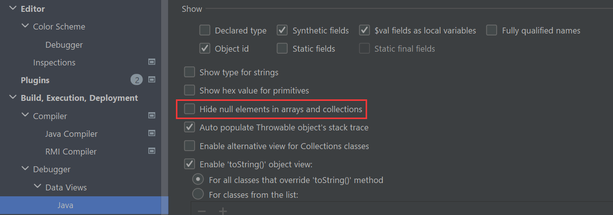
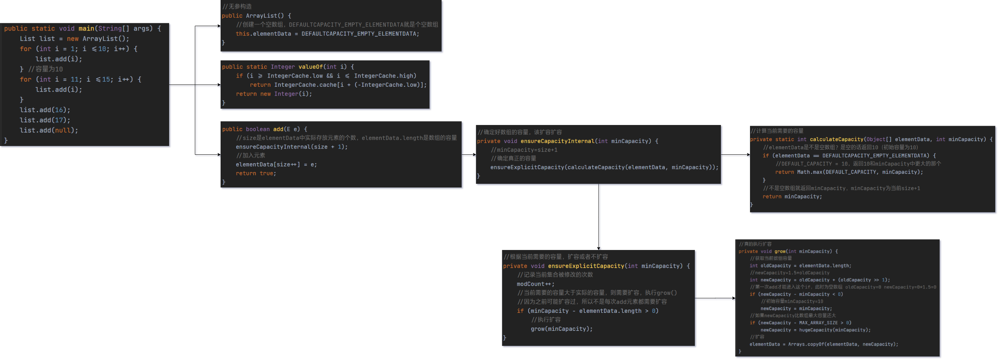

# 类和对象_基础
## 包

包的三大作用：

- 区分相同名字的类
- 当类很多时可以很好地管理类
- 控制访问范围

## 封装

好处：

- 隐藏实现细节
- 对数据进行验证，保证安全合理

实现步骤（三部曲）：

1. 将属性进行私有化（不能直接修改）
2. 提供一个公共的 set 方法，用于对属性判断和赋值
3. 提供一个公共的 get 方法，用于获取属性的值（权限判断）

将构造器和 setXxx 结合

```java
package demo1;

public class Person {
    public String name;
    private int age;

    public Person(){}

    public Person(String name, int age) {
//        this.name = name;
//        this.age = age;
        // 防止构造器跳过验证
        setName(name);
        setAge(age);
    }

    public String getName() {
        return name;
    }

    public void setName(String name) {
        //加入数据校验
        if (name.length() >= 2 && name.length() <= 6)
            this.name = name;
        else {
            System.out.println("名字长度为2-6个字符");
            this.name = "无名人士";
        }
    }

    public int getAge() {
        return age;
    }

    public void setAge(int age) {
        if (age > 0 && age < 120)
            this.age = age;
        else {
            System.out.println("年龄范围不符合");
            this.age = 18;
        }
    }

}
```

## 继承

继承可以解决代码复用

> 不能滥用继承，子类和父类必须满足 is a 的逻辑关系

**好处：**
- 代码复用性提高了
- 代码的扩展性和维护性提高了

基本规则：
- 所有类都是 **object 子类**（ctrl+h 看类的继承关系）
- 子类最多只能继承一个父类，java 是**单继承**
- 子类继承了**所有的方法和属性**，
	- 但是**私有属性不能直接在子类访问**，要通过**公共的方法**去访问

```java
public class Father {
    private int n2 = 200;

    private void test400() {
        System.out.println("400");
    }

    public void callTest400() {
        test400();
    }

    public int getN2() {
        return n2;
    }
}

public class Son extends Father {
    public void test() {
//        System.out.println(n2);
        //通过公共的方法访问父类私有属性
        System.out.println(getN2());
        callTest400();
    }
}
```

> 如何让 A 类继承 B 类和 C 类呢？B 继承 C，A 继承 B

子类**必须调用**父类的构造器，完成父类的初始化
- 当创建子类对象时，不管使用子类的哪个构造器，默认情况下总会去调用**父类的无参构造**
- 如果父类没有**提供无参构造**，必须在子类构造器中用 **`super()`** 指定使用父类的哪个构造器完成对父类的初始化工作，否则编译不通过
- 父类构造器的调用不限于直接父类，将一直往上追溯到 Object 类

*继承设计的基本思想*： 父类的构造器完成父类属性初始化，子类的构造器完成子类属性的初始化

```java
public class Father {
    public Father() {
        System.out.println("父类构造器被调用");
    }
}

public class Son extends Father {
    public Son(){
      //隐含super();
        System.out.println("子类构造器被调用");
    }
}

//父类构造器被调用
//子类构造器被调用
```

```java
public class Father {
    public String name;
    public int age;

//    public Father() {
//        System.out.println("父类无参构造器");
//    }

    public Father(String name, int age) {
        System.out.println("父类有参构造");
    }
}

public class Son extends Father {
    public int height;

    public Son(String name, int age, int height) {
      //父类的构造器完成父类属性初始化，子类的构造器完成子类属性的初始化
        super(name, age);
        this.height = height;
    }
}
```

构造器调用顺序：

```java
public class Father {
    public String name;
    public int age;

//    public Father() {
//        System.out.println("父类无参构造器");
//    }

    public Father(String name, int age) {
        System.out.println("父类有参构造");
    }
}

public class Son extends Father {
    //不写super会报错
    public Son(){
      //父类的构造器完成父类属性初始化，子类的构造器完成子类属性的初始化
        super("tom",36);
        System.out.println("子类无参构造");
    }

    public Son(String name){
        super("tom",36);
        System.out.println("子类有参构造");
    }
}

//父类有参构造
//子类无参构造
//父类有参构造
//子类有参构造
```

习题：

```java
public class A {
    A() {
        System.out.println("A无参"); //1
    }
}

public class B extends A {
    B() {
        System.out.println("B无参");
    }

    B(String name) {
        System.out.println("B有参"); //2
    }
}

public class C extends B{
    public C(){
        this("hello"); 
        System.out.println("c无参"); //4
    }

    public C(String name){
        super("aa");
        System.out.println("c有参"); //3
    }
}

// C c = new C();结果？
A无参
B有参
c有参
c无参
```

### Super 关键字

Super 代表父类的引用，用于防问父类的属性、方法、构造器
- 访问父类的属性和方法，不能访问私有的
- 访问父类的构造器，只能放在构造器的第一句，只能出现一次

调用父类构造器的好处：分工明确，父类属性由父类初始化，子类属性由子类初始化

当子类有和父类中成员重名时，为了访问父类成员必须通过 super

```java
public class A {
    public void cal(){
        System.out.println("A类的cal方法");
    }
}
```

```java
public class B extends A {
    public void cal() {
        System.out.println("A类的cal方法");
    }

    public void sum() {
        System.out.println("B类的sum方法");
        super.cal();
    }
}
```

如果没有重名，super、this、直接访问的效果是一样的

找 cal 的顺序：本类没有就逐级向上找父类，找到了就调用

```java
public class A {
    public void cal(){
        System.out.println("A类的cal方法");
    }
}
```

```java
public class B extends A {
    public void sum(){
        System.out.println("B类的sum方法");
        //super.cal();
        //cal();
        this.cal();
    }
}
```

Super 的访问不限于直接父类，如果爷爷类和本类有同名的成员，按就近原则访问爷爷类的成员


**this 和 super 的比较**

| this                                 | super                                  |
| ------------------------------------ | -------------------------------------- |
| 访问本类的属性和方法，没有从父类中找 | 访问父类的属性和方法                   |
| 调用本类构造器，必须放在构造器首行   | 调用父类构造器，必须放在子类构造器首行 |
| 表示当前对象                         | 子类中访问父类对象                     |

Super ()在使用时必须放在构造器第一行，this 也只能放第一行，所以这两个方法不能共存于一个构造器


### 方法重写/覆盖（override）

子类方法的参数、方法名称和父类完全一样

返回类型可以和父类一样，也可以是父类返回类型的子类

子类方法不能缩小父类的访问权限（public>protected>默认>private）


**重写和重载的比较**

|      | 发生范围 | 方法名   | 形参列表                     | 返回类型 | 修饰符 |
| ---- | -------- | -------- | ---------------------------- | -------- | ------ |
| 重载 | 本类     | 必须一样 | 类型、个数、顺序至少一个不同 | 无要求   | 无要求 |
| 重写 | 父子类   | 必须一样 | 相同                         |          |        |

### 静态成员

#Boer

> Java子类可以继承父类的静态变量和静态方法吗？
> 
> https://www.zhihu.com/question/482047900/answer/2083061773

> 静态部分不属于“需要继承的东西”，所以无所谓继承。

子类是**不继承**父类的 static 变量和方法的。因为这是属于类本身的。但是**子类是可以访问的**。  

子类和父类中同名的 static 变量和方法都是**相互独立**的，并**不存在任何的重写的关系**。

```java
public class A {
    public static String name = "nameA";

    public static void myName() {
        System.out.print("我是class A--- ");
        System.out.println(name);
    }
}

public class B extends A {
    public static String name = "nameB";

    public static void myName() {
        System.out.print("我是class B--- ");
        System.out.println(name);
    }

	public static void main(String[] args) {
        System.out.println(A.name);
        System.out.println(B.name);

        A.myName();
        B.myName();
    }
}

```


## 多态

**问题引出：**

​	有 Master 类、Animal 类和 Food 类，Master 类中有一个 feed 方法，可以给动物喂食物，但因为有不同动物和事物，需要写很多 feed 方法，feed (Dog dog, Bone bone)、feed (Cat cat, Fish fish)，代码复用性很差


**多态的具体体现**

方法的多态：重写和重载

对象的多态（核心）：

- 一个对象的编译类型和运行类型可以不同
- 编译类型在定义对象时就确定了，不能改变
- 运行类型时可以变化的
- 编译类型看=的左边，运行类型看右边


### 多态的向上转型

本质：父类的引用指向子类的对象

语法：父类类型引用 = new 子类类型 (); 

特点：

- 可以调用父类中的所有成员（遵循访问权限）
- 不能调用子类中特有成员
- 最终运行效果看子类的具体实现（编译阶段能调用哪些成员，由编译类型决定）

```java
public class Animal {
    public String name;

    public Animal(String name) {
        this.name = name;
    }

    public void eat(){
        System.out.println("吃");
    }

    public void run() {
        System.out.println("跑");
    }
}
```

```java
public class Cat extends Animal {
    public Cat(String name) {
        super(name);
    }

    //重写
    public void eat(){
        System.out.println("猫吃鱼");
    }

    //特有成员
    public void catchMouse(){
        System.out.println("猫抓老鼠");
    }
}
```

```java
public class Test {
    public static void main(String[] args) {
        Animal animal = new Cat("咪咪");
        animal.run();
        // 猫吃鱼，运行效果看子类的具体实现
        animal.eat();
        // 编译阶段能调用哪些成员，由编译类型决定
//        cat.catchMouse();
    }
}
```


### 多态的向下转型

语法：子类类型引用 = （子类类型）父类引用;

特点：

- 只能强转父类的引用，不能强转父类的对象
- 要求父类的引用必须指向的是当前目标类型的对象
- 可以调用子类类型中的所有成员

```java
public class Test {
    public static void main(String[] args) {
        Animal animal = new Cat("咪咪");
        // 希望可以调用catchMouse方法
        // 此时cat的编译和运行类型都是cat
        // animal本来指向的是cat类型的对象
        Cat cat = (Cat) animal;
        cat.catchMouse();
        // 错误：
//        Dog dog=(Dog) animal;
    }
}
```


### 属性问题

属性的值看编译类型

```java
public class Test2 {
    public static void main(String[] args) {
        Base base = new Sub();
        System.out.println(base.count);//10
        Sub sub = new Sub();
        System.out.println(sub.count);//20
    }
}

class Base {
    int count = 10;
}

class Sub extends Base {
    int count = 20;
}
```


### Instance of

比较操作符，用于判断对象的类型是否为 xx 类型或其子类型

```java
public class tes {
    public static void main(String[] args) {
        BB bb = new BB();
        System.out.println(bb instanceof BB);
        System.out.println(bb instanceof AA);
        AA aa = new BB();
        System.out.println(aa instanceof BB);
        System.out.println(aa instanceof AA);
        // 全是true
    }
}

class AA {
}

class BB extends AA {
}
```


### Java 动态绑定机制

1. 当调用对象方法时，刚方法会和该对象的内存地址/运行类型绑定
2. 当调用对象属性时，没有动态绑定机制，哪里声明哪里使用

```java
public class Test3 {
    public static void main(String[] args) {
        A a = new B();
        System.out.println(a.sum());//40
        System.out.println(a.sum1());//30
    }
}

class A {
    public int i = 10;

    public int sum() {
        return getI() + 10;
    }

    public int sum1() {
        return i + 10;
    }

    public int getI() {
        return i;
    }
}

class B extends A {
    public int i = 20;

    public int sum() {
        return getI() + 20;
    }

    public int sum1() {
        return i + 10;
    }

    public int getI() {
        return i;
    }
}
```

```java
public class Test3 {
    public static void main(String[] args) {
        A a = new B();
        //区别：一个调方法，一个调属性
        // 用A类的sum，其中的getI调用的是B类的
        System.out.println(a.sum());//30
        // 用A类的sum1，属性值在A类声明，用A的
        System.out.println(a.sum1());//20
    }
}

class A {
    public int i = 10;

    public int sum() {
        return getI() + 10;
    }

    public int sum1() {
        return i + 10;
    }

    public int getI() {
        return i;
    }
}

class B extends A {
    public int i = 20;
    
    public int getI() {
        return i;
    }
}
```


### 多态数组

数组的定义类型为父类类型，里面保存的是子类类型

```java
public class Person {
    public String name;
    public int age;

    //构造，get，set
    public String say() {
        return name + "\t" + age;
    }
}
```

```java
public class Student extends Person {
    private double score;

    //构造，get，set
    @Override
    public String say() {
        return super.say() + "score=" + score;
    }
}
```

```java
public class Teacher extends Person {
    private double salary;

    //构造，get，set
    @Override
    public String say() {
        return super.say() + "salary=" + salary;
    }
}
```

```java
public class Test {
    public static void main(String[] args) {
        Person[] persons = new Person[3];
        persons[0] = new Person("aa", 20);
        persons[1] = new Student("bb", 30, 60);
        persons[2] = new Teacher("ee", 33, 4000);

        for (int i = 0; i < persons.length; i++) {
            System.out.println(persons[i].say());
        }
    }
}
```

调用子类特有的方法

```java
public class Test {
    public static void main(String[] args) {
        Person[] persons = new Person[5];
        persons[0] = new Person("aa", 20);
        persons[1] = new Student("bb", 30, 60);
        persons[2] = new Student("cc", 21, 70);
        persons[3] = new Teacher("dd", 33, 2000);
        persons[4] = new Teacher("ee", 33, 4000);

        for (int i = 0; i < persons.length; i++) {
            System.out.println(persons[i].say());
            if (persons[i] instanceof Student) {
//                Student student=(Student) persons[i];
//                student.study();
                ((Student) persons[i]).study();
            } else if (persons[i] instanceof Teacher) {
                ((Teacher) persons[i]).teach();
            } else {
                System.out.println("类型有误");
            }
        }

    }
}
```


## Object 类详解

### Equals 方法

**==运算符**：一个比较运算符

- 判断基本类型，比较值是否相等
- 判断引用类型，比较地址是否相等，即判断是不是同一个对象

```java
public class Test {
    public static void main(String[] args) {
        B a = new B();
        B b = a;
        B c = b;
        System.out.println(a == b); //true
        System.out.println(b == c); //true
        A a1 = a;
        System.out.println(a1 == c); //true
    }
}

class A {}

class B extends A {}
```

**equals 方法**是 Object 类中的方法，只能判断==引用类型==

==默认判断的是地址是否相等==，子类中往往会重写该方法，判断内容是否相等，如 Integer、String

```java
//Object
public boolean equals(Object obj) {
    return (this == obj);
}
```

```java
//Integer
public boolean equals(Object obj) {
  	//传入对象不是Integer类型，直接false
    if (obj instanceof Integer) {
        return value == ((Integer)obj).intValue();
    }
    return false;
}
```

判断一下

```java
public class Test {
    public static void main(String[] args) {
        Integer integer1 = new Integer(1000);
        Integer integer2 = new Integer(1000);
        System.out.println(integer1 == integer2); //false，不是同一个对象
        System.out.println(integer1.equals(integer2)); //true，Integer重写了equals，比较内容
    }
}
```


**重写 equals 方法**

```java
public class Person {
    private String name;
    private int age;
    private char gender;

    @Override
    public boolean equals(Object o) {
        // 两个对象是同一个对象
        if (this == o) return true;
        if (o instanceof Person) {
            // 向下转型后可以调用子类的全部成员
            Person p = (Person) o;
            return this.name.equals(p.name) && this.age == p.age && this.gender == p.gender;
        }
        // 不是Person
        return false;
    }

    //......
}
```


### HashCode 方法

提高具有哈希结构的容器的效率

两个引用指向同一个对象，哈希值一定相同，指向不同对象，哈希值一定不同

哈希值主要根据地址号来的，但不完全等价于地址

在集合中，hashCode ()如果需要，也会重写


### ToString 方法

默认返回：全类名（包名+类名）+ @ + 哈希值的十六进制

子类往往重写 toString ()，用于返回对象的属性信息

重写 toString ()，打印或拼接对象时，都会自动调用该对象的 toString 形式

直接输出一个对象

```java
public class Test {
    public static void main(String[] args) {
        Monster monster = new Monster("aa", "律师", 20000);
        System.out.println(monster);
    }
}

class Monster {
    private String name;
    private String job;
    private double sal;

    public Monster(String name, String job, double sal) {
        this.name = name;
        this.job = job;
        this.sal = sal;
    }

    @Override
    public String toString() {
        return "Monster{" +
                "name='" + name + '\'' +
                ", job='" + job + '\'' +
                ", sal=" + sal +
                '}';
    }
}
```


### Finalize 方法

> 实际开发中，几乎不会用，应付面试

当对象被回收时，系统自动调用该对象的 finalize 方法，子类可以重写该方法，做一些释放资源的操作

什么时候被回收：当某个对象没有任何引用时，jvm 就会认为这个对象是一个垃圾对象，就会使用垃圾回收机制销毁该对象，销毁前会调用 finalize 方法

垃圾回收机制的而调用，是由系统来决定（即有自己的 GC 算法），也可以通过 System.Gc ()主动触发

```java
public class test {
    public static void main(String[] args) {
        Car car = new Car("宝马");
        car = null;
        //没有输出重写finalize里打印的内容，一个对象变成垃圾不会马上回收
        //需要主动调用垃圾回收器
        System.gc();
        System.out.println("程序退出了");

    }
}

class Car {
    private String name;

    public Car(String name) {
        this.name = name;
    }

    @Override
    protected void finalize() throws Throwable {
        System.out.println("销毁汽车" + name);
        System.out.println("释放了某些资源");
        super.finalize();
    }
}
```


## 断点调试

F 7：跳入方法内

F 8：逐行执行代码

Shift+F 8：跳出方法

F 9（resume）：执行到下一个断点


追踪一个对象创建的过程

https://www.bilibili.com/video/BV1fh411y7R8?p=334&spm_id_from=pageDriver

```java
public class Test5 {
    public static void main(String[] args) {
        Person jack = new Person("Jack", 22);
        System.out.println(jack);
    }
}

class Person {
    private String name;
    private int age;

    public Person(String name, int age) {
        this.name = name;
        this.age = age;
    }

    @Override
    public String toString() {
        return "Person{" +
                "name='" + name + '\'' +
                ", age=" + age +
                '}';
    }
}
```


追踪动态绑定机制

```java
public class Test3 {
    public static void main(String[] args) {
        A a = new B();
        //区别：一个调方法，一个调属性
        // 用A类的sum，其中的getI调用的是B类的
        System.out.println(a.sum());//30
        // 用A类的sum1，属性值在A类声明，用A的
        System.out.println(a.sum1());//20
    }
}

class A {
    public int i = 10;

    public int sum() {
        return getI() + 10;
    }

    public int sum1() {
        return i + 10;
    }

    public int getI() {
        return i;
    }
}

class B extends A {
    public int i = 20;
    
    public int getI() {
        return i;
    }
}
```


# 类和对象_高级

## 代码块

- 相当于另外一种形式的构造器，可以做**初始化操作**
- 如果多个构造器都有重复的语句，可以抽取到初始化块中，提高代码的重用性

普通代码块：每创建一个对象执行一次

```java
public class Test1 {
    public static void main(String[] args) {
        Movie movie = new Movie("你好李焕英");
        Movie movie2 = new Movie("你好李焕英", 20, "aaa");
        /**
         * 进入影院
         * 找到座位
         * 电影开始
         * Movie(String name)被调用
         * 进入影院
         * 找到座位
         * 电影开始
         * Movie(String name, double price, String direction)被调用
         */
    }
}

class Movie {
    private String name;
    private double price;
    private String direction;

    {
        System.out.println("进入影院");
        System.out.println("找到座位");
        System.out.println("电影开始");
    }

    public Movie(String name) {
        System.out.println("Movie(String name)被调用");
        this.name = name;
    }

    public Movie(String name, double price, String direction) {
        System.out.println("Movie(String name, double price, String direction)被调用");
        this.name = name;
        this.price = price;
        this.direction = direction;
    }
}
```

静态代码块：`static{...}`，作用是对类进行**初始化**，随着类的加载而执行，并且只会执行一次

```java
public class Test2 {
    public static void main(String[] args) {
        BB bb = new BB();
        AA aa = new AA();
        //AA的静态代码块，类只加载一次，静态代码块只执行一次，
        //BB的静态代码块
        System.out.println(Cat.n1);
        //使用了Cat的静态成员，Cat会被加载，Animal会先被加载
        //Animal的静态代码块
        //Cat的静态代码块
        //999
    }
}

class AA {
    static {
        System.out.println("AA的静态代码块");
    }
}

class BB extends AA {
    static {
        System.out.println("BB的静态代码块");
    }
}

class Animal {
    static {
        System.out.println("Animal的静态代码块");
    }
}

class Cat extends Animal {
    static {
        System.out.println("Cat的静态代码块");
    }

    public static int n1 = 999;
}
```

只是使用类的静态成员，普通代码块不会执行

```java
public class Test3 {
    public static void main(String[] args) {
        System.out.println(A.n1);
        //静态代码块
        //10
    }
}

class A {
    static {
        System.out.println("静态代码块");
    }

    {
        System.out.println("普通代码块");
    }

    public static int n1 = 10;
}
```

静态代码块只能调用**静态成员**，普通代码块可以调用**任意成员**

```java
class A {
    private int n1 = 100;
    private static int n2 = 200;

    private void m1() {}

    private static void m2() {}

    static {
        System.out.println(n2);
        m2();
    }

    {
        System.out.println(n1);
        System.out.println(n2);
        m1();
        m2();
    }
}
```

## 内部类

一个类的内部又完整地嵌套了另一个类结构，是类的第五大成员（属性、方法、构造器、代码块、内部类）

最大的特点是可以==直接访问私有属性==，并且可以==体现类与类之间的包含关系==

> 内部类的分类

定义在外部类局部位置上（比如方法内）：
1. 局部内部类（有类名）
2. 匿名内部类（无类名，重点在这里）

定义在外部类的成员位置上：
1. 成员内部类（无static修饰）
2. 静态内部类（有static修饰）

### 局部内部类

定义在外部类的局部位置（方法/代码块）

可以直接访问外部类的所有成员

不能添加访问修饰符，因为它的地位就是一个局部变量（局部变量是不能用修饰符的），可以使用final修饰（局部变量可以使用final）

作用域：仅仅在定义它的方法或代码块中

外部类访问局部内部类的成员的访问方式：**创建对象再访问**（必须在作用域内）

外部类和内部类重名，遵循就近原则。访问外部类的成员：外部类名.this.成员名（四种内部类都是这样）

本质是一个类

```java
public class Test {
    public static void main(String[] args) {
        Outer outer = new Outer();
        outer.m1();
        System.out.println("outer的hashCode=" + outer); //同内部类输出的相同
    }
}

class Outer {
    private int n1 = 100;

    private void m2() {}

    public void m1() {
        final class Inner {
            private int n1 = 800;

            public void f1() {
              	//重名
                System.out.println("n1=" + n1); //800
                System.out.println(Outer.this.n1); //100
                //Outer.this表示当前对象
                System.out.println("Outer.this hashCode=" + Outer.this);
                m2();
            }
        }
        Inner inner = new Inner(); //作用域内
        inner.f1();
    }
}
```

### 匿名内部类

定义位置、访问成员、作用域、可添加修饰符 同局部内部类一样

特点：

- 需求：类只使用一次，用完就没有了
- 没有名字
- 本质是一个类，同时也是一个**对象**
- 相当于继承了外部类或者实现了接口

匿名内部类的理解：**将继承\实现，方法重写，创建对象，放在了一步进行**

```
public class Test {
    public static void main(String[] args) {
        Outer outer = new Outer();
        outer.method();
        //tiger对象的运行类型是：class demo7.d6.Outer$1
        //匿名内部类重写了cry()
        //接收到name=jack
        //father对象的运行类型是：class demo7.d6.Outer$2
        //匿名内部类重写了run()
        //狗吃骨头
    }
}

class Outer {
  
    private int n1 = 10;

    public void method() {
        //基于接口的匿名内部类
        //tiger的编译类型是IA，运行类型是匿名内部类Outer$2
        //jdk底层创建匿名内部类，马上就创建了实例，并把地址传给tiger
        IA tiger = new IA() {
            @Override
            public void cry() {
                System.out.println("匿名内部类重写了cry()");
            }
        };
        System.out.println("tiger对象的运行类型是：" + tiger.getClass());
        tiger.cry();

        //基于普通类的匿名内部类
        Father father = new Father("jack") {
            @Override
            public void run() {
                System.out.println("匿名内部类重写了run()");
            }
        };
        System.out.println("father对象的运行类型是：" + father.getClass()); //Outer$1，没有大括号就是father
        father.run();

        //基于抽象类的匿名内部类
        Animal dog = new Animal() {
            @Override
            void eat() {
                System.out.println("狗吃骨头");
            }
        };
        dog.eat();
    }
  
}
```

最佳实践：当作实参直接传递，简洁高效

```
public class Test2 {
    public static void main(String[] args) {
        //直接当作参数传递
        f1(new IL() {
            @Override
            public void show() {
                System.out.println("这是一幅名画");
            }
        });
    }

    public static void f1(IL il) {
        il.show();
    }
}

interface IL {
    void show();
}
```

### 成员内部类

定义在外部类的成员位置

可以添加任意访问修饰符（地位等同于一个成员）

作用域：同外部类其他成员一样，为整个类体

外部类访问内部类：创建对象，再访问

外部其他类访问内部类的两种方式

```
public class Test {
    public static void main(String[] args) {
        Outer outer = new Outer();
        outer.t1();
        //外部其他类访问成员内部类
        //第一种 只是一种语法，不必纠结
        //Outer.Inner inner = outer.new Inner();
        //inner.say();
        new Outer().new Inner().say();
        //第二种 在外部类中编写一个方法，返回Inner对象
        outer.getInnerInstance().say();
    }
}

class Outer {
    private int n1 = 10;
    public String name = "张三";

    class Inner {
        public void say() {
            System.out.println("n1=" + n1 + " name=" + name);
        }
    }

    public Inner getInnerInstance() {
        return new Inner();
    }

    public void t1() {
        //使用成员内部类
        Inner inner = new Inner();
        inner.say();
    }
}
```

### 静态内部类

定义位置、访问修饰符、作用域

用static修饰

可直接访问外部类的所有静态成员，不能直接访问非静态成员

```
public class Test {
    public static void main(String[] args) {
        //外部其他类访问静态内部类
        //方式一 静态的，可以直接通过类名访问
        Outer.Inner inner = new Outer.Inner();
        inner.say();
        //方式二
        new Outer().getInnerInstance().say();
        //方式三 创建静态方法访问
        Outer.getInnerInstance_().say();
    }
}

class Outer {
    private static String name = "张三";

    static class Inner {
        private static String name = "张三";

        public void say() {
            //重名
            System.out.println("name=" + Outer.name);
            System.out.println("name=" + name);
        }
    }

    public Inner getInnerInstance() {
        return new Inner();
    }

    public static Inner getInnerInstance_() {
        return new Inner();
    }
}
```

# 集合

数组的弊端：

- 长度开始时必须指定且不能更改
- 保存的必须为同一类型的元素
- 增删元素比较麻烦

集合的好处：

- 可以动态保存任意多个对象
- 提供了一系列方便的操作对象的方法
- 增删方便

继承图：


集合主要是两组，Collection 接口有两个重要子接口 List、Set，他们实现的集合都是单列集合，Map 接口实现的子类都是双列集合

## Collection 接口

实现类特点：

- 可以存放多个元素，每个元素可以是 Object
- 有些可以存放重复的元素，有些不可以，
- 有些是有序的（List），有些不是（Set）
- Collection 接口没有直接实现子类，是通过子接口 Set 和 List 实现的

### Collection 接口常用方法

这里以实现子类ArrayList来演示

```java
public static void main(String[] args) throws Exception {
    List list = new ArrayList();
    /**
     * add() 添加单个元素
     */
    list.add("jack");
    list.add(10); //相当于 list.add(new Integer(10))
    list.add(true); //同理

    /**
     * remove(Object o) 删除指定元素
     */
    list.remove("jack");

    /**
     * boolean contains(Object o) 查找元素是否存在
     */
    boolean contains = list.contains(true);

    /**
     * int size() 获取元素个数
     */
    int size = list.size();

    /**
     * boolean isEmpty() 判断是否为空
     */
    boolean empty = list.isEmpty();

    /**
     * void clear() 清空
     */
    list.clear();

    /**
     * boolean addAll(Collection<? extends E> c) 添加多个元素
     */
    List list1 = new ArrayList();
    list.addAll(list1);

    /**
     * boolean containsAll(Collection<?> c) 查找多个元素是否都存在
     */
    boolean containsAll = list.containsAll(list1);

    /**
     * boolean removeAll(Collection<?> c) 删除多个元素
     */
    list.removeAll(list1);
}
```

### Collection 遍历元素方式

#### 方式一：Iterator

Iterator对象称为迭代器，主要用于遍历Collection集合中的元素

所有实现了Collection接口的集合类都有一个iterator()方法，用以返回一个实现了Iterator接口的对象，即可以返回一个迭代器

Iterator仅用于遍历集合，本身并不存放对象

```java
class Book {
    private String name;
    private String author;
    private double price;
		//有参、toString()
}
```

```java
public static void main(String[] args) throws Exception {
    Collection col = new ArrayList();
    col.add(new Book("三国演义", "罗贯中", 10.1));
    col.add(new Book("红楼梦", "曹雪芹", 10.1));
    col.add(new Book("小李飞刀", "古龙", 10.1));

    //得到col对应的迭代器
    Iterator iterator = col.iterator();
    while (iterator.hasNext()) {
        //next() 下移，并将下移以后集合位置上元素返回
        Object obj = iterator.next();
        System.out.println(obj);
    }
    //如果没有更多的元素，会抛出NoSuchElementException
    iterator.next();
    //如果想再次遍历，需要重置迭代器
    iterator = col.iterator();
}
```

#### 方式二：增强for循环

就是简化版iterator，底层仍然是迭代器

```java
public static void main(String[] args) throws Exception {
    Collection col = new ArrayList();
    col.add(new Book("三国演义", "罗贯中", 10.1));
    col.add(new Book("红楼梦", "曹雪芹", 10.1));
    col.add(new Book("小李飞刀", "古龙", 10.1));

    //增强for循环
    for (Object o : col) {
        System.out.println(o);
    }
}
```

## List 接口

Collection 接口的子接口

- List 集合中元素 
	- 有序（添加顺序和取出顺序一致）
	- 可重复
- 支持索引
- List 集合可以添加null（多个）

### List 接口常用方法

List集合支持索引，并添加了一些==根据索引来操作集合元素的方法==

```java
public static void main(String[] args) throws Exception {
    List list = new ArrayList();
    list.add("aa");
    list.add("bb");

    /**
     * void add(int index, E element) 在index位置插入元素
     */
    list.add(1, "add1");

    /**
     * boolean addAll(int index, Collection<? extends E> c) 从index位置开始将eles所有元素插入
     * boolean addAll(Collection<? extends E> c) 从表尾将eles所有元素插入
     */
    List list1 = new ArrayList();
    list1.add("addAll1");
    list1.add("addAll2");
    list.addAll(list1);
    list.addAll(2, list1);

    /**
     * int indexOf(Object o) 返回o在当前集合首次出现的位置
     * int lastIndexOf(Object o) 返回o在当前集合末次出现的位置
     */
    int indexOf = list.indexOf("aa");
    int lastIndexOf = list.lastIndexOf("aa");

    /**
     * E set(int index, E element) 替换index位置的元素
     */
    Object o = list.set(1, "set");

    /**
     * List<E> subList(int fromIndex, int toIndex) 返回从fromIndex~toIndex位置的子集合
     */
    List list2 = list.subList(0, 2);
}
```

### List 集合遍历方式

迭代器、增强for循环、普通for循环，前两种和Collection

普通for循环：

```java
List list = new ArrayList();
//List list = new LinkedList();
//List list = new Vector();
list.add("aa");
list.add("bb");
list.add("cc");

for (int i = 0; i < list.size(); i++) {
    System.out.println(list.get(i));
}
```

## ArrayList

特点：

- List 集合的主要实现类
- 由数组实现存储，底层是一个对象数组
- 基本等同于 Vector，除了线程不安全（没有 synchronized），故多线程不建议使用 ArrayList

### 底层结构和扩容机制（重要）

- ArrayList 维护了一个 `transient Object[] elementData` 数组（transient：表示该属性不会被序列化，为什么见引用部分）
- 当创建 ArrayList 对象时，如果使用无参构造，则初始 elementData 容量为 0，第一次添加则扩容 elementData 为 10，如需再次扩容，则 elementData 容量为原先的 1.5 倍
- 如果使用的是指定大小的构造器，则初始 elementData 容量为指定大小，之后扩容为原先的 1.5 倍

### 分析add()源码

> Debug下面的代码，并分析底层扩容机制 https://www.bilibili.com/video/BV1fh411y7R8?p=511&spm_id_from=pageDriver

> 注意：需要设置一下，不然 debug 的时候默认看不到数组中的 null 元素
> 
> 

```java
public static void main(String[] args) {
    List list = new ArrayList();
    for (int i = 1; i <=10; i++) {
        list.add(i);
    } //容量为10
    for (int i = 11; i <=15; i++) {
        list.add(i);
    }
    list.add(16);
    list.add(17);
    list.add(null);
}
```

**源码解析：**

1、调用ArrayList的无参构造函数，创建了一个空数组 或者 调用ArrayList的有参构造函数，指明初始容量

```java
//无参构造
public ArrayList() {
  	//创建一个空数组，DEFAULTCAPACITY_EMPTY_ELEMENTDATA就是个空数组
    this.elementData = DEFAULTCAPACITY_EMPTY_ELEMENTDATA;
}
```

```java
//有参构造
public ArrayList(int initialCapacity) {
    if (initialCapacity > 0) {
        this.elementData = new Object[initialCapacity];
    } else if (initialCapacity == 0) {
        this.elementData = EMPTY_ELEMENTDATA;
    } else {
        throw new IllegalArgumentException("Illegal Capacity: "+ initialCapacity);
    }
}
```

2、将int自动装箱为Integer

```java
public static Integer valueOf(int i) {
    if (i >= IntegerCache.low && i <= IntegerCache.high)
        return IntegerCache.cache[i + (-IntegerCache.low)];
    return new Integer(i);
}
```

3、add()加入元素

```java
public boolean add(E e) {
  	//size是elementData中实际存放元素的个数，elementData.length是数组的容量
    ensureCapacityInternal(size + 1); 
  	//加入元素
    elementData[size++] = e;
    return true;
}

//确定好数组的容量，该扩容扩容
private void ensureCapacityInternal(int minCapacity) {
  	//minCapacity=size+1
  	//确定真正的容量
    ensureExplicitCapacity(calculateCapacity(elementData, minCapacity));
}

//计算当前需要的容量
private static int calculateCapacity(Object[] elementData, int minCapacity) {
  	//elementData是不是空数组？是空的话返回10（初始容量为10）
    if (elementData == DEFAULTCAPACITY_EMPTY_ELEMENTDATA) {
      	//DEFAULT_CAPACITY = 10，返回10和minCapacity中更大的那个
        return Math.max(DEFAULT_CAPACITY, minCapacity);
    }
  	//不是空数组就返回minCapacity，minCapacity为当前size+1
    return minCapacity;
}

//根据当前需要的容量，扩容或者不扩容
private void ensureExplicitCapacity(int minCapacity) {
  	//记录当前集合被修改的次数
    modCount++; 
		//当前需要的容量大于实际的容量，则需要扩容，执行grow()
  	//因为之前可能扩容过，所以不是每次add元素都需要扩容
    if (minCapacity - elementData.length > 0) 
      	//执行扩容
        grow(minCapacity);
}

//真的执行扩容
private void grow(int minCapacity) {
  	//获取当前数组容量
    int oldCapacity = elementData.length; 
  	//newCapacity=1.5*oldCapacity
    int newCapacity = oldCapacity + (oldCapacity >> 1); 
  	//空数组才能进去该if oldCapacity=0 newCapacity=0*1.5=0
    if (newCapacity - minCapacity < 0)
      	//初始容量minCapacity=10
        newCapacity = minCapacity; 
  	//如果newCapacity比数组最大容量还大
    if (newCapacity - MAX_ARRAY_SIZE > 0)
        newCapacity = hugeCapacity(minCapacity);
    //扩容
    elementData = Arrays.copyOf(elementData, newCapacity); 
}
```



> 1、为什么elementData要用transient修饰？
>
> ​	 ArrayList在序列化的时候会调用writeObject，直接将size和element写入ObjectOutputStream；反序列化时调用readObject，从ObjectInputStream获取size和element，再恢复到elementData。
> ​    为什么不直接用elementData来序列化，而采用上诉的方式来实现序列化呢？原因在于elementData是一个缓存数组，它通常会预留一些容量，等容量不足时再扩充容量，那么有些空间可能就没有实际存储元素，采用上诉的方式来实现序列化时，就可以保证只序列化实际存储的那些元素，而不是整个数组，从而节省空间和时间
>
> ​	[(9条消息) ArrayList中elementData为什么被transient修饰？_hy_zzzzz的博客-CSDN博客](https://blog.csdn.net/u011679955/article/details/94365543)
>
> 2、arraylist存入的是对象还是引用呢？
>
> ​	[arraylist存入的是对象还是引用呢？？ - 走看看 (zoukankan.com)](http://t.zoukankan.com/Kiro-p-2337996.html)

## Vector

特点

- List 集合的古老实现类
- 线程安全
- 扩容机制和 arraylist 不同，其他和 arraylist 基本等同

### 扩容机制

如果是无参，默认容量是10，容量满后按照两倍扩容

如果是指定大小，每次直接按两倍扩

> 源码和arraylist有所不同，完全看得懂，自己debug一下
>
> 区别是vector有一个capacityIncrement属性，可以自增容量，该属性在构造函数中赋值
>
> ```java
> /**
>  * The amount by which the capacity of the vector is automatically
>  * incremented when its size becomes greater than its capacity.  If
>  * the capacity increment is less than or equal to zero, the capacity
>  * of the vector is doubled each time it needs to grow.
>  *
>  * @serial
>  */
> protected int capacityIncrement;
> ```
>
> ```java
> public Vector(int initialCapacity, int capacityIncrement) {
>     super();
>     if (initialCapacity < 0)
>         throw new IllegalArgumentException("Illegal Capacity: "+
>                                            initialCapacity);
>     this.elementData = new Object[initialCapacity];
>     this.capacityIncrement = capacityIncrement;
> }
> ```
>
> ```java
> private void grow(int minCapacity) {
>     // overflow-conscious code
>     int oldCapacity = elementData.length;
>     int newCapacity = oldCapacity + ((capacityIncrement > 0) ?
>                                      capacityIncrement : oldCapacity);
>     if (newCapacity - minCapacity < 0)
>         newCapacity = minCapacity;
>     if (newCapacity - MAX_ARRAY_SIZE > 0)
>         newCapacity = hugeCapacity(minCapacity);
>     elementData = Arrays.copyOf(elementData, newCapacity);
> }
> ```

## LinkedList

特点

- 底层实现了双向链表和双端队列特点
- 线程不安全

### 底层结构

- 底层维护了一个双向链表，维护了两个属性first和last分别指向首节点和尾结点
- 每个节点（Node对象）里面又维护了prev、next、item三个属性，其中通过prev指向前一个，通过next指向后一个节点
- 元素的添加和删除不是通过数组完成的，相对效率较高

```java
transient Node<E> first;
transient Node<E> last;
//双向链表
private static class Node<E> {
    E item;
    Node<E> next;
    Node<E> prev;

    Node(Node<E> prev, E element, Node<E> next) {
        this.item = element;
        this.next = next;
        this.prev = prev;
    }
}
```

### add() 源码解析

在表尾添加新元素，链表也不需要考虑扩容的问题

```java
//debug
public static void main(String[] args) {
    LinkedList list = new LinkedList();		
    for (int i = 0; i < 5; i++) {
        list.add(i); //add 添加
    }
}
```

进入add方法()

```java
public boolean add(E e) {
    linkLast(e);
    return true;
}

//在表尾加入新元素
void linkLast(E e) {
    final Node<E> l = last;
  	//为新元素创建节点 newNode
    final Node<E> newNode = new Node<>(l, e, null);
  	//让表尾指向 newNode
    last = newNode;
  	//如果原先表尾是null，即第一次加入元素的时候才能进入这个if
    if (l == null)
      	//表头和表尾都指向 newNode
        first = newNode;
    else
        l.next = newNode;
    size++;
    modCount++;
}
```

### remove()源码解析

```java
//debug
public static void main(String[] args) {
    LinkedList list = new LinkedList();
    for (int i = 0; i < 5; i++) {
        list.add(i);
    }
    /**
     * remove 删除并返回删除的元素
     * public E remove() 删除第一个
     * public E remove(int index) 删除指定索引的元素
     */
    list.remove();
    list.remove(2);
}
```

remove() 没有参数，默认删除第一个元素

```java
public E remove() {
    return removeFirst();
}

//删除第一个元素，先判断能不能删
public E removeFirst() {
    final Node<E> f = first;
  	//如果是空表，直接抛异常
    if (f == null)
        throw new NoSuchElementException();
    return unlinkFirst(f);
}
//执行删除
private E unlinkFirst(Node<E> f) {
  	//获取删除节点的元素，用于返回
    final E element = f.item;
  	//获取删除节点的后一个节点 next
    final Node<E> next = f.next;
    f.item = null;
    f.next = null; // help GC
    first = next;
  	//只有一个节点
    if (next == null)
        last = null;
    else
        next.prev = null;
    size--;
    modCount++;
    return element;
}
```

remove(int index) 删除指定索引的元素

```java
public E remove(int index) {
    checkElementIndex(index);
    return unlink(node(index));
}

//检查索引的合法性
private void checkElementIndex(int index) {
    if (!isElementIndex(index))
        throw new IndexOutOfBoundsException(outOfBoundsMsg(index));
}
private boolean isElementIndex(int index) {
    return index >= 0 && index < size;
}

//通过index找到节点，这个方法复用性很强，get和set都会用到，所以get和set不讲了，比remove简单太多了
Node<E> node(int index) {
  	//size>>1就是size/2，前半段从表头往后找，后半段从表尾往前找
    if (index < (size >> 1)) {
        Node<E> x = first;
        for (int i = 0; i < index; i++)
            x = x.next;
        return x;
    } else {
        Node<E> x = last;
        for (int i = size - 1; i > index; i--)
            x = x.prev;
        return x;
    }
}

//执行删除
E unlink(Node<E> x) {
    final E element = x.item;
  	//获取删除节点的前一个结点和后一个节点
    final Node<E> next = x.next;
    final Node<E> prev = x.prev;
		//前一个结点为null，说明删的是表头
    if (prev == null) {
        first = next;
    } else {
        prev.next = next;
        x.prev = null;
    }
		//后一个节点为null，说明删的是表尾
    if (next == null) {
        last = prev;
    } else {
        next.prev = prev;
        x.next = null;
    }
    x.item = null;
    size--;
    modCount++;
    return element;
}
```

## List 集合选择

[Java集合常见知识点&面试题总结(上) | JavaGuide](https://javaguide.cn/java/collection/java-collection-questions-01.html#arraylist-与-linkedlist-区别)

我们在项目中一般是不会使用到 LinkedList 的，需要用到 LinkedList 的场景几乎都可以使用 ArrayList 来代替，并且性能通常会更好！就连 LinkedList 的作者约书亚·布洛克（Josh Bloch）自己都说从来不会使用 LinkedList

另外，不要下意识地认为 LinkedList 作为链表就最适合元素增删的场景。LinkedList 仅仅在头尾插入或者删除元素的时候时间复杂度近似 O(1)，其他情况增删元素的时间复杂度都是 O(n)

## Set 接口

特点

- 无序（添加和取出顺序不一致，但取出的顺序是固定的，每次都一样）
- 不能通过索引操作
- 不允许重复元素，最多包含一个 null

```java
public static void main(String[] args) {
    Set set = new HashSet();
    set.add("lucy");
    set.add("jack");
    set.add("john");
    set.add("john"); //重复
    set.add(null);
    set.add(null); //再次添加 null
    //每次取出顺序都一样过
    for (int i = 0; i < 10; i++) {
        System.out.println("set=" + set);
    }
}
```

### Set 集合常用方法

Set 接口也是 Collection 的子接口，因此常用方法和 Collection 接口一样

### 遍历方式

迭代器 和 增强for循环，和Collection一样
不能使用索引的方式来获取，所以不能用普通for循环遍历

## HashSet

特点

- 底层是是HashMap，就是把元素作为HashMap的key存放，HashMap的key不会重复；HashMap的value用一个常量present

  ```java
  public HashSet() {
      map = new HashMap<>();
  }
  
  private static final Object PRESENT = new Object();
  ```

- 不保证取出顺序和存放顺序一致，取决于hash后确定索引的结果

### 存储结构

> 底层是是HashMap，所以就是分析HashMap

HashMap的存储结构是 数组+链表/红黑树

HashMap具体存储结构的实现：

```java
//数组
transient Node<K,V>[] table;

//链表或者红黑树的节点
static class Node<K,V> implements Map.Entry<K,V> {
    final int hash;
    final K key;
    V value;
    Node<K,V> next;

    Node(int hash, K key, V value, Node<K,V> next) {
        this.hash = hash;
        this.key = key;
        this.value = value;
        this.next = next;
    }

    public final K getKey()        { return key; }
    public final V getValue()      { return value; }
    public final String toString() { return key + "=" + value; }

    public final int hashCode() {
        return Objects.hashCode(key) ^ Objects.hashCode(value);
    }

    public final V setValue(V newValue) {
        V oldValue = value;
        value = newValue;
        return oldValue;
    }

    public final boolean equals(Object o) {
        if (o == this)
            return true;
        if (o instanceof Map.Entry) {
            Map.Entry<?,?> e = (Map.Entry<?,?>)o;
            if (Objects.equals(key, e.getKey()) &&
                Objects.equals(value, e.getValue()))
                return true;
        }
        return false;
    }
}
```

### 添加元素流程

- HashSet 中有一个 HashMap，会把元素作为 HashMap 的 key 值存放
- 添加一个元素时会先得到 hash 值（hashcode 方法）
- 通过 hash 值 和 数组当前容量 n 计算出元素在数组中存放的索引位置：`(n - 1) & hash`
- 看这个位置是否已经存放有元素
  - 如果没有，直接加入；
  - 如果有调用equals()比较，相同不添加，不同添加到最后

### 扩容机制

- 第一次添加时，table 数组扩容到 16，临界值 `threshold=16 * 0.75`，加载因子 `loadFactor =0.75`
- 如果 table 数组超过临界值，就按两倍扩容，临界值也为原来的两倍（元素个数超过12，扩容到 `16 * 2=32`，新的临界值就是 `12 * 2=24`）
- 在 java8 中，如果一条链表的元素个数超过 `TREEIFY_THREHOLD` (默认是 8)，并且 table 的大小>= `MIN_TREEIFY_CAPCITY` (默认 64)，就会树化（红黑树），否则仍然采用数组扩容机制

### 源码解析

```java
//debug
public static void main(String[] args) {
    Set set = new HashSet();
    set.add("java");
    set.add("php");
    set.add("java");
}
```

1、调用构造方法

```java
public HashSet() {
    map = new HashMap<>();
}
```

2、进入add()方法

```java
public boolean add(E e) {
  	//private static final Object PRESENT = new Object();
  	//PRESENT主要是起到占位的作用，所有的key共享这个PRESENT
  	//返回null，表示成功
    return map.put(e, PRESENT)==null;
}

-------------------进入hashmap的方法中了--------------------

public V put(K key, V value) { //key="java"
  	//插入成功putVal返回null
    return putVal(hash(key), key, value, false, true);
}

//计算哈希值
static final int hash(Object key) {
    int h;
    return (key == null) ? 0 : (h = key.hashCode()) ^ (h >>> 16);
}

//核心方法
final V putVal(int hash, K key, V value, boolean onlyIfAbsent,
               boolean evict) {
    Node<K,V>[] tab; Node<K,V> p; int n, i; //辅助变量
  	//table就是HashMap的一个数组 transient Node<K,V>[] table;
    if ((tab = table) == null || (n = tab.length) == 0)
      	//这里会进入resize()方法
      	//第一次扩容，大小为16，并计算出临界值threshold=12（防止突然变满）
        n = (tab = resize()).length; //获取扩容后新数组的长度 
  	//通过之前得到的key的hash值，计算出当前key存放在数组中的位置
  	//p为null，表示未存放元素
    if ((p = tab[i = (n - 1) & hash]) == null)
      	//，创建一个Node(key="java",value=PRESENT)放在该位置
        tab[i] = newNode(hash, key, value, null);
  	//p不为空，该位置已有元素，hash冲突
    else {
        Node<K,V> e; K k; 
        if (p.hash == hash && //hash值是否一样，hash值都不一样肯定不是一个对象
            //两个key是同一个对象 或者 经过equals()比较后是同一个对象
            ((k = p.key) == key || (key != null && key.equals(k))))
            e = p;
      	//再判断p是不是一棵红黑树
        else if (p instanceof TreeNode)
          	//putTreeVal太复杂，先不追了
            e = ((TreeNode<K,V>)p).putTreeVal(this, tab, hash, key, value);
      	//for循环与链表的元素逐个比较
        else {
            for (int binCount = 0; ; ++binCount) {
              	//获取到表尾结点，新建节点
                if ((e = p.next) == null) {
                    p.next = newNode(hash, key, value, null);
                  	//判断链表是否达到8个结点 static final int TREEIFY_THRESHOLD = 8;
                    if (binCount >= TREEIFY_THRESHOLD - 1) //-1是没比第一个节点
                      	//treeifyBin里还会判断数组的长度是否超过 static final int MIN_TREEIFY_CAPACITY = 64; 
                      	//满足才将链表转换为红黑树，否则调用resize()对数组扩容
                        treeifyBin(tab, hash); 
                    break;
                }
              	//遇到重复元素了，退出循环
                if (e.hash == hash &&
                    ((k = e.key) == key || (key != null && key.equals(k))))
                    break;          
                p = e; //指针后移
            }
        }
      	//成功添加，e=null，这个if没啥好看的
        if (e != null) { 
            V oldValue = e.value;
            if (!onlyIfAbsent || oldValue == null)
                e.value = value;
            afterNodeAccess(e);
            return oldValue;
        }
    }
    ++modCount;
  	//放入数据之后size+1，并判断是否超过临界值
    if (++size > threshold)
        resize(); //扩容
    afterNodeInsertion(evict); //空方法，留给子类实现
    return null; //表示成功
} 

//数组扩容的核心方法
final Node<K,V>[] resize() {
    Node<K,V>[] oldTab = table;
    int oldCap = (oldTab == null) ? 0 : oldTab.length;
    int oldThr = threshold; //int threshold; 当前数组的临界值
    int newCap, newThr = 0;
    if (oldCap > 0) {
      	//超过最大值就不再扩充了，就只好随你碰撞去吧
        if (oldCap >= MAXIMUM_CAPACITY) {
            threshold = Integer.MAX_VALUE;
            return oldTab;
        }
      	//没超过最大值，就扩充为原来的2倍
        else if ((newCap = oldCap << 1) < MAXIMUM_CAPACITY &&
                 oldCap >= DEFAULT_INITIAL_CAPACITY)
            newThr = oldThr << 1; //临界值也为原来2倍
    }
    else if (oldThr > 0) // initial capacity was placed in threshold
        newCap = oldThr;
  	//第一次初始化数组
    else {
      	//static final int DEFAULT_INITIAL_CAPACITY = 1 << 4; 默认的初始化容量
        newCap = DEFAULT_INITIAL_CAPACITY; //newCap=16
      	//static final float DEFAULT_LOAD_FACTOR = 0.75f; 默认的加载因子
      	//0.75*16=12 即新的临界值，数组有12个元素就要开始扩容了
        newThr = (int)(DEFAULT_LOAD_FACTOR * DEFAULT_INITIAL_CAPACITY);
    }
    if (newThr == 0) {
        float ft = (float)newCap * loadFactor;
        newThr = (newCap < MAXIMUM_CAPACITY && ft < (float)MAXIMUM_CAPACITY ?
                  (int)ft : Integer.MAX_VALUE);
    }
    threshold = newThr; //将临界值更新
    @SuppressWarnings({"rawtypes","unchecked"})
        Node<K,V>[] newTab = (Node<K,V>[])new Node[newCap]; //创建扩容后的数组，
    table = newTab;
    if (oldTab != null) {
      	//把每个bucket都移动到新的buckets中
        for (int j = 0; j < oldCap; ++j) {
            Node<K,V> e;
            if ((e = oldTab[j]) != null) {
                oldTab[j] = null;
                if (e.next == null)
                    newTab[e.hash & (newCap - 1)] = e;
                else if (e instanceof TreeNode)
                    ((TreeNode<K,V>)e).split(this, newTab, j, oldCap);
                else { // preserve order
                    Node<K,V> loHead = null, loTail = null;
                    Node<K,V> hiHead = null, hiTail = null;
                    Node<K,V> next;
                    do {
                        next = e.next;
                        if ((e.hash & oldCap) == 0) {
                            if (loTail == null)
                                loHead = e;
                            else
                                loTail.next = e;
                            loTail = e;
                        }
                        else {
                            if (hiTail == null)
                                hiHead = e;
                            else
                                hiTail.next = e;
                            hiTail = e;
                        }
                    } while ((e = next) != null);
                    if (loTail != null) {
                        loTail.next = null;
                        newTab[j] = loHead;
                    }
                    if (hiTail != null) {
                        hiTail.next = null;
                        newTab[j + oldCap] = hiHead;
                    }
                }
            }
        }
    }
    return newTab; 
}
```


### 最佳实践：重写equals和hashCode方法

重写equals()方法后必须重写hashCode()方法，否则不能保证equals相等的两个对象，hashCode一定相等

由前面的源码分析可得出，如果hash值不同直接就认为不是相同的对象，更不会调用equals()方法，会导致equals()判断相同的对象出现在hashmap中

```java
if (p.hash == hash && //hash值是否一样，hash值都不一样肯定不是一个对象
    //两个key是同一个对象 或者 经过equals()比较后是同一个对象
    ((k = p.key) == key || (key != null && key.equals(k))))
    e = p;
//再判断p是不是一棵红黑树
else if (p instanceof TreeNode)
    //putTreeVal太复杂，先不追了
    e = ((TreeNode<K,V>)p).putTreeVal(this, tab, hash, key, value);
//for循环与链表的元素逐个比较 equals()
else {...}
```

示例：

```java
public class Test8 {
    public static void main(String[] args) {
        HashSet set=new HashSet();
        set.add(new Person("aa",18));
        set.add(new Person("aa",18));
        System.out.println(set);
    }
}

class Person{
    String name;
    int age;

    public Person(String name, int age) {
        this.name = name;
        this.age = age;
    }

    @Override
    public String toString() {
        return "Person{" +
                "name='" + name + '\'' +
                ", age=" + age +
                '}';
    }

    @Override
    public boolean equals(Object o) {
        if (this == o) return true;
        if (o == null || getClass() != o.getClass()) return false;
        Person person = (Person) o;
        return age == person.age && Objects.equals(name, person.name);
    }

    //必须重写
  	//如果 name 和 age 值相同，则返回相同的hash值
    @Override
    public int hashCode() {
        return Objects.hash(name, age);
    }
}
```

## LinkedHashSet

特点

- LinkedHashSet 是 HashSet 的子类
- 底层是一个 LinkedHashMap（HashMap 的子类）
- 在 hashset 的基础上保证元素添加顺序和取出顺序一致

### 存储结构

LinkedHashMap 底层是数组+双向链表，这个双向链表结点就是在 hashset 的 Node 结点的基础上增加以下属性

```java
//这个table直接继承的父类HashMap的table
transient Node<K,V>[] table;

//内部节点继承了父类HashMap的静态内部类Node，并增加了before, after两个指针
//table能直接存放Entry就是多态
static class Entry<K,V> extends HashMap.Node<K,V> {
    Entry<K,V> before, after;
    Entry(int hash, K key, V value, Node<K,V> next) {
      	//调用node的构造
        super(hash, key, value, next);
    }
}

//双向链表的表头和表尾
transient LinkedHashMap.Entry<K,V> head;
transient LinkedHashMap.Entry<K,V> tail;
```

### 源码分析

以 `add()` 方法为例：

和HashSet的区别就是，每次新加入结点的时候维护一下双向链表，即Entry中的before、after两个指针，记录好表尾节点

具体体现在 LinkedHashMap 重写了 HashMap 的 `NewNode()` 方法

```java
//debug
public static void main(String[] args) {
    LinkedHashSet set = new LinkedHashSet();
    for (int i = 0; i < 50; i++) {
        set.add(i);
    }
}
```

```java
//新建一个LinkedHashMap.Entry结点，存入元素
Node<K,V> newNode(int hash, K key, V value, Node<K,V> e) {
    LinkedHashMap.Entry<K,V> p =
        new LinkedHashMap.Entry<K,V>(hash, key, value, e);
    linkNodeLast(p);
    return p;
}
//连接新结点
private void linkNodeLast(LinkedHashMap.Entry<K,V> p) {
    LinkedHashMap.Entry<K,V> last = tail;
    //记录好新表尾
    tail = p;
    //第一个结点，作为头节点
    if (last == null)
        head = p;
    //维护before, after两个指针
    else {
        p.before = last;
        last.after = p;
    }
}
```

# 异常

## 基本概念

将程序执行过程中发生的不正常情况称为“异常”

执行过程中发生的异常事件可分为两类

1. `Error`：java虚拟机无法解决的严重问题，如JVM系统内部错误、资源耗尽等严重情况。比如`StackOverflow`（栈溢出）和`OOM`（out of memory，内存不足），Error是严重错误，程序会崩溃
2. `Exception`：因编程错误或偶然的外在因素导致的一般性问题，可以使用针对性的代码处理。如空指针访问、试图读取不存在的文件、网络连接中断，分为两大类，运行时异常和编译时异常

## 异常体系结构

java.lang. `Throwable`：Java 语言中所有错误和异常的超类。只有类的实例(或它的一个子类)的对象才会被 Java 虚拟机抛出，或者可以被 Java throw 语句抛出。

java.lang. `Error`：一般不编写针对性的代码进行处理。 
- `OutOfMemoryError`
- `StackOverflowError`
- java.lang. `Exception`：程序本身可以处理的异常，可以通过 `catch` 来进行捕获 

编译时异常(checked)：**必须处理**，否则编译不能通过 
  - `SQLException`：操作数据库时，查询表可能发生异常
  - `IOException`：操作文件时发生的异常 
	 - `FileNotFoundException`：操作一个不存在的文件
  - `ClassNotFoundException`：加载类，而该类不存在
  - `EOFException`：操作文件，到文件末尾发生异常

运行时异常(unchecked，RuntimeException)：可以**不处理**
  - `NullPointerException`：空指针异常，当应用程序试图在需要对象的地方使用 null
  - `ArrayIndexOutOfBoundsException`：数组脚标越界异常，非法索引访问数组
  - `ClassCastException`：类型转换异常，试图将对象强制转换为不是实例的子例时
  - `InputMismatchException`：输入类型不匹配
  - `ArithmeticException`：算术异常，出现异常的运算条件
  - `IllegalArgumentException`：参数异常 
	 - `NumberFormatException`：数字格式化异常，试图将字符串转换成一种数值类型，但该子字符串不能转换为适当格式

## 运行时异常

特点：不要求强制处理

```java
// ArithmeticException
public void test6() {
    int a = 10;
    int b = 0;
    System.out.println(a / b);
}

// InputMismatchException
public void test5() {
    Scanner scanner = new Scanner(System.in);
    int score = scanner.nextInt();
    System.out.println(score);
    scanner.close();
}

// NumberFormatException
public void test4() {
    String str = "123";
    str = "中文";
    int num = Integer.parseInt(str);
}

// ClassCastException
public void test3() {
    Object obj = new Date();
    String str = (String) obj;
}

// IndexOutOfBoundsException
public void test2() {
    // ArrayIndexOutOfBoundsException
		// int[] arr = new int[10];
		// System.out.println(arr[10]);
    // StringIndexOutOfBoundsException
    String str = "abc";
    System.out.println(str.charAt(3));
}

// NullPointerException
public void test1() {
		// int[] arr = null;
		// System.out.println(arr[3]);
    String str = "abc";
    str = null;
    System.out.println(str.charAt(0));
}
```

## 异常处理
### try-catch-finally

程序员在代码中捕获发生的异常，自行处理<br />快捷键：`ctrl+alt+t`

```java
try{
    //代码可能有异常
  	//如果异常发生了，异常后面的代码不执行，直接进入到catch块、
    //如果没有发生异常，catch代码块不执行
}catch(Exception e){
    //捕获到异常
    //当异常发生时，系统将异常封装成Exception对象e，传递给catch
    //得到异常对象后，程序员自己处理
    //可以有多个catch语句，捕获不同的异常，要求父类异常在后，子类异常在前，且只会匹配一个catch
}finally{
    //可以没有finally
    //不管try代码块是否有异常发生，一定会执行
    //所以通常将释放资源的代码放在finally
}
//之后的代码
//catch捕获到异常，正常执行
//catch没捕获到，不再执行
```
```java
class Person {
    private String name = "jack";

    public String getName() {
        return name;
    }
}
```
```java
class Person {
    private String name = "jack";

    public String getName() {
        return name;
    }
}
public class Test2 {
    public static void main(String[] args) {
        try {
            Person person = new Person();
            person = null;
            System.out.println(person.getName()); //NullPointerException
            int n1 = 10;
            int n2 = 0;
            int res = n1 / n2; //ArithmeticException
        } catch (NullPointerException e) {
            System.out.println("空指针异常=" + e.getMessage());
        } catch (ArithmeticException e) {
            System.out.println("算术异常=" + e.getMessage());
        } catch (Exception e) {
            System.out.println(e.getMessage());
        } finally {
            System.out.println("finally代码块执行");
        }
        System.out.println("程序继续");
    }
}
//执行结果：
//空指针异常=null
//finally代码块执行
//程序继续
```

- 只写`try-finally`，这种用法相当于没有捕获异常，如果发生异常，执行完`finally`程序会直接退出
- **在**`**try**`**或**`**catch**`**中遇到**`**return**`**语句时，**`**finally**`**将在方法返回之前被执行**
- 像数据库连接、输入输出流、网络编程Socket等资源，JVM是不能自动的回收的，我们需要自己手动的进行资源的释放。此时的资源释放，就需要声明在`finally`中
- **体会**：使用`try-catch-finally`处理编译时异常，程序在编译时就不再报错，但是运行时仍可能报错，**相当于将一个编译时可能出现的异常，延迟到运行时出现。**

最佳实践：如果用户输入的不是一个整数，就提示他反复输入，直到是整数为止
```java
public class Test3 {
    public static void main(String[] args) {
        Scanner scanner = new Scanner(System.in);
        int num = 0;
        String inputStr;
        while (true) {
            System.out.println("请输入一个整数：");
            inputStr = scanner.next();
            try {
                num = Integer.parseInt(inputStr);
                break;
            } catch (NumberFormatException e) {
                System.out.println("你输入的不是一个整数");
            }
        }
        System.out.println("你输入的值是：" + num);
    }
}
```
### throws


- 如果一个方法（中的语句执行时）可能生成某种异常，但是并不能确定如何处理这种异常，则此方法应显示地声明抛出异常，表明该方法将不对异常进行处理，而**由该方法的调用者处理**
- 在方法声明中用`**throws**`**语句可以声明抛出异常的列表**，throws后面的异常类型可以是**方法中产生的异常类型，也可以是它的父类**
- 注意事项：
   -  对于**运行时异常**，程序中如果没有处理，**默认是throws方式处理 **
   -  **子类重写父类的方法时，对抛出异常的规定：**子类重写的方法所抛出的异常类型要么和父类抛出的异常类型**一致**，要么为**父类抛出的异常类型的子类 **
   -  在throws过程中，**如果有方法try-catch，就相当于处理异常，不必再throws** 
```java
class Father {
    public void method() throws RuntimeException {}
}

class Son extends Father {
    //抛出异常只能是RuntimeException或它的子类
    @Override
    public void method() throws NullPointerException {}
}
```
```java
public class Test2 {
  	//main调f1，继续throws给jvm
    public static void main(String[] args) throws FileNotFoundException {
        f1();
    }
		//f1调f2，继续throws给主函数
    public static void f1() throws FileNotFoundException {     
        f2();
    }
		//编译时异常，必须显式处理，要么try-catch，或者继续throws
    public static void f2() throws FileNotFoundException {
        FileInputStream fis = new FileInputStream("路径");
    }

  	//f3调f4，可以不管f4抛出的ArithmeticException
    public static void f3() {
        f4();
    }
		//运行时异常不要求程序员显示处理
    public static void f4() throws ArithmeticException {}
}
```
## 自定义异常
> Java中不同的异常类，分别表示着某一种具体的异常情况。那么在开发中总是有些异常情况是核心类库中没有定义好的，此时我们需要根据自己业务的异常情况来定义异常类。例如年龄负数问题，考试成绩负数问题，某员工已在团队中等。

如何自定义异常？

1. 要继承一个异常类型
   1. 自定义一个**编译时异常**类型：自定义类继承`java.lang.Exception`
   2. 自定义一个**运行时异常**类型：自定义类继承`java.lang.RuntimeException`
2. 建议大家提供至少两个构造器
   1. 无参构造
   2. `(String message)`构造器
3. 自定义异常需要提供`serialVersionUID`（未解释清楚）

---

注意点

1. 自定义的异常只能通过 **`throw`** 抛出（手动抛出）
2. 自定义异常最重要的是异常类的名字和 `message` 属性。当异常出现时，可以根据名字判断异常类型。比如：`TeamException("成员已满，无法添加")`、 `TeamException("该员工已是某团队成员")`
3. 抛出后**由**`**try..catch**`**处理**，也可以**甩锅**`**throws**`**给调用者处理**。

```java
// 自定义异常
class AgeException extends RuntimeException {
    public AgeException(String message) {
        super(message);
    }
}
```
```java
public class Test3 {
    public static void main(String[] args) {
        int age = 180;
        if (!(age >= 18 && age <= 120)) {
            //通过构造器设置信息
            throw new AgeException("年龄需要在18-120之间");
        }
        System.out.println("你的年龄范围正确");
    }
}
```
## Throwable 类常用方法
```java
public string getMessage() //返回异常发生时的简要描述

public string toString() //返回异常发生时的详细信息

public String getLocalizedMessage() { //返回异常对象的本地化信息
    return getMessage();
} 
//使用 Throwable 的子类覆盖这个方法，可以生成本地化信息
//如果子类没有覆盖该方法，则该方法返回的信息与 getMessage()返回的结果相同

public void printStackTrace() //在控制台上打印 Throwable 对象封装的异常信息
```

## 文件File类

### 创建文件

```java
public class Test1 {
    //方式1 new File(String pathname)
    @Test
    public void create01() {
        String filePath = "src/test.txt";
        //只是在内存中
        File file = new File(filePath);
        try {
            //真正创建在磁盘中
            file.createNewFile();
            System.out.println("文件创建成功");
        } catch (IOException e) {
            e.printStackTrace();
        }
    }

    //方式2 new File(File parent,String child) //根据父目录文件+子路径构建
    @Test
    public void create02() {
        File parentFile = new File("d:\\");
        String filename = "news.txt";
        File file = new File(parentFile, filename);
        try {
            file.createNewFile();
            System.out.println("文件创建成功");
        } catch (IOException e) {
            e.printStackTrace();
        }
    }

    //方式3 new File(String parent,String child) //根据父目录+子路径构建
    @Test
    public void create03() {
        String parentPath = "e:\\";
        String fileName = "news4.txt";
        File file = new File(parentPath, fileName);
        try {
            file.createNewFile();
            System.out.println("创建成功~");
        } catch (IOException e) {
            e.printStackTrace();
        }
    }
}
```


### 常用文件操作

获取文件信息

```java
//先创建文件对象
File file = new File("src/test.txt");
//调用相应的方法，得到对应信息
System.out.println("文件名字=" + file.getName());
System.out.println("文件绝对路径=" + file.getAbsolutePath());
System.out.println("文件父级目录=" + file.getParent());
System.out.println("文件大小(字节)=" + file.length());
System.out.println("文件是否存在=" + file.exists());//T
System.out.println("是不是一个文件=" + file.isFile());//T
System.out.println("是不是一个目录=" + file.isDirectory());//F
```

**目录操作：**创建、删除

目录也被当做文件

```java
//判断 D:\\demo02 目录是否存在，存在就删除，否则提示不存在
//这里我们需要体会到，在java编程中，目录也被当做文件
@Test
public void m2() {
    String filePath = "D:\\demo02";
    File file = new File(filePath);
    if (file.exists()) {
        if (file.delete()) {
            System.out.println(filePath + "删除成功");
        } else {
            System.out.println(filePath + "删除失败");
        }
    } else {
        System.out.println("该目录不存在...");
    }
}
```

mkdir()、mkdirs()

```java
//判断 D:\\demo\\a\\b\\c 目录是否存在，如果存在就提示已经存在，否则就创建
@Test
public void m3() {

    String directoryPath = "D:\\demo\\a\\b\\c";
    File file = new File(directoryPath);
    if (file.exists()) {
        System.out.println(directoryPath + "存在..");
    } else {
        if (file.mkdirs()) { //创建一级目录使用mkdir() ，创建多级目录使用mkdirs()
            System.out.println(directoryPath + "创建成功..");
        } else {
            System.out.println(directoryPath + "创建失败...");
        }
    }
}
```


# IO 流

java 程序中，对于数据的 输入/输出 操作以流的方式进行

流的分类：

| 操作数据单位     | 数据的流向 | 流的角色 |
| :--------- | :---- | ---- |
| 字节流（二进制文件） | 输入流   | 节点流  |
| 字符流（文本文件）  | 输出流   | 处理流  |

IO 流共涉及 40 多个类，实际上非常规则，都是从如下四个抽象基类派生：

|     | 字节流          | 字符流    |
| --- | ------------ | ------ |
| 输入流 | InputStream  | Reader |
| 输出流 | OutputStream | Writer |

## InputStream

`InputStream` 用于从源头（通常是文件）读取数据（字节信息）到内存中，`java.io.InputStream` 抽象类是所有字节输入流的父类。

常用方法：

- `read()`：
	- 作用：返回输入流中**下一个字节**的数据。返回的值介于 0 到 255 之间。
		- 如果**未读取**任何字节，则代码返回 `-1` ，表示文件结束 
	- 特点：单字节读取，**效率比较低**
- `read(byte b[])` : 
	- 作用：从输入流中读取一些字节存储到数组 b 中
		- 如果数组 b 的长度为零，则不读取
		- 如果没有可用字节读取，返回 `-1`
		- 如果有可用字节读取，则读取的字节数**最多**等于 `b.length` ， 返回读取的字节数。
	- 特点：**提高效率**
	- 这个方法等价于 `read(b, 0, b.length)`
- `read(byte b[], int off, int len)`：
	- `off` 参数（偏移量）
	- `len` 参数（要读取的最大字节数）
- `skip(long n)`：忽略输入流中的 n 个字节，返回实际忽略的字节数。
- `available()`：返回输入流中可以读取的字节数。
- `close()`：关闭输入流释放相关的系统资源。

## OutputStream

`OutputStream` 用于将数据（字节信息）写入到目的地（通常是文件），`java.io.OutputStream` 抽象类是所有字节输出流的父类。

常用方法：

- `write(int b)`：将特定字节写入输出流
- `write(byte b[ ])` : 将数组 `b` 写入到输出流，等价于 `write(b, 0, b.length)` 。
- `write(byte[] b, int off, int len)` : 在 `write(byte b[ ])` 方法的基础上增加了 `off` 参数（偏移量）和 `len` 参数（要读取的最大字节数）。
- `flush()`：刷新此输出流并**强制写出**所有缓冲的输出字节。
- `close()`：关闭输出流释放相关的系统资源。

## Reader

`Reader` 用于从源头（通常是文件）读取数据（字符信息）到内存中，`java.io.Reader` 抽象类是所有字符输入流的父类。

`Reader` 用于读取文本， `InputStream` 用于读取原始字节

`Reader` 常用方法：

- `read()` : 从输入流读取**一个**字符
- `read(char[] cbuf)` : 从输入流中读取一些字符，并将它们存储到字符数组 `cbuf` 中，等价于 `read(cbuf, 0, cbuf.length)`
- `read(char[] cbuf, int off, int len)`：在 `read(char[] cbuf)` 方法的基础上增加了 `off` 参数（偏移量）和 `len` 参数（要读取的最大字符数）
- `skip(long n)`：忽略输入流中的 n 个字符，返回实际忽略的字符数
- `close()` : 关闭输入流并释放相关的系统资源

`InputStreamReader` 是字节流转换为字符流的桥梁，其子类 `FileReader` 是基于该基础上的封装，可以直接操作字符文件

```java
// 字节流转换为字符流的桥梁
public class InputStreamReader extends Reader {
}
// 用于读取字符文件
public class FileReader extends InputStreamReader {
}
```

## 节点流——文件流

### FileInputStream

> 一般不会直接单独使用 `FileInputStream` ，通常会配合 `BufferedInputStream` 来使用。

`FileInputStream` 是一个比较常用的字节输入流对象，可直接指定文件路径，可以直接读取单字节数据，也可以读取至字节数组中

> 演示 `read()` 读取文件，由于中文一个字符三个字节，所以用字节流读会乱码

```java
public static void main(String[] args) throws IOException {  
    String filePath = "input.txt";  
    int readData = 0; // 接受是否读取成功，控制循环  
    FileInputStream fis = null;  
    try {  
        fis = new FileInputStream(filePath);  
        while ((readData = fis.read()) != -1) {  
            System.out.print((char) readData); // 转成char显示  
        }  
    } catch (IOException e) {  
        e.printStackTrace();  
    } finally {  
        fis.close();  
    }  
}
```

> 演示 `read(byte[] b)` 读取文件，中文还是会乱码

```java
public static void main(String[] args) throws IOException {  
    String filePath = "input.txt";  
    byte[] buf = new byte[8]; //一次读取8个字节  
    int readLen = 0; //实际读取的字节数  
    FileInputStream fis = null;  
    try {  
        fis = new FileInputStream(filePath);  
        while ((readLen = fis.read(buf)) != -1) {  
            System.out.print(new String(buf, 0, readLen));  
        }  
    } catch (IOException e) {  
        e.printStackTrace();  
    } finally {  
        fis.close();  
    }  
}
```

### FileOutputStream

> `FileOutputStream` 通常配合 `BufferedOutputStream` 来使用

`FileOutputStream` 是最常用的字节输出流对象，可直接指定文件路径，可以直接输出单字节数据，也可以输出指定的字节数组。

注意：FileOutputStream 的两种构造，write()的两种参数形式

```java
public static void main(String[] args) throws IOException {  
    String filePath = "output.txt";  
    FileOutputStream fos = null;  
    String str = "ello world!\n";  
    try {  
        // 1. new FileOutputStream(filePath) 创建方式，覆盖原来的内容  
        // 2. new FileOutputStream(filePath, true) 创建方式，追加到文件后面  
        fos = new FileOutputStream(filePath, true);  
  
        // 写入一个字节  
        fos.write('H');  
  
        // 写入字符串  
        // fos.write(str.getBytes(), 0, str.length()); // 全部写入  
        fos.write(str.getBytes()); // 全部写入  
    } catch (IOException e) {  
        e.printStackTrace();  
    } finally {  
        fos.close();  
    }  
}
```

### 实例：拷贝文件

边读边写

```java
public static void main(String[] args) {
    //完成 文件拷贝，将 e:\\Koala.jpg 拷贝 c:\\
    //思路分析
    //1. 创建文件的输入流 , 将文件读入到程序
    //2. 创建文件的输出流， 将读取到的文件数据，写入到指定的文件.
    String srcFilePath = "src/test.txt";
    String destFilePath = "src/test2.txt";
    FileInputStream fileInputStream = null;
    FileOutputStream fileOutputStream = null;

    try {
        fileInputStream = new FileInputStream(srcFilePath);
        fileOutputStream = new FileOutputStream(destFilePath);
        byte[] buf = new byte[1024];
        int readLen = 0;
        while ((readLen = fileInputStream.read(buf)) != -1) {
            //一定要使用这个方法
            fileOutputStream.write(buf, 0, readLen);
        }

    } catch (IOException e) {
        e.printStackTrace();
    } finally {
        try {
            //等于空说明流没有创建
            if (fileInputStream != null) {
                fileInputStream.close();
            }
            if (fileOutputStream != null) {
                fileOutputStream.close();
            }
        } catch (IOException e) {
            e.printStackTrace();
        }
    }
}
```

### FileReader

单个字符读取文件

```java
public static void main(String[] args) throws IOException {  
    String filePath = "input.txt";  
    FileReader fileReader = null;  
    int data = 0;  
  
    try {  
        fileReader = new FileReader(filePath);  
        while ((data = fileReader.read()) != -1) {  
            System.out.print((char) data);  
        }  
  
    } catch (IOException e) {  
        e.printStackTrace();  
    } finally {  
        if (fileReader != null) {  
            fileReader.close();  
        }  
    }  
}
```

字符数组读取文件

```java
public static void main(String[] args) throws IOException {  
    String filePath = "output.txt";  
    FileReader fileReader = null;  
    int readLen = 0;  
    char[] buf = new char[8];  
  
    try {  
        fileReader = new FileReader(filePath);  
        //循环读取到buf数组中, 返回的是实际读取到的字符数  
        while ((readLen = fileReader.read(buf)) != -1) {  
            System.out.print(new String(buf, 0, readLen));  
        }  
    } catch (IOException e) {  
        e.printStackTrace();  
    } finally {  
        if (fileReader != null) {  
            fileReader.close();  
        }  
    }  
}
```

### FileWriter

注意：一定要关闭流，或者 flush 才能真正的把数据写入到文件

```java
public static void main(String[] args) {  
    String filePath = "output.txt";  
    FileWriter fileWriter = null;  
    char[] chars = {'a', 'b', 'c'};  
    try {  
        fileWriter = new FileWriter(filePath); // 覆盖写入  
        //write(int)：写入单个字符  
        fileWriter.write('H');  
        //write(char[])：写入指定数组  
        fileWriter.write(chars);  
        //write(char[],off,len)：写入指定数组的指定部分  
        fileWriter.write("你好世界，世界你好".toCharArray(), 0, 4);  
        //write（string）：写入整个字符串  
        fileWriter.write("你好北京~");  
        //write(string,off,len)：写入字符串的指定部分  
        fileWriter.write("上海天津", 0, 2);  
    } catch (IOException e) {  
        e.printStackTrace();  
    } finally {  
        try {  
            //关闭文件流，等价 flush() + 关闭  
            fileWriter.close();  
        } catch (IOException e) {  
            e.printStackTrace();  
        }  
    }  
}
```

## 节点流与处理流

*节点流*：可以从一个特定的数据类型读写数据，如 FileReader、FileWriter

*处理流*：也叫包装流，==“连接”在已存在的流（节点流或处理流）之上==，为程序提供更为强大的读写功能，如 BufferedReader、BufferedWriter

*联系与区别*：

- 节点流是底层流/低级流，直接和数据源相关
- 处理流包装节点流，既可以消除不同节点流的实现差异，也可以提供更方便的方法来完成输入输出
- 处理流使用了**装饰器**设计模式，不会直接与数据源相连

*功能主要体现*：

- 性能的提高：主要以增加缓冲的方式来提高输入输出的效率
- 操作的便捷：处理流可以提供一系列便捷的方法来一次输入输出大批量的数据，使用更加灵敏方便

模拟包装流的设计模式（装饰器设计模式）

```java
public abstract class Reader_ { //抽象类
    public void readFile() {
    }

    public void readString() {
    }
    //在Reader_ 抽象类，使用read方法统一管理.
    //后面在调用时，利用对象动态绑定机制，绑定到对应的实现子类即可.
    //public abstract void read();
}
```

```java
//节点流
public class FileReader_ extends Reader_ {
    public void readFile() {
        System.out.println("对文件进行读取...");
    }
}
//节点流
public class StringReader_ extends Reader_ {
    public void readString() {
        System.out.println("读取字符串..");
    }
}
```

```java
//包装流
public class BufferedReader_ extends Reader_ {
    private Reader_ reader_; //属性是 Reader_类型

    //接收Reader_ 子类对象
    public BufferedReader_(Reader_ reader_) {
        this.reader_ = reader_;
    }

    //封装一层，调用本身的方法
    public void readFile() {
        reader_.readFile();
    }

    //让方法更加灵活，多次读取文件, 或者加缓冲byte[] ....
    public void readFiles(int num) {
        for (int i = 0; i < num; i++) {
            reader_.readFile();
        }
    }

    //扩展 readString, 批量处理字符串数据
    public void readStrings(int num) {
        for (int i = 0; i < num; i++) {
            reader_.readString();
        }
    }
}
```

```java
BufferedReader_ bufferedReader_ = new BufferedReader_(new FileReader_());
bufferedReader_.readFiles(10);
//bufferedReader_.readFile(); //调用本身的方法

//通过 BufferedReader_ 多次读取字符串
BufferedReader_ bufferedReader_2 = new BufferedReader_(new StringReader_());
bufferedReader_2.readStrings(5);
```

## 处理流——缓冲流

IO 操作是很消耗性能的，缓冲流将数据加载至缓冲区，一次性读取/写入多个字节，从而避免频繁的 IO 操作，提高流的传输效率。

字节缓冲流这里采用了**装饰器模式**来增强 `InputStream` 和 `OutputStream` 子类对象的功能

字节流和字节缓冲流的性能差别主要体现：

- 如果都是调用 `write(int b)` 和 `read()` 这两个一次只操作一个字节的方法时，由于“字节缓冲流”内部有**缓冲区（字节数组）**，因此，字节缓冲流会先将读取到的字节存放在缓存区，大幅减少 IO 次数，提高读取效率。

- 如果是调用 `read(byte b[])` 和 `write(byte b[], int off, int len)` 这两个写入一个“字节数组”的方法的话，只要字节数组的**大小合适**，两者的性能**差距不大**，基本可以忽略。

### BufferedInputStream & BufferedOutputStream

`BufferedInputStream` 从源头（通常是文件）读取数据（字节信息）到内存的过程中不会一个字节一个字节的读取，而是会==先将读取到的字节存放在缓存区==，并从内部缓冲区中单独读取字节。这样大幅减少了 IO 次数，提高了读取效率。

`BufferedInputStream` 内部维护了一个缓冲区，这个缓冲区实际就是一个字节数组

`BufferedOutputStream` 将数据（字节信息）写入到目的地（通常是文件）的过程中不会一个字节一个字节的写入，而是会==先将要写入的字节存放在缓存区==，并从内部缓冲区中单独写入字节。这样大幅减少了 IO 次数，提高了读取效率

### BufferedReader & BufferedWriter

`BufferedReader` （字符缓冲输入流）和 `BufferedWriter`（字符缓冲输出流）类似于 `BufferedInputStream`（字节缓冲输入流）和 `BufferedOutputStream`（字节缓冲输入流），内部都维护了一个字节数组作为缓冲区。不过，前者主要是用来操作字符信息

```java
public static void main(String[] args) throws Exception {
    String filePath = "src/test.txt";
    BufferedReader bufferedReader = new BufferedReader(new FileReader(filePath));
    String line; //按行读取, 效率高
    //String readLine() 按行读取文件，但是没有换行
    //当返回null时，表示文件读取完毕
    while ((line = bufferedReader.readLine()) != null) {
        System.out.println(line);
    }
    //关闭流, 只需要关闭 BufferedReader ，底层会自动关闭节点流
    //FileReader。
    bufferedReader.close();
    /*
        public void close() throws IOException {
            synchronized (lock) {
                if (in == null) //private Reader in;
                    return;
                try {
                    in.close(); //in 就是我们传入的 new FileReader(filePath), 关闭了.
                } finally {
                    in = null;
                    cb = null;
                }
            }
        }
     */
}
```

```java
public static void main(String[] args) throws IOException {
    String filePath = "src/test.txt";
    //new FileWriter(filePath, true) 表示以追加的方式写入
    //new FileWriter(filePath) , 表示以覆盖的方式写入
    BufferedWriter bufferedWriter = new BufferedWriter(new FileWriter(filePath));
    bufferedWriter.write("hello, 韩顺平教育!");
    bufferedWriter.newLine(); //插入一个和系统相关的换行
    bufferedWriter.write("hello2, 韩顺平教育!");
    //关闭外层流
    bufferedWriter.close();
}
```

### 字符流拷贝

```java
//BufferedReader 和 BufferedWriter 是安装字符操作
//不要去操作 二进制文件[声音，视频，doc, pdf ], 可能造成文件损坏
String srcFilePath = "src/test.txt";
String destFilePath = "src/test3.txt";
BufferedReader br = null;
BufferedWriter bw = null;
String line;
try {
    br = new BufferedReader(new FileReader(srcFilePath));
    bw = new BufferedWriter(new FileWriter(destFilePath));
    //说明: readLine 读取一行内容，但是没有换行
    while ((line = br.readLine()) != null) {
        //每读取一行，就写入
        bw.write(line);
        //插入一个换行
        bw.newLine();
    }
} catch (IOException e) {
    e.printStackTrace();
} finally {
    //关闭流
    try {
        if (br != null) {
            br.close();
        }
        if (bw != null) {
            bw.close();
        }
    } catch (IOException e) {
        e.printStackTrace();
    }
}
```

### 字节流拷贝

```java
String srcFilePath = "e:\\a.java";
String destFilePath = "e:\\a3.java";
BufferedInputStream bis = null;
BufferedOutputStream bos = null;

try {
    bis = new BufferedInputStream(new FileInputStream(srcFilePath));
    bos = new BufferedOutputStream(new FileOutputStream(destFilePath));

    byte[] buff = new byte[1024];
    int readLen = 0;
    //当返回 -1 时，就表示文件读取完毕
    while ((readLen = bis.read(buff)) != -1) {
        bos.write(buff, 0, readLen);
    }
} catch (IOException e) {
    e.printStackTrace();
} finally {
    try {
        if (bis != null) {
            bis.close();
        }
        if (bos != null) {
            bos.close();
        }
    } catch (IOException e) {
        e.printStackTrace();
    }
}
```

## 处理流——对象流

### 序列化和反序列化

- 序列化就是在保存数据时，保存数据的值和数据类型
- 反序列化就是在恢复数据时，恢复数据的值和数据类型

注意事项：

- 让某个对象支持序列化机制，必须让其**类是可序列化的**，该类必须**实现**如下两个接口之一：
	- `Serializable`：一个标记接口，没有方法
	- `Externalizable`：有方法需要实现，一般用上面那个

- 读取（反序列化）的顺序需要 和 保存数据（序列化）的顺序一致

- 序列化的类中建议添加 serialVersionUID，提高版本兼容性

- 序列化对象时，默认将里面所有属性都进行序列化，但除了 static 或 transient 修饰的成员

- 序列化对象时，要求里面属性的类型也需要**实现**序列化接口

- 序列化具备**可继承性**，某类实现序列化，其子类也默认实现了序列化

### 需要序列化的某个类

```java
public class Dog implements Serializable {
    private String name;
    private int age;
    //序列化对象时，默认将里面所有属性都进行序列化，但除了static或transient修饰的成员
    private static String nation;
    private transient String color;
    //序列化对象时，要求里面属性的类型也需要实现序列化接口
    private Master master = new Master(); //class Master implements Serializable

    //serialVersionUID 序列化的版本号，可以提高兼容性
    private static final long serialVersionUID = 1L;

    public Dog(String name, int age, String nation, String color) {
        this.name = name;
        this.age = age;
        this.color = color;
        this.nation = nation;
    }
  
    //没有nation和color属性输出
    @Override
    public String toString() {
        return "Dog{" +
                "name='" + name + '\'' +
                ", age=" + age +
                ", color='" + color + '\'' +
                ", master=" + master +
                '}';
    }

    //get、set
}
```

### ObjectOutputStream

提供序列化功能

```java
public static void main(String[] args) throws Exception {
    //序列化后，保存的文件格式，不是存文本，而是按照他的格式来保存
    String filePath = "src/data.dat";

    ObjectOutputStream oos = new ObjectOutputStream(new FileOutputStream(filePath));

    oos.writeInt(100); // int -> Integer(Integer实现了 Serializable)
    oos.writeBoolean(true); // boolean -> Boolean(实现了 Serializable)
    oos.writeChar('a'); // char -> Character(实现了 Serializable)
    oos.writeDouble(9.5); // double -> Double(实现了 Serializable)
    oos.writeUTF("韩顺平教育"); //String
    // 保存一个dog对象
    oos.writeObject(new Dog("旺财", 10, "日本", "白色"));
    oos.close();
}
```

### ObjectInputStream

提供反序列化功能

```java
public static void main(String[] args) throws IOException, ClassNotFoundException {
    String filePath = "src/data.dat";

    ObjectInputStream ois = new ObjectInputStream(new FileInputStream(filePath));

    //读取(反序列化)的顺序需要和保存数据(序列化)的顺序一致，否则会出现异常
    System.out.println(ois.readInt());
    System.out.println(ois.readBoolean());
    System.out.println(ois.readChar());
    System.out.println(ois.readDouble());
    System.out.println(ois.readUTF());

    //dog 的编译类型是 Object , dog 的运行类型是 Dog
    Object dog = ois.readObject(); // public final Object readObject()
    System.out.println("运行类型=" + dog.getClass());
    System.out.println("dog信息=" + dog); 
  	//dog信息=Dog{name='旺财', age=10, color='null', master=demo9.outputstream_.Master@378bf509}

    ois.close();
}
```

## 打印流

`System.out` 实际是获取一个 `PrintStream` 对象，`print()` 方法实际调用的是 `PrintStream` 对象的 `write()` 方法

`PrintStream` 属于字节打印流，与之对应的是 `PrintWriter` （字符打印流）。

`PrintStream` 是 `OutputStream` 的子类，`PrintWriter` 是 `Writer` 的子类

|                   | 编译类型        | 运行类型                | 默认设备 |
| ----------------- | ----------- | ------------------- | ---- |
| `System.in` 标准输入  | InputStream | BufferedInputStream | 键盘   |
| `System.out` 标准输出 | PrintStream | PrintStream         | 显示器  |

```java
// System.in 
// public final static InputStream in = null;
// 编译类型   InputStream
// 运行类型   BufferedInputStream
System.out.println(System.in.getClass());

// System.out
// public final static PrintStream out = null;
// 编译类型 PrintStream
// 运行类型 PrintStream
System.out.println(System.out.getClass());

Scanner scanner = new Scanner(System.in);
System.out.println("输入内容");
String next = scanner.next();
System.out.println("next=" + next);
```

## 编码与解码的概念

计算机只认0和1，人类只能认文字，双方都不能妥协，那就必须要有一个从文字到0、1的映射

从文字到0、1的映射称为编码

反过来从0、1到文字叫解码。

https://www.cnblogs.com/19322li/p/10687646.html

## 转换流

`InputStreamReader`：Reader的子类，将InputStream包装成Reader

`OutputStreamWriter`：Writer的子类，将OutputStream包装成Writer

当处理纯文本数据时，如果使用字符流更加高效，并且可以有效解决中文问题

可以在使用时指定编码格式


InputStreamReader

```java
public static void main(String[] args) throws IOException {
    String filePath = "src/test.txt";
    //1. 把 FileInputStream 转成 InputStreamReader
    //2. 指定编码 gbk
    //InputStreamReader isr = new InputStreamReader(new FileInputStream(filePath), "gbk");
    //3. 把 InputStreamReader 传入 BufferedReader
    //BufferedReader br = new BufferedReader(isr);

    //将2 和 3 合在一起
    BufferedReader br = new BufferedReader(new InputStreamReader(
            new FileInputStream(filePath), "gbk"));

    String s = br.readLine();
    System.out.println("读取内容=" + s);

    br.close();
}
```

OutputStreamWriter

```java
public static void main(String[] args) throws IOException {
    String filePath = "src/test3.txt";
    String charSet = "utf-8";
    //指定编码方式保存文本文件
    //打开文件后是以utf-8编码的
    OutputStreamWriter osw = new OutputStreamWriter(new FileOutputStream(filePath), charSet);
    osw.write("hi, 韩顺平教育");
    osw.close();
}
```

## Properties

mysql.properties

```properties
ip=192.168.100.100
user=root
pwd=12345
```

传统方法读取mysql.properties文件

```java
BufferedReader br = new BufferedReader(new FileReader("src\\mysql.properties"));
String line = "";
while ((line = br.readLine()) != null) { //循环读取
    String[] split = line.split("=");
    //如果我们要求指定的ip值
    if("ip".equals(split[0])) {
        System.out.println(split[0] + "值是: " + split[1]);
    }
}

br.close();
```

用Properties类的方法读取mysql.properties文件

```java
//1. 创建Properties 对象
Properties properties = new Properties();
//2. 加载指定配置文件
properties.load(new FileReader("src\\mysql.properties"));
//3. 把k-v显示控制台
//public void list(PrintStream out) 
properties.list(System.out);
//4. 根据key 获取对应的值
String user = properties.getProperty("user");
String pwd = properties.getProperty("pwd");
System.out.println("用户名=" + user);
System.out.println("密码是=" + pwd);
```

修改mysql.properties文件

```java
Properties properties = new Properties();

//如果该文件没有key 就是创建
//如果该文件有key ,就是修改
properties.setProperty("charset", "utf8");
properties.setProperty("user", "汤姆"); //注意保存时，是中文的 unicode码值
properties.setProperty("pwd", "888888");

//将k-v 存储文件中即可，可以添加注释
properties.store(new FileOutputStream("src\\mysql.properties"), "comments");
/*
    Properties 父类是 Hashtable ， 底层就是Hashtable 核心方法
    public synchronized V put(K key, V value) {
        // Make sure the value is not null
        if (value == null) {
            throw new NullPointerException();
        }

        // Makes sure the key is not already in the hashtable.
        Entry<?,?> tab[] = table;
        int hash = key.hashCode();
        int index = (hash & 0x7FFFFFFF) % tab.length;
        @SuppressWarnings("unchecked")
        Entry<K,V> entry = (Entry<K,V>)tab[index];
        for(; entry != null ; entry = entry.next) {
            if ((entry.hash == hash) && entry.key.equals(key)) {
                V old = entry.value;
                entry.value = value;//如果key 存在，就替换
                return old;
            }
        }

        addEntry(hash, key, value, index);//如果是新k, 就addEntry
        return null;
    }
 */
```


# 反射

## 引入

根据配置文件 `re.properties` 指定信息，创建 Cat 对象并调用方法 hi()

```properties
classfullpath=com.boer.reflection.Cat
method=cry
```

这样的需求在框架中特别多，即通过外部文件配置，在不修改源码的情况下控制程序，符合设计程序的 ocp 原则（开闭原则，不修改代码，扩容功能）

```java
public class Demo {
    public static void main(String[] args) throws Exception {
        //----- 传统的方式 new 对象，调用方法
        // Cat cat = new Cat();
        // cat.hi(); ===> cat.cry() 修改源码.

        // Properties类, 读写配置文件
        Properties properties = new Properties();
        properties.load(new FileInputStream("src\\main\\resources\\re.properties"));
        String classfullpath = properties.get("classfullpath").toString();
        String methodName = properties.get("method").toString();
        System.out.println("classfullpath=" + classfullpath); // classfullpath=com.boer.reflection.Cat
        System.out.println("method=" + methodName); // method=cry

        //----- 使用反射机制解决
        // 1、加载类, 返回Class类型的对象cls
        Class cls = Class.forName(classfullpath);
        // 2、通过 cls 得到你加载的类 reflection.Cat 的对象实例
        Object o = cls.newInstance();
        System.out.println("o的运行类型=" + o.getClass()); // o的运行类型=class com.boer.reflection.Cat
        // 3、通过 cls 得到你加载的类 reflection.Cat 的 methodName "hi" 的方法对象
        //   即：在反射中，可以把方法视为对象（万物皆对象）
        Method method1 = cls.getMethod(methodName);
        // 4、通过method1 调用方法: 即通过方法对象来实现调用方法
        method1.invoke(o); // cat cry
    }
}
```

## 反射介绍

反射之所以被称为**框架的灵魂**，主要是因为它赋予了我们在**运行时**分析类以及执行类中方法的能力。通过反射你可以**获取**任意一个类的所有属性和方法，你还可以**调用**这些方法和属性。

加载完类之后，在堆中就产生了一个 **Class 类型的对象**（一个类只有一个），这个对象包含了类的完整结构信息。这个对象就像一面镜子，透过这个镜子看到类的结构，故形象地称之为反射

- 优点：可以**动态**地创建和使用对象（也是框架的底层核心），使用灵活，没有反射机制，框架技术就失去了底层支持
- 缺点：反射基本是**解释执行**，对执行速度有有影响

【案例】对比反射性能
```java
public class Demo {
	// 执行次数
    private static final int NUM = 90000000;

    public static void main(String[] args) throws Exception {
        m1();
        m2();
    }

    public static void m1() {
        Cat cat = new Cat();
        
        long start = System.currentTimeMillis();
        for (int i = 0; i < NUM; i++) {
            cat.hi();
        }
        long end = System.currentTimeMillis();
        
        System.out.println(end - start);
    }

    public static void m2() throws Exception {
        Class<?> cls = Class.forName("com.boer.reflection.Cat");
        Object cat = cls.newInstance();
        Method hi = cls.getMethod("hi");
        
        long start = System.currentTimeMillis();
        for (int i = 0; i < NUM; i++) {
            hi.invoke(cat);
        }
        long end = System.currentTimeMillis();
        
        System.out.println(end - start);
    }
}
```

【原理图】左边两块属于 JVM 这块，面试高频


## Class 类

- 类的字节码二进制数据，存放在方法区，有的地方称为类的元数据。Class 对象存放在**堆**中
- Class 类的对象不是 new 出来的，而是**系统创建**的
- 对于某个类的 class 对象，在内存中只有一份，因为类只加载一次
- 每个类的实例都知道自己是由哪个 Class 实例所生成的
- 通过 Class 可以完整得到一个类的完整结构

### 获取 Class 类对象的方式（重要）

下面四种方式获取的都是同一个 Class 对象

1、已知一个类的**全类名** ---> 通过 Class 类的静态方法 **`forName()`** 获取

- 可能抛出 `ClassNotFoundException`
- 应用场景：多用于配置文件，读取类全路径，加载类

```java
Class cls = Class.forName("com.boer.reflection.Car");
```

2、已知具体的类 ---> 通过**类的 class** 获取

- 最可靠安全，程序**性能最高**
- 应用场景：多用于**参数传递**，比如通过反射得到对应构造器对象

```java
Class cls2 = Car.class;
```

 3、已知某个类的**实例** ---> 调用该实例的 **`getClass()`** 方法获取

- 应用场景：通过创建好的对象，获取 Class 实例

```java
Car car = new Car();
Class cls3 = car.getClass();
```

 4、通过**类加载器**

- 不会进行初始化，意味着不进行包括初始化等一系列步骤，静态代码块和静态对象不会得到执行

```java
Class clazz = ClassLoader.loadClass("cn.javaguide.TargetObject");
```

### 获取 Class 对象-基本数据类型及包装类

基本数据类型会自动自动装箱，所以两种方式获得的 Class 对象是同样的

```java
public static void main(String[] args) throws Exception {
	// 基本数据类型
	Class<Integer> integerClass = int.class;
	Class<Character> characterClass = char.class;
	Class<Boolean> booleanClass = boolean.class;
	System.out.println(integerClass); // int

	// 包装类
	Class<Integer> integerClass2 = Integer.TYPE;
	Class<Character> characterClass2 = Character.TYPE;

	// 基本数据类型会自动自动装箱，所以两种方式获得的 Class 对象是同样的
	System.out.println(integerClass.hashCode()); // 621009875
	System.out.println(integerClass2.hashCode()); // 621009875
}
```

### 哪些类型有 Class 类对象

外部类、内部类、接口、数组、枚举、注解、基本数据类型、void

```java
public static void main(String[] args) throws Exception {
	Class<String> stringClass = String.class; // 外部类
	Class<Serializable> serializableClass = Serializable.class; // 接口
	Class<Integer[]> integerClass = Integer[].class; // 数组
	Class<float[][]> floatClass = float[][].class; // 二维数组
	Class<Deprecated> deprecatedClass = Deprecated.class; // 注解
	Class<Thread.State> stateClass = Thread.State.class; // 枚举
	Class<Long> longClass = long.class; // 基本数据类型
	Class<Void> voidClass = void.class; // void 数据类型
	Class<Class> classClass = Class.class;
}
```

## 类加载

反射机制是 java 实现动态语言的关键，即通过反射实现类**动态加载**

- **静态加载**：编译时加载相关的类，如果没有则报错，依赖性太强
- **动态加载**：运行时加载需要的类，如果运行时不用该类，即使不存在该类，也不报错，降低了依赖性

类加载时机：

- new 创建对象（静态加载）
- 子类被加载时，父类也加载（静态加载）
- 调用类中静态成员时（静态加载）
- 反射（动态加载）

类加载过程：


类加载各阶段完成任务：


加载阶段：
- JVM 在该阶段主要是将字节码从不同的数据源（class 文件、jar 包、网络）转换为二进制字节流**加载到内存中（方法区）**，
- 并生成一个代表该类的 **`java.lang.Class`** 对象

连接阶段
- 验证：
	- 确保 Class 文件的字节流中包含的信息符合当前 JVM 的要求，并且不会危害 JVM 自身的安全，包括文件格式验证（是否以魔数 `0xcafebabe` 开头）、元数据验证、字节码验证和符号引用验证。
	- 可以考虑使用 `-Xverify:none` 参数来**关闭**大部分的类验证措施，缩短虚拟机类加载的时间
- 准备
	- JVM 会在该阶段对静态变量，分配内存并默认初始化（0、0 L、null、false 等）这些变量所使用的内存都将在方法区中进行分配
- 解析：
	- 虚拟机将常量池内的符号引用替换为直接引用的过程

```java
class A {
     //属性-成员变量-字段
     //类加载的连接阶段-准备 属性是如何处理
     //1. n1 是实例属性, 不是静态变量，因此在准备阶段，是不会分配内存
     //2. n2 是静态变量，分配内存 n2 是默认初始化 0 ,而不是20
     //3. n3 是static final 是常量, 他和静态变量不一样, 因为一旦赋值就不变 n3 = 30
     public int n1 = 10;
     public static  int n2 = 20;
     public static final  int n3 = 30;
}
```

初始化阶段：


## 反射的基本操作（重要）

### 通过反射 (Class) 获取类的信息

准备 Person 类
```java
class A {
    public String hobby;
    public void hi() {}
    public A() {}
    public A(String name) {}
}

interface IA {}
interface IB {}

@Deprecated // 注解
class Person extends A implements IA, IB {
    // 属性
    public String name;
    protected static int age; // 4 + 8 = 12
    String job;
    private double sal;

    // 构造器
    public Person() {}
    public Person(String name) {}
    
    // 私有构造器
    private Person(String name, int age) {}
    
    // 公有方法
    public void m1(String name, int age, double sal) {}
    // 保护方法
    protected String m2() {
        return null;
    }
    // 方法
    void m3() {}
    // 私有方法
    private void m4() {}
}
```

获取 Class 对象
```java
public class ReflectionDemo {
	static Class<?> personCls;
	
	static {
		try {
			personCls = Class.forName("com.boer.reflection.Person");
		} catch (ClassNotFoundException e) {
			throw new RuntimeException(e);
		}
	}
}
```

```java
/**
 * 获取类名、包名
 * - getName() 获取全类名
 * - getSimpleName() 获取简单类名
 * - getPackage() 返回包名
 */
public static void getNames() {
	System.out.println(personCls.getName()); // com.boer.test.Person
	System.out.println(personCls.getSimpleName()); // Person
	System.out.println(personCls.getPackage()); // package com.boer.test
}

/**
 * 返回父类和接口的信息
 * - getSuperClass() 返回父类的class对象
 * - getInterfaces() 返回实现接口的Class[]
 */
public static void getSuper() {
	Class<?> superclass = personCls.getSuperclass();
	System.out.println("父类的class对象=" + superclass); // 父类的class对象=class com.boer.reflection.A

	Class<?>[] interfaces = personCls.getInterfaces();
	for (Class<?> anInterface : interfaces) {
		System.out.println("接口信息=" + anInterface);
		// 接口信息=interface com.boer.reflection.IA
		// 接口信息=interface com.boer.reflection.IB
	}
}

/**
 * 返回注解信息
 * - getAnnotations:以Annotation[] 形式返回注解信息
 */
public static void getAnnotations() {
	Annotation[] annotations = personCls.getAnnotations();
	for (Annotation annotation : annotations) {
		System.out.println("注解信息=" + annotation);
		// 注解信息=@java.lang.Deprecated()
	}
}

/**
 * 获取构造器
 * - getConstructors() 获取所有本类public修饰的构造器
 * - getDeclaredConstructors() 获取本类中所有构造器
 */
public static void getConstructors() {
	Constructor<?>[] constructors = personCls.getConstructors();
	for (Constructor<?> constructor : constructors) {
		System.out.println("本类public修饰的构造器=" +constructor.getName());
		// 本类public修饰的构造器=com.boer.reflection.Person
		// 本类public修饰的构造器=com.boer.reflection.Person
	}

	Constructor<?>[] declaredConstructors = personCls.getDeclaredConstructors();
	for (Constructor<?> declaredConstructor : declaredConstructors) {
		System.out.println("----- 本类中所有构造器=" + declaredConstructor.getName());
		Class<?>[] parameterTypes = declaredConstructor.getParameterTypes();
		for (Class<?> parameterType : parameterTypes) {
			System.out.println("该构造器的形参类型=" + parameterType);
		}
		// ----- 本类中所有构造器=com.boer.reflection.Person
		// 该构造器的形参类型=class java.lang.String
		// 该构造器的形参类型=int
		// ----- 本类中所有构造器=com.boer.reflection.Person
		// 该构造器的形参类型=class java.lang.String
		// ----- 本类中所有构造器=com.boer.reflection.Person
	}
}

/**
 * 获取属性
 * - getFields() 获取所有public修饰的属性，包含本类以及所有父类的
 * - getDeclaredFields() 获取本类中所有属性，包含private
 */
public static void getFields() {
	Field[] fields = personCls.getFields();
	for (Field field : fields) {
		System.out.println("本类以及父类的属性=" + field.getName());
		// 本类以及父类的属性=name
		// 本类以及父类的属性=hobby
	}

	Field[] declaredFields = personCls.getDeclaredFields();
	for (Field declaredField : declaredFields) {
		// 默认修饰符是0，public是1，private是2，protected是4，static是8，final是16
		System.out.println("本类中所有属性=" + declaredField.getName()
				+ " 该属性的修饰符值=" + declaredField.getModifiers()
				+ " 该属性的类型=" + declaredField.getType());
		// 本类中所有属性=name 该属性的修饰符值=1 该属性的类型=class java.lang.String
		// 本类中所有属性=age 该属性的修饰符值=12 该属性的类型=int
		// 本类中所有属性=job 该属性的修饰符值=0 该属性的类型=class java.lang.String
		// 本类中所有属性=sal 该属性的修饰符值=2 该属性的类型=double
	}
}

/**
 * 获取方法
 * - getMethods() 获取所有public修饰的方法，包含本类以及所有父类的
 * - getDeclaredMethods() 获取本类中所有方法
 */
public static void getMethods() {
	Method[] methods = personCls.getMethods();
	for (Method method : methods) {
		System.out.println("本类以及父类public方法=" + method.getName());
		// 本类以及父类public方法=m1
		// 本类以及父类public方法=hi
		// 本类以及父类public方法=wait
		// 本类以及父类public方法=wait
		// 本类以及父类public方法=wait
		// 本类以及父类public方法=equals
		// 本类以及父类public方法=toString
		// 本类以及父类public方法=hashCode
		// 本类以及父类public方法=getClass
		// 本类以及父类public方法=notify
		// 本类以及父类public方法=notifyAll
	}

	Method[] declaredMethods = personCls.getDeclaredMethods();
	for (Method declaredMethod : declaredMethods) {
		System.out.println("---- 本类中所有方法=" + declaredMethod.getName()
				+ " 该方法的访问修饰符值=" + declaredMethod.getModifiers()
				+ " 该方法返回类型" + declaredMethod.getReturnType());
		// 输出当前这个方法的形参数组情况
		Class<?>[] parameterTypes = declaredMethod.getParameterTypes();
		for (Class<?> parameterType : parameterTypes) {
			System.out.println("该方法的形参类型=" + parameterType);
		}
		// ---- 本类中所有方法=m1 该方法的访问修饰符值=1 该方法返回类型void
		// 该方法的形参类型=class java.lang.String
		// 该方法的形参类型=int
		// 该方法的形参类型=double
		// ---- 本类中所有方法=m2 该方法的访问修饰符值=4 该方法返回类型class java.lang.String
		// ---- 本类中所有方法=m3 该方法的访问修饰符值=0 该方法返回类型void
		// ---- 本类中所有方法=hi 该方法的访问修饰符值=4161 该方法返回类型void
		// ---- 本类中所有方法=m4 该方法的访问修饰符值=2 该方法返回类型void
	}
}
```

### 取消安全检查

```java
public void setAccessible(boolean flag)
```

Method、Field、Constructor 对象都有 `setAccessible()`方法

Flag 为 true 表明屏蔽 Java 语言的访问检查、使得对象的**私有属性**也可以被查询和设置

```java
@Test
public void testSetAccessible() throws Exception {
    Class<?> catCls = Class.forName("com.boer.pojo.Cat");
    Object o = catCls.newInstance();
    Method hi = catCls.getDeclaredMethod("hi"); //hi为私有方法
    hi.setAccessible(true); //取消安全检查
    hi.invoke(o); //hi~
}

public class Cat{
    private void hi(){
        System.out.println("hi~");
    }
}
```

### 通过反射创建对象的方式

无参、有参、private 有参

```java
public static void main(String[] args) throws Exception {
    Class<?> userClass = Class.forName("reflection.User");
    //通过public的无参构造器创建实例
    Object o = userClass.newInstance();
    System.out.println(o);

    //通过public的有参构造器创建实例
    //先得到对应构造器 getConstructor()
    Constructor<?> constructor = userClass.getConstructor(String.class);
    //创建实例，并传入实参
    Object hsp = constructor.newInstance("hsp");
    System.out.println("hsp=" + hsp);

    //通过非public的有参构造器创建实例
    //得到private的构造器对象 getDeclaredConstructor()
    Constructor<?> constructor1 = userClass.getDeclaredConstructor(int.class, String.class);
    //创建实例
    //暴破【暴力破解】, 使用反射可以访问private构造器/方法/属性, 反射面前，都是纸老虎
    constructor1.setAccessible(true);
    Object user2 = constructor1.newInstance(100, "张三丰");
    System.out.println("user2=" + user2);
}
```

```java
class User {
    private int age = 10;
    private String name = "韩顺平教育";

    public User() {}

    public User(String name) {
        this.name = name;
    }

    private User(int age, String name) {
        this.age = age;
        this.name = name;
    }

    public String toString() {
        return "User [age=" + age + ", name=" + name + "]";
    }
}
```


### 通过反射访问类中的属性

如果是静态属性，则 set 和 get 中的参数 Object，可以写成 null

```java
public class ReflecAccessMethod {
    public static void main(String[] args) throws Exception {
        Class<?> stuClass = Class.forName("reflection.Student");
        Object o = stuClass.newInstance();

        //操作public属性
        Field age = stuClass.getField("age");
        age.set(o, 88);//设置属性值
        System.out.println(age.get(o));//获取属性值

        //操作private属性
        Field name = stuClass.getDeclaredField("name");
        name.setAccessible(true); //爆破
        name.set(null, "老韩~"); //static属性，o也可以null
        System.out.println(name.get(o)); //获取属性值
        System.out.println(name.get(null)); //获取static属性值
    }
}

class Student {
    public int age;
    private static String name;

    public Student() {}

    public String toString() {
        return "Student [age=" + age + ", name=" + name + "]";
    }
}
```


### 通过反射访问类中的方法

```java
public class ReflectionDemo {
    public static void main(String[] args) throws Exception{
        Class<?> bossCls = Class.forName("reflection.Boss");
        Object o = bossCls.newInstance();
        //调用public的方法
        //得到hi方法对象，下面两种都可以
        //Method hi = bossCls.getMethod("hi", String.class);
        Method hi = bossCls.getDeclaredMethod("hi", String.class);
        //调用
        hi.invoke(o, "韩顺平教育~");

        //调用private static 方法
        Method say = bossCls.getDeclaredMethod("say", int.class, String.class, char.class);
        //暴破
        say.setAccessible(true);
        System.out.println(say.invoke(o, 100, "张三", '男'));
        //因为say方法是static的，还可以这样调用 ，可以传入null
        System.out.println(say.invoke(null, 200, "李四", '女'));

        //在反射中，如果方法有返回值，统一返回Object , 但是他运行类型和方法定义的返回类型一致
        Object reVal = say.invoke(null, 300, "王五", '男');
        System.out.println("reVal 的运行类型=" + reVal.getClass());//String
        
        //演示一个返回的案例
        Method m1 = bossCls.getDeclaredMethod("m1");
        Object reVal2 = m1.invoke(o);
        System.out.println("reVal2的运行类型=" + reVal2.getClass());//Monster
    }
}

class Monster {}

class Boss {
    public int age;
    private static String name;

    public Boss() {}

    public Monster m1() {
        return new Monster();
    }

    private static String say(int n, String s, char c) {//静态方法
        return n + " " + s + " " + c;
    }

    public void hi(String s) {//普通public方法
        System.out.println("hi " + s);
    }
}
```