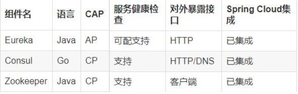
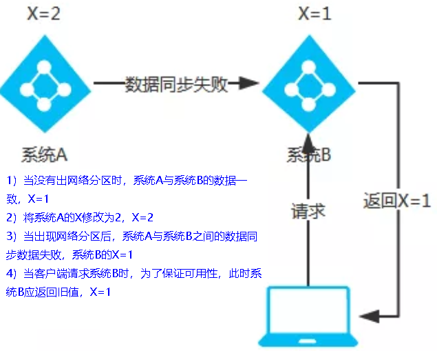
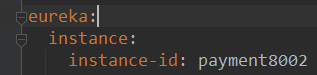
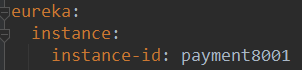
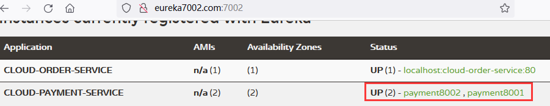
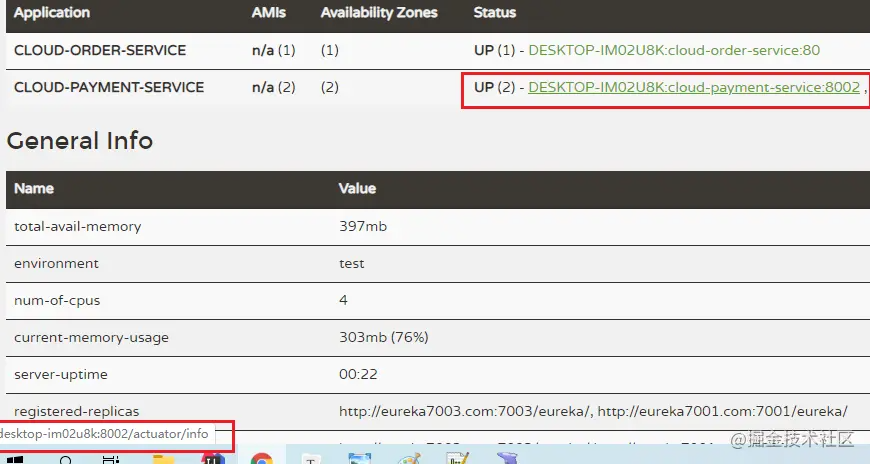
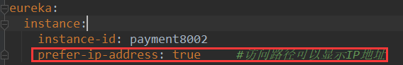
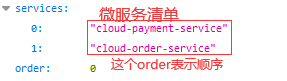
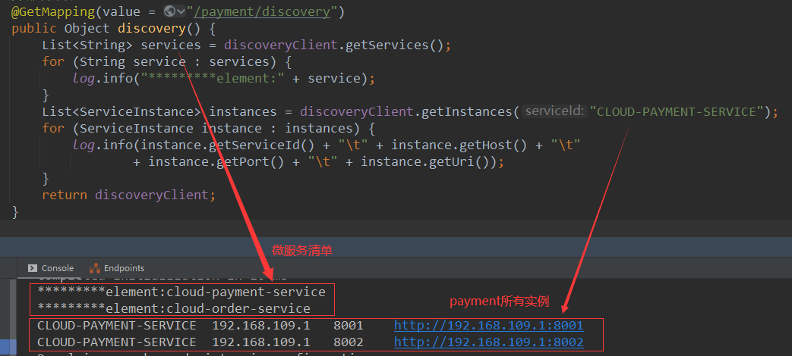
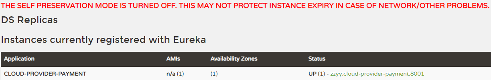

```ad-summary
参考：SpringCloud+RabbitMQ+Docker+Redis+搜索+分布式，系统详解springcloud微服务技术栈课（heima2021）
```

# 导学

微服务技术 > springcloud

微服务技术栈：


学习路线：


# 认识微服务

## 服务架构演变

单体架构：将业务的所有功能集中在一个项目中开发，打成一个包部署

- 优点：架构简单、部署成本低
- 缺点：耦合度高

分布式架构：根据业务功能对系统进行拆分，每个业务模块作为独立项目开发，称为一个服务

- 优点：降低服务耦合、有利于服务升级拓展
- 缺点：架构复杂，运维、监控、部署难度提高
- 分布式架构的要考虑的问题：
	- 服务拆分粒度如何?
	- 服务集群地址如何维护?
	- 服务之间如何实现远程调用?
	- 服务健康状态如何感知?

微服务是一种经过良好架构设计的==分布式架构方案==，微服务架构特征：

- 单一职责：微服务拆分粒度更小，每一个服务都对应唯一的业务能力，做到单一职责，避免重复业务开发
- 面向服务：微服务对外暴露业务接口
- 自治：团队独立、技术独立、数据独立、部署独立
- 隔离性强：服务调用做好隔离、容错、降级，避免出现级联问题

微服务技术对比：


企业需求：


## SpringCloud

SpringCloud 是目前国内使用最广泛的微服务框架。官网地址：[Spring Cloud](https://spring.io/projects/spring-cloud)

SpringCloud 集成了各种微服务功能组件，并基于 SpringBoot 实现了这些组件的自动装配，从而提供了良好的开箱即用体验：


SpringCloud 和 SpringBoot 版本兼容关系：


# 服务拆分及远程调用

## 服务拆分

注意事项：
1. 不同微服务，不要重复开发相同业务
2. 微服务数据独立，不要访问其它微服务的数据库
3. 微服务可以将自己的业务暴露为接口，供其它微服务调用

项目结构：
- cloud-demo
	- order-service（根据 id 查询订单）
	- user-service（根据 id 查询用户）

## 远程调用

查询订单对应的用户信息，order-service远程调用user-service

1）注册RestTemplate：在 order-service 的 OrderApplication 中注册 RestTemplate

```java
@MapperScan("cn.itcast.order.mapper")
@SpringBootApplication
public class OrderApplication {

    public static void main(String[] args) {
        SpringApplication.run(OrderApplication.class, args);
    }

    @Bean
    public RestTemplate restTemplate(){
        return new RestTemplate();
    }
}
```

2）远程调用

```java
@Service
public class OrderService {

    @Resource
    private OrderMapper orderMapper;
    @Resource
    private RestTemplate restTemplate;

    private final static String URL = "http://localhost:8081/user/";

    public Order queryOrderById(Long orderId) {
        Order order = orderMapper.findById(orderId);
        User user = restTemplate.getForObject(URL + order.getUserId().toString(), User.class);
        order.setUser(user);
        return order;
    }
}
```

## 服务调用关系

- *服务提供者*：暴露接口给其它微服务调用
- *服务消费者*：调用其它微服务提供的接口

> 服务 A 调用服务 B，服务 B 调用服务 C，那么服务 B 是什么角色?

提供者与消费者角色是相对的，一个服务可以同时是服务提供者和服务消费者


# ---------- 服务注册与发现


## 什么是服务注册与发现？

在服务注册与发现中，有一个**注册中心**。

- *服务注册*：每个服务节点在启动运行的时候，都会向注册中心注册服务，
	- 即将自己的地址信息 (ip、端口以及服务名字等) 上报给注册中心，注册中心负责将地址信息保存起来


- *服务发现*：**服务消费者**拿着服务的信息找注册中心要对方的地址信息。
	- 通常情况下，服务节点拿到地址信息之后，还会在**本地缓存**一份，保证在注册中心宕机时仍然可以正常调用服务。


- *服务健康检查*：为了保证服务地址列表中都是可用服务的地址信息，注册中心通常会通过 **心跳机制** 来检测服务是否可用，
- *不可用服务剔除*：注册中心会主动剔除不可用服务
- *服务状态变更通知*：如果服务信息发生变更，注册中心会将变更**推送**给相关联的服务，更新服务地址信息


> 调用 RPC 远程调用框架核心设计思想：在于注册中心，因为使用注册中心管理每个服务与服务之间的一个依赖关系 (服务治理概念)。在**任何 rpc 远程框架**中，都会有一个注册中心

## 为什么需要服务注册与发现？

#todo

## 常见的注册中心

比较常用的注册中心有 ZooKeeper、Eureka、Nacos，这三个都是使用 Java 语言开发，相对来说更适合 Java 技术栈

> 其他的还有像 ETCD、Consu，这里就不做介绍了。

1）严格意义上来说，*ZooKeeper* 设计之初并不是未来做注册中心的，只是前几年国内使用 Dubbo 的场景下比较喜欢使用它来做注册中心。

- 对于 CAP 理论来说，ZooKeeper 保证的是 **CP**。任何时刻对 ZooKeeper 的读请求都能得到一致性的结果，
- 但是，ZooKeeper 不保证每次请求的可用性（比如在 Leader 选举过程中或者半数以上的机器不可用的时候服务就是不可用的）

> 一致性（Consistency）、可用性（Availability）、分区容错性（Partition tolerance）

针对注册中心这个场景来说，重要的是可用性，**AP** 会更合适一些。ZooKeeper 更适合做分布式协调，服务注册中心就交给专业的来做吧!

2）*Eureka*，一款非常值得研究的注册中心。Eureka 是 Netflix 公司开源的一个注册中心，配套的还有 Feign、Ribbon、Zuul、Hystrix 等知名的微服务系统构建所必须的组件。

- 对于 CAP 理论来说，Eureka 保证的是 **AP**。Eureka 集群只要有一台 Eureka 正常服务，整个注册中心就是可用的，
- 只是查询到的数据可能是过期的（集群中的各个节点异步方式同步数据，不保证强一致性）

> Spring Cloud 2020.0.0 版本移除了 Netflix 除 Eureka 外的所有组件，因为在 2018 年的时候。Netflix 宣布其开源的核心组件 Hystrix、Ribbon、Zuul、Eureka 等进入维护状态，不再进行新特性开发，只修 BUG。于是，Spring 官方不得不考虑移除 Netflix 的组件。

不推荐使用 Eureka 作为注册中心，阿里开源的 Nacos 或许是更好的选择。

3）Nacos，一款即可以用来做**注册中心**，又可以用来做**配置中心**的优秀项目

- Nacos 属实是后起之秀，借鉴吸收了其他注册中心的优点，与 Spring Boot、Dubbo、Spring CloudKubernetes **无缝对接**，兼容性很好
- Nacos 不仅支持 **CP** 也支持 **AP**
- Nacos 性能强悍 (比 Eureka 能支持更多的服务实例)
- 易用性较强 (文档丰富、数据模型简单且自带后台管理界面)
- 支持 99.9% 高可用

推荐使用 Nacos 来做注册中心

## 注册中心的异同点



### CAP 理论

`Consistency（一致性）`：即更新操作成功并返回客户端后，所有节点在同一时间的数据完全一致。

- 对于客户端，一致性指的是并发访问时更新过的数据如何获取的问题。
- 对于服务端，则是更新如何复制分布到整个系统，以保证数据最终一致。

`Avaliability（可用性）`：即服务一直可用，而且是正常响应时间。系统能够很好的为用户服务，不出现用户操作失败或者访问超时等用户体验不好的情况。

`Partition Tolerance（分区容错性）`：即分布式系统在遇到某节点或网络故障的时候，仍然能够对外提供满足一致性和可用性的服务。分区容错性要求应用虽然是一个分布式系统，但看上去切好像是在一个可以运转正常的整体。比如现在的分布式系统中有某一个或者几个机器宕掉了，其他剩下的机器还能够正常运转满足系统要求，对于用户而言并没有什么体验上的影响。

==CAP 理论关注粒度是数据，而不是整体系统设计的策略==


CAP 理论的核心是：一个分布式系统不可能同时很好的满足一致性，可用性和分区容错性这三个需求，最多只能同时较好的满足两个。

因此，根据 CAP 原理将 NoSQL 数据库分成了满足 CA 原则、满足 CP 原则和满足 AP 原则三 大类：

- CA - 单点集群，满足一致性，可用性的系统，通常在可扩展性上不太强大。
- CP - 满足一致性，分区容忍性的系统，通常性能不是特别高。
- AP - 满足可用性，分区容忍性的系统，通常可能对一致性要求低一些。


### AP 架构

当网络分区出现后，为了保证可用性，系统 B 可以返回旧值，保证系统的可用性。

**结论：违背了一致性 C 的要求，只满足可用性和分区容错，即 AP**



### CP 架构

当网络分区出现后，为了保证一致性，就必须拒接请求，否则无法保证一致性

**结论：违背了可用性 A 的要求，只满足一致性和分区容错，即 CP**


# Eureka 注册中心

## 服务调用出现的问题

- 服务消费者该如何获取服务提供者的地址信息?
- 如果有多个服务提供者，消费者该如何选择?
- 消费者如何得知服务提供者的健康状态?

## Eureka 的作用

在 Eureka 架构中，微服务角色有两类：
- Eureka Server：服务端，**注册中心**
	- 记录服务信息
	- 心跳监控
- Eureka Client：客户端
	- Provider：服务提供者（例如案例中的 user-service）
		- 注册自己的信息到 Eureka Server
		- 每隔 30 秒向 EurekaServer **发送心跳**
	- consumer：服务消费者（例如案例中的 order-service ）
		- 根据服务名称从 Eureka server 拉取服务列表
		- 基于服务列表做负载均衡，选中一个微服务后发起远程调用

Eureka 的作用：
- 消费者该如何获取服务提供者具体信息?
	- 服务提供者启动时向 eureka **注册**自己的信息
	- eureka 保存这些信息
	- **消费者**根据服务名称向 eureka 拉取提供者信息
- 如果有多个服务提供者，消费者该如何选择?
	- 服务消费者利用**负载均衡**算法，从服务列表中挑选一个
- 消费者如何感知服务提供者健康状态?
	- 服务提供者会每隔 30 秒向 EurekaServer 发送心跳请求，报告健康状态 
	- eureka 会更新记录服务列表信息，心跳不正常会被剔除
	- 消费者就可以拉取到最新的信息


## 动手实践

整体流程：
- 搭建 EurekaServer
- 将 user-service、order-service 都注册到 eureka
- 在 order-service 中完成服务拉取，然后通过负载均衡挑选一个服务，实现远程调用

### 搭建 eureka-server

eureka-server 必须是一个独立的微服务

1）引入 eureka-server 依赖

```xml
<dependencies>
    <!--eureka-server-->
    <dependency>
        <groupId>org.springframework.cloud</groupId>
        <artifactId>spring-cloud-starter-netflix-eureka-server</artifactId>
    </dependency>
</dependencies>
```

2）编写启动类，添加 `@EnableEurekaServer` 注解

```java
@SpringBootApplication
@EnableEurekaServer  //表示当前是Eureka的服务注册中心
public class EurekaApplication {
    public static void main(String[] args) {
        SpringApplication.run(EurekaApplication.class, args);
    }
}
```

3）配置文件

```yml
server:
  port: 10086
spring:
  application:
    name: eureka-server
eureka:
  client:
    service-url:
      # EurekaServer的地址，现在是自己的地址，如果是集群，需要加上其它Server的地址
      defaultZone: http://127.0.0.1:10086/eureka/
```

测试：浏览器访问 http://localhost:7001

- instances currently registered with euraka：已经注册到 Eureka 的实例


### 服务注册

将 user-service 服务注册到 EurekaServer（order-service 同理）

1）添加 Eureka-Client 依赖

```xml
<dependency>
  <groupId>org.springframework.cloud</groupId>
  <artifactId>spring-cloud-starter-netflix-eureka-client</artifactId>
</dependency>
```

2）配置文件添加如下配置：

```yml
spring:
  application:
    name: user-service # 微服务的注册名称
eureka:
  client:
    service-url:
      defaultZone: http://127.0.0.1:10086/eureka
```

另外，可以将服务多次启动模拟多实例部署，但为了避免端口冲突，需要修改端口设置

- 再启动一个服务，VM options 设置 `-Dserver.port=8082`


### 服务发现 & 负载均衡

服务拉取：基于服务名称获取**服务列表**，然后再对服务列表做**负载均衡**

1）修改 order-service 中调用的 url 路径，==用服务名代替 ip、端口==

```java
private final static String URL = "http://user-service/user/";
```

2）使用 `@LoadBalanced` 注解赋予 RestTemplate 负载均衡的能力

```java
@Bean
@LoadBalanced //赋予 RestTemplate 负载均衡的能力
public RestTemplate restTemplate() {
	return new RestTemplate();
}
```

> 查看两个 user-service 的 mybatis 日志，都被调用了

## actuator 微服务信息完善

#### 主机名称：服务名称的规范和修改

按照规范的要求只暴露服务名，不带有主机名。 

修改生产者 8001/8002 的 yml

 

测试：仅暴露服务名



#### 访问信息有 IP 信息提示



我现在点击这个微服务的链接，没有 ip 信息提示。 实际工作中，我们都会说这个微服务是部署在几号机器上面的几号端口。我们要让访问信息 有 ip 信息提示。 

在每个微服务的 yml 中添加如下



## 服务发现 Discovery

服务发现：对于注册进 eureka 里面的微服务，可以通过服务发现来获得该服务的信息

不排除我们微服务要对外提供一种功能。那么我们就需要拿到在 eureka 上注册了的微服务的信息，例如：主机名称、端口号。

修改 cloud-provider-payment8001 的 controller，注入`DiscoveryClient`（注意写在 80 和 8002 中也都可以获得所有的微服务信息，这里只是在 8001 上进行测试）

```java
@RestController
@Slf4j
public class PaymentController {

    @Value("${server.port}")
    private String serverPort;

    @Resource
    private PaymentService paymentService;

    @Resource
    private DiscoveryClient discoveryClient;

    @GetMapping(value = "/payment/discovery")
    public Object discovery() {
        List<String> services = discoveryClient.getServices();
        for (String element : services) {
            log.info(element);
        }

        List<ServiceInstance> instances = discoveryClient.getInstances("CLOUD-PAYMENT-SERVICE");
        for (ServiceInstance element : instances) {
            log.info(element.getServiceId() + "\t"
                    + element.getHost() + "\t" + element.getPort() + "\t" + element.getUri());
        }
        return this.discoveryClient;
    }
}
```

8001 主启动类上添加 `@EnableDiscoveryClient`

```java
@SpringBootApplication
@EnableEurekaClient
@EnableDiscoveryClient //服务发现
public class PaymentMain8001 {
    public static void main(String[] args) {
        SpringApplication.run(PaymentMain8001.class, args);
    }
}
```

测试： http://localhost:8001/payment/discovery





## eureka 自我保护

#### 概述

什么是保护模式？

保护模式主要用于一组客户端和 EurekaServer 之间存在网络分区场景下的保护。一旦进入保护模式 EurekaServer 将会尝试保护其服务注册表中的信息，不再删除服务注册表中的数据，也就是不会注销任何微服务。 

如果在 EurekaServer 的首页看到以下这段提示，则说明 Eureka 进入了保护模式：


综上，自我保护模式是一种应对网络异常的安全保护措施。它的架构哲学是宁可同时保留所有微服务（健康的微服务和不健康的微服务都会保留）也不盲目注销任何健康的微服务。使用自我保护模式，可以让 Eureka 集群更加的健壮、稳定。

一句话：某时刻某一个微服务不可用了，Eureka 不会立刻清理，依旧会对该微服务的信息进行保存。


为什么会产生 Eureka 自我保护机制？

因为可能存在这样的情况： EurekaClient 可以正常运行，但是与 EurekaServer 网络不通。 此时 EurekaServer 不会立刻将 EurekaClient 服务剔除。 

默认情况下，如果 EurekaServer 在一定时间内没有接收到某个微服务实例的心跳，EurekaServer 将会注销该实例（默认 90 秒）。但是当网络分区故障发生(延时、卡顿、拥挤)时，微服务与 EurekaServer 之间无法正常通信，以上行为可能变得非常危险了——因为微服务本身其实是健康的，此时本不应该注销这个微服务。Eureka 通过“自我保护模式”来解决这个问题——当 EurekaServer 节点在短时间内丢失过多客户端时（可能发生了网络分区故障），那么这个节点就会进入自我保护模式。


属于 CAP 里面的 AP 分支。


#### 禁止自我保护？

##### 修改注册中心 eurekaServer 端 7001

出厂默认，自我保护机制是开启的，`eureka.server.enable-self-preservation=true`

修改 yml

```yml
eureka:
  server:
    # 关闭自我保护机制，保证不可用服务被及时踢除
    enable-self-preservation: false
    eviction-interval-timer-in-ms: 2000
```

测试关闭效果：访问 7001




##### 修改生产者客户端 eurekaClient 端 8001

默认：

```yml
eureka.instance.lease-renewal-interval-in-seconds=30
eureka.instance.lease-expiration-duration-in-seconds=90
```

修改 yml

```yml
eureka:
  instance:
    instance-id: payment8001
    prefer-ip-address: true # 访问路径可以显示 IP 地址
    # Eureka 客户端向服务端发送心跳的时间间隔，单位为秒(默认是 30 秒)
    lease-renewal-interval-in-seconds: 1
    # Eureka 服务端在收到最后一次心跳后等待时间上限，单位为秒(默认是 90 秒)，超时将剔除服务
    lease-expiration-duration-in-seconds: 2
```

# Ribbon 负载均衡

Spring Cloud Ribbon 是基于 Netflix Ribbon 实现的一套客户端**负载均衡**的工具

负载均衡流程


> Ribbon 负载均衡 VS Nginx 负载均衡？
> 
> - Nginx 是服务器负载均衡，客户端所有请求都会交给 nginx，然后由 nginx 实现转发请求。即负载均衡是由==服务端实现==的。
> - Ribbon 本地负载均衡，在调用微服务接口时候，会在注册中心上获取注册信息服务列表之后缓存到 JVM 本地，从而在==本地实现== RPC 远程服务调用技术

## 原理

> 源码跟踪 #todo

SpringCloudRibbon 的底层采用了一个拦截器，拦截了 RestTemplate 发出的请求，对地址做了修改

基本流程如下：

- 拦截我们的 RestTemplate 请求 [http://userservice/user/1](http://userservice/user/1)
- RibbonLoadBalancerClient 会从请求 url 中获取服务名称，也就是 user-service
- DynamicServerListLoadBalancer 根据 user-service 到 eureka 拉取服务列表
	- eureka 返回列表，localhost:8081、localhost:8082
- IRule 利用内置负载均衡规则，从列表中选择一个，例如 localhost:8081
- RibbonLoadBalancerClient 修改请求地址


## 负载均衡策略

负载均衡的规则都定义在 IRule 接口中，而 IRule 有很多不同的实现类，每一个实现类都代表一个策略


| **内置负载均衡规则类**             | **规则描述**                                                                                                                                                                                                                                                                |
| ------------------------- | ----------------------------------------------------------------------------------------------------------------------------------------------------------------------------------------------------------------------------------------------------------------------- |
| RoundRobinRule            | 简单轮询服务列表来选择服务器。它是 Ribbon 默认的负载均衡规则。                                                                                                                                                                                                                                     |
| AvailabilityFilteringRule | 对以下两种服务器进行忽略：<br> （1）在默认情况下，这台服务器如果 3 次连接失败，这台服务器就会被设置为“短路”状态。短路状态将持续 30 秒，如果再次连接失败，短路的持续时间就会几何级地增加。 <br>（2）并发数过高的服务器。如果一个服务器的并发连接数过高，配置了 AvailabilityFilteringRule 规则的客户端也会将其忽略。并发连接数的上限，可以由客户端的 `<clientName>.<clientConfigNameSpace>.ActiveConnectionsLimit` 属性进行配置。 |
| WeightedResponseTimeRule  | 为每一个服务器赋予一个权重值。服务器响应时间越长，这个服务器的权重就越小。这个规则会随机选择服务器，这个权重值会影响服务器的选择。                                                                                                                                                                                                       |
| **ZoneAvoidanceRule**     | 以区域可用的服务器为基础进行服务器的选择。使用 Zone 对服务器进行分类，这个 Zone 可以理解为一个机房、一个机架等。而后再对 Zone 内的多个服务做轮询。                                                                                                                                                                                      |
| BestAvailableRule         | 忽略那些短路的服务器，并选择并发数较低的服务器。                                                                                                                                                                                                                                                |
| RandomRule                | 随机选择一个可用的服务器。                                                                                                                                                                                                                                                           |
| RetryRule                 | 重试机制的选择逻辑                                                                                                                                                                                                                                                               |

## 配置负载均衡策略

服务调用方通过定义 IRule 实现可以修改负载均衡规则，有两种方式：

1）代码方式：在配置类中，定义一个新的 IRule：

```java
@Configuration  
public class ApplicationContextConfig {  
  
    @Bean  
    @LoadBalanced //使用@LoadBalanced注解赋予RestTemplate负载均衡的能力  
    public RestTemplate restTemplate() {  
        return new RestTemplate();  
    }  
  
    @Bean  
    public IRule randomRule(){  
        return new RandomRule();  
    }  
}
```

2）配置文件方式：在 application.yml 文件中，添加新的配置也可以修改规则

```yml
cloud-payment-service: # 给某个微服务配置负载均衡规则，这里是userservice服务
  ribbon:
    NFLoadBalancerRuleClassName: com.netflix.loadbalancer.RandomRule # 负载均衡规则 
```

## 饥饿加载

Ribbon 默认是采用**懒加载**，即第一次访问时才会去创建 LoadBalanceClient，==请求时间会很长==。

而**饥饿加载**则会在项目启动时创建，降低第一次访问的耗时

通过下面配置开启饥饿加载：

```yml
ribbon:  
  eager-load:  
    enabled: true # 开启饥饿加载
    clients: cloud-payment-service # 指定对cloud-payment-service服务饥饿加载
```

# Nacos 服务注册中心

> 对应着我们前面学的：Eureka/Consul/Zookeeper（服务注册） Config+Bus（配置中心）

## Nacos 简介

> Nacos——**Na**ming **Co**nfiguration **S**ervice

[Nacos](https://nacos.io/)是阿里巴巴的产品，现在是[SpringCloud](https://spring.io/projects/spring-cloud)中的一个组件。相比[Eureka](https://github.com/Netflix/eureka)功能更加丰富，在国内受欢迎程度较高。

- 一个更易于构建云原生应用的动态服务发现、配置管理和服务的管理平台。
- Nacos 就是注册中心 + 配置中心的组合， **Nacos = Eureka + Config + Bus**

> 官网文档：[https://nacos.io/zh-cn/index.html]()

### 安装并运行 Nacos

> 下载地址：[https://github.com/alibaba/Nacos]()

运行 bin 目录下的 startup.cmd，默认的是集群模式启动

```bash
# 单机模式启动
# windows
startup.cmd -m standalone
# mac
sh startup.sh -m standalone
```

运行成功，访问 [http://localhost:8848/nacos]()，默认账号密码都是 nacos

## Nacos 注册中心

### 服务注册到 Nacos

1）依赖

父工程管理版本
```xml
<dependencyManagement>
    <dependencies>
        <dependency>
            <groupId>com.alibaba.cloud</groupId>
            <artifactId>spring-cloud-alibaba-dependencies</artifactId>
            <version>2.1.0.RELEASE</version>
            <type>pom</type>
            <scope>import</scope>
        </dependency>
    </dependencies>
</dependencyManagement>
```

spring-cloud-alibaba-dependencies中规定了版本号
```xml
<properties>  
    <sentinel.version>1.7.1</sentinel.version>  
    <oss.version>3.1.0</oss.version>  
    <seata.version>1.0.0</seata.version>  
    <nacos.client.version>1.1.4</nacos.client.version>  
    <nacos.config.version>0.8.0</nacos.config.version>  
    <acm.version>1.0.9</acm.version>  
    <ans.version>1.0.1</ans.version>  
    <aliyun.sdk.version>4.4.1</aliyun.sdk.version>  
    <alicloud.context.version>1.0.5</alicloud.context.version>  
    <aliyun.sdk.edas.version>2.44.0</aliyun.sdk.edas.version>  
    <schedulerX.client.version>2.1.6</schedulerX.client.version>  
    <aliyun.java.sdk.dysmsapi>1.1.0</aliyun.java.sdk.dysmsapi>  
    <aliyun.sdk.mns>1.1.8.6</aliyun.sdk.mns>  
    <aliyun.java.sdk.dyvmsapi>1.1.1</aliyun.java.sdk.dyvmsapi>  
	<spring.context.support.version>1.0.5</spring.context.support.version>  
</properties>
```

需要注册的服务引入 nacos-discovery 依赖

```xml
<dependencies>
    <!--SpringCloud ailibaba nacos -->
    <dependency>
        <groupId>com.alibaba.cloud</groupId>
        <artifactId>spring-cloud-starter-alibaba-nacos-discovery</artifactId>
    </dependency>
</dependencies>
```

2）配置 nacos 地址

```yml
server:
  port: 8081

spring:
  application:
    name: userservice
  cloud:
    nacos:
      server-addr: localhost:8848 # 配置Nacos地址 ，注册到 Nacos
```

```yml
server:
  port: 8088

spring:
  application:
    name: orderservice
  cloud:
    nacos:
      server-addr: localhost:8848
```

3）业务类

 服务提供者：返回端口号功能

```java
@RestController
public class PaymentController {
    @Value("${server.port}")
    private String serverPort;

    @GetMapping(value = "/payment/nacos/{id}")
    public String getPayment(@PathVariable("id") Integer id) {
        return "nacos registry, serverPort: " + serverPort + "\t id" + id;
    }
}
```

服务消费者

```java
@RestController  
@RequestMapping("/consumer")  
@Slf4j  
public class OrderNac

osController {  
    @Resource  
    private RestTemplate restTemplate;  
  
    private String serverURL = "http://nacos-payment-provider";  
  
    @GetMapping("/payment/{id}")  
    public String paymentInfo(@PathVariable("id") Long id) {  
        String result = restTemplate.getForObject(serverURL + "/payment/" + id, String.class);  
        return result;  
    }  
}
```


4）启动成功，访问 http://localhost:9001/payment/1


## 服务分级存储模型

> 一个**服务**可以有多个**实例**，例如 user-service，可以有:
> 
> - 127.0.0.1:8081
> - 127.0.0.1:8082
> - 127.0.0.1:8083
> 
> 假如这些实例分布于全国各地的不同机房，例如：
> 
> - 127.0.0.1:8081，在上海机房
> - 127.0.0.1:8082，在上海机房
> - 127.0.0.1:8083，在杭州机房

Nacos 就将同一机房内的实例 划分为一个**集群**

也就是说，user-service 是服务，一个服务可以包含多个集群，如杭州、上海，每个集群下可以有多个实例，形成分级模型，如图：


1）Nacos 服务分级存储模型

1. 一级是**服务**，例如 userservice
2. 二级是**集群**，例如 杭州或上海
3. 三级是**实例**，例如 杭州机房的某台部署了 userservice 的服务器

### 实例集群配置

如何设置实例的集群属性：修改 `application.yml` 文件，添加集群配置属性

```yml
spring:
  cloud:
    nacos:
      server-addr: localhost:8848
      discovery:
        cluster-name: HZ # 集群名称
```

---

复制多个 nacos-payment-provider 实例，通过以下参数启动

```bash
-Dserver.port=9001 -Dspring.cloud.nacos.discovery.cluster-name=HZ
-Dserver.port=9002 -Dspring.cloud.nacos.discovery.cluster-name=HZ
-Dserver.port=9003 -Dspring.cloud.nacos.discovery.cluster-name=SH
```

查看控制台


### NacosRule 负载均衡策略

默认的 `ZoneAvoidanceRule` 并不能实现根据同集群优先来实现负载均衡。

Nacos 中提供了一个 `NacosRule` 的实现，可以**优先从同集群中挑选实例**

在服务消费者中配置：

```yml
nacos-payment-provider:
  ribbon:
    NFLoadBalancerRuleClassName: com.alibaba.cloud.nacos.ribbon.NacosRule # 负载均衡规则
```

> 将 cloudalibaba-consumer-nacos-order83 的集群也配置为 HZ，设置 NacosRule 负载均衡策略，调用生产者服务返回的端口号都是 HZ 集群的

## 权重配置

> 服务器设备性能有差异，部分实例所在机器性能较好，另一些较差，我们希望性能好的机器承担更多的用户请求。

默认情况下 NacosRule 是同集群内随机挑选，不会考虑机器的性能问题。

Nacos 提供了权重配置来控制访问频率，==权重越大则访问频率越高==。

直接在 nacos 控制台编辑权重即可：


## 环境隔离

Nacos 提供了 namespace 来实现环境隔离功能

- nacos 中可以有多个 namespace
- namespace 下可以有 group、service 等
- 不同 namespace 之间相互隔离，例如==不同 namespace 的服务互相不可见==


默认情况下，所有 service、data、group 都在名为 **public** 的 namespace 下

给微服务配置 namespace ，通过修改配置文件：

```yml
spring:  
  cloud:  
    nacos:  
      discovery:  
        namespace: 65527313-eef9-439e-a3e0-bf2187879a5d # namespace的id，开发环境
```

> 将 consumer 服务配置在 dev namespace 下，provider 服务配置在 public namespace 下，consumer 调用不到 provider 服务


## Nacos 和 Eureka 的异同

Nacos 的服务实例分为两种类型：

- *临时实例*（默认）：如果实例宕机超过一定时间，会从服务列表剔除
- *非临时实例*：如果实例宕机，不会从服务列表剔除，也可以叫**永久实例**

配置一个服务实例为永久实例：

```yml
 spring:  
   cloud:  
     nacos:  
       discovery:  
         ephemeral: false # 设置为非临时实例
```

Nacos 和 Eureka 整体结构类似，服务注册、服务拉取、心跳等待，但是也存在一些差异：

- 共同点
    - 都支持服务注册和服务拉取
    - 都支持服务提供者**心跳方式**做健康检测
- 区别
    - Nacos 支持服务端主动检测提供者状态：
	    - 临时实例（干儿子）采用**心跳**模式，
	    - 非临时实例（亲儿子）采用**主动检测**模式
	    - 临时实例心跳不正常会被剔除，非临时实例则不会被剔除
    - Nacos 支持服务列表变更的**消息推送**模式，服务列表更新更及时
    - CAP：
	    - Nacos 集群**默认**采用 AP 方式。当集群中存在非临时实例时，采用 CP 模式；
	    - Eureka 采用 AP 方式


