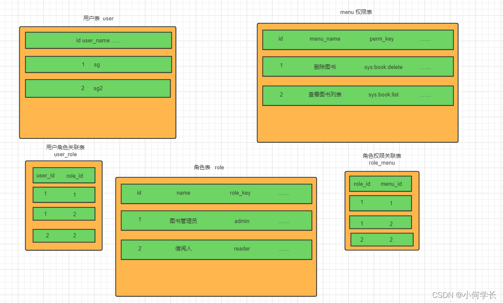
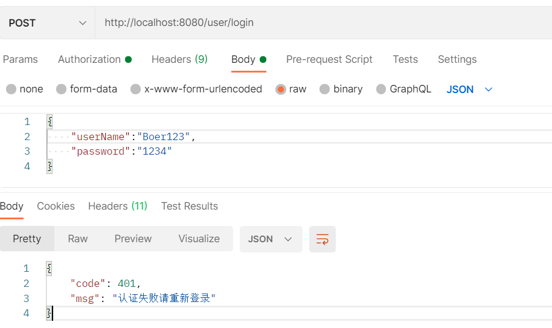

# 授权

## 权限系统的作用

 例如一个学校图书馆的管理系统，如果是普通学生登录就能看到借书还书相关的功能，不可能让他看到并且去使用添加书籍信息，删除书籍信息等功能。但是如果是一个图书馆管理员的账号登录了，应该就能看到并使用添加书籍信息，删除书籍信息等功能。

 总结起来就是**不同的用户可以使用不同的功能**。这就是权限系统要去实现的效果。

 我们不能只依赖前端去判断用户的权限来选择显示哪些菜单哪些按钮。因为如果只是这样，如果有人知道了对应功能的接口地址就可以不通过前端，直接去发送请求来实现相关功能操作。

 所以我们还需要在后台进行用户权限的判断，判断当前用户是否有相应的权限，必须具有所需权限才能进行相应的操作。


## 授权基本流程（重要）

在SpringSecurity中，会使用默认的 `FilterSecurityInterceptor` 来进行权限校验。在FilterSecurityInterceptor中会从`SecurityContextHolder ` 获取其中的 `Authentication`，然后获取其中的权限信息。当前用户是否拥有访问当前资源所需的权限。

所以我们在项目中只需要把当前登录用户的权限信息也存入 Authentication

然后设置我们的资源所需要的权限即可


## 授权实现

### 限制访问资源所需权限

SpringSecurity为我们提供了基于注解的权限控制方案，这也是我们项目中主要采用的方式。我们可以使用注解去指定访问对应的资源所需的权限。

但是要使用它我们需要先开启相关配置

```java
// 开启基于方法的安全认证机制，也就是说在web层的controller启用注解机制的安全确认
// securedEnabled 确定是否应该启用Spring Security的安全注释
@EnableGlobalMethodSecurity(prePostEnabled = true)
public class SecurityConfig extends WebSecurityConfigurerAdapter {}
```

然后就可以使用对应的注解 @PreAuthorize

```java
@GetMapping("/hello")
//实际执行的时候会去调用hasAuthority这个方法，判断用户是否具有 test 权限
@PreAuthorize("hasAuthority('test')")
public String hello() {
    return "hello";
}
```

### 封装权限信息

我们前面在写UserDetailsServiceImpl的时候说过，在查询出用户后还要获取对应的权限信息，封装到UserDetails中返回。

我们先直接把权限信息写死封装到UserDetails中进行测试。

我们之前定义了UserDetails的实现类LoginUser，想要让其能封装权限信息就要对其进行修改，增加 permissions 字段存储权限信息

重写 getAuthorities 方法，把permissions中字符串类型的权限信息转换成GrantedAuthority对象存入authorities中

```java
@Data
@NoArgsConstructor
public class LoginUser implements UserDetails {
  
    private User user;
        
    //存储用户的权限信息
    private List<String> permissions;

    public LoginUser(User user, List<String> permissions) {
        this.user = user;
        this.permissions = permissions;
    }

    //存储SpringSecurity所需要的权限信息的集合
    @JSONField(serialize = false) //不让序列化，redis不存
    //将authorities作为全局变量，不用每次都转换 permissions 为 authorities
    //GrantedAuthority 是 GrantedAuthority 的实现类
    private List<GrantedAuthority> authorities;

    @Override
    //接受的返回类型是 GrantedAuthority 实现类的集合
    public Collection<? extends GrantedAuthority> getAuthorities() {
        if (authorities != null) {
            return authorities;
        }
        //把permissions中字符串类型的权限信息转换成GrantedAuthority对象存入authorities中
        //函数式编程写法
        authorities = permissions.stream().
                map(SimpleGrantedAuthority::new)
                .collect(Collectors.toList());
        return authorities;
        /*
        原写法：
        authorities=new ArrayList<>();
        for (String permission : permissions) {
            SimpleGrantedAuthority authority = new SimpleGrantedAuthority(permission);
            authorities.add(authority);
        }
        */
    }
}
```

LoginUser修改完后我们就可以在UserDetailsServiceImpl中去把权限信息封装到LoginUser中了。我们写死权限进行测试，后面我们再从数据库中查询权限信息

```java
@Service
public class UserDetailsServiceImpl implements UserDetailsService {

    @Autowired
    private UserMapper userMapper;

    @Override
    public UserDetails loadUserByUsername(String username) throws UsernameNotFoundException {
        LambdaQueryWrapper<User> wrapper = new LambdaQueryWrapper<>();
        wrapper.eq(User::getUserName,username);
        User user = userMapper.selectOne(wrapper);
        if(Objects.isNull(user)){
            throw new RuntimeException("用户名或密码错误");
        }
        //TODO 根据用户查询权限信息 添加到LoginUser中
        List<String> list = new ArrayList<>(Arrays.asList("test"));
        return new LoginUser(user,list);
    }
}
```

在自定义过滤器中将获取的权限信息封装到Authentication中

```java
@Component
public class JwtAuthenticationTokenFilter extends OncePerRequestFilter {
    @Autowired
    private RedisCache redisCache;

    @Override
    protected void doFilterInternal(HttpServletRequest request, HttpServletResponse response, FilterChain filterChain) throws ServletException, IOException {
        //获取token
        ...
        //解析token
        ...
        //从redis中获取用户信息
     		...
        //存入SecurityContextHolder
        //获取权限信息 loginUser.getAuthorities() 封装到Authentication中
        UsernamePasswordAuthenticationToken authenticationToken =
                new UsernamePasswordAuthenticationToken(loginUser, null, loginUser.getAuthorities());
        SecurityContextHolder.getContext().setAuthentication(authenticationToken);
        //放行
        filterChain.doFilter(request, response);
    }
}
```


### 从数据库查询权限信息

#### RBAC权限模型

RBAC权限模型（Role-Based Access Control）即：基于角色的权限控制。这是目前最常被开发者使用也是相对易用、通用权限模型。

用户和角色是多对多关系，角色和权限是多对多关系



#### 准备工作

数据库创建 user、role、menu 以及 关联表

```
sql脚本
```

sql测试语句，根据userid查询perms，对应的role和menu都必须是是正常状态

```mysql
SELECT 
	DISTINCT m.`perms`
FROM
	sys_user_role ur
	LEFT JOIN `sys_role` r ON ur.`role_id` = r.`id`
	LEFT JOIN `sys_role_menu` rm ON ur.`role_id` = rm.`role_id`
	LEFT JOIN `sys_menu` m ON m.`id` = rm.`menu_id`
WHERE
	user_id = 2
	AND r.`status` = 0
	AND m.`status` = 0
```

菜单表(Menu)实体类

```java
/**
 * 菜单表(Menu)实体类
 */
@TableName(value="sys_menu")
@Data
@AllArgsConstructor
@NoArgsConstructor
@JsonInclude(JsonInclude.Include.NON_NULL)
public class Menu implements Serializable {
    private static final long serialVersionUID = -54979041104113736L;
    
    @TableId
    private Long id;
    /**
    * 菜单名
    */
    private String menuName;
    /**
    * 路由地址
    */
    private String path;
    /**
    * 组件路径
    */
    private String component;
    /**
    * 菜单状态（0显示 1隐藏）
    */
    private String visible;
    /**
    * 菜单状态（0正常 1停用）
    */
    private String status;
    /**
    * 权限标识
    */
    private String perms;
    /**
    * 菜单图标
    */
    private String icon;
    
    private Long createBy;
    
    private Date createTime;
    
    private Long updateBy;
    
    private Date updateTime;
    /**
    * 是否删除（0未删除 1已删除）
    */
    private Integer delFlag;
    /**
    * 备注
    */
    private String remark;
}
```


#### 代码实现

我们只需要根据用户id去查询到其所对应的权限信息即可

所以我们可以先定义个mapper，其中提供一个方法可以根据userid查询权限信息

```java
public interface MenuMapper extends BaseMapper<Menu> {
    List<String> selectPermsByUserId(Long id);
}
```

这是自定义方法，没法使用mp自带的方法，所以需要创建对应的mapper映射文件，定义对应的sql语句

```xml
<?xml version="1.0" encoding="UTF-8" ?>
<!DOCTYPE mapper PUBLIC "-//mybatis.org//DTD Mapper 3.0//EN" "http://mybatis.org/dtd/mybatis-3-mapper.dtd" >
<mapper namespace="com.boer.mapper.MenuMapper">
    <select id="selectPermsByUserId" resultType="java.lang.String">
        SELECT
            DISTINCT m.`perms`
        FROM
            sys_user_role ur
            LEFT JOIN `sys_role` r ON ur.`role_id` = r.`id`
            LEFT JOIN `sys_role_menu` rm ON ur.`role_id` = rm.`role_id`
            LEFT JOIN `sys_menu` m ON m.`id` = rm.`menu_id`
        WHERE
            user_id = #{userid}
            AND r.`status` = 0
            AND m.`status` = 0
    </select>
</mapper>
```

在application.yml中配置mapperXML文件的位置

```yaml
spring:
  datasource:
    url: jdbc:mysql://localhost:3306/sg_security?characterEncoding=utf-8&serverTimezone=UTC
    username: root
    password: root
    driver-class-name: com.mysql.cj.jdbc.Driver
  redis:
    host: localhost
    port: 6379
mybatis-plus:
  mapper-locations: classpath*:/mapper/**/*.xml # 可以不配，MybatisPlusProperties中默认值就是这个
```

测试一下mapper的功能

```java
@SpringBootTest
@RunWith(SpringRunner.class)
public class MapperTest {
    @Autowired
    private MenuMapper menuMapper;

    @Test
    public void testSelectPermsByUserId() {
        List<String> list = menuMapper.selectPermsByUserId(2L);
        System.out.println(list);
    }
}
```

然后我们可以在UserDetailsServiceImpl中去调用该mapper的方法查询权限信息封装到LoginUser对象中即可。

```java
@Service
public class UserDetailsServiceImpl implements UserDetailsService {
    @Autowired
    private UserMapper userMapper;

    @Autowired
    private MenuMapper menuMapper;

    @Override
    public UserDetails loadUserByUsername(String username) throws UsernameNotFoundException {
        LambdaQueryWrapper<User> wrapper = new LambdaQueryWrapper<>();
        wrapper.eq(User::getUserName,username);
        User user = userMapper.selectOne(wrapper);
        if(Objects.isNull(user)){
            throw new RuntimeException("用户名或密码错误");
        }
      
        //根据用户查询权限信息 添加到LoginUser中
        List<String> list =  menuMapper.selectPermsByUserId(user.getId());
        //封装成UserDetails对象返回
        //List<String> list = new ArrayList<>(Arrays.asList("test")); //原来是写死的
        return new LoginUser(user, list);
    }
}
```

重新为控制器设置权限，按照数据库里的标准

```java
@GetMapping("/hello")
//@PreAuthorize("hasAuthority('test')")
@PreAuthorize("hasAuthority('system:dept:list')") //直接从menu表复制过来
//实际执行的时候会去调用hasAuthority这个方法，判断用户是否具有 test 权限
public String hello() {
    return "hello";
}
```


# 自定义失败处理

我们还希望在认证失败或者是授权失败的情况下也能和我们的接口一样返回相同结构的json，这样可以让前端能对响应进行统一的处理。要实现这个功能我们需要知道SpringSecurity的异常处理机制。

在SpringSecurity中，如果我们在认证或者授权的过程中出现了异常会被 `ExceptionTranslationFilter` 捕获到。在ExceptionTranslationFilter中会去判断是认证失败还是授权失败出现的异常。

如果是认证过程中出现的异常会被封装成 `AuthenticationException` 然后调用 `AuthenticationEntryPoint` 对象的方法去进行异常处理。

如果是授权过程中出现的异常会被封装成 `AccessDeniedException` 然后调用 `AccessDeniedHandler` 对象的方法去进行异常处理。

所以如果我们需要自定义异常处理，我们只需要自定义 `AuthenticationEntryPoint` 和 `AccessDeniedHandler` 然后配置给SpringSecurity即可。


自定义 `AuthenticationEntryPoint` 和 `AccessDeniedHandler` 的实现类

```java
@Component
public class AuthenticationEntryPointImpl implements AuthenticationEntryPoint {
    @Override
    public void commence(HttpServletRequest request, HttpServletResponse response, AuthenticationException authException) throws IOException, ServletException {
        // HttpStatus.UNAUTHORIZED.value() 就是 401
        ResponseResult result = new ResponseResult(HttpStatus.UNAUTHORIZED.value(), "认证失败请重新登录");
        // com.alibaba.fastjson下的JSON，toJSONString()方法返回一个json格式的字符串
        String json = JSON.toJSONString(result);
        WebUtils.renderString(response, json);
    }
}
```

```java
@Component
public class AccessDeniedHandlerImpl implements AccessDeniedHandler {
    @Override
    public void handle(HttpServletRequest request, HttpServletResponse response, AccessDeniedException accessDeniedException) throws IOException, ServletException {
        // HttpStatus.FORBIDDEN.value() 就是 403
        ResponseResult result = new ResponseResult(HttpStatus.FORBIDDEN.value(), "权限不足");
        String json = JSON.toJSONString(result);
        WebUtils.renderString(response, json);
    }
}
```

配置异常处理器给SpringSecurity，先注入我们实现的异常处理器

```java
@Configuration
@EnableGlobalMethodSecurity(prePostEnabled = true)
public class SecurityConfig extends WebSecurityConfigurerAdapter {
    @Autowired
    private AuthenticationEntryPoint authenticationEntryPoint;
    @Autowired
    private AccessDeniedHandler accessDeniedHandler;

    @Override
    protected void configure(HttpSecurity http) throws Exception {
        // 配置异常处理器
        http.exceptionHandling().authenticationEntryPoint(authenticationEntryPoint).
                accessDeniedHandler(accessDeniedHandler);
    }
}
```

测试认证失败，输入错误密码或者不存在的用户名



测试授权失败，把controller的权限改改就行


# 跨域

浏览器出于安全的考虑，使用 XMLHttpRequest对象发起 HTTP请求时必须遵守同源策略，否则就是跨域的HTTP请求，默认情况下是被禁止的。 同源策略要求源相同才能正常进行通信，即协议、域名、端口号都完全一致。

前后端分离项目，前端项目和后端项目一般都不是同源的，所以肯定会存在跨域请求的问题。

所以我们就要处理一下，让前端能进行跨域请求。


先对SpringBoot配置，允许跨域请求

```java
@Configuration
public class CorsConfig implements WebMvcConfigurer {
    @Override
    public void addCorsMappings(CorsRegistry registry) {
        // 设置允许跨域的路径
        registry.addMapping("/**")
                // 设置允许跨域请求的域名
                .allowedOriginPatterns("*")
                // 是否允许cookie
                .allowCredentials(true)
                // 设置允许的请求方式
                .allowedMethods("GET", "POST", "DELETE", "PUT")
                // 设置允许的header属性
                .allowedHeaders("*")
                // 跨域允许时间
                .maxAge(3600);
    }
}
```

开启SpringSecurity的跨域访问

由于我们的资源都会收到SpringSecurity的保护，所以想要跨域访问还要让SpringSecurity运行跨域访问

```java
@Configuration
@EnableGlobalMethodSecurity(prePostEnabled = true)
public class SecurityConfig extends WebSecurityConfigurerAdapter {
    @Override
    protected void configure(HttpSecurity http) throws Exception {
        ......
        //允许跨域
        http.cors();
    }
}
```


# 遗留小问题

## 其它权限校验方法

我们前面都是使用@PreAuthorize注解，然后在在其中使用的是hasAuthority方法进行校验。SpringSecurity还为我们提供了其它方法例如：hasAnyAuthority，hasRole，hasAnyRole等。

这里我们先不急着去介绍这些方法，我们先去理解hasAuthority的原理，然后再去学习其他方法你就更容易理解，而不是死记硬背区别。并且我们也可以选择定义校验方法，实现我们自己的校验逻辑。

debug下 `hasAuthority()` 方法：

- hasAuthority方法实际是执行到了SecurityExpressionRoot的hasAuthority，大家只要断点调试既可知道它内部的校验原理。

- 它内部其实是调用authentication的getAuthorities方法获取用户的权限列表。然后判断我们存入的方法参数数据是否在权限列表中。


### hasAnyAuthority

方法可以传入多个权限，只有用户有其中任意一个权限就可以访问对应资源。

```java
@PreAuthorize("hasAnyAuthority('admin','test','system:dept:list')")
public String hello(){
    return "hello";
}
```

### hasRole（不好用）

要求有对应的角色才可以访问，但是它内部会把我们传入的参数拼接上 **ROLE_** 后再去比较。所以这种情况下要用用户对应的权限也要有 **ROLE_** 这个前缀才可以

```java
@PreAuthorize("hasRole('system:dept:list')")
public String hello(){
    return "hello";
}
```

### hasAnyRole（不好用）

有任意的角色就可以访问。它内部也会把我们传入的参数拼接上 **ROLE_** 后再去比较。所以这种情况下要用用户对应的权限也要有 **ROLE_** 这个前缀才可以。

```java
@PreAuthorize("hasAnyRole('admin','system:dept:list')")
public String hello(){
    return "hello";
}
```


## 自定义权限校验方法

我们也可以定义自己的权限校验方法，在@PreAuthorize注解中使用我们的方法。

```java
@Component("ex") //bean的名字是 ex
public class SGExpressionRoot {
    //自定义的hasAuthority()方法
    public boolean hasAuthority(String authority) {
        //获取当前用户的权限
        Authentication authentication = SecurityContextHolder.getContext().getAuthentication();
        LoginUser loginUser = (LoginUser) authentication.getPrincipal();
        List<String> permissions = loginUser.getPermissions();
        //判断用户权限集合中是否存在authority
        return permissions.contains(authority);
    }
}
```

在==SPEL表达式==使用 @ex相当于获取容器中bean的名字未ex的对象。然后再调用这个对象的hasAuthority方法

```java
@GetMapping("/hello")
//@PreAuthorize("hasAuthority('system:dept:list')") //直接从menu表复制过来
@PreAuthorize("@ex.hasAuthority('system:dept:list')")
//实际执行的时候会去调用hasAuthority这个方法，判断用户是否具有 test 权限
public String hello() {
    return "hello";
}
```


## 基于配置的权限控制

我们也可以在配置类中使用使用配置的方式对资源进行权限控制。

```java
@Override
protected void configure(HttpSecurity http) throws Exception {
    http
            // 对于登录接口 允许匿名访问
            .antMatchers("/user/login").anonymous()
            // 对于/hello2接口，设置权限 system:dept:list
            .antMatchers("/hello2").hasAuthority("system:dept:list")
            // 除上面外的所有请求全部需要鉴权认证
            .anyRequest().authenticated();

}
```


## CSRF

 CSRF是指跨站请求伪造（Cross-site request forgery），是web常见的攻击之一。

 https://blog.csdn.net/freeking101/article/details/86537087

 SpringSecurity去防止CSRF攻击的方式就是通过csrf_token。后端会生成一个csrf_token，前端发起请求的时候需要携带这个csrf_token,后端会有过滤器进行校验，如果没有携带或者是伪造的就不允许访问。

 我们可以发现CSRF攻击依靠的是cookie中所携带的认证信息。但是在前后端分离的项目中我们的认证信息其实是token，而token并不是存储中cookie中，并且需要前端代码去把token设置到请求头中才可以，所以CSRF攻击也就不用担心了。


## 认证成功处理器（了解）

前提：当前系统中有UsernamePasswordAuthenticationFilter这个过滤器

实际上在UsernamePasswordAuthenticationFilter进行登录认证的时候，如果登录成功了是会调用AuthenticationSuccessHandler的方法进行认证成功后的处理的。AuthenticationSuccessHandler就是登录成功处理器。

我们也可以自己去自定义成功处理器进行成功后的相应处理。

```java
@Component
public class SGSuccessHandler implements AuthenticationSuccessHandler {
    @Override
    public void onAuthenticationSuccess(HttpServletRequest request, HttpServletResponse response, Authentication authentication) throws IOException, ServletException {
        System.out.println("认证成功了");
    }
}
```

```java
@Configuration
public class SecurityConfig extends WebSecurityConfigurerAdapter {
    @Autowired
    private AuthenticationSuccessHandler successHandler;

    @Override
    protected void configure(HttpSecurity http) throws Exception {
      	//调用了formLogin()，才有UsernamePasswordAuthenticationFilter这个过滤器，才能调用AuthenticationSuccessHandler
        http.formLogin().successHandler(successHandler);

        http.authorizeRequests().anyRequest().authenticated();
    }
}
```


## 认证失败处理器（了解）

实际上在UsernamePasswordAuthenticationFilter进行登录认证的时候，如果认证失败了是会调用AuthenticationFailureHandler的方法进行认证失败后的处理的。AuthenticationFailureHandler就是登录失败处理器。

我们也可以自己去自定义失败处理器进行失败后的相应处理。

```java
@Component
public class SGFailureHandler implements AuthenticationFailureHandler {
    @Override
    public void onAuthenticationFailure(HttpServletRequest request, HttpServletResponse response, AuthenticationException exception) throws IOException, ServletException {
        System.out.println("认证失败了");
    }
}
```

```java
@Configuration
public class SecurityConfig extends WebSecurityConfigurerAdapter {

    @Autowired
    private AuthenticationSuccessHandler successHandler;

    @Autowired
    private AuthenticationFailureHandler failureHandler;

    @Override
    protected void configure(HttpSecurity http) throws Exception {
        http.formLogin()
//                配置认证成功处理器
                .successHandler(successHandler)
//                配置认证失败处理器
                .failureHandler(failureHandler);

        http.authorizeRequests().anyRequest().authenticated();
    }
}
```


## 登出成功处理器（了解）

```java
@Component
public class SGLogoutSuccessHandler implements LogoutSuccessHandler {
    @Override
    public void onLogoutSuccess(HttpServletRequest request, HttpServletResponse response, Authentication authentication) throws IOException, ServletException {
        System.out.println("注销成功");
    }
}
```

```java
@Configuration
public class SecurityConfig extends WebSecurityConfigurerAdapter {

    @Autowired
    private AuthenticationSuccessHandler successHandler;

    @Autowired
    private AuthenticationFailureHandler failureHandler;

    @Autowired
    private LogoutSuccessHandler logoutSuccessHandler;

    @Override
    protected void configure(HttpSecurity http) throws Exception {
        http.formLogin()
//                配置认证成功处理器
                .successHandler(successHandler)
//                配置认证失败处理器
                .failureHandler(failureHandler);
        http.logout()
                //配置注销成功处理器
                .logoutSuccessHandler(logoutSuccessHandler);

        http.authorizeRequests().anyRequest().authenticated();
    }
}
```


# spring security配置详解

```java
/**
 * spring security配置
 *
 * @author ruoyi
 */
//@EnableGlobalMethodSecurity(prePostEnabled=true)
// 开启基于方法的安全认证机制，也就是说在web层的controller启用注解机制的安全确认，而securedEnabled
// 确定是否应该启用Spring Security的安全注释。
// 返回值: 如果应该启用安全注释，则为true，否则为false。默认是假的。
@EnableGlobalMethodSecurity(prePostEnabled = true, securedEnabled = true)
public class SecurityConfig extends WebSecurityConfigurerAdapter
{
    /**
     * 自定义用户认证逻辑
     * 主要方法为loadUserByUsername，依据username去数据库查出该用户
     * 再根据该用户Status字段来判断该用户目前的状况
     */
    @Autowired
    private UserDetailsService userDetailsService;

    /**
     * 认证失败处理类
     * 主要方法为commence，用于返回response，该返回状态码为200，返回消息为认证失败
     */
    @Autowired
    private AuthenticationEntryPointImpl unauthorizedHandler;

    /**
     * 退出处理类
     * 主要方法为onLogoutSuccess，主要做两件事：
     *  1. 从redis中删除用户缓存记录
     *  2. 通过异步的方式记录用户退出日志，输出log日志，并将相关信息写到数据库中
     */
    @Autowired
    private LogoutSuccessHandlerImpl logoutSuccessHandler;

    /**
     * token认证过滤器
     * 主要是从request中获取用户，并及时刷新redis中的用户信息
     */
    @Autowired
    private JwtAuthenticationTokenFilter authenticationTokenFilter;

    /**
     *
     * 跨域过滤器
     * 跨域配置，实际上配置了所有请求都允许
     */
    @Autowired
    private CorsFilter corsFilter;

    /**
     * 解决 无法直接注入 AuthenticationManager
     * 用于处理认证请求，提供authenticate(认证)方法等
     * 使用样例如下：
     * @Resource
     * private AuthenticationManager authenticationManager;
     *
     * @return
     * @throws Exception
     */
    @Bean
    @Override
    public AuthenticationManager authenticationManagerBean() throws Exception
    {
        return super.authenticationManagerBean();
    }

    /**
     * anyRequest          |   匹配所有请求路径
     * access              |   SpringEl表达式结果为true时可以访问
     * anonymous           |   匿名可以访问
     * denyAll             |   用户不能访问
     * fullyAuthenticated  |   用户完全认证可以访问（非remember-me下自动登录）
     * hasAnyAuthority     |   如果有参数，参数表示权限，则其中任何一个权限可以访问
     * hasAnyRole          |   如果有参数，参数表示角色，则其中任何一个角色可以访问
     * hasAuthority        |   如果有参数，参数表示权限，则其权限可以访问
     * hasIpAddress        |   如果有参数，参数表示IP地址，如果用户IP和参数匹配，则可以访问
     * hasRole             |   如果有参数，参数表示角色，则其角色可以访问
     * permitAll           |   用户可以任意访问
     * rememberMe          |   允许通过remember-me登录的用户访问
     * authenticated       |   用户登录后可访问
     */
    @Override
    protected void configure(HttpSecurity httpSecurity) throws Exception
    {
        httpSecurity
                // CSRF禁用，因为不使用session
                .csrf().disable()
                // 认证失败处理类
                .exceptionHandling().authenticationEntryPoint(unauthorizedHandler).and()
                // 基于token，所以不需要session，
                // STATELESS：Spring Security永远不会创建HttpSession，也永远不会使用它来获取SecurityContext
                .sessionManagement().sessionCreationPolicy(SessionCreationPolicy.STATELESS).and()
                // 过滤请求
                .authorizeRequests()
                // 对于登录login 验证码captchaImage 允许匿名访问
                .antMatchers("/login", "/captchaImage").anonymous()
//                对于静态资源，用户可以任意访问
                .antMatchers(
                        HttpMethod.GET,
                        "/*.html",
                        "/**/*.html",
                        "/**/*.css",
                        "/**/*.js"
                ).permitAll()
                .antMatchers("/profile/**").anonymous()
                .antMatchers("/common/download**").anonymous()
                .antMatchers("/common/download/resource**").anonymous()
                .antMatchers("/swagger-ui.html").anonymous()
                .antMatchers("/swagger-resources/**").anonymous()
                .antMatchers("/webjars/**").anonymous()
                .antMatchers("/*/api-docs").anonymous()
                .antMatchers("/druid/**").anonymous()
                .antMatchers("/screen/**").anonymous()
                //Todo:调试开放接口
//                .antMatchers("/communityManager/**/**").anonymous()
                // 除上面外的所有请求全部需要鉴权认证
                .anyRequest().authenticated()
                .and()
//                禁用安全响应头
                .headers().frameOptions().disable();
        httpSecurity.logout().logoutUrl("/logout").logoutSuccessHandler(logoutSuccessHandler);
        // 添加JWT filter
        httpSecurity.addFilterBefore(authenticationTokenFilter, UsernamePasswordAuthenticationFilter.class);
        // 添加CORS filter
//        CORS它允许浏览器向跨源服务器，发出XMLHttpRequest请求，从而克服了AJAX只能同源使用的限制。
//        同源：协议相同、域名相同、端口相同
        httpSecurity.addFilterBefore(corsFilter, JwtAuthenticationTokenFilter.class);
        httpSecurity.addFilterBefore(corsFilter, LogoutFilter.class);
    }


    /**
     * 强散列哈希加密实现
     */
    @Bean
    public BCryptPasswordEncoder bCryptPasswordEncoder()
    {
        return new BCryptPasswordEncoder();
    }

    /**
     * 身份认证接口
     */
    @Override
    protected void configure(AuthenticationManagerBuilder auth) throws Exception
    {
        auth.userDetailsService(userDetailsService).passwordEncoder(bCryptPasswordEncoder());
    }
}
```

