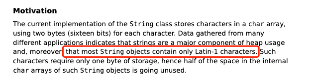

# 基础概念与常识

## Java 语言有哪些特点?

- 面向对象（封装，继承，多态）；
- 平台无关性（ Java 虚拟机实现平台无关性）；
- 支持多线程（ C++ 语言没有内置的多线程机制，因此必须调用操作系统的多线程功能来进行多线程程序设计，而 Java 语言却提供了多线程支持）；
- 可靠性（具备异常处理和自动内存管理机制）；
- 安全性（Java 语言本身的设计就提供了多重安全防护机制如访问权限修饰符、限制程序直接访问操作系统资源）；
- 高效性（通过 Just In Time 编译器等技术的优化，Java 语言的运行效率还是非常不错的）；
- 支持网络编程并且很方便；
- 编译与解释并存；

## JVM & JRE & JDK


Java 虚拟机（JVM）是运行 Java 字节码的虚拟机。JVM 有针对不同系统的特定实现（Windows，Linux，macOS），目的是使用相同的字节码，它们都会给出相同的结果。字节码和不同系统的 JVM 实现是 Java 语言“一次编译，随处可以运行”的关键所在。

JDK（Java Development Kit），它是功能齐全的 Java SDK，是提供给开发者使用，能够创建和编译 Java 程序的开发套件。它包含了 JRE，同时还包含了编译 java 源码的编译器 javac 以及一些其他工具比如 javadoc（文档注释工具）、jdb（调试器）、jconsole（基于 JMX 的可视化监控⼯具）、javap（反编译工具）等等。

JRE（Java Runtime Environment） 是 Java 运行时环境。它是运行已编译 Java 程序所需的所有内容的集合，主要包括 **Java 虚拟机**（JVM）、**Java 基础类库**（Class Library）。

也就是说，JRE 是 Java 运行时环境，仅包含 Java 应用程序的运行时环境和必要的类库。而 JDK 则包含了 JRE，同时还包括了 javac、javadoc、jdb、jconsole、javap 等工具，可以用于 Java 应用程序的开发和调试。如果需要进行 Java 编程工作，比如编写和编译 Java 程序、使用 Java API 文档等，就需要安装 JDK。而对于某些需要使用 Java 特性的应用程序，如 JSP 转换为 Java Servlet、使用反射等，也需要 JDK 来编译和运行 Java 代码。因此，即使不打算进行 Java 应用程序的开发工作，也有可能需要安装 JDK。

# 基本语法

### 标识符和关键字的区别是什么？

在我们编写程序的时候，需要大量地为程序、类、变量、方法等取名字，于是就有了标识符  

有一些标识符，Java 语言已经赋予了其特殊的含义，只能用于特定的地方，这些特殊的标识符就是关键字 

简单来说，标识符就是一个名字，关键字是被赋予特殊含义的标识符


### 关键字有哪些？

| 分类                 | 关键字   |            |          |              |            |           |        |
| :------------------- | -------- | ---------- | -------- | ------------ | ---------- | --------- | ------ |
| 访问控制             | private  | protected  | public   |              |            |           |        |
| 类，方法和变量修饰符 | abstract | class      | extends  | final        | implements | interface | native |
|                      | new      | static     | strictfp | synchronized | transient  | volatile  | enum   |
| 程序控制             | break    | continue   | return   | do           | while      | if        | else   |
|                      | for      | instanceof | switch   | case         | default    | assert    |        |
| 错误处理             | try      | catch      | throw    | throws       | finally    |           |        |
| 包相关               | import   | package    |          |              |            |           |        |
| 基本类型             | boolean  | byte       | char     | double       | float      | int       | long   |
|                      | short    |            |          |              |            |           |        |
| 变量引用             | super    | this       | void     |              |            |           |        |
| 保留字               | goto     | const      |          |              |            |           |        |

`native`：native关键字说明其修饰的方法是一个原生态方法，方法对应的实现不是在当前文件，而是在用其他语言（如C和C++）实现的文件中。Java语言本身不能对操作系统底层进行访问和操作，但是可以通过JNI接口调用其他语言来实现对底层的访问

`transient`：让某些被transient关键字修饰的成员属性变量不被序列化

`instanceof`：java的保留关键字。他的作用就是测试==左边的对象==是不是==右边类的实例==，是的话就返回true，不是的话返回false。类的实例包括本身的实例，以及所有直接或间接子类的实例

## final 关键字

### 有哪些使用场景？

- 修饰类：不希望类被**继承**
- 修饰方法：不希望父类的某个方法被子类**重写**
- 修饰成员变量：不希望类的某个属性值被**修改**
- 修饰局部变量：不希望某个局部变量被**修改**

包装类、String 类都是 final 类，final 不能修饰构造方法

### final 修饰基本数据类型和引用类型的区别？

- 如果是基本数据类型的变量，则其数值一旦在初始化之后便不能更改；
- 如果是引用类型的变量，则在对其初始化之后便不能再让其指向另一个对象（该对象的内容可变）

# 变量

## 静态变量有什么用？

可以被类的所有实例共享，无论一个类创建了多少个对象，它们都共享同一份静态变量

静态变量只会被分配一次内存，即使创建多个对象，这样可以节省内存。

## 字符型常量和字符串常量的区别?

```java
public class StringExample {
    // 字符型常量
    public static final char LETTER_A = 'A';

    // 字符串常量
    public static final String GREETING_MESSAGE = "Hello, world!";
    public static void main(String[] args) {
        System.out.println("字符型常量占用的字节数为："+Character.BYTES);
        System.out.println("字符串常量占用的字节数为："+GREETING_MESSAGE.getBytes().length);
    }
}
```

- **形式** : 字符常量是单引号引起的一个字符，字符串常量是双引号引起的 0 个或若干个字符

- **含义** : 字符常量相当于一个整型值( ASCII 值)，可以参加表达式运算; 字符串常量代表一个地址值(该字符串在内存中存放位置)。

- **占内存大小** ： 字符常量只占 2 个字节; 字符串常量占若干个字节

> 通过(int)可以将一个字符常量或变量强制转型为int类型，输出的就是ASCII对应的十进制值
>
> 也可以通过一个(char)将一个整型常量或变量强制转型为char类型，输出的就是ASCII对应的字符
>
> ```java
> public class Demo {
>     private static final char c = 'a';
>     private static final String str = "abc";
> 
>     public static void main(String[] args) {
>         System.out.println((int) c); //97
>         System.out.println(c + 1); //98
>         System.out.println((char) (c + 1)); //b
>     }
> }
> ```

# 方法

## 静态方法为什么不能调用非静态成员?

这个需要结合 JVM 的相关知识，主要原因如下：

> 静态方法是属于类的，**在类加载的时候就会分配内存**，可以通过类名直接访问。而非静态成员属于实例对象，只有在对象实例化之后才存在，需要通过类的实例对象去访问。

在类的非静态成员不存在的时候静态成员就已经存在了，此时调用在内存中还不存在的非静态成员，属于非法操作

## 静态方法和实例方法有何不同？

**调用方式**

在外部调用静态方法时，可以使用 `类名.方法名` 的方式，也可以使用 `对象.方法名` 的方式，而实例方法只有后面这种方式。**即调用静态方法可以无需创建对象** 

> 一般不建议使用 `对象.方法名` 的方式来调用静态方法。这种方式非常容易造成混淆，静态方法不属于类的某个对象而是属于这个类

**访问类成员是否存在限制**

静态方法在访问本类的成员时，只允许访问静态成员，不允许访问实例成员，而实例方法不存在这个限制

## 重载和重写

重载就是同一个类中多个同名方法根据不同的传参来执行不同的逻辑处理

重写就是子类对父类方法的重新改造，外部样子不能改变，内部逻辑可以改变

| 区别点     | 重载方法 | 重写方法                                                     |
| :--------- | :------- | :----------------------------------------------------------- |
| 发生范围   | 同一个类 | 子类                                                         |
| 参数列表   | 必须修改 | 一定不能修改                                                 |
| 返回类型   | 可修改   | 子类方法返回值类型应比父类方法返回值类型更小或相等           |
| 异常       | 可修改   | 子类方法声明抛出的异常类应比父类方法声明抛出的异常类更小或相等； |
| 访问修饰符 | 可修改   | 一定不能做更严格的限制（可以降低限制）                       |
| 发生阶段   | 编译期   | 运行期                                                       |

**方法的重写要遵循“两同两小一大”**

- “两同”：即方法名相同、形参列表相同
- “两小”：指的是子类方法返回值类型应比父类方法返回值类型更小或相等，子类方法声明抛出的异常类应比父类方法声明抛出的异常类更小或相等；
- “一大”指的是子类方法的访问权限应比父类方法的访问权限更大或相等。

> 关于 **重写的返回值类型** 这里需要额外多说明一下：如果方法的返回类型是 void 和基本数据类型，则返回值重写时不可修改。但是如果方法的返回值是引用类型，重写时是可以返回该引用类型的子类的

## 什么是可变长参数？

#todo完善 

> 从 Java5 开始支持

可变长参数就是允许在**调用方法时**传入不定长度的参数

- 可变参数只能作为函数的**最后一个**参数，其前面可以没有其他参数

```java
public static void method2(String arg1, String... args) {}
```

遇到**方法重载**的情况怎么办呢？会**优先匹配**固定参数还是可变参数的方法呢？

- 会优先匹配固定参数的方法
- Java 的可变参数编译后实际会被转换成一个数组，我们看编译后生成的 `class`文件就可以看出来了

```java
public class VariableLengthArgument {
    public static void printVariable(String... args) {
        String[] var1 = args;
        int var2 = args.length;

        for(int var3 = 0; var3 < var2; ++var3) {
            String s = var1[var3];
            System.out.println(s);
        }
    }
}
```

## 访问控制符权限

*private*：私有。当类中属性或方法被 private 修饰时，表示此成员或方法只能被本类中的方法使用，而不能被外部类或对象直接使用

*default*：默认。具有包访问权限。如果类中属性或方法不使用 public、protected、privete 修饰符修饰时，则说明其具有包访问权限，具有包访问权限的属性或方法既可以被本类中的方法使用也可以被同一包下的其他类使用，但不能被其他包中的类使用

*protected*：保护，具有**子类**访问权限
- 可以被同一包下的类使用，也可以被**不同包下的子类**使用

*public*：公共。具有公共访问权限。如果类中的属性或方法被 public 修饰，则此类中的属性或方法可以被任何类调用

# 基本数据类型

## Java 中的几种基本数据类型

Java 中有 8 种基本数据类型

- 6 种数字类型：
  - 4 种整数型：byte、short、int、long
  - 2 种浮点型：float、double
- 1 种字符类型：char
- 1 种布尔型：boolean

这 8 种基本数据类型的默认值以及所占空间的大小如下：

| 基本类型  | 位数 | 字节 | 默认值  | 取值范围                                   |
| :-------- | :--- | :--- | :------ | ------------------------------------------ |
| `byte`    | 8    | 1    | 0       | -128 ~ 127                                 |
| `short`   | 16   | 2    | 0       | -32768 ~ 32767                             |
| `int`     | 32   | 4    | 0       | -2147483648 ~ 2147483647                   |
| `long`    | 64   | 8    | 0L      | -9223372036854775808 ~ 9223372036854775807 |
| `char`    | 16   | 2    | 'u0000' | 0 ~ 65535                                  |
| `float`   | 32   | 4    | 0f      | 1.4E-45 ~ 3.4028235E38                     |
| `double`  | 64   | 8    | 0d      | 4.9E-324 ~ 1.7976931348623157E308          |
| `boolean` | 1    |      | false   | true、false                                |

Java 里使用 `long` 类型的数据一定要在数值后面加上 **L**，否则将作为整型解析

这八种基本类型都有对应的包装类分别为：`Byte`、`Short`、`Integer`、`Long`、`Float`、`Double`、`Character`、`Boolean`

## 基本类型和包装类型的区别？

- *用途*：包装类型可用于**泛型**，而基本类型不可以
- *默认值*：包装类型不赋值就是 `null` ，而基本类型有默认值且不是 `null`
- *存放位置*：
	- 基本数据类型的**局部变量**存放在 Java 虚拟机栈中的**局部变量表**中
	- 基本数据类型的**成员变量**（未被 static 修饰 ）存放在 Java 虚拟机的**堆**中
	- 包装类型属于对象类型，我们知道几乎所有对象实例都存在于堆中。
- *占用空间*：相比于对象类型， 基本数据类型占用的空间非常小

> 为什么说是**几乎**所有对象实例呢？ 这是因为 HotSpot 虚拟机引入了 JIT（just in time） 优化之后，会对对象进行逃逸分析，如果发现某一个对象并没有逃逸到方法外部，那么就可能通过标量替换来实现栈上分配，而避免堆上分配内存

> 基本数据类型存放在栈中是一个常见的**误区**！ 基本数据类型的成员变量如果没有被 `static` 修饰的话（不建议这么使用，应该要使用基本数据类型对应的包装类型），就存放在堆中

## 自动装箱与拆箱了解吗？原理是什么？

- 装箱：将基本类型用它们对应的引用类型包装起来
- 拆箱：将包装类型转换为基本数据类型

装箱其实就是调用了包装类的 `valueOf()` 方法，拆箱其实就是调用了 `xxxValue()` 方法

- `Integer i = 10` 等价于 `Integer i = Integer.valueOf(10)`

  ```java
  public static Integer valueOf(int i) {
      if (i >= IntegerCache.low && i <= IntegerCache.high)
          return IntegerCache.cache[i + (-IntegerCache.low)];
      return new Integer(i);
  }
  ```

- `int n = i` 等价于 `int n = i.intValue()`;

  ```java
  public int intValue() {
      return value;
  }
  ```

```java
public class Test {
    public static void main(String[] args) {
        //手动装箱 int->Integer
        int n1 = 100;
        //两种方式
        Integer integer = new Integer(n1);
        Integer integer1 = Integer.valueOf(n1);
        //手动拆箱 Integer->int
        int i = integer.intValue();

        //自动装箱
        //底层 Integer integer2 = Integer.valueOf(n1); 
        Integer integer2 = n1;
        //自动拆箱
        //底层 integer2.intValue()
        int n2 = integer2;
    }
}
```

如果频繁拆装箱的话，也会严重影响系统的性能。我们应该尽量避免不必要的拆装箱操作

```java
private static long sum() {
    // 应该使用 long 而不是 Long
    Long sum = 0L; 
    for (long i = 0; i <= Integer.MAX_VALUE; i++)
        sum += i;
    return sum;
}
```

## 包装类型的缓存机制（常量池）

除了 `Float`,`Double` ，其他包装类都实现了常量池技术

`Byte`, `Short`, `Integer`, `Long` 这 4 种包装类默认创建了数值 `[-128，127]` 的相应类型的缓存数据，`Character` 创建了数值在 `[0,127]` 范围的缓存数据，`Boolean` 直接返回 `True` or `False`

```java
Integer i1 = 127;
Integer i2 = 127;
Integer i3 = 128;
Integer i4 = 128;
System.out.println(i1 == i2); // true
System.out.println(i3 == i4); // false
```

Integer 缓存源码：

```java
public static Integer valueOf(int i) {
    if (i >= IntegerCache.low && i <= IntegerCache.high)
        return IntegerCache.cache[i + (-IntegerCache.low)];
    return new Integer(i);
}
private static class IntegerCache {
    static final int low = -128;
    static final int high;
    static {
        // high value may be configured by property
        int h = 127;
    }
}
```

是否用缓存中的数据要看有没有调用 `valueOf()`

```java
Integer i1 = 40; // 自动装箱，等价于 Integer i1=Integer.valueOf(40) ，因此 i1 直接使用的是常量池中的对象
Integer i2 = new Integer(40); // 直接创建新的对象，没调用valueOf()
System.out.println(i1==i2); // false
```

所有整型包装类对象之间值的比较，全部使用 equals 方法比较！


## 为什么浮点数运算的时候会有精度丢失的风险？

浮点数运算精度丢失代码演示：

```java
float a = 2.0f - 1.9f;
float b = 1.8f - 1.7f;
System.out.println(a);// 0.100000024
System.out.println(b);// 0.099999905
System.out.println(a == b);// false
```

这个和计算机保存浮点数的机制有很大关系。我们知道计算机是二进制的，而且计算机在表示一个数字时，宽度是有限的，无限循环的小数存储在计算机时，只能被截断，所以就会导致小数精度发生损失的情况。这也就是解释了为什么浮点数没有办法用二进制精确表示。

> 就比如说十进制下的 0.2 就没办法精确转换成二进制小数

```java
// 0.2 转换为二进制数的过程为，不断乘以 2，直到不存在小数为止，
// 在这个计算过程中，得到的整数部分从上到下排列就是二进制的结果。
0.2 * 2 = 0.4 -> 0
0.4 * 2 = 0.8 -> 0
0.8 * 2 = 1.6 -> 1
0.6 * 2 = 1.2 -> 1
0.2 * 2 = 0.4 -> 0（发生循环）
...
```

## 如何解决浮点数运算的精度丢失问题？

`BigDecimal` 可以实现对浮点数的运算，不会造成精度丢失。通常情况下，大部分需要浮点数精确运算结果的业务场景（比如涉及到钱的场景）都是通过 `BigDecimal` 来做的。

```java
BigDecimal a = new BigDecimal("1.0");
BigDecimal b = new BigDecimal("0.9");
BigDecimal c = new BigDecimal("0.8");

BigDecimal x = a.subtract(b);
BigDecimal y = b.subtract(c);

System.out.println(x); /* 0.1 */
System.out.println(y); /* 0.1 */
System.out.println(Objects.equals(x, y)); /* true */
```

## 超过 long 整型的数据应该如何表示？

基本数值类型都有一个表达范围，如果超过这个范围就会有数值溢出的风险。

在 Java 中，64 位 long 整型是最大的整数类型。

```java
long l = Long.MAX_VALUE;
System.out.println(l + 1); // -9223372036854775808
System.out.println(l + 1 == Long.MIN_VALUE); // true
```

`BigInteger` 内部使用 `int[]` 数组来存储任意大小的整形数据。

相对于常规整数类型的运算来说，`BigInteger` 运算的效率会相对较低

# 面向对象基础

## 解释下什么是面向对象？面向对象和面向过程的区别？

面向对象是一种基于面向过程的编程思想，是向现实世界模型的自然延伸，这是一种“万物皆对象”的编程思想。由执行者变为指挥者，在现实生活中的任何物体都可以归为一类事物，而每一个个体都是一类事物的实例。面向对象的编程是以对象为中心，以消息为驱动。

主要区别在于解决问题的方式不同：

- 面向过程把==解决问题的过程拆成一个个方法==，通过一个个方法的执行解决问题
- 面向对象会先抽象出对象，然后用==对象执行方法==的方式解决问题

另外，面向对象开发的程序一般更易维护、易复用、易扩展

## 构造方法

### 如果一个类没有声明构造方法，该程序能正确执行吗?

如果一个类没有声明构造方法，也可以执行！因为一个类即使没有声明构造方法也会有默认的不带参数的构造方法。

如果我们自己添加了类的构造方法（无论是否有参），Java 就不会再添加默认的无参数的构造方法了

### 构造方法有哪些特点？是否可被 override?

构造方法特点如下：

- 名字与类名相同
- 没有返回值，但不能用 void 声明构造函数
- 生成类的对象时自动执行，无需调用

构造方法不能被 override，但是可以 overload

## 面向对象三大特征

继承

关于继承如下 3 点请记住：

1. 子类拥有父类对象所有的属性和方法（包括私有属性和私有方法），但是父类中的私有属性和方法子类是==无法访问，只是拥有==
2. 子类可以拥有自己属性和方法，即子类可以对父类进行扩展
3. 子类可以用自己的方式实现父类的方法）

多态

具体表现为：父类的引用指向子类的实例

多态的特点：

- 对象类型和引用类型之间具有继承（类）/实现（接口）的关系
- 引用类型变量发出的方法调用的到底是哪个类中的方法，必须在程序运行期间才能确定
- 多态不能调用“只在子类存在但在父类不存在”的方法
- 如果子类重写了父类的方法，真正执行的是子类覆盖的方法，如果子类没有覆盖父类的方法，执行的是父类的方法

## 接口和抽象类有什么共同点和区别？

**共同点** ：

- 都不能被实例化
- 都可以包含抽象方法
- 都可以有默认实现的方法（Java 8 可以用 `default` 关键在接口中定义默认方法）

> 继承抽象类的子类必须重写父类所有的抽象方法。否则，该子类也必须声明为抽象类，使用 abstract 关键字修饰

**区别** ：

- 功能：
	- 接口主要用于对类的**行为进行约束**，你实现了某个接口就具有了对应的行为。
	- 抽象类主要用于**代码复用**，强调的是**所属关系**
- 一个类只能继承一个类，但是可以实现多个接口
- 成员变量：
	- 接口中的成员变量只能是 `public static final` 类型的，不能被修改且必须有初始值；
	- 抽象类的成员变量默认 `default`，可在子类中被重新定义，也可被重新赋值

## 深拷贝和浅拷贝区别了解吗？什么是引用拷贝？

> #todo完善 深浅拷贝实现

*浅拷贝*：浅拷贝会在堆上创建一个新的对象（区别于引用拷贝的一点），不过，如果原对象内部的属性是引用类型的话，浅拷贝会直接复制内部对象的引用地址，也就是说拷贝对象和原对象共用同一个内部对象

*深拷贝*：深拷贝会完全复制整个对象，包括这个对象所包含的内部对象

*引用拷贝*：两个不同的引用指向同一个对象


# Object

## Object 类的常见方法有哪些？

Object 类是一个特殊的类，是所有类的父类。它主要提供了以下 11 个方法：

```java
/**
 * native 方法，用于返回当前运行时对象的 Class 对象，使用了 final 关键字修饰，故不允许子类重写。
 */
public final native Class<?> getClass()
/**
 * native 方法，用于返回对象的哈希码，主要使用在哈希表中，比如 JDK 中的HashMap。
 */
public native int hashCode()
/**
 * 用于比较 2 个对象的内存地址是否相等，String 类对该方法进行了重写以用于比较字符串的值是否相等。
 */
public boolean equals(Object obj)
/**
 * naitive 方法，用于创建并返回当前对象的一份拷贝。
 */
protected native Object clone() throws CloneNotSupportedException
/**
 * 返回类的名字实例的哈希码的 16 进制的字符串。建议 Object 所有的子类都重写这个方法。
 */
public String toString()
/**
 * native 方法，并且不能重写。唤醒一个在此对象监视器上等待的线程(监视器相当于就是锁的概念)。如果有多个线程在等待只会任意唤醒一个。
 */
public final native void notify()
/**
 * native 方法，并且不能重写。跟 notify 一样，唯一的区别就是会唤醒在此对象监视器上等待的所有线程，而不是一个线程。
 */
public final native void notifyAll()
/**
 * native方法，并且不能重写。暂停线程的执行。注意：sleep 方法没有释放锁，而 wait 方法释放了锁 ，timeout 是等待时间。
 */
public final native void wait(long timeout) throws InterruptedException
/**
 * 多了 nanos 参数，这个参数表示额外时间（以毫微秒为单位，范围是 0-999999）。 所以超时的时间还需要加上 nanos 毫秒。。
 */
public final void wait(long timeout, int nanos) throws InterruptedException
/**
 * 跟之前的2个wait方法一样，只不过该方法一直等待，没有超时时间这个概念
 */
public final void wait() throws InterruptedException
/**
 * 实例被垃圾回收器回收的时候触发的操作
 */
protected void finalize() throws Throwable { }
```

## == 和 equals() 的区别？（1）

`==` 

- 对于基本数据类型来说，`==` 比较的是值。
- 对于引用数据类型来说，`==` 比较的是对象的内存地址。

> 因为 Java 只有值传递，所以，对于 `==` 来说，不管是比较基本数据类型，还是引用数据类型的变量，其本质比较的都是值，只是引用类型变量存的值是对象的地址。

`equals()` 不能用于判断基本数据类型的变量，只能用来判断两个对象是否相等，存在两种使用情况：

- *类没有重写 `equals()`* ：等价于通过 `==` 比较这两个对象
- *类重写了 `equals()`* ：一般我们都重写 `equals()` 方法来比较两个对象中的**属性是否相等**

> `Object` 类 `equals()` 方法：
> 
> ```java
> public boolean equals(Object obj) {
>      return (this == obj); // 默认判断地址值
> }
> ```

## hashCode() 方法

### 有什么用？

`hashCode()` 的作用是获取哈希码（`int` 整数），哈希码的作用是确定该对象在哈希表中的索引位置

>  `Object` 的 `hashCode()` 方法是**本地**方法（native 修饰，也就是用 C 语言或 C++ 实现的），该方法通常用来将对象的内存地址转换为整数之后返回

### 为什么要有 hashCode？

`hashCode()` 和 `equals()` 都可以用于比较两个对象是否相等

在一些容器（如 `HashMap`、`HashSet`）中，有了 `hashCode()` 之后，判断元素是否在对应容器中的效率会更高

- 两个对象哈希值不等，它们一定不相等
- 两个对象的相等值相等，它们不一定不相等。通过 `equals()` 比较后返回 true，它们相等。

### 为什么重写 equals() 时必须重写 hashCode() 方法？

因为两个相等对象的哈希值必须相等

也就是说 equals 方法判断两个对象是相等的，那这两个对象的 hashCode 值也要相等

如果重写 `equals()` 时没有重写 `hashCode()` 方法的话就可能会导致 `equals` 方法判断是相等的两个对象，`hashCode` 值却不相等。

> 【思考 】重写 `equals()` 时没有重写 `hashCode()` 方法的话，使用 `HashMap` 可能会出现什么问题？
>
> 可能会出现 equals 方法返回为 true，而 hashCode 方法却返回 false。这样的一个后果会导致==在 hashmap、hashSet 等类中存储多个一模一样的对象==，这与 java 的思想不符（因为：hashmap 只能有唯一的 key，hashSet 只能有唯一的对象）

# String

## String、StringBuffer、StringBuilder 的区别？

**可变性**

String 是不可变的，StringBuilder 与 StringBuffer可变

StringBuilder 与 StringBuffer 都继承自 AbstractStringBuilder 类，在 AbstractStringBuilder 中也是使用字符数组保存字符串，不过没有使用 final 和 private 关键字修饰，最关键的是这个 AbstractStringBuilder 类还提供了很多修改字符串的方法比如 `append()`

```java
abstract class AbstractStringBuilder implements Appendable, CharSequence {
    char[] value; //没有使用 final 和 private 关键字修饰
    public AbstractStringBuilder append(String str) {
        if (str == null)
            return appendNull();
        int len = str.length();
        ensureCapacityInternal(count + len);
        str.getChars(0, len, value, count);
        count += len;
        return this;
    }
  	//...
}
```

**线程安全性**

- String 中的对象是不可变的，也就可以理解为常量，线程安全。
- StringBuffer 对方法加了同步锁或者对调用的方法加了同步锁，线程安全的。
- StringBuilder 并没有对方法进行加同步锁，非线程安全的。

**性能**

- 每次对 String 类型进行改变的时候，都会生成一个新的 String 对象，然后将指针指向新的 String 对象。
- StringBuffer 每次都会对 StringBuffer 对象本身进行操作，而不是生成新的对象并改变对象引用。
- 相同情况下使用 StringBuilder 相比使用 StringBuffer 仅能获得 10%~15% 左右的性能提升，但却要冒多线程不安全的风险。

**对于三者使用的总结：**

- 操作少量的数据: 适用 String
- 单线程操作字符串缓冲区下操作大量数据: 适用 StringBuilder
- 多线程操作字符串缓冲区下操作大量数据: 适用 StringBuffer


#### String 为什么是不可变的？（*）

String 类中使用 final 关键字修饰字符数组来保存字符串

```java
public final class String implements java.io.Serializable, Comparable<String>, CharSequence {
    private final char value[];
	//...
}
```

> 注意：我们知道被 `final` 关键字修饰的类不能被继承，修饰的方法不能被重写，修饰的变量是基本数据类型则值不能改变，修饰的变量是引用类型则不能再指向其他对象。因此，`final` 关键字修饰的数组保存字符串并不是 `String` 不可变的根本原因，因为这个数组保存的字符串是可变的（`final` 修饰引用类型变量的情况）。

String 真正不可变有下面几点原因：

1. 保存字符串的数组被 final 修饰且为==私有的==，并且String 类==没有提供/暴露修改这个字符串的方法==
2. String 类被 final 修饰导致其不能被继承，进而避免了子类破坏 String 不可变。

```java
public final class String implements java.io.Serializable,Comparable<String>, CharSequence {
    // @Stable 注解表示变量最多被修改一次，称为“稳定的”。
    @Stable
    private final byte[] value;
}

abstract class AbstractStringBuilder implements Appendable, CharSequence {
    byte[] value;
}
```

> **Java 9 为何要将 String 的底层实现由 char[] 改成了 byte[] ?（了解）**
>
> 新版的 String 其实支持两个编码方案： Latin-1 和 UTF-16。如果字符串中包含的汉字没有超过 Latin-1 可表示范围内的字符，那就会使用 Latin-1 作为编码方案。Latin-1 编码方案下，`byte` 占一个字节(8 位)，`char` 占用 2 个字节（16），`byte` 相较 `char` 节省一半的内存空间。
>
> JDK 官方就说了绝大部分字符串对象只包含 Latin-1 可表示的字符。
>
> 
>
> 如果字符串中包含的汉字超过 Latin-1 可表示范围内的字符，`byte` 和 `char` 所占用的空间是一样的。
>
> 这是官方的介绍：https://openjdk.java.net/jeps/254 。


#### 可以通过别的方法改变 String 的实际字符串内容吗？（*）


####  字符串拼接用“+” 还是 StringBuilder？

Java 语言本身并不支持运算符重载，“+”和“+=”是专门为 String 类重载过的运算符，也是 Java 中仅有的两个重载过的元素符。

```java
String str1 = "he";
String str2 = "llo";
String str3 = "world";
String str4 = str1 + str2 + str3;
```

**对象引用和“+”**的字符串拼接方式，实际上是通过==StringBuilder 调用 append()方法==实现的，拼接完成之后==调用 toString()==得到一个 String 对象 。


不过，**在循环内使用“+”进行字符串的拼接**的话，存在比较明显的缺陷：编译器不会创建单个 StringBuilder 以复用，会导致创建过多的 StringBuilder 对象。

```java
String[] arr = {"he", "llo", "world"};
String s = "";
for (int i = 0; i < arr.length; i++) {
    s += arr[i];
  	//StringBuilder对象是在循环内部被创建的
  	//这意味着每循环一次就会创建一个StringBuilder对象
}
System.out.println(s);
```

如果直接使用 `StringBuilder` 对象进行字符串拼接的话，就不会存在这个问题了


#### String的equals() 和 Object的equals() 有何区别？

- String 中的 equals 方法是被重写过的，比较的是 String 字符串的值是否相等
- Object 的 equals 方法是比较的对象的内存地址

```java
public boolean equals(Object anObject) {
    if (this == anObject) {
        return true;
    }
    if (anObject instanceof String) { //anObject只有是String对象时才能return true
        String anotherString = (String)anObject;
        int n = value.length;
        if (n == anotherString.value.length) {
            char v1[] = value;
            char v2[] = anotherString.value;
            int i = 0;
            while (n-- != 0) {
                if (v1[i] != v2[i])
                    return false;
                i++;
            }
            return true;
        }
    }
    return false;
}
```


#### 字符串常量池的作用了解吗？

**字符串常量池** 是 JVM 为了提升性能和减少内存消耗针对字符串（String 类）专门开辟的一块区域，主要目的是为了避免字符串的重复创建。

```java
String aa = "ab"; //在堆中创建字符串对象”ab“，将字符串对象”ab“的引用保存在字符串常量池中
String bb = "ab"; //直接返回字符串常量池中字符串对象”ab“的引用
System.out.println(aa==bb); //true
```


#### String s1 = new String("abc");这句话创建了几个字符串对象？

会创建 1 或 2 个字符串。

1、如果字符串常量池中不存在字符串对象“abc”的引用，那么会在堆中创建 2 个字符串对象“abc”。

```java
//示例代码（JDK 1.8）：
String s1 = new String("abc");
```

对应的字节码：


`ldc` 命令用于判断字符串常量池中是否保存了对应的字符串对象的引用，如果保存了的话直接返回，如果没有保存的话，会在堆中创建对应的字符串对象并将该字符串对象的引用保存到字符串常量池中。

2、如果字符串常量池中已存在字符串对象“abc”的引用，则只会在堆中创建 1 个字符串对象“abc”。

```java
//示例代码（JDK 1.8）：
String s1 = "abc";//字符串常量池中存了字符串对象“abc”的引用
//下面这段代码只会在堆中创建 1 个字符串对象“abc”
String s2 = new String("abc");
```

对应的字节码：


7 这个位置的 `ldc` 命令不会在堆中创建新的字符串对象“abc”，这是因为 0 这个位置已经执行了一次 `ldc` 命令，已经在堆中创建过一次字符串对象“abc”了。7 这个位置执行 `ldc` 命令会直接返回字符串常量池中字符串对象“abc”对应的引用

> 故现在通过new String() 创建字符串对象，会提示：'new String' is redundant，多余的


#### intern方法有什么作用？

String.intern() 是一个 native（本地）方法，其作用是==将指定的字符串对象的引用保存在字符串常量池中==，可以简单分为两种情况：

- 如果字符串常量池中保存了对应的字符串对象的引用，就直接返回该引用。
- 如果字符串常量池中没有保存了对应的字符串对象的引用，那就在常量池中创建一个指向该字符串对象的引用并返回。

```java
//示例代码（JDK 1.8） :
String s1 = "Java"; //在堆中创建字符串对象”Java“，将字符串对象”Java“的引用保存在字符串常量池中
String s2 = s1.intern(); //直接返回字符串常量池中字符串对象”Java“对应的引用
String s3 = new String("Java"); //会在堆中在”单独“创建一个字符串对象
String s4 = s3.intern(); //直接返回字符串常量池中字符串对象”Java“对应的引用
// s1 和 s2 指向的是堆中的同一个对象
System.out.println(s1 == s2); // true
// s3 和 s4 指向的是堆中不同的对象
System.out.println(s3 == s4); // false
// s1 和 s4 指向的是堆中不同的对象
System.out.println(s1 == s4); //true
```


#### String 类型的变量和常量做“+”运算时发生了什么？（了解）

先来看字符串不加 `final` 关键字拼接的情况（JDK1.8）

```java
String str1 = "str";
String str2 = "ing";
String str3 = "str" + "ing";
String str4 = str1 + str2;
String str5 = "string";
System.out.println(str3 == str4);//false
System.out.println(str3 == str5);//true
System.out.println(str4 == str5);//false
```

对于编译期可以确定值的字符串，也就是常量字符串 ，jvm 会将其存入字符串常量池。并且，字符串常量拼接得到的字符串常量在编译阶段就已经被存放字符串常量池，这个得益于编译器的优化。

在编译过程中，Javac 编译器（下文中统称为编译器）会进行一个叫做 **常量折叠(Constant Folding)** 的代码优化。《深入理解 Java 虚拟机》中是也有介绍到：


常量折叠会把常量表达式的值求出来作为常量嵌在最终生成的代码中，这是 Javac 编译器会对源代码做的极少量优化措施之一(代码优化几乎都在即时编译器中进行)。

对于 `String str3 = "str" + "ing";` 编译器会给你优化成 `String str3 = "string";` 

并不是所有的常量都会进行折叠，只有编译器在程序编译期就可以确定值的常量才可以：

- 基本数据类型( `byte`、`boolean`、`short`、`char`、`int`、`float`、`long`、`double`)以及字符串常量。
- `final` 修饰的基本数据类型和字符串变量
- 字符串通过 “+”拼接得到的字符串、基本数据类型之间算数运算（加减乘除）、基本数据类型的位运算（<<、>>、>>> ）

**引用的值在程序编译期是无法确定的，编译器无法对其进行优化。**

对象引用和“+”的字符串拼接方式，实际上是通过 `StringBuilder` 调用 `append()` 方法实现的，拼接完成之后调用 `toString()` 得到一个 `String` 对象 。

```java
String str4 = new StringBuilder().append(str1).append(str2).toString();
```

我们在平时写代码的时候，尽量避免多个字符串对象拼接，因为这样会重新创建对象。如果需要改变字符串的话，可以使用 `StringBuilder` 或者 `StringBuffer`。

不过，字符串使用 `final` 关键字声明之后，可以让编译器当做常量来处理。

```java
final String str1 = "str";
final String str2 = "ing";
// 下面两个表达式其实是等价的
String c = "str" + "ing";// 常量池中的对象
String d = str1 + str2; // 常量池中的对象
System.out.println(c == d);// true
```

被 `final` 关键字修改之后的 `String` 会被编译器当做常量来处理，编译器在程序编译期就可以确定它的值，其效果就相当于访问常量。

如果 ，编译器在运行时才能知道其确切值的话，就无法对其优化。

示例代码（`str2` 在运行时才能确定其值）：

```java
final String str1 = "str";
final String str2 = getStr();
String c = "str" + "ing";// 常量池中的对象
String d = str1 + str2; // 在堆上创建的新的对象
System.out.println(c == d);// false
public static String getStr() {
      return "ing";
}
```

# 集合

Collection 接口

- *List* 接口
	- *ArrayList*
		- 线程不安全
		- 允许存放 null
	- *Vector*
		- 线程安全
	- *LinkedList*
		- 线程不安全
- *Set* 接口
	- *HashSet*
		- LinkedHashSet
	- *TreeSet*
- *Queue* 接口
	- LinkedList
	- ArrayDeque

Map 接口

- HashMap
	- LinkedHashMap
- HashTable
- TreeMap

## List, Set, Queue, Map 四者的区别？

- `List` : 存储的元素是**有序**的、**可重复**的。
- `Set` : 存储的元素**不可重复**的。
- `Queue` : 按特定的排队规则来确定先后顺序，存储的元素是**有序**的、**可重复**的
- `Map` : 使用键值对（key-value）存储，
	- key 是**无序**的、**不可重复**的，
	- value 是**无序**的、**可重复**的，

## 底层数据结构

List

- `ArrayList`：`Object[]` 数组
- `Vector`：`Object[]` 数组
- `LinkedList`：双向链表

Set

- `HashSet`（无序）：基于 `HashMap` 实现的
	- `LinkedHashSet`：内部是通过 `LinkedHashMap` 来实现的。
- `TreeSet`（有序）: TreeMap 实现

Queue

- `PriorityQueue`：`Object[]` 数组来实现**小顶堆**
- `DelayQueue`：`PriorityQueue`
- `ArrayDeque`：可扩容动态双向数组

Map

- `HashMap`：数组+**链表/红黑树**。当链表长度大于阈值（默认为 8）（将链表转换成红黑树前会判断，如果当前数组的长度小于 64，那么会选择先进行数组扩容，而不是转换为红黑树）时，将链表转化为红黑树，以减少搜索时间。
	- `LinkedHashMap`：`LinkedHashMap` 继承自 `HashMap`，所以它的底层仍然是基于拉链式散列结构即由数组和**链表或红黑树**组成。另外，`LinkedHashMap` 在上面结构的基础上，增加了一条**双向链表**，使得上面的结构可以**保持键值对的插入顺序**。同时通过对链表进行相应的操作，实现了访问顺序相关逻辑。
- `Hashtable`：数组+链表
- `TreeMap`（有序）：红黑树（自平衡的排序二叉树）

## List

### ArrayList 和 Array（数组）的区别？

- `ArrayList` 会根据实际存储的元素**动态地扩容或缩容**，而 `Array` 被创建之后就不能改变它的长度了
	- `ArrayList` 创建时不需要指定大小，而 `Array` 需要
- `ArrayList` 允许你使用**泛型**来确保类型安全
- 存储内容：
	- `ArrayList` 中只能存储**对象**。对于基本类型数据，需要使用其对应的包装类（如 Integer、Double 等）
	- `Array` 可以直接存储**基本类型数据**，也可以存储**对象**
- `ArrayList` 支持插入、删除、遍历等常见操作，并且提供了丰富的 API 操作方法，比如 `add()`、`remove()` 等。`Array` 只是一个固定长度的数组，只能按照下标访问其中的元素，不具备动态添加、删除元素的能力。

### Vector 和 Stack 的区别?（了解即可）

- `Vector` 和 `Stack` 两者都是**线程安全**的，都是使用 `synchronized` 关键字进行同步处理。
- `Stack` 继承自 `Vector`，是一个后进先出的栈，而 `Vector` 是一个列表。

随着 Java 并发编程的发展，`Vector` 和 `Stack` 已经被淘汰，推荐使用**并发集合类**（例如 `ConcurrentHashMap`、`CopyOnWriteArrayList` 等）或者手动实现线程安全的方法来提供安全的多线程操作支持。

### ArrayList 插入和删除元素的时间复杂度？

对于插入：

- *头部插入*：由于需要将所有元素都依次向后移动一个位置，因此时间复杂度是 `O(n)`
- *尾部插入*：
	- 当 `ArrayList` 的容量未达到极限时，`O(1)`
	- 当需要扩容时，则需要执行一次 `O(n)` 的操作将原数组复制到新的更大的数组中，然后再执行 `O(1)` 的操作添加元素
- *指定位置插入*：需要将目标位置之后的所有元素都向后移动一个位置，然后再把新元素放入指定位置。这个过程需要移动平均 n/2 个元素，因此时间复杂度为 `O(n)`

对于删除：

- *头部删除*：需要将所有元素依次向前移动一个位置，`O(n)`
- *尾部删除*：当删除的元素位于列表末尾时，`O(1)`
- *指定位置删除*：需要将目标元素之后的所有元素向前移动一个位置以填补被删除的空白位置，因此需要移动平均 n/2 个元素，时间复杂度为 `O(n)`

### LinkedList 插入和删除元素的时间复杂度？

- *头部插入/删除*：只需要修改头结点的指针即可完成插入/删除操作，`O(1)`
- *尾部插入/删除*：只需要修改尾结点的指针即可完成插入/删除操作，`O(1)`
- *指定位置插入/删除*：需要先移动到指定位置，再修改指定节点的指针完成插入/删除，因此需要移动平均 n/2 个元素，时间复杂度为 `O(n)`

### LinkedList 为什么不能实现 RandomAccess 接口？

#todo

`RandomAccess` 是一个标记接口，用来表明实现该接口的类支持随机访问（即可以通过索引快速访问元素）。由于 `LinkedList` 底层数据结构是链表，内存地址不连续，只能通过指针来定位，不支持随机快速访问，所以不能实现 `RandomAccess` 接口

### ArrayList 与 LinkedList 区别?

- 是否保证线程安全
- 底层数据结构
- 插入和删除是否受元素位置的影响
	- ArrayList 只有尾部插入才是 `O(1)`，其他位置 `O(n)`
	- LinkedList 只有指定位置插入 `O(n)`，其他位置 `O(1)`
- 是否支持快速随机访问
- 内存空间占用
	- ArrayList 的空间浪费主要体现在在 list 列表的**结尾**会预留一定的容量空间，
	- LinkedList 的空间花费则体现在它的**每一个元素**都需要消耗比 ArrayList 更多的空间（因为要存放直接后继和直接前驱以及数据）

> 我们在项目中一般是不会使用到 `LinkedList` 的，需要用到 `LinkedList` 的场景几乎都可以使用 `ArrayList` 来代替，并且，性能通常会更好！就连 `LinkedList` 的作者约书亚 · 布洛克（Josh Bloch）自己都说从来不会使用 `LinkedList`

### ArrayList 扩容机制

ArrayList 维护了一个 `transient Object[] elementData` 数组（transient 表示该属性不会被序列化）

- 新增元素后会检查是否会超过数组的容量，如果超过，则进行扩容

- 创建 ArrayList 对象时，
	- 如果使用无参构造，给 elementData 分配一个空数组，初始容量为 0，第一次添加则扩容 elementData 为 10，如需再次扩容，则 elementData 容量为原先的 1.5 倍
	- 如果使用的是指定大小的构造器，则初始容量为指定大小，之后扩容为原先的 1.5 倍
- 将老数组的元素复制到新数组中，扩容完成

## Set

### 无序性和不可重复性的含义是什么

- 无序性不等于随机性 ，无序性是指存储的数据在底层数组中并非按照数组索引的顺序添加 ，而是根据数据的**哈希值**决定的。
- 不可重复性是指添加的元素按照 `equals()` 判断时 ，返回 false，需要同时重写 `equals()` 方法和 `hashCode()` 方法

### HashSet、LinkedHashSet 和 TreeSet 三者的异同

- 都不是线程安全的
- 底层数据结构不同
	- `HashSet` 的底层数据结构是**哈希表**（基于 `HashMap` 实现）
	- `LinkedHashSet` 的底层数据结构是**链表和哈希表**，元素的插入和取出顺序满足 **FIFO**
	- `TreeSet` 底层数据结构是**红黑树**，元素是**有序**的，排序的方式有自然排序和**定制排序**
- 应用场景不同
	- `HashSet` 用于不需要保证元素插入和取出顺序的场景，
	- `LinkedHashSet` 用于保证元素的插入和取出顺序满足 FIFO 的场景，
	- `TreeSet` 用于支持对元素自定义排序规则的场景。

### HashSet 如何检查重复?

在 JDK1.8 中，`HashSet` 的 `add()` 方法只是简单的调用了 `HashMap` 的 `put()` 方法，并且判断了一下返回值以确保是否有重复元素

```java
// Returns: true if this set did not already contain the specified element
// 返回值：当 set 中没有包含 add 的元素时返回真
public boolean add(E e) {
        return map.put(e, PRESENT)==null;
}
```

而在 `HashMap` 的 `putVal()` 方法中也能看到如下说明：

```java
// Returns : previous value, or null if none
// 返回值：如果插入位置没有元素返回null，否则返回上一个元素
final V putVal(int hash, K key, V value, boolean onlyIfAbsent,
                   boolean evict) {
...
}
```

也就是说，在 JDK1.8 中，实际上无论 `HashSet` 中是否已经存在了某元素，`HashSet` 都会**直接插入（覆盖）**，只是会在 `add()` 方法的==返回值处告诉我们插入前是否存在相同元素==

## Queue

#todo 

## Map

### HashMap 和 Hashtable 的区别

- *线程是否安全*： HashMap 是非线程安全的，`Hashtable` 线程安全
- *对 Null key 和 Null value 的支持*： 
	- HashMap 可以存储 null 的 key 和 value，但 ==null 作为键只能有一个==，null 作为值可以有多个；
	- Hashtable 不允许有 null 键和 null 值，否则会抛出 `NullPointerException`
- *初始容量和扩容机制不同*
- *底层数据结构*
	- HashMap 是 哈希表（数组+链表/红黑树）
	- HashTable 是 哈希表（数组+链表）

### HashMap 和 TreeMap 区别

- 相同点：`TreeMap` 和 `HashMap` 都继承自 `AbstractMap`

- 不同点：
	- `TreeMap` 它还实现了 **NavigableMap 接口** 和 **SortedMap 接口**
	- 底层数据结构

实现 `NavigableMap` 接口让 `TreeMap` 有了对集合内元素的搜索的能力。`NavigableMap` 接口提供了丰富的方法来探索和操作键值对:

1. *定向搜索*：`ceilingEntry()`, `floorEntry()`, `higherEntry()` 和 `lowerEntry()` 等方法可以用于定位大于、小于、大于等于、小于等于给定键的最接近的键值对。
2. *子集操作*：`subMap()`, `headMap()` 和 `tailMap()` 方法可以高效地创建原集合的子集视图，而无需复制整个集合。
3. *逆序视图*：`descendingMap()` 方法返回一个逆序的 `NavigableMap` 视图，使得可以反向迭代整个 `TreeMap`。
4. *边界操作*：`firstEntry()`, `lastEntry()`, `pollFirstEntry()` 和 `pollLastEntry()` 等方法可以方便地访问和移除元素。

这些方法都是基于**红黑树**的属性实现的，红黑树保持平衡状态，从而保证了搜索操作的时间复杂度为 O(log n)，这让 `TreeMap` 成为了处理**有序集合搜索**问题的强大工具

实现 `SortedMap` 接口让 `TreeMap` 有了对集合中的元素根据键**排序**的能力。默认是按 key 的升序排序，不过我们也可以指定**排序**的比较器（构造器传入 comparator）

### HashMap 底层原理

#### 元素添加和去重

- 添加一个元素时会先得到 hash 值（hashcode 方法）
- 通过 hash 值 和 数组当前容量 n 计算出元素在数组中存放的索引位置：`(n - 1) & hash`
- 看这个位置是否已经存放有元素
    - 如果没有，直接加入；
    - 如果有，调用 `equals()` 和链表上的节点逐个比较，相同直接**覆盖**，不同添加到最后

#### 初始容量及扩容机制

`HashMap` 默认的初始化大小为 16，加载因子 `loadFactor = 0.75`，即容量超过 75% 就会扩容，临界值 `threshold=16 * 0.75=12`

之后每次扩充，容量变为原来的 2 倍，临界值也为原来的 2 倍。

创建时如果给定了容量初始值，`HashMap` 会将其扩充为 **2 的幂次方**大小

---

JDK1.8 之后在解决**哈希冲突**时有了较大的变化，当链表长度大于**阈值（默认为 8）**

- 如果当前数组的长度**小于 64**，那么会选择先进行**数组扩容**，
- 否则将链表转化为**红黑树**，以减少搜索时间。

#### HashMap 的长度为什么是 2 的幂次方？

#todo 

### HashMap 多线程操作导致死循环问题

JDK1.7 及之前版本的 `HashMap` 在多线程环境下扩容操作可能存在死循环问题，这是由于当一个桶位中有多个元素需要进行扩容时，多个线程同时对链表进行操作，头插法可能会导致链表中的节点指向错误的位置，从而形成一个**环形链表**，进而使得查询元素的操作陷入死循环无法结束。

为了解决这个问题，JDK1.8 版本的 HashMap 采用了==尾插法而不是头插法来避免链表倒置==，使得插入的节点永远都是放在链表的末尾，避免了链表中的环形结构。但是还是不建议在多线程下使用 `HashMap`，因为多线程下使用 `HashMap` 还是会存在数据覆盖的问题。并发环境下，推荐使用 `ConcurrentHashMap`

### 常见遍历方式

#todo

### ConcurrentHashMap

#todo


# 异常

### Exception 和 Error 有什么区别？

在 Java 中，所有的异常都有一个共同的祖先 `java.lang` 包中的 `Throwable` 类。`Throwable` 类有两个重要的子类:

- **`Exception`** ：==程序本身可以处理的异常==，可以通过 `catch` 来进行捕获。
- **`Error`** ：`Error` 属于==程序无法处理的错误==，不建议通过`catch`捕获。例如 Java 虚拟机运行错误（`Virtual MachineError`）、虚拟机内存不够错误(`OutOfMemoryError`)、类定义错误（`NoClassDefFoundError`）等 。这些异常发生时，Java 虚拟机（JVM）一般会选择线程终止


### Checked Exception 和 Unchecked Exception 有什么区别？

*Checked Exception*：受检查异常，Java代码在编译过程中，如果受检查异常没有被catch/throw 处理的话，就没办法通过编译，故==必须处理==。

*Unchecked Exception*：不受检查异常，Java代码在编译过程中即使不处理也能正常通过编译。

`RuntimeException`及其子类都统称为非受检查异常；除了`RuntimeException`及其子类以外，其他的`Exception`类及其子类都属于受检查异常。


### 常见的异常有哪些？

**Error：**

- Java虚拟机运行错误 `Virtual MachineError`
- 虚拟机内存不够错误 `OutOfMemoryError`
- 类定义错误 `NoClassDefFoundError`

**编译时异常：**

- `SQLException`：操作数据库时，查询表可能发生异常
- `IOException`：操作文件时发生的异常
  - `FileNotFoundException`：操作一个不存在的文件
- `ClassNotFoundException`：加载类，而该类不存在

**运行时异常：**

- `NullPointerException`：空指针异常
- `ArrayIndexOutOfBoundsException`：数组脚标越界异常
- `ClassCastException`：类型转换异常，试图将对象强制转换为不是实例的子例时
- `InputMismatchException`：输入类型不匹配
- `ArithmeticException`：算术异常，出现异常的运算条件
- `IllegalArgumentException`：参数异常
  - `NumberFormatException`：字符串转换为数字格式错误


### Throw和Throws有什么区别？（我出的）

我的理解：throw是创造异常，throws和try-catch是处理异常

[(9条消息) Java中throw和throws有什么区别？_我不是你不是我的博客-CSDN博客_java中throw和throws的区别](https://blog.csdn.net/weixin_46511008/article/details/118770337)


### Throwable 类常用方法有哪些？

```java
public string getMessage() //返回异常发生时的简要描述

public string toString() //返回异常发生时的详细信息

public String getLocalizedMessage() { //返回异常对象的本地化信息
    return getMessage();
} 
//使用 Throwable 的子类覆盖这个方法，可以生成本地化信息
//如果子类没有覆盖该方法，则该方法返回的信息与 getMessage()返回的结果相同

public void printStackTrace() //在控制台上打印 Throwable 对象封装的异常信息
```


### try-catch-finally 如何使用？

- try块：用于捕获异常。其后可接零个或多个catch块，如果没有catch块，则必须跟一个finally块。
- catch块：用于处理try捕获到的异常。
- finally块：无论是否捕获或处理异常，finally 块里的语句都会被执行。当在 try 块或 catch 块中遇到 return 语句时，finally 语句块将在方法返回之前被执行。

```java
try {
    System.out.println("Try to do something");
    throw new RuntimeException("RuntimeException");
} catch (Exception e) {
    System.out.println("Catch Exception -> " + e.getMessage());
} finally {
    System.out.println("Finally");
}
//Try to do something
//Catch Exception -> RuntimeException
//Finally
```

==在try或catch中遇到return语句时，finally将在方法返回之前被执行==

==注意：不要在 finally 语句块中使用 return！==当 try 语句和 finally 语句中都有 return 语句时，try 语句块中的 return 语句会被忽略。这是因为 try 语句中的 return 返回值会先被暂存在一个本地变量中，当执行到 finally 语句中的 return 之后，这个本地变量的值就变为了 finally 语句中的 return 返回值。

```java
public static void main(String[] args) {
    System.out.println(f(2));
}

public static int f(int value) {
    try {
        return value * value;
    } finally {
        if (value == 2) {
            return 0;
        }
    }
}
//输出：0
```


### try-catch-finally执行流程？（我出的）

```java
try{
    //代码可能有异常
  	//如果异常发生了，异常后面的代码不执行，直接进入到catch块、
    //如果没有发生异常，catch代码块不执行
}catch(Exception e){
    //捕获到异常
    //当异常发生时，系统将异常封装成Exception对象e，传递给catch
    //得到异常对象后，程序员自己处理
    //可以有多个catch语句，捕获不同的异常，要求父类异常在后，子类异常在前，且只会匹配一个catch
}finally{
    //可以没有finally
    //不管try代码块是否有异常发生，一定会执行
    //所以通常将释放资源的代码放在finally
}
//之后的代码
//catch捕获到异常，正常执行
//catch没捕获到，不再执行
```


### finally 中的代码一定会执行吗？（没学jvm）

不一定！在某些情况下，finally 中的代码不会被执行。

就比如说 finally 之前虚拟机被终止运行的话，finally 中的代码就不会被执行。

```java
try {
    System.out.println("Try to do something");
    throw new RuntimeException("RuntimeException");
} catch (Exception e) {
    System.out.println("Catch Exception -> " + e.getMessage());
    // 终止当前正在运行的Java虚拟机
    System.exit(1);
} finally {
    System.out.println("Finally");
}
//Try to do something
//Catch Exception -> RuntimeException
```

另外，在以下 2 种特殊情况下，finally 块的代码也不会被执行：

1. 程序所在的线程死亡
2. 关闭 CPU


### 如何使用 try-with-resources 代替try-catch-finally？

没学过try-with-resources


###  异常使用有哪些需要注意的地方？（没看懂）

- 不要把异常定义为静态变量，因为这样会导致异常栈信息错乱。每次手动抛出异常，我们都需要手动 new 一个异常对象抛出
- 抛出的异常信息一定要有意义
- 建议抛出更加具体的异常比如字符串转换为数字格式错误的时候应该抛出`NumberFormatException`而不是其父类`IllegalArgumentException`
- 使用日志打印异常之后就不要再抛出异常了（两者不要同时存在一段代码逻辑中）


# 泛型

### 什么是泛型？有什么作用？

Java 泛型（Generics） 是 JDK 5 中引入的一个新特性，泛型的本质是==类型参数化==，使用泛型参数，可以增强代码的可读性以及稳定性。

编译器可以对泛型参数进行检测，并且通过泛型参数可以==指定传入的对象类型==。比如 `ArrayList<Persion> persons = new ArrayList<Persion>()` 这行代码就指明了该 `ArrayList` 对象只能传入 `Person` 对象，如果传入其他类型的对象就会报错。

```java
ArrayList<E> extends AbstractList<E>
```

并且，原生 `List` 返回类型是 `Object` ，需要手动转换类型才能使用，使用泛型后编译器==自动转换==


### 泛型的使用方式有哪几种？

泛型一般有三种使用方式：泛型类、泛型接口、泛型方法

**1、泛型类**：

```java
//此处T可以随便写为任意标识，常见的如T、E、K、V等形式的参数常用于表示泛型
//在实例化泛型类时，必须指定T的具体类型
public class Generic<T>{
    private T key;

    public Generic(T key) {
        this.key = key;
    }

    public T getKey(){
        return key;
    }
}
```

如何实例化泛型类：

```java
Generic<Integer> genericInteger = new Generic<Integer>(123456);
```

**2、泛型接口** ：

```java
public interface Generator<T> {
    public T method();
}
```

实现泛型接口，不指定类型：

```java
class GeneratorImpl<T> implements Generator<T>{
    @Override
    public T method() {
        return null;
    }
}
```

实现泛型接口，指定类型：

```java
class GeneratorImpl<T> implements Generator<String>{
    @Override
    public String method() {
        return "hello";
    }
}
```

**3、泛型方法** ：

```java
public static <E> void printArray( E[] inputArray )
{
    for ( E element : inputArray ){
      System.out.printf( "%s ", element );
    }
    System.out.println();
}
```

使用：

```java
// 创建不同类型数组： Integer, Double 和 Character
Integer[] intArray = { 1, 2, 3 };
String[] stringArray = { "Hello", "World" };
printArray( intArray  );
printArray( stringArray  );
```

> 注意： `public static < E > void printArray( E[] inputArray )` 一般被称为静态泛型方法；在 java 中泛型只是一个占位符，==必须在传递类型后才能使用==。类在实例化时才能真正的传递类型参数，由于静态方法的加载先于类的实例化，也就是说类中的泛型还没有传递真正的类型参数，静态的方法的加载就已经完成了，所以==静态泛型方法是没有办法使用类上声明的泛型==。只能使用自己声明的 


### 项目中哪里用到了泛型？（没用过）

- 自定义接口通用返回结果 `CommonResult<T>` 通过参数 `T` 可根据具体的返回类型动态指定结果的数据类型
- 定义 `Excel` 处理类 `ExcelUtil<T>` 用于动态指定 `Excel` 导出的数据类型
- 构建集合工具类（参考 `Collections` 中的 `sort`, `binarySearch` 方法）


# 反射

### 何为反射？

反射之所以被称为框架的灵魂，主要是因为它赋予了我们在==运行时分析类以及执行类中方法的能力==。通过反射你可以获取任意一个类的所有属性和方法，你还可以调用这些方法和属性。

### 反射机制优缺点

- **优点** ： 可以让咱们的代码更加灵活、为各种框架提供开箱即用的功能提供了便利
- **缺点** ：让我们在运行时有了分析操作类的能力，这同样也增加了安全问题。比如可以无视泛型参数的安全检查（泛型参数的安全检查发生在编译时）。另外，反射的性能也要稍差点，不过，对于框架来说实际是影响不大的。[Java Reflection: Why is it so slow?open in new window](https://stackoverflow.com/questions/1392351/java-reflection-why-is-it-so-slow)

### 反射的应用场景

因为反射，我们可以轻松地使用各种框架。像 Spring/Spring Boot、MyBatis 等等框架中都大量使用了反射机制

**这些框架中也大量使用了动态代理，而动态代理的实现也依赖反射。**

比如下面是通过 JDK 实现动态代理的示例代码，其中就使用了反射类 `Method` 来调用指定的方法。

```java
public class DebugInvocationHandler implements InvocationHandler {
    /**
     * 代理类中的真实对象
     */
    private final Object target;

    public DebugInvocationHandler(Object target) {
        this.target = target;
    }

    public Object invoke(Object proxy, Method method, Object[] args) throws InvocationTargetException, IllegalAccessException {
        System.out.println("before method " + method.getName());
        Object result = method.invoke(target, args);
        System.out.println("after method " + method.getName());
        return result;
    }
}
```

另外，像 Java 中的一大利器 **注解** 的实现也用到了反射。

为什么你使用 Spring 的时候 ，一个`@Component`注解就声明了一个类为 Spring Bean 呢？为什么你通过一个 `@Value`注解就读取到配置文件中的值呢？究竟是怎么起作用的呢？

这些都是因为你可以基于反射分析类，然后获取到类/属性/方法/方法的参数上的注解。你获取到注解之后，就可以做进一步的处理。


## 为什么 Java 中只有值传递？

### 形参&实参

方法的定义可能会用到 **参数**（有参的方法），参数在程序语言中分为：

- **实参（实际参数）** ：用于传递给函数/方法的参数，必须有确定的值。
- **形参（形式参数）** ：用于定义函数/方法，接收实参，不需要有确定的值。

```java
String hello = "Hello!";
// hello 为实参
sayHello(hello);
// str 为形参
void sayHello(String str) {
    System.out.println(str);
}
```


### 值传递&引用传递

程序设计语言将实参传递给方法（或函数）的方式分为两种：

- **值传递** ：方法接收的是实参值的拷贝，会创建副本。
- **引用传递** ：方法接收的直接是实参所引用的对象在堆中的地址，不会创建副本，对形参的修改将影响到实参。

很多程序设计语言（比如 C++、 Pascal )提供了两种参数传递的方式，不过，在 Java 中只有值传递。


### 为什么 Java 只有值传递？

**为什么说 Java 只有值传递呢？** 不需要太多废话，我通过 3 个例子来给大家证明。

#### 案例1：传递基本类型参数

```java
public static void main(String[] args) {
    int num1 = 10;
    int num2 = 20;
    swap(num1, num2);
    System.out.println("num1 = " + num1);
    System.out.println("num2 = " + num2);
}

public static void swap(int a, int b) {
    int temp = a;
    a = b;
    b = temp;
    System.out.println("a = " + a);
    System.out.println("b = " + b);
}
```

输出：

```text
a = 20
b = 10
num1 = 10
num2 = 20
```

解析：

在 `swap()` 方法中，`a`、`b` 的值进行交换，并不会影响到 `num1`、`num2`。因为，`a`、`b` 的值，只是从 `num1`、`num2` 的复制过来的。也就是说，a、b 相当于 `num1`、`num2` 的副本，副本的内容无论怎么修改，都不会影响到原件本身。

#### 案例2：传递引用类型参数1

```java
public static void main(String[] args) {
    int[] arr = { 1, 2, 3, 4, 5 };
    System.out.println(arr[0]);
    change(arr);
    System.out.println(arr[0]);
}

public static void change(int[] array) {
    // 将数组的第一个元素变为0
    array[0] = 0;
}
```

输出：

```text
1
0
```

解析：

看了这个案例很多人肯定觉得 Java 对引用类型的参数采用的是引用传递。实际上，并不是的，这里传递的还是值，不过，这个值是实参的地址罢了！也就是说 `change` 方法的参数拷贝的是 `arr` （实参）的地址，因此，它和 `arr` 指向的是同一个数组对象。这也就说明了为什么方法内部对形参的修改会影响到实参。

为了更强有力地反驳 Java 对引用类型的参数采用的不是引用传递，我们再来看下面这个案例！

### 案例3 ：传递引用类型参数2

```java
public class Person {
    private String name;
   // 省略构造函数、Getter&Setter方法
}

public static void main(String[] args) {
    Person xiaoZhang = new Person("小张");
    Person xiaoLi = new Person("小李");
    swap(xiaoZhang, xiaoLi);
    System.out.println("xiaoZhang:" + xiaoZhang.getName());
    System.out.println("xiaoLi:" + xiaoLi.getName());
}

public static void swap(Person person1, Person person2) {
    Person temp = person1;
    person1 = person2;
    person2 = temp;
    System.out.println("person1:" + person1.getName());
    System.out.println("person2:" + person2.getName());
}
```

输出:

```text
person1:小李
person2:小张
xiaoZhang:小张
xiaoLi:小李
```

解析：

怎么回事？？？两个引用类型的形参互换并没有影响实参啊！

`swap` 方法的参数 `person1` 和 `person2` 只是拷贝的实参 `xiaoZhang` 和 `xiaoLi` 的地址。因此， `person1` 和 `person2` 的互换只是拷贝的两个地址的互换罢了，并不会影响到实参 `xiaoZhang` 和 `xiaoLi` 。


### 总结

Java 中将实参传递给方法（或函数）的方式是==值传递== ：

- 如果参数是基本类型的话，很简单，传递的就是基本类型的字面量值的拷贝，会创建副本。
- 如果参数是引用类型，传递的就是实参所引用的对象在堆中地址值的拷贝，同样也会创建副本。

# 工具

## Comparable 和 Comparator 的区别

#todo

`Comparable` 接口和 `Comparator` 接口都是 Java 中用于排序的接口，它们在实现类对象之间比较大小、排序等方面发挥了重要作用：

- `Comparable` 接口实际上是出自 `java.lang` 包 它有一个 `compareTo(Object obj)` 方法用来排序
- `Comparator` 接口实际上是出自 `java.util` 包它有一个 `compare(Object obj1, Object obj2)` 方法用来排序

一般我们需要对一个集合使用自定义排序时，我们就要重写 `compareTo()` 方法或 `compare()` 方法，当我们需要对某一个集合实现两种排序方式，比如一个 `song` 对
象中的歌名和歌手名分别采用一种排序方法的话，我们可以重写 `compareTo()` 方法和使用自制的 `Comparator` 方法或者以两个 `Comparator` 来实现歌名排序和歌星名排序，第二种代表我们只能使用两个参数版的 `Collections.sort()`


