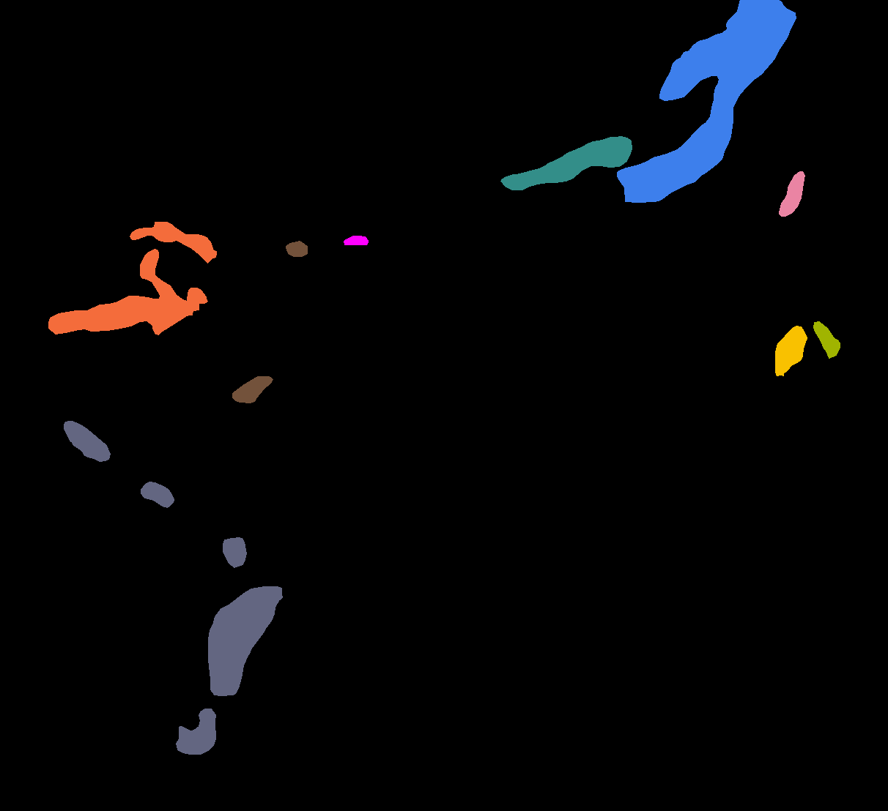

# 待修改

1. 添加“dice loss适合样本极度不均衡的情况”√
2. 跳跃连接方式修改√
3. 可视化分析，改为对每一类锋分析
4. SAM-Based dense connection缩写
5. SAM-Based dense connection作为一个章节介绍
6. 小尺度锋新增7
	1. 对比实验修改
	2. 图修改
	3. 分离实验修改√
7. 对比实验开头
	1. 稍微介绍下其他模型
	2. 说明一下全用的双线性插值上采样
8. 全文时态统一


# 包含全部种类锋的一天

20140513


# GPT润色

[https://blog.csdn.net/He_r_o/article/details/129050606](https://blog.csdn.net/He_r_o/article/details/129050606)

```
Prompt: Translate and polish the paragraph above to make it more logical, and academic.


```
提示：润色上面的内容，使其更加更合逻辑，更符合学术风格

Prompt: For the sentence “[Before polished sentence]”, why did you polish it to be “[Polished sentence]”.

提示：对于“[润色前的句子]”这句话，为什么你润色为成“[润色后的句子]”。

Prompt: Polish and rewrite the above content to make it more in line with the style of academic papers, and at the same time, it can be more professional. If there are parts that do not conform to facts or logic, please refer to the part of xxxxx for the above content modification.

提示：润色并重写上面的内容，使其更加符合论文的风格，于此同时，又能更加专业化，如果有不符合事实或者逻辑的部分，请你参考XXX原理部分对上面的内容修改。

# 专业术语

the contextual cues are aggregated via densely up-sampling the features of the encoder layers to the features of the decoder layers. This enables CENet to capture multi-scale context information.
通过将编码器层的特征密集上采样为解码器层的特征来聚集上下文线索。这使得CENet能够捕获多尺度上下文信息。

标准的接编码器结构：standard encoder–decoder architecture

混合损失函数：a hybrid loss function

## 引用图

```
___, which is illustrated in Fig.
___ is illustrated in Fig.
As shown on the right side of Fig , ___
Fig. shows ___
```

## 公式

1）解释公式
- 用denotes，而不是is
- 函数要加 the function
```
The function H(·) denotes the operation of the convolution block. 
The function P(·) denotes a 2×2 max pooling operation for down-sampling.
```

2）xx的公式为xx
```
xx can be formulated as follows:
which is defined as:
xx can be formulated as:
```

## 分离试验开头

```
We evaluated the importance of each part of xx by conducting a series of ablation studies.
```

## 海洋锋相关术语

- frontal regions 锋区
- fronts 锋面
- frontal identification 锋面识别
- ocean front detection 海洋锋检测
	- mult-class ocean front detection 多类海洋锋检测
- feature extraction 特征提取
- multiscale 多尺度


# 论文结构

## 标题

密集空间增强的上下文集成网络用于多类海洋锋检测中的小尺度锋精准提取

Dense Spatial Enhanced Contextual Ensemble Network for Accurate Extraction of Small-Scale Fronts in Multi-Class Ocean Front Detection
## 摘要

- 海洋锋是海洋学中重要的中尺度现象。
- 高精度海洋锋检测在渔业生产力和海洋环境保护等领域扮演着重要角色。
- 基于统计学和梯度阈值的传统锋检测方法经常识别出假锋由于不完善的或者噪声数据。
- 现有基于深度学习的锋检测方法对于多类锋检测中的小目标锋(STF)提取效果不佳。
- 为了解决上述问题，我们提出了Dense Spatial Enhanced Contextual Ensemble Network (DSE-CENet)网络用于像素级的多类锋检测，能够精准地识别出STF的边界并准确地分辨出不同海域的锋。
- 该网络是基于SAM-based Ensemble Upsampling (SA-EU) 的编码器-解码器结构，经过SAM捕获空间依赖关系的多尺度上下文信息充分聚合。
- 构成主干网络的 Dense Convolutional Block (DC Block)增强了锋的特征传递。
- 此外，我们设计了一个front class balance (fcb) 损失平衡分配各锋类的损失，有效提高低像素频率(PF)锋类的分割精度。
- 我们在SCSOF数据集上进行了一系列实验评估DSE-CENet，证明了其相对于多类海锋检测sota模型和其他语义分割模型的优势。

## 引言
### 传统方法

- 从海洋学的角度来看，传统方法是最直观的，并且速度快。
- 但是传统方法会提取出假锋由于数据不完善或者是背景噪声的干扰，对视觉解释产生负面影响。
- 此外，根据感兴趣区域选取合适的阈值是另一个难题，并且聚焦于同一区域时相同的阈值无法区分不同类别的锋。

From the perspective of oceanography, traditional methods are the most intuitive and offer quick results.
However, they tend to extract false fronts due to inperfect data or interference from background noise, thereby negatively impacting visual interpretation.
Furthermore, choosing appropriate thresholds based on the region of interest is another challenge.
Finally, when focusing on the same area, traditional methods struggle to differentiate fronts of different classes with the same threshold.

### 海洋锋分类

多类海洋锋检测能够识别并分辨不同类别的海洋锋

现有的对于海洋锋的研究往往针对于某个海域的锋的时空分布和变化，以对比不同类别的锋背后的形成和维持机制，所以自动的多类海洋锋检测方法是十分必要的。

随着高时空分辨率的SST遥感数据的出现，能够更精准地识别锋的类别，并在更细的时间尺度上跟踪锋的生命周期。

propose a semantic segmentation model called LSENet for multi-class detection of ocean fronts at pixel-level.


%% 为了促进海洋锋的多学科研究，并加深对其形成和维持背后机制的理解，对来自不同海域的海洋锋分类是十分必要的 %%

### 问题描述

> **核心：加强检测小尺度锋**

**1、问题抛出：**
- 小尺度锋检测效果差！
	- LSENet举例
**2、小尺度锋怎么形成的？**
- 不同类别的锋形成机理不同
	- 形态差别大
	- 生命周期不同
**3、小尺度锋为什么难以检测？**
- 形态：
	- 尺寸小---》细节信息少
	- 弱边缘性---》周围环境的上下文依赖
	- 后果
		- 容易受到图像噪声干扰的影响
		- 模糊、错误分割
- 生命周期短
	- 样本不平衡---》实例数少于其他锋类
	- 后果
		- there are many more instances of some classes than others. In such cases, the standard classifiers tend to be overwhelmed by the larger classes and ignore the smaller ones
		- The classifier trained by the  standard cross-entropy loss function tends to ignore the low pixel frequency front classes

- 在多类海洋锋检测中存在小尺度锋检测效果差的问题。
- 不同的锋类形成机理不同，导致他们的形态和生命周期差别大。
- 小尺度锋尺寸小，包含的细节信息少，且呈现弱边缘性，依赖周围环境的上下文信息，小尺度锋的检测容易受到图像噪声干扰的影响，且容易出现模糊、错误分割。
此外小尺度锋的生命周期短，其实例数明显少于其他锋类，从而导致样本不平衡，In such cases, the standard classifiers tend to be overwhelmed by the larger classes and ignore the smaller ones，从而导致对于小尺度锋的特征学习不充分。

来自不同海域的front形成机理不同，从而呈现出不同的形态。

低像素频率(PF，它的定义见(a))的front类更容易产生STF，

在这种情况下，与其他fornt类相比，它们的实例明显较少，从而导致标准分类器被较大的类所淹没，而忽略较小的类。

### 问题解决

> 介绍模型各个模块功能，而不是具体的模型结构或者是实际的检测效果

> 两大模块：
> 1）**Dense Convolutional Block（DC Block）**
> ~~2）**Spatial Enhanced Ensemble Upsamling（SEEU）**~~
> 2）**SAM-based Ensemble Upsampling" (SA-EU)**
> 
> 模型名字
> **Dense Spatial Enhanced Contextual Ensemble Network（DSE-CENet）** 多类海洋锋检测
> 密集空间增强上下文集成网络

结构：
- 提出DSE-CENet多类海洋锋检测模型
- 改进的解编码器结构网络
- 在编解码中嵌入了 **DC Block** ，==提供了更短的特征传播路径--》缓解梯度消失，实现每个卷积层间特征共享--》保留锋的微小细节，提供更丰富的上下文信息
- 编解码器间通过 **SA-EU** ==有效聚合多尺度的上下文信息，其中集成的空间注意模块（SAM）能够捕获锋和其对应海域的空间依赖关系并剔除背景噪声。==
- **DMFB** 混合损失函数：==平衡锋类间权重分配，并且更加关注目标的重叠部分，减少了对精确边界的强依赖。==

正文完整版：
- 基于上述问题，受启发于DenseU-Net和CENet，我们提出了 Dense Spatial Enhanced Contextual Ensemble Network(DSE-CENet) 用于多类海洋锋检测中增强小尺度锋的提取。
- DSE-CENet是一种改进的解编码器结构网络。编码器的输出通过 SAM-based Ensemble Upsampling（SA-EU）额外映射到解码器，实现多尺度上下文信息的自然聚合，其中集成的空间注意模块（SAM）能够捕获锋和其对应海域的空间依赖关系并剔除背景噪声。
- 编解码器中嵌入了 Dense Convolutional Block（DC Block），通过提供更短的特征传播路径实现每个卷积层间特征共享，有效保留了锋的弱边缘信息，融合了丰富的海洋锋周围环境信息。
- 最后我们设计了一个 由MFB loss和Dice loss构成的DMFB 混合损失函数。MFB loss能够平衡锋类间权重分配。Dice loss更加关注目标的重叠部分，减少了对精确边界的强依赖。

正文缩减版：
-  基于上述问题，受启发于DenseU-Net和CENet，我们提出了 Dense Spatial Enhanced Contextual Ensemble Network(DSE-CENet) 用于多类海洋锋检测中增强小尺度锋的提取。
- DSE-CENet是一种改进的解编码器结构网络。编码器的输出通过 SAM-based Ensemble Upsampling（SA-EU）额外映射到解码器，实现多尺度上下文信息的自然聚合，其中集成的空间注意模块（SAM）能够捕获锋和其对应海域的空间依赖关系并剔除背景噪声。
- 编解码器中嵌入了 Dense Convolutional Block（DC Block）实现每个卷积层间特征共享，有效保留了锋的弱边缘信息。
- 最后我们设计了一个 由MFB loss和Dice loss构成的DMFB 混合损失函数，能够平衡锋类间权重分配并减少了对精确边界的强依赖。

### 贡献

> 1）提出xxx网络，解决什么问题？
> 2）极简的语言、各模块的作用
> 3）数据集上实验，优于其他方法

The contributions of this letter are mainly as follows:  
1. 为了提高多类海洋锋检测中STF的提取精准度，提出DSE-CENet精准识别STF的边界、有效避免误检、漏检。
2. 提出DC Block和SAED编解码器结构使网络更全面地感知和利用front的细节和上下文信息。
3. 设计了fcb损失针对front类间的不平衡有效提升低PF front类的分割精度。
4. 在自制SCSOF数据集上实验表明我们的方法优于其他SOTA方法。


## 模型

> 上下文聚合：模型如何有效地捕获输入图像中像素点周围的信息和语境，以更好地理解每个像素点的语义。
### Overview

解编码结构
inconv和outconv

### DC Block

更短的特征传播路径--->在深层网络中，梯度能够更有效地流向较早的层--->**避免梯度消失**

前后相邻层特征共享--->
- **保持和传递目标的微小细节
- **提供更多上下文信息**

正文：
- 针对上述问题，在编解码器中嵌入DC Block用于特征提取和还原。
- 图C阐述了DC Block的结构，对每一层特征进行级联，并通过1×1卷积降低级联特征的维数。
- DC Block提供了更短的特征传播路径有助于梯度流动，他的密集连接结构能够保持和传递小尺度锋的微小细节信息。各层间的特征共享使网络能捕捉到小尺度锋的不同层次的上下文信息。
- DC Block可以有若干个3×3卷积（特征提取）和一个1×1的卷积（特征降维）构成
- DSE-CENet中构建了一个4层的DC Block，输出为DC(F,4)（后续实验会验证n=4的优越性）

### S-CE Architecture

> LSENet
> we propose a location attention that aims to ensure that the model learns the spatial dependence between the ocean front classes and the corresponding sea areas.

全局作用
- 聚合来自==所有卷积层==的多尺度上下文信息
	- aggregates multi-scale context information from all convolutional layers
- 采用==编码器-解码器架构==来协作探索多级卷积特征以捕获上下文信息
	- ==exploring multi-level convolution features collaboratively== to capture context information
结构概述
- 构建从编码器到解码器的==密集跳跃连接==，生成输入图像的描绘分割图
	- construct dense skip-connections from encoder to decoder, producing the delineated segmentation map of an input image
- 通过从深层卷积层到浅层的密集上采样多层金字塔特征来协作研究不同分辨率的分层上下文交互。
	- the hierarchical contextual interactions of different resolutions are collaboratively investigated via densely upsampling multi-level pyramid features from deep convolution layers to shallow layers. 
- CENet ==在编码器中收集并连接具有不同分辨率的反卷积特征==，称为集成反卷积，==以在解码器中产生特征表示==，该特征表示==携带局部和全局上下文信息==。

---
> SAM

全局作用：
- 引入空间注意力机制，以==增强模型对图像中不同位置的感知能力=
- 增加模型对于更广泛上下文信息的感知。这使得网络在处理图像时能够考虑更远处的像素，从而提高感受野，更好地理解整体图像结构。

--->自己的
增强模型对锋面位置的感知能力（引言）
捕获到锋的全局和局部空间依赖关系
在不同尺度的上下文中强化空间特征表示


SAM--->网络更关注锋面区域
connection--->捕获上下文线索、聚合多尺度上下文信息

此外，上下文线索通过基于SAM的密集跳过连接进行聚合。
跳过连接允许将低级特征信息直接传递给解码器，允许解码器利用来自原始输入的详细信息。对SAM的输出到解码器的输入进行密集的上采样使DSE-CENet能够捕获更多的多尺度上下文信息。

正文：
- 在标准的编解码器结构中，相同尺度的浅层和深层语义特征通过跳跃连接合并。
- 为了捕获更丰富的小尺度锋的多尺度上下文信息，SA-EU允许编码器的输出密集上采样到解码器中，如图？所示。
- 首先通过SAM捕获编码器聚合到解码器的特征图的像素间的空间相关性，然后通过1×1的卷积降维，特征通道数与解码器输出的特征维度保持一致。如果让来自上采样的堆叠特征图保持原始维度会模型模型的泛化能力并导致模型过拟合。
- 此外，网络对来自跳跃连接的同尺度合并也进行了空间关系捕获。
- 最终，解码器的输入主要由三个分支构成：来自编码器的上采样堆叠、跳跃连接以及膨胀路径上前置卷积层经过2×2上采样的特征图。
- 解码器的输入和输出定义如下：...
- SAM能够使网络更加关注锋面区域，有助于剔除背景噪声，其定义如下：...
- 相较于CENet中的集成上采样结构，我们的1×1卷积保留了更多的特征通道，并对跳跃连接和集成上采样进行了空间关系捕获。

### loss

多类别交叉熵损失标准解释


正文：
- 像素频率(PF)越低的front类越容易产生小目标front。
- front c 的PF由它的像素点总数除以它出现的样本的像素点总数得到，它的计算方式如下：
- 图?通过每类front的PF呈现了SCSOF数据集中front的类别分布，可以看出f- 4, f-6, f-7 and f-9 像素频率相对于其他front类较低。
- 针对front类间的不平衡，我们设计了一种front class balance (fcb) loss function 在交叉熵损失函数的基础上对每一类front引入一个通过PF线性印射到范围a~b的权重因子。fcb loss的定义如下：
- 受启发于？，我们将front类的权重范围设置为2~3并且将背景的权重设置为1。


## 实验

### 对比实验

我们选用了一些具有代表性的模型进行对比实验。
LSENet是目前海洋锋多类别检测中的sota模型。
CENet设计了一种集成反卷积结构用于融合多尺度上下文信息。
DenseU-net提出了基于3层DC Block的上下采样块。
UNet++ 在 UNet 的基础上引入了嵌套结构用于多尺度信息融合。
以上模型都是基于UNet的解编码器架构模型。
PSPNet、DeepLabv3+在一些经典任务上表现出色。
为了避免棋盘效应的产生，所有模型均使用双线程插值法上采样。

值得注意的是，当关注锋4、6、7和9时，比较模型经常出现IoU低于60，相比之下DSE-CENet具有显著的优势。
此外，DSE-CENet和DenseU-net在像素频率最低的front9上表现明显优于其他模型，说明了DC Block对于小尺度锋细节特征保留的有效性。

为了进一步验证DSE-CENet的有效性，我们从测试集中选择的一些代表性样本进行了可视对比。
样本（1）和（3）中front3和front1包含了相邻但不连贯的锋面，对比模型很容易便将它们视为一道锋，而DSE-CENet能够准确地分割出两道锋。
样本（2）和（3）中出现了一些梯度较强的区域，对比模型容易将它们当做锋面区域，DSE-CENet和CENet未收受到噪声区域的影响。
样本（4）中front4和front10的区域很容易相互影响，上下文信息的捕获就显得十分重要，对比模型中front4区域被front10大量淹没，此外对于像素数量及其有限的front9也会出现漏检现象。
DSE-CENet能够准确地分割出各类锋面的边界，而CENet在实际分割效果中也表现优越，说明多尺度上下文信息能够有效聚合锋及其周围环境特征。

### 分离实验

- 我们设置了3、4和5层的DC Block用于对比分割性能，结果显示4层的DC Block在mIou、mF1和mP上得分均最高并且优于对比模型，故我们将它作为baseline用于验证其他模块的有效性。
- 我们对SA-CE结构中的SAM分离(4L+CE和4L+SA-CE)来验证Contextual Ensemble(CE)结构和SAM的有效性。
- 此外，我们对DMFB损失函数也进行了分离，其余模块组合均使用CE loss。
- 从图4(a)观察可得这些模块的组合相较于只含有DC Block的backbone(图中虚线部分)均有明显的优越性，SAM对CE结构的增强得以验证。
- SA-CE和DMFB的共同叠加(4L+SA-CE+DMFB)在mIoU、mF1和mP上的得分均最高。
- 从图4(b)和(c)分别对高PF锋类和低PF锋类的IoU得分展示。
- 经过对比发现，相较于高频锋类，低频锋类中的每个类别的得分都获得了明显提升。SA-CE对于f-6、f-7和f-9三个类别有明显的提升，并且DMFB对所有类别都有了进一步提升，尤其是f-4。充分验证了DSE-CENet对于小目标锋的提取的优势。

## 总结

在这封信中我们提出了DSE-CENet用于像素级的多类海洋锋检测，能够准确识别各个锋类，并实现了小目标锋的精准提取。

通过基于SA-CE的编解码器结构有效聚合锋的不同尺度上下文信息，并通过SAM充分捕获锋的空间依赖关系。
编解码器中嵌入的DC Block充分保留和传递锋的细节特征并提供更丰富的锋的周围环境信息。
此外，我们设计了fcb损失函数增强锋的损失的权重分配，尤其是易产生小目标锋的低PF锋类，有效提高低PF锋类的分割精度。

最后，在SCSOF数据集上的一系列实验结果表明，与其他方法相比，DSE-CENet不仅在量化结果中表现出色，并且在视觉上呈现出小目标锋的边界清晰，在避免误检、漏检上也具有明显的优越。

在深度学习领域中，海洋锋检测的数据集构建始终是一个痛点，当更换不同的海洋环境时需要重新构建数据集，未来，我们会尝试通过无监督学习来减少数据标注的成本。


# 存档

## DC Block公式

繁琐版
```latex
\mathbb{F}_{1}&=
\sigma(\mathcal{F}^{3\times3}(\mathbb{F}_\text{in})), \\
\mathbb{F}_\text{2}&=
\sigma(\mathcal{F}^{3\times3}(\mathbb{F}_\text{in}\odot \mathbb{F}_{1})), \\
\mathbb{F}_\text{3}&=
\sigma(\mathcal{F}^{3\times3}(\mathbb{F}_\text{in}\odot \mathbb{F}_{1}\odot \mathbb{F}_\text{2}), \\ 

公式说明：
 where $\mathbb{F}_0\in R^{H\times W\times C}$ and $F_\text{out}\in R^{H\times W\times C}$ denote the input and output feature maps of DC Block, 
 the function $f^{3\times3}(\cdot)$ and $f^{1\times1}(\cdot)$ denote 3×3 convolution and 1×1 convolution operation respectively, 
 $[F_\text{conv1}\in R^{H\times W\times C},F_\text{conv2}\in R^{H\times W\times C},F_\text{conv3}\in R^{H\times W\times C}]$ denote the feature maps generated by three 3×3 convolutions respectively, 
 $\sigma$ denotes the Relu function and batch normalization and [:] denotes the concatenation on the channel dimension.
```

简化版 2023年12月25日17:48:56
```latex
\begin{equation}
\begin{aligned}
\hat{\mathbf{F}}_{i}&=
\begin{cases}
\mathbf{F}&i=1
\\
\hat{\mathbf{F}}_{i-1}\oplus \mathbf{F}_{i-1}&i>1\\  
\end{cases}
\\
\mathbf{F}_{i}&=
\sigma(\mathcal{F}^{3\times3}(\hat{\mathbf{F}}_{i}))
\\
\mathcal{DC}(\mathbf{F},n)
&=\sigma(
\mathcal{F}^{1\times1}(
\hat{\mathbf{F}}_{n}
)), \; n=3,4,...
\end{aligned}
\end{equation}
```
## SAM公式

```latex
% \begin{equation}
% \begin{aligned}
%     F_\text{out}&=F_\text{in}\cdot F_\text{sam}\\ 
%     &=F_\text{in}\cdot\sigma(f^{7\times7}([\text{MP}(F_\text{in}):\text{AP}(F_\text{in})]))\\ &=F_\text{in}\cdot\sigma(f^{7\times7}([F_\text{mp}\colon F_\text{ap}]))
% \end{aligned}
% \end{equation}****
```

## SE-CE

```latex
\begin{equation}
\begin{aligned}
\mathbb{E}(\mathbf{F}_{E_i})&=\mathcal{DA}(\mathbf{F}_{E_i},4) 
\\
\hat{\textbf{F}}^S_{E_i}&= \mathcal{S}(\mathbb{E}(\mathbf{F}_{E_i}))
\\
\textbf{F}^{SA-EU}_{D_i}&=\begin{cases}
 \mathrm{none}  &i=3\\
 \mathcal{U}_{2}(\hat{\textbf{F}}^S_{E_3})  &i=2\\
 \mathcal{U}_{2}(\hat{\textbf{F}}^S_{E_2})\oplus \mathcal{U}_{4}(\hat{\textbf{F}}^S_{E_3})  &i=1\\
 \mathcal{U}_{2}(\hat{\textbf{F}}^S_{E_1})\oplus \mathcal{U}_{4}(\hat{\textbf{F}}^S_{E_2})\oplus \mathcal{U}_{8}(\hat{\textbf{F}}^S_{E_3})  &i=0\\
\end{cases}
\\
%\hat{\mathbf{F}}_p&=
%\mathcal{U}_{r=2}(\mathbf{F}_p )
%\\
\mathbb{D}(&\textbf{F}^{SA-EU}_{D_i},\hat{\textbf{F}}^S_{E_i},\mathbf{F}_p) \\
&=\mathcal{DC}( 
\mathcal{F}^{1\times1}(
\textbf{F}^{SA-EU}_{D_i})
\oplus \hat{\textbf{F}}^S_{E_i}
\oplus \mathcal{U}_{2}(\mathbf{F}_p ) 
)
%\hat{\textbf{F}}_{D_i}&=\mathcal{DC}(\textbf{F}_{D_i},4) 
\end{aligned}
\end{equation}
```

# GRSL论文参考

## BPFANet

> Ocean Front Detection With Bi-Directional Progressive Fusion Attention Network

### 摘要

**背景**
Ocean fronts are a mesoscale phenomenon in the ocean. 
It is important for fisheries, environmental protection, and military activities. 
Therefore, more and more attention has been attracted to ocean front detection. 
海洋锋是海洋中的一种中尺度现象。它对于渔业、环境保护和军事活动都很重要。因此，海洋锋探测越来越受到人们的关注。

**提出问题**
However, the distribution of front and nonfront pixels is highly unbalanced in remotesensing images, and it is not easy to establish an effective ocean front detection algorithm with high accuracy. 
然而，遥感图像中锋和非锋像素的分布极不平衡，建立有效且高精度的海洋锋检测算法并不容易。

**解决问题**
To alleviate these problems, we model the problem of detecting ocean fronts as an edge detection task and design a new end-to-end bi-directional progressive fusion attention network (BPFANet). 
为了缓解这些问题，我们将检测海洋锋的问题建模为边缘检测任务，并设计了一种新的端到端双向渐进融合注意网络（BPFANet）。

**介绍模型**
Specifically, BPFANet consists of an effective backbone and a bi-directional path. 
具体来说，BPFANet 由有效主干和双向路径组成。

The whole backbone has four-stage detection blocks (SD blocks), which <span style="background:#d4b106">capture the ocean front features at different scales. </span>
整个主干有四级检测块（SD块），<span style="background:#d4b106">捕获不同尺度的锋特征</span>。

Each SD block contains a side branch structure, which includes a deep residual dilated convolution (DRDC) module to <span style="background:#d4b106">enrich multiscale edge information</span> and an attention module (AM) to enhance the feature representation in both the channel and spatial dimensions. 
每个SD块包含一个侧分支结构，其中包括用于<span style="background:#d4b106">丰富多尺度边缘信息</span>的深度残差扩张卷积（DRDC）模块和用于增强通道和空间维度上的特征表示的注意模块（AM）。

In addition, the bi-directional path can progressively <span style="background:#d4b106">fuse</span> the four SD blocks of <span style="background:#d4b106">ocean front information</span>. 
此外，双向路径可以逐步<span style="background:#d4b106">融合锋信息</span>的四个SD块。

**结果**
To evaluate BPFANet, we perform experiments on the OFDS365 dataset and show its advantages over existing ocean front detection methods.
为了评估 BPFANet，我们在 OFDS365 数据集上进行了实验，并展示了其相对于现有锋检测方法的优势。

### 问题解决

> We build a bi-directional progressive fusion attention network (BPFANet) that consists of four-stage detection blocks (SD blocks), a top-down path, and a bottomup path. 

我们建立了一个双向渐进融合注意网络（BPFANet），它由四个阶段的检测块（SD块）、一个自上而下的路径和一个自下向上的路径组成。

> Each block contains a side branch structure with an embedded deep residual dilated convolution (DRDC) for capturing multiscale features, and an attention module (AM) for removing background noise from the channel dimension and spatial dimension, thus achieving cross-channel interaction. 

每个块包含一个侧分支结构，其中嵌入了一个深度残差扩张卷积（DRDC），用于<span style="background:#d4b106">捕获多尺度特征</span>，以及一个注意模块（AM），用于从通道维度和<span style="background:#d4b106">空间维度</span>中去除背景噪声，从而实现跨通道交互。

> Furthermore, the top layer of BPFANet helps to capture weak edge information of ocean fronts, and the bottom layer extracts large-scale ocean fronts. 
> Hence, the bi-directional paths <span style="background:#d4b106">fuse rich multiscale ocean front information</span>. 

此外，BPFANet的顶层有助于捕获海洋锋面的弱边缘信息，而底层则可以提取出大规模的海洋锋面。因此，双向路径<span style="background:#d4b106">融合了丰富的多尺度海洋锋信息</span>。

### 本文贡献

1）We model ocean front detection as an edge detection problem and based on it propose BPFANet.
我们将海洋检测作为边缘检测问题建模，并在此基础上提出BPFANet。

2）The <span style="background:#d4b106">designed</span> bi-directional network can progressively fuse <span style="background:#d4b106">multiscale feature representations.</span> Moreover, we <span style="background:#d4b106">propose</span> the DRDC that can fully exploit the multiscale ocean front features and the AM that can refine the feature map.
所设计的双向网络可以==逐步融合多尺度的特征表示==。此外，我们提出了可以==充分利用多尺度海洋锋特征==的DRDC和可以==细化特征图==的AM

3）在OFDS365数据集上的实验表明，BPFANet优于==现有的海洋检测方法==
Experiments on the OFDS365 dataset demonstrate the superiority of BPFANet over existing ocean front detection methods. 

### 总结

**问题**
This letter formulates ocean front detection as an edge detection problem. 
这封信将锋检测表述为边缘检测问题。

**解决问题**
To detect ocean fronts in remote-sensing images, we build the BPFANet model. 
为了检测遥感图像中的海洋锋，我们构建了 BPFANet 模型。

**介绍模型**
BPFANet includes a progressive fusion network with top-down and bottom-up paths, which effectively extracts detailed textures and largescale features of ocean fronts. 
BPFANet 包括具有自上而下和自下而上路径的渐进融合网络，可有效提取海洋锋的详细纹理和大规模特征。
Moreover, BPFANet employs a DRDC module in its SD block to enrich the multiscale ocean front features and an AM module to refine the features around the ocean fronts and reduce the background noise. 
此外，BPFANet 在其 SD 块中采用 DRDC 模块来丰富多尺度锋特征，并采用 AM 模块来细化锋周围的特征并减少背景噪声。
Besides, the loss function guides the proposed BPFANet to fit the ocean front distribution. 
此外，损失函数指导所提出的 BPFANet 拟合锋分布。

**实验**
Finally, the experimental results on the OFDS365 dataset show that BPFANet obtains the best results compared to other approaches. 
最后，OFDS365数据集上的实验结果表明，与其他方法相比，BPFANet获得了最好的结果。

**展望**
In the future, we will try to collect more ocean front data to supplement ocean front detection and optimize our proposed model for applying it to other tasks, such as semantic segmentation on remote sensing images.
未来，我们将尝试收集更多的锋数据来补充锋检测，并优化我们提出的模型，以将其应用于其他任务，例如遥感图像的语义分割。

## SNUNet-CD

> SNUNet-CD: A Densely Connected Siamese Network for Change Detection of VHR Images
> 一个用于VHR图像变化检测的密集连接的Siamese网络

### 问题解决

> we design a densely connected siamese network for change detection. 
> Through dense skip connections between encoder and decoder, and between decoder and decoder, it can maintain high-resolution, fine-grained representations. 
> Since our final backbone network structure is a combination of siamese network and NestedUNet, we name it SNUNet-CD. 

我们设计了一个密集连接的siamese网络，用于变化检测。
通过编码器和解码器之间，以及解码器和解码器之间的密集跳过连接，它可以保持高分辨率、细粒度的表示。
由于我们最终的主干网络结构是siamese网络和NestedUNet的组合，因此我们将其命名为SNUNet-CD。

> The backbone of SNUNet-CD has multiple groups of outputs at different levels. 
> To implement the natural aggregation of final low-level and high-level features, and suppress semantic gaps of deep supervision, we introduce Channel Attention Module (CAM) [17] in deep supervision and propose the Ensemble Channel Attention Module (ECAM). Experimental results prove that ECAM can aggregate and refine features of multiple semantic levels and get the better results.

SNUNet-CD的主干在不同的层次上有多组输出。
为了实现最终的低级和高级特征的自然聚合，抑制深度监督的语义空白，我们在深度监督中引入了通道注意模块（CAM）[17]，并提出了集成通道注意模块（ECAM）。
实验结果表明，ECAM可以对多个语义层次的特征进行聚合和细化，得到较好的效果。

### 贡献

1. 我们提出了一种基于NestedUNet的密集连接SNUNet-CD用于RS变化检测。SNUNet-CD减轻了神经网络深层定位信息的丢失。
	1. We propose a densely connected SNUNet-CD based on NestedUNet for RS change detection. SNUNet-CD alleviates the loss of localization information in deep layers of neural network. 
2. 提出了ECAM用于==多语义层次特征的聚合和细化==，在一定程度上==抑制了语义间隙和定位错误==。
	1. The ECAM is proposed to aggregate and refine features of multiple semantic levels, which suppress semantic gaps and localization error in some extent. 
3. 通过一系列的实验比较，我们的方法在f1-评分和计算复杂度方面都优于其他最==先进的（SOTA）方法==。我们的源代码是在https://github.com/likyoo/的网络网站上发布的。
	1. Through a series of experimental comparisons, our method is superior to other state-of-the-art (SOTA) methods in F1-Score and computational complexity. Our source code is released at https://github.com/likyoo/ Siam-NestedUNet. 

## MDE-UNet

> MDE-UNet: A **Multitask Deformable** UNet Combined **Enhancement** Network for Farmland Boundary Segmentation MDE-UNet：
> 一种 基于农田边界划分 的 多任务可变形UNet联合增强网络
### 贡献

The main contributions include the following: 
1. 为了提高农田确定性和模糊边界的分割精度，提出了多任务可变形UNet（MD-UNet）分割模块，准确分割确定性边界和模糊边界，提高农田边界的分割性能；
> <span style="background:#d4b106">to</span> improve the segmentation accuracy of both deterministic and fuzzy boundary of farmland, a Multitask Deformable UNet (MD-UNet) segmentation module is proposed, which accurately segments deterministic and fuzzy boundary from original farmland image, and improves the segmentation performance of farmland boundary; 
2. 为了提高农田确定性和模糊边界的分割精度，提出了多任务可变形UNet（MD-UNet）分割模块，准确分割确定性边界和模糊边界，提高农田边界的分割性能；
> in the basic network of MD-UNet segmentation module, a weight modulated deformable UNet (D-UNet) network is used to improve the directional perception capability of this network; and 
3. 在增强模块中，将通过残差注意改进的轻量级UNet与MD-UNet分割模块进行级联，进一步提高了MD-UNet分割模块融合结果的分割精度。
> in the enhancement module, the lightweight UNet improved by residual attention is cascaded with the MD-UNet segmentation module, which could further enhance the segmentation accuracy of the MD-UNet segmentation module fusion results. 

# 素材

## Distribution and variability of sea surface temperature fronts in the south China sea

> 2020

A front, defined as the boundary of different water masses, is a
ubiquitous feature of the global ocean (Legeckis, 1978). 

The frontal regions are characterized with enhanced horizontal gradients of temperature, salinity, density and other characteristics (Bowman, 1978;Fedorov, 1986), associating with higher nutrient contents (Greer et al.,2015). 

Fronts play a key role in supporting the development of the
ecosystem (Belkin et al., 2009), ocean-atmosphere interaction (Cheltonet al., 2007) and fishery productivity (Woodson and Litvin, 2015). 

Thus,the understanding of ocean fronts is fundamentally important.

## Ocean Fronts and Their Acoustic Effects: A Review

From the perspective of oceanography, the traditional method of detecting ocean front is the most intuitive and has broad significance, but it should be noted that the frontal zone detected can sometimes contain too many spikes and become chaotic, leading to a negative effect for visual interpretation. 
从海洋学的角度来看，传统的海洋检测方法是最直观的，意义广泛的，但需要注意的是，检测到的锋区有时会包含太多的峰值，变得混乱，对视觉解释产生负面影响。

Additionally, most conventional methods that focus on extracting the ridges of fronts struggle with false fronts due to imperfect data. 
此外，大多数专注于提取锋脊的传统方法都是由于数据不完善而导致的假锋。

Further, choosing appropriate thresholds for them is another dilemma, which sometimes leads to too many frontal ridges in unwanted areas or too little than needed in the region of interest.
此外，为它们选择合适的阈值是另一个困境，这有时会导致不需要的区域有太多的额脊或感兴趣区域需要的太少。

## CENet

### introduction

To address above problems, this paper introduces a contextual ensemble network (CENet), which aggregates multi-scale context information from all convolutional layers, for semantic segmentation. 
为了解决上述问题，本文**引入了上下文集成网络**（CENet），它==聚合来自所有卷积层的多尺度上下文信息==，用于语义分割。

CENet still adopts encoder-decoder architecture for ==exploring multi-level convolution features collaboratively== to capture context information. 
CENet仍然**采用编码器-解码器架构**来协作探索多级卷积特征以捕获上下文信息。

Unlike previous methods that formulate contextual cues using attention schemes [4,6] or simply duplicated from the responses of encoder [10,11] , the hierarchical contextual interactions of different resolutions are collaboratively investigated via **densely upsampling** multi-level pyramid features from deep convolution layers to shallow layers. 
与以前使用注意方案[4,6]制定上下文线索或简单地从编码器的响应中复制[10,11]的方法不同，不同分辨率的分层上下文交互是通过深度卷积的密集上采样多层金字塔特征来协作研究的层到浅层。

More specifically, while the shallow convolutional layers of encoder always abstract low-level image statistics, the deeper layers have powerful ability to extract highlevel semantics. 
更具体地说，虽然编码器的浅层卷积层总是抽象低级图像统计数据，但更深的层具有提取高级语义的强大能力。

On one hand, the high-level semantics of deeper layers is helpful to guide learning stage of low-level and mediumlevel convolutional features. 
一方面，==更深层次的高级语义有助于指导低层和中层卷积特征的学习阶段==。

On the other hand, the feature descriptors of shallow layers are beneficial to correctly delineate object boundaries and shapes with high-level semantics. 
另一方面，==浅层的特征描述符有利于用高级语义正确地描绘对象边界和形状==。

Therefore, the features extracted from different layers are complemented each other, and their integration always leads to enhanced segmentation performance. 
因此，从==不同层提取的特征是相互补充==的，它们的集成总是会导致分割性能的增强。

As illustrated in Fig. 1 (c), our CENet harvests and concatenates deconvolutional features with different resolutions in encoder, called **ensemble deconvolution** , to produce the feature representation in decoder, which carries both local and global context information.
如图 1（c）所示，我们的 CENet ==在编码器中收集并连接具有不同分辨率的反卷积特征==，称为集成反卷积，==以在解码器中产生特征表示==，该特征表示==携带局部和全局上下文信息==。

Specifically, for one specific deconvolution feature representation, it is first concatenated with feature maps **densely upsampled** from deeper convolutional layers in encoder (denoted as colored arrows in Fig. 1 (c)), and then supplemented with its corresponding counterpart (denoted as black arrows in Fig. 1 (c)).
具体来说，对于一个特定的反卷积特征表示，它首先与编码器中较深层卷积层密集上采样的特征图连接起来（在图1（c）中表示为彩色箭头），然后补充其相应的对应部分（表示为黑色箭头）如图1(c))。

---
贡献

CENet ==introduces a novel encoder-decoder architecture== to capture multi-scale context via ensemble deconvolution. 
The stacked feature maps are complemented each other, allowing us to ==fully explore multiple scale contextual information embedded in images==.

### 具体结构

Specifically, we resort to employ an 1 × 1 convolution to reduce feature dimension before stacking them in each concatenated path.
For convenient computing, the number of feature channels keeps the same with counterpart convolution layerin encoder. 
Immediately below, we introduce how to produce the concatenation layer in each stage.
具体来说，我们在将==特征堆叠到每个串联路径之前采用 1 × 1 卷积来减少特征维度==。
为了计算方便，特征通道数与编码器中对应的卷积层数保持一致。下面，我们介绍如何在每个阶段生成串联层。

As shown in Fig. 2 , the resolution of feature maps F p from prepositive convolutional layer is first enlarged twice, and then convoluted with a 3 × 3 filter kernels F 3 ×3 (·) , which halves the number of feature channels:
如图2所示，==来自前置卷积层的特征图Fp 的分辨率首先被放大两倍，然后与3 × 3滤波器核F 3 ×3 (·) 进行卷积==，这使得特征通道数减半：

where U r=2 (·) stands for two times upsampling. 
On the other hand, the feature maps F e within deeper layers in encoder network have to be expanded with different upsampling ratio r (denoted as colored arrows in Fig. 2 ), resulting in feature representation of equal resolution for stacking. 
After that, an 1 × 1 convolution F 1 ×1 (·) with stride 1 is applied into the enlarged feature maps to further extract contextual information, and reduce feature channels at the same time:
其中U r=2 (·) 代表两倍上采样。
另一方面，==编码器网络中较深层的特征图 Fe 必须以不同的上采样率 r 进行扩展==（如图 2 中的彩色箭头所示），从而==得到用于堆叠的相同分辨率的特征表示==。
之后，==将步长为 1 的 1 × 1 卷积 F 1 ×1 (·) 应用于放大的特征图中==，以==进一步提取上下文信息，同时减少特征通道==：

Finally, due to having the same resolution, the feature maps F c of counterpart in encoder are directly **fed into** an 1 × 1 convolution F 1 ×1 (·) for dimension reduction, without upsampling operation:
最后，由于具有相同的分辨率，==编码器中对应部分的特征图 F c 直接输入到 1 × 1 卷积 F 1 ×1 (·) 中进行降维==，无需上采样操作：

Thereafter, all the convolutional feature maps are stacked together to generate our concatenation layer, allowing us to fully explore multiple scale context cues
此后，==所有卷积特征图堆叠在一起以生成我们的串联==层，使我们能够充分探索多个尺度上下文线索：


## 三种上下文信息

在计算机视觉领域，很多学者采用 Biederman 的语义关系划分来完成目标识别的方法研究。这种划分根据上下文信息的来源可以划分三类：
1. 语义上下文（可能性）
2. 空间上下文（位置）
3. 尺度上下文（尺寸）。

所以本质上来说多尺度信息也是上下文信息中的一种。

语义/空间上下文信息：这个是很玄得东西，很难有准确的定义来描述语义或空间上的上下文信息。就我理解而言，语义/空间上下文信息就是通过捕捉不同的对象之间的相互作用信息，对象与场景之间的相互作用信息作为条件来对新目标进行识别、处理。

多尺度信息：所谓多尺度信息，实际上就是对信号的不同粒度的采样后呈现得不同信息，通常在不同的尺度下我们可以观察到不同的特征，从而完成不同的任务。通常来说粒度更小/更密集的采样信息可以看到更多的细节，粒度更大/更稀疏的采样信息可以看到整体的趋势。

