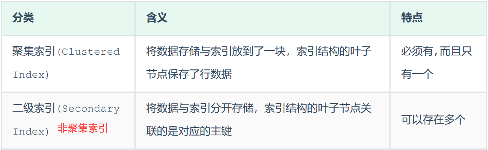
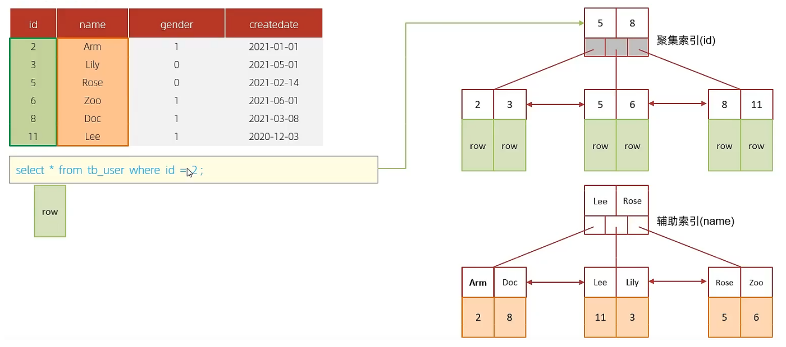
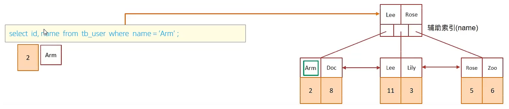
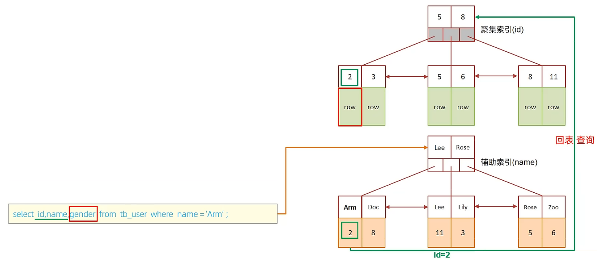

> 参考 
> - MySQL数据库入门到精通 heima 2022

# -------------------- 进阶篇

# ---------- 存储引擎

## MySQL体系结构


1、连接层

最上层是一些客户端和链接服务，包含本地sock 通信和大多数基于客户端/服务端工具实现的类似于TCP/IP的通信。主要完成一些类似于连接处理、授权认证、及相关的安全方案。在该层上引入了线程池的概念，为通过认证安全接入的客户端提供线程。同样在该层上可以实现基于SSL的安全链接。服务器也会为安全接入的每个客户端验证它所具有的操作权限。

2、服务层

第二层架构主要完成大多数的核心服务功能，如SQL接口，并完成缓存的查询，SQL的分析和优化，部分内置函数的执行。所有跨存储引擎的功能也在这一层实现，如过程、函数等。在该层，服务器会解析查询并创建相应的内部解析树，并对其完成相应的优化如确定表的查询的顺序，是否利用索引等，最后生成相应的执行操作。如果是select语句，服务器还会查询内部的缓存，如果缓存空间足够大，这样在解决大量读操作的环境中能够很好的提升系统的性能。

3、引擎层

存储引擎层， 存储引擎真正的负责了MySQL中数据的存储和提取，服务器通过API和存储引擎进行通信。不同的存储引擎具有不同的功能，这样我们可以根据自己的需要，来选取合适的存储引擎。数据库中的索引是在存储引擎层实现的。

4、存储层

数据存储层， 主要是将数据(如: redolog、undolog、数据、索引、二进制日志、错误日志、查询日志、慢查询日志等)存储在文件系统之上，并完成与存储引擎的交互。

和其他数据库相比，MySQL有点与众不同，它的架构可以在多种不同场景中应用并发挥良好作用。主要体现在存储引擎上，插件式的存储引擎架构，将查询处理和其他的系统任务以及数据的存储提取分离。这种架构可以根据业务的需求和实际需要选择合适的存储引擎。


## 存储引擎介绍

存储引擎就是存储数据、建立索引、更新/查询数据等技术的实现方式 。==存储引擎是基于表的==，而不是基于库的，所以存储引擎也可被称为表类型。我们可以在创建表的时候，来指定选择的存储引擎，如果没有指定将自动选择默认的存储引擎。

建表时指定存储引擎

```mysql
CREATE TABLE 表名(
  ......
) ENGINE = 引擎名;
```

查询当前数据库支持的存储引擎

```mysql
show engines;
```


查询建表语句查看某张表的存储引擎

```mysql
show create table account;
```


## 三个存储引擎

### InnoDB

#### 介绍

InnoDB是一种兼顾高可靠性和高性能的通用存储引擎，在 MySQL 5.5 之后，InnoDB是==默认的==MySQL 存储引擎。

InnoDB的特点：

- DML操作（增删改）遵循ACID模型，支持事务
-  支持行级锁，提高并发访问性能；
- 支持外键FOREIGN KEY约束，保证数据的完整性和正确性

#### ibd 文件 

`xxx.ibd`：xxx代表的是表名，innoDB引擎的每张表都会对应这样一个表空间文件，存储该表的表结构（frm-早期的 、sdi-新版的）、数据和索引。 

参数 `innodb_file_per_table` 如果开启了，代表对于InnoDB引擎的表，每一张表都对应一个ibd文件。

```mysql
show variables like 'innodb_file_per_table'; #查看是否开启变量
```

#### 逻辑存储结构


- 表空间 : InnoDB存储引擎逻辑结构的最高层，ibd文件其实就是表空间文件，在表空间中可以 包含多个Segment段。 
- 段 : 表空间是由各个段组成的， 常见的段有数据段、索引段、回滚段等。InnoDB中对于段的管理，都是引擎自身完成，不需要人为对其控制，一个段中包含多个区。 
- 区 : 区是表空间的单元结构，每个区的大小为1M。 默认情况下， InnoDB存储引擎页大小为 16K， 即一个区中一共有64个连续的页。 
- 页 : 页是组成区的最小单元，页也是InnoDB 存储引擎磁盘管理的最小单元，每个页的大小默 认为 16KB。为了保证页的连续性，InnoDB 存储引擎每次从磁盘申请 4-5 个区。 
- 行 : InnoDB 存储引擎是面向行的，也就是说数据是按行进行存放的，在每一行中除了定义表时 所指定的字段以外，还包含两个隐藏字段(后面会详细介绍)。


### MyISAM 

MyISAM是MySQL早期的默认存储引擎。

特点：

- 不支持事务，不支持外键 
- 支持表锁，不支持行锁 
- 访问速度快 

文件：

- `xxx.sdi`：存储表结构信息 
- `xxx.MYD`: 存储数据 
- `xxx.MYI`: 存储索引


### Memory 

Memory引擎的表数据时存储在内存中的，由于受到硬件问题、或断电问题的影响，只能将这些表作为临时表或缓存使用。 

特点：

- 内存存放 
- hash索引（默认） 

文件：`xxx.sdi`，存储表结构信息


### 三者区别


### 存储引擎选择

在选择存储引擎时，应该根据应用系统的特点选择合适的存储引擎。对于复杂的应用系统，还可以根据 实际情况选择多种存储引擎进行组合。 

- `InnoDB`：如果应用对事务的完整性有比较高的要求，在并发条件下要求数据的一致性，数据操作除了插入和查询之外，还包含很多的更新、删除操作
- `MyISAM`： 如果应用是以读操作和插入操作为主，只有很少的更新和删除操作，并且对事务的完整性、并发性要求不是很高
- `MEMORY`：将所有数据保存在内存中，访问速度快，通常用于临时表及缓存。缺陷就是对表的大小有限制，太大的表无法缓存在内存中，而且无法保障数据的安全性。

> 两个nosql数据库：MongoDB取代MyISAM，Redis取代MEMORY


# SQL性能分析

### sql执行频率

SQL执行频率 MySQL 客户端连接成功后，通过 `show [session|global] status` 命令可以提供服务器状态信息。

通过如下指令，可以查看当前数据库的INSERT、UPDATE、DELETE、SELECT的访问频次：

```mysql
-- session 是查看当前会话
-- global 是查询全局数据
SHOW GLOBAL STATUS LIKE 'Com_______'; -- 七个下划线
```


> 通过上述指令，我们可以查看到当前数据库到底是以查询为主，还是以增删改为主，从而为数据库优化提供参考依据。 如果是以增删改为主，我们可以考虑不对其进行索引的优化。 如果是以查询为主，那么就要考虑对数据库的索引进行优化了。


### 慢查询日志

> linux看教程pdf，这里用的windows（[(9条消息) MySql慢查询日志设置_0店小二的博客-CSDN博客_mysql慢日志设置](https://blog.csdn.net/ljb825802164/article/details/106599827)）

慢查询日志记录了所有执行时间超过指定参数（long_query_time，单位：秒，默认10秒）的所有 SQL语句的日志

查询慢查询日志相关参数：

```mysql
show global variables like '%query%';
show session variables like '%query%';
```


```mysql
set global|session slow_query_log=1; -- 开启慢日志
set global|session long_query_time=5; -- 设置慢查询时间
```

这里没有大数据量的表，只能把`long_query_time`设置得很小，然后随便执行个select语句，然后在日志存放文件中查看（通过名字在电脑里搜索这个文件位置）

```
日志文件中的内容：
# Time: 2022-04-27T06:24:25.784511Z
# User@Host: root[root] @ localhost [127.0.0.1]  Id:     2
# Query_time: 0.000342  Lock_time: 0.000064 Rows_sent: 24  Rows_examined: 24
SET timestamp=1651040665;
/* ApplicationName=DataGrip 2021.3.4 */ select * from tb_user;
```


### profile详情

通过 `show profiles` 能够在做SQL优化时帮助我们了解时间都耗费到哪里去了

```mysql
-- 查看和 profiles相关的变量
show variables like '%profiling%';
```


```mysql
-- 查看当前MySQL是否支持profile操作
SELECT @@have_profiling; 
-- 查看是否开启
SELECT @@profiling ; 
-- 开启profile
SET profiling = 1; 

-- 随便执行点语句

-- 查看每一条SQL的耗时基本情况
show profiles;
-- 查看指定query_id的SQL语句各个阶段的耗时情况
show profile for query query_id;
-- 查看指定query_id的SQL语句CPU的使用情况
show profile cpu for query query_id;
```


### explain（常用）

EXPLAIN 或者 DESC 命令获取 MySQL 如何执行 SELECT 语句的信息，包括在 SELECT 语句执行过程中表如何连接和连接的顺序。

```mysql
-- 直接在select语句之前加上关键字 explain / desc
EXPLAIN SELECT... ;
```

Explain 执行计划中各个字段的含义：

| 字段             | 含义                                                         |
| ---------------- | ------------------------------------------------------------ |
| id               | select查询的序列号，表示查询中执行select子句或者是操作表的顺序 (id相同，执行顺序从上到下；id不同，值越大，越先执行)。 |
| select_type      | 表示 SELECT 的类型，常见的取值有 SIMPLE（简单表，即不使用表连接 或者子查询）、PRIMARY（主查询，即外层的查询）、 UNION（UNION 中的第二个或者后面的查询语句）、 SUBQUERY（SELECT/WHERE之后包含了子查询）等 |
| ==type==         | 表示连接类型，性能由好到差的连接类型为NULL、system、const、 eq_ref、ref、range、 index、all |
| ==possible_key== | 显示可能应用在这张表上的索引，一个或多个。                   |
| ==key==          | 实际使用的索引，如果为NULL，则没有使用索引。                 |
| ==key_len==      | 表示索引中使用的字节数，该值为索引字段最大可能长度，并非实际使用长度，在不损失精确性的前提下， 长度越短越好 。 |
| rows             | MySQL认为必须要执行查询的行数，在innodb引擎的表中，是一个估计值， 可能并不总是准确的。 |
| filtered         | 表示返回结果的行数占需读取行数的百分比， filtered 的值越大越好。 |

type、possible_key、key、key_len 重点关注


# ---------- 索引

## 索引概述

### 介绍 

索引（index）是帮助MySQL高效获取数据的==数据结构(有序)==。在数据之外，数据库系统还维护着满足特定查找算法的数据结构，这些数据结构以某种方式引用（指向）数据， 这样就可以在这些数据结构上实现高级查找算法，这种数据结构就是索引

### 演示索引

执行SQL语句为 `select * from user where age = 45;`

无索引情况：需要从第一行开始扫描，一直扫描到最后一行，我们称之为全表扫描，性能很 低。

有索引情况：假设索引结构是二叉树，会对age这个字段建立一个二叉树的索引结构


此时我们在进行查询时，只需要扫描三次就可以找到数据了，极大的提高的查询的效率。

### 索引的特点

优势

- 提高数据检索的效率，降低数据库的IO成本。
- 通过索引列对数据进行排序，降低数据排序的成本，降低CPU的消耗。 

劣势

- 索引列也是要占用空间的。 （不是个问题，磁盘的空间很大）
- 索引大大提高了查询效率，同时却也降低更新表的速度，如对表进行INSERT、UPDATE、DELETE时，效率降低。


## 索引结构

### 概述

MySQL的索引是在存储引擎层实现的，==不同的存储引擎有不同的索引结构==，主要包含以下几种：

- `B+Tree`：最常见的索引类型，大部分引擎都支持 B+ 树索引 
- `Hash`：底层数据结构是用哈希表实现的, 只有精确匹配索引列的查询才有效, 不 支持范围查询 
- `R-tree`：空间索引，MyISAM引擎的一个特殊索引类型，主要用于地理空间数据类 型，通常使用较少 
- `Full-text`：全文索引，一种通过建立倒排索引,快速匹配文档的方式。类似于 Lucene,Solr,ES

看不同的存储引擎对于索引结构的支持情况：


> 注意： 我们平常（面试）所说的索引，如果没有特别指明，都是指B+树结构组织的索引


### B+树

> 详细的b树、b+树看数据结构

B+Tree是B-Tree的变种，我们以一颗最大度数（max-degree）为4（4阶）的b+tree为例


我们可以看到两部分： 

- 绿框是索引部分，仅仅起到索引数据的作用，不存储数据。 
- 红框是数据存储部分，在其叶子节点中要存储具体的数据。

> 我们可以通过一个数据结构可视化的网站演示： https://www.cs.usfca.edu/~galles/visualization/BPlusTree.html
>
> 插入一组数据：100 65 169 368 900 556 780 35 215 1200 234 888 158 90 1000 88 120 268 250 。然后观察一些数据插入过程中，节点的变化情况

B+Tree 与 B-Tree相比，主要有以下==三点区别==： 

- 所有的数据都会出现在叶子节点
- 叶子节点形成一个单向链表 
- 非叶子节点仅仅起到索引数据作用，具体的数据都是在叶子节点存放的

MySQL索引数据结构对经典的B+Tree进行了优化。在原B+Tree的基础上，==增加一个指向相邻叶子节点的链表指针==，就形成了带有顺序指针的B+Tree，提高区间访问的性能，利于排序。


### Hash 

MySQL中除了支持B+Tree索引，还支持一种Hash索引 

哈希索引就是采用一定的hash算法，将键值换算成新的hash值，映射到对应的槽位上，然后存储在 hash表中


如果两个(或多个)键值，映射到一个相同的槽位上，他们就产生了hash冲突（也称为hash碰撞），可以通过链表来解决


特点：

- Hash索引只能用于对等比较(=，in)，==不支持范围查询==（between，>，< ，...） 
- 无法利用索引完成排序操作 
- 查询效率高，通常(不存在hash冲突的情况)只需要一次检索就可以了，效率通常要高于B+tree索引

存储引擎支持：在MySQL中，支持hash索引的是Memory存储引擎。 而InnoDB中具有==自适应hash功能==，hash索引是 InnoDB存储引擎根据B+Tree索引在指定条件下自动构建的。


### 面试题

**为什么InnoDB存储引擎选择使用B+tree索引结构?** 

- 相对于二叉树（红黑树也是二叉树），层级更少，搜索效率高
- 对于B-tree，无论是叶子节点还是非叶子节点，都会保存数据，这样==导致一页中存储的键值减少==，指针跟着减少，要同样保存大量数据，只能增加树的高度，导致性能降低
- 相对Hash索引，B+tree支持范围匹配及排序操作


## 索引分类

### 按字段特性分类

在MySQL数据库，将索引的具体类型主要分为以下几类：主键索引、唯一索引、常规索引、全文索引。

| 分类     | 含义                                                         | 特点             | 关键字      |
| -------- | ------------------------------------------------------------ | ---------------- | ----------- |
| 主键索引 | 建立在主键上的索引，索引列值唯一且不允许有空值，一般在建表时创建主键索引 | 一张表只能有一个 | PRIMARY KEY |
| 唯一索引 | 建立在UNIQUE字段上的索引，索引列值唯一且允许为空             | 一张表可以有多个 | UNIQUE      |
| 常规索引 | 建立在普通字段上的索引                                       | 一张表可以有多个 |             |
| 全文索引 | 用于查找文本中的关键词，而不是比较索引中的值                 | 一张表可以有多个 | FULLTEXT    |


### 按索引字段个数分类

1. 单列索引：建立在单个列上的索引被称为单列索引。
2. 联合索引：建立在多个列上的索引被称为联合索引，又叫复合索引、组合索引。在MySQL中使用联合索引时要遵循最左前缀匹配原则


### 存储形式分类

MySQL索引按叶子节点存储的是否为完整表数据分为：聚集索引、非聚集索引（也叫二级索引、辅助索引）



聚集索引选取规则：

- 如果存在主键，主键索引就是聚集索引
- 如果不存在主键，将使用第一个唯一（UNIQUE）索引作为聚集索引
- 如果表没有主键，或没有合适的唯一索引，则InnoDB会自动生成一个rowid作为隐藏的聚集索引

聚集索引和二级索引的具体结构：

- 聚集索引的叶子节点下挂的是这一行的数据
- 二级索引的叶子节点下挂的是该字段值对应的主键值


具体分析 `select * from user where name='Arm';` 的执行：

- 先根据name='Arm'到name字段的二级索引中进行匹配查找。在二级索引中查找到 Arm 对应的主键值10 
- 由于查询返回的数据是*，所以还需要根据主键值10，到聚集索引中查找10对应的记录，最 终找到10对应的行row
- 最终拿到这一行的数据，直接返回即可


**回表查询：**这种先到二级索引中查找数据，找到主键值，然后再到聚集索引中根据主键值，获取数据的方式，就称之为回表查询。

> 思考题： InnoDB主键索引的B+tree高度为多高呢？
>
> 
>
> 假设：
>
> - 一行数据大小为1k
> - 一页中可以存储16行这样的数据，即一页16KB
> - InnoDB的指针占用6个字节的空间
> - 主键使用bigint，占用字节数为8
>
> 设一页中有n个key，则有n+1个指针（看图）
>
> 在高度为2的情况下：`n * 8 + (n + 1) * 6 = 16 * 1024` , 算出n约为 1170，则指针有1171个，能指向1171页，一页16条，1171页有1171 * 16 = 18736条记录，也就是说，如果树的高度为2，则可以存储 18000 多条记录。
>
> 同理，高度为3，能存 1171 * 1171 * 16 = 21939856条记录
>
> 2200w多万条的数据也只需要高度为3的B+树（当然有很多棵树）


## 索引语法

### 第一种方式：使用Alter创建索引

添加主键索引

```mysql
ALTER TABLE tbl_name ADD PRIMARY KEY (col_list);
该语句添加一个主键，这意味着索引值必须是唯一的，且不能为NULL
```

添加唯一索引

```mysql
ALTER TABLE tbl_name ADD UNIQUE index_name (col_list);
这条语句创建索引的值必须是唯一的。
```

添加普通索引

```mysql
ALTER TABLE tbl_name ADD INDEX index_name (col_list);
添加普通索引，索引值可出现多次
```

添加全文索引

```mysql
ALTER TABLE tbl_name ADD FULLTEXT index_name (col_list);
```

添加多列索引

```mysql
ALTER TABLE 表名 ADD UNIQUE (col1, col2, ..., )
```


### 第二种方式：使用Create创建索引

创建索引

```mysql
CREATE [ UNIQUE | FULLTEXT ] INDEX 索引名 ON 表名 (字段1,字段2,...);
1、INDEX前：
    UNIQUE：唯一索引
    FULLTEXT：全文索引
    不加就是普通索引
2、索引命名标准：idx_表名_字段名
```

查看索引

```mysql
SHOW INDEX FROM table_name;
```

删除索引

```mysql
DROP INDEX index_name ON table_name;
```

**操作实例：**

```mysql
-- name字段为姓名字段，该字段的值可能会重复，为该字段创建常规索引
CREATE INDEX idx_user_name ON tb_user(name);
-- phone手机号字段的值，是非空，且唯一的，为该字段创建唯一索引
CREATE UNIQUE INDEX idx_user_phone ON tb_user(phone);
-- 为profession、age、status创建联合索引
CREATE INDEX idx_user_pro_age_sta ON tb_user(profession,age,status);
-- 为email建立合适的索引来提升查询效率
CREATE INDEX idx_email ON tb_user(email);
```

最后查看表中的索引


### 两种创建索引方式的区别

- Alter可以省略索引名，如果省略索引名，数据库会默认根据第一个索引列赋予一个名称。Create必须指定索引名称
- Create不能用于创建Primary key索引
- Alter允许一条语句同时创建多个索引，Create一次只能创建一个索引


## 索引使用

### 最左前缀法则

如果==索引了多列（联合索引）==，就要遵守最左前缀法则。

**最左前缀法则：**查询从索引的最左列开始，并且不跳过索引中的列。如果跳跃某一列，索引将会部分失效（后面的字段索引失效）

在使用联合索引时，MySQL 会==根据联合索引中的字段顺序==，从左到右依次到查询条件中去匹配，如果查询条件中存在与联合索引中最左侧字段相匹配的字段，则就会使用该字段过滤一批数据，直至联合索引中全部字段匹配完成


以 tb_user 表为例，为profession、age、status创建联合索引

```mysql
-- 为profession、age、status创建联合索引
CREATE INDEX idx_user_pro_age_sta ON tb_user(profession,age,status);
```

下面的测试中，我们发现只要联合索引最左边的字段 profession存在（和where字句中的顺序无关），索引就会生效，而且可以推测出profession字段索引长度为40、age 字段索引长度为2、status字段索引长度为2。

```mysql
explain select * from tb_user where profession = '软件工程' and age = 31 and status = '0';
-- key_len:40
explain select * from tb_user where age = 31 and status = '0' and profession = '软件工程';
-- key_len:40
explain select * from tb_user where profession = '软件工程' and age = 31;
-- key_len:38
explain select * from tb_user where profession = '软件工程'; 
-- key_len:36
```

两面两组测试索引不生效，因为不满足最左前缀法则

```mysql
explain select * from tb_user where age = 31 and status = '0';
explain select * from tb_user where status = '0';
```

下述查询中索引满足最左前缀法则的基本条件。但是查询时跳过了age这个列，所以age及后面的列索引是不会使用的，也就是索引部分生效，索引的长度是36

```mysql
explain select * from tb_user where profession = '软件工程' and status = '0';
-- key_len:36
```


### 索引失效情况

#### 范围查询 

联合索引中，出现范围查询( > , < )，范围查询右侧的列索引失效

```mysql
explain select * from tb_user where profession = '软件工程' and age > 30 and status= '0';
-- key_len:38
-- status字段没有走索引
```

在业务允许的情况下，尽可能的使用类似于 >= 或 <= 这类的范围查询

```mysql
explain select * from tb_user where profession = '软件工程' and age >= 30 and status= '0';
-- key_len:40
-- 所有字段都走了索引
```


#### 索引列运算

不要在索引列上进行运算操作，索引将失效

```mysql
explain select * from tb_user where substring(phone,10,2) = '15'; -- 失效
```

 

#### 字符串不加引号 

字符串类型字段使用时，不加引号，索引将失效

```mysql
explain select * from tb_user where phone = '17799990015';
explain select * from tb_user where phone = 17799990015; -- 失效
```

如果字符串不加单引号，对于查询结果，没什么影响，但是数据库存在隐式类型转换，索引将失效


#### 模糊查询 

如果仅仅是尾部模糊匹配，索引不会失效。如果是头部模糊匹配，索引失效

```mysql
explain select * from tb_user where profession like '软件%'; -- key_len=36
explain select * from tb_user where profession like '%工程'; -- 索引失效
explain select * from tb_user where profession like '%工%'; -- 索引失效
```


#### or 连接条件 

当or连接的条件，==左右两侧字段都有索引时==，索引才会生效

```mysql
-- age没有索引，id字段的主键索引失效
explain select * from tb_user where id = 10 or age = 23; 
```


#### 数据分布影响 

如果MySQL评估使用索引比全表更慢，则不使用索引

```mysql
-- 整张表都满足，不走索引
select * from tb_user where phone >= '17799990000'; 
-- 表中部分满足，走索引
select * from tb_user where phone >= '17799990020';
```

MySQL在查询时，会评估使用索引的效率与走全表扫描的效率，如果走全表扫描更快，则放弃 索引，走全表扫描。 因为==索引是用来索引少量数据的==，如果通过索引查询返回大批量的数据，则还不如走全表扫描来的快，此时索引就会失效


### SQL提示

在tb_user表中分别为profession字段创建单列索引和联合索引

```mysql
create index idx_user_pro on tb_user(profession); -- 单列索引
CREATE INDEX idx_user_pro_age_sta ON tb_user(profession,age,status); -- 联合索引
```

测试下面的语句，`possible_keys`中 `idx_user_pro_age_sta`、`idx_user_pro` 这两个索引都可能用到，最终MySQL选择了`idx_user_pro_age_sta`索引，这是MySQL自动选择的结果。

```mysql
explain select * from tb_user where profession ='软件工程';
```


**SQL提示：**是优化数据库的一个重要手段，简单来说，就是在SQL语句中加入一些人为的提示来达到优 化操作的目的

1. `use index`：建议使用某个索引完成此次查询（只是建议，mysql内部还会再次进行评估）
2. `ignore index`： 忽略指定的索引
3. `force index`： 强制使用索引

```mysql
explain select * from tb_user use|ignore|force index(idx_user_pro) where profession = '软件工程';
```


### 覆盖索引

覆盖索引：查询使用了索引，并且返回的列在该索引中已经全部能够找到

尽量使用覆盖索引，减少 `select *`

```mysql
-- entra=Using index
explain select id, profession from tb_user where profession = '软件工程' and age =31 and status = '0' ;
-- entra=Using index
explain select id,profession,age, status from tb_user where profession = '软件工程'and age = 31 and status = '0' ;
-- entra=NULL
explain select id,profession,age, status, name from tb_user where profession = '软件工程' and age = 31 and status ='0';
-- entra=NULL
explain select * from tb_user where profession = '软件工程' and age = 31 and status= '0';
```

这四条SQL语句的执行计划前面所有的指标都是一样的，看不出来差异。但在后面的Extra中，前两条SQL的结果为 `Using where; Using Index`而后两条SQL的结果为 `Using index condition `

> 不同的mysql版本对于extra的展示不同，我这里是Using index和null

| Extra                    | 含义                                                         |
| ------------------------ | ------------------------------------------------------------ |
| Using where; Using Index | 查找使用了索引，但是需要的数据都在索引列中能找到，所以不需要回表查询数据 |
| Using index condition    | 查找使用了索引，但是需要回表查询数据                         |

在tb_user表中有一个联合索引`idx_user_pro_age_sta`，该索引关联了三个字段 profession、age、status，而这个索引也是一个二级索引，所以叶子节点下面挂的是这一行的主键id。 所以当我们查询返回的数据在 id、profession、age、status 之中，则直接走二级索引返回数据，不需要回表查询

如果一直使用 `select *` 查询返回所有字段值，很容易就会造成回表查询（除非是根据主键查询，此时只会扫描聚集索引）


**更直观地分析覆盖索引与回表查询：**

id 是主键，是一个聚集索引；name字段建立了普通索引，是一个二级索引（辅助索引）

执行SQL： `select * from tb_user where id = 2;`  

根据id查询，直接走聚集索引查询，一次索引扫描，直接返回数据，性能高



执行SQL：`select id,name from tb_user where name = 'Arm';`

根据name字段查询，查询二级索引，查询返回在字段为 id和name，都在name的二级索引中，这两个值都是可以直接获取到的，因为覆盖索引，所以不需要回表查询，性能高



执行SQL：`select id,name,gender from tb_user where name = 'Arm';`

由于在name的二级索引中不包含gender，所以需要回表查询，性能相对较差一点



> 思考题： 
>
> 一张表有四个字段(id, username, password, status)，由于数据量大，需要对以下SQL语句进行优化，该如何进行才是最优方案？
>
> ```mysql
> select id,username,password from tb_user where username = 'itcast'; 
> ```
>
> 答案：针对于 username 和 password 建立联合索引，这样可以避免上述的SQL语句在查询的过程中出现回表查询
>
> ```mysql
> create index idx_user_name_pass on tb_user(username,password); 
> ```


### 前缀索引

当字段类型为字符串（varchar，text，longtext等）时，有时候需要索引很长的字符串，这会让 索引变得很大，查询时，浪费大量的磁盘IO， 影响查询效率。此时可以只将字符串的一部分前缀，建 立索引，这样可以大大节约索引空间，从而提高索引效率

语法：

```mysql
create index idx_xxxx on table_name(column(n)) ;
-- 为tb_user表的email字段，建立长度为5的前缀索引
create index idx_email_5 on tb_user(email(5));
```

前缀长度的选择：

可以根据索引的选择性来决定，而选择性是指==不重复的索引值（基数）和数据表的记录总数的比值==， 索引选择性越高则查询效率越高， 唯一索引的选择性是1，这是最好的索引选择性，性能也是最好的

```mysql
select count(distinct email) / count(*) from tb_user ; -- 1
select count(distinct substring(email,1,5)) / count(*) from tb_user ;
```

分析 `select * from tb_user where email='lvbu666@163.com';` 的执行流程


### 单列索引与联合索引

> 就是讲覆盖索引

在tb_user表中，假如phone、name上都是有单列索引的，执行下面的sql语句

```mysql
explain select id,phone,name from tb_user where phone='17799990002' and name='赵云'; 
```

最终mysql只会选择一个索引，此时是会回表查询的

来创建一个phone和name字段的联合索引，再执行上面的sql语句

```mysql
create unique index idx_user_phone_name on tb_user(phone,name);  
```

查询时走了联合索引，在联合索引中包含 phone、name的信息，在叶子节点下挂的是对应的主键id，所以查询是无需回表查询

在业务场景中，如果存在==多个查询条件==，考虑针对于查询字段建立索引时，==建议建立联合索引==， 而非单列索引


## 索引设计原则

- 针对于数据量较大，且查询比较频繁的表建立索引
- 针对于常作为 查询条件 where、排序 order by、分组 group by 操作的字段建立索引 
- 尽量选择区分度高的列作为索引，尽量建立唯一索引，区分度越高，使用索引的效率越高 
- 如果是字符串类型的字段，字段的长度较长，可以针对于字段的特点，建立前缀索引
- 尽量使用联合索引，减少单列索引，查询时，联合索引很多时候可以覆盖索引，节省存储空间， 避免回表，提高查询效率
- 要控制索引的数量，索引并不是多多益善，索引越多，维护索引结构的代价也就越大，会影响 删改的效率
- 如果索引列不能存储NULL值，请在创建表时使用NOT NULL约束它。当优化器知道每列是否包含 NULL 值时，它可以更好地确定哪个索引最有效地用于查询

# ---------- SQL 优化


# ---------- 视图/存储过程/触发器


# ---------- 锁


# ---------- InnoDB 引擎


# ---------- MySQL 管理


# -------------------- 运维篇