 
> 参考 
> - MySQL数据库入门到精通 heima 2022

# -------------------- 入门篇
# 基本概念

### db、dbms、sql

**数据库：**

英文单词DataBase，简称DB。按照一定格式存储数据的一些文件的组合。顾名思义：存储数据的仓库，实际上就是一堆文件。这些文件中存储了具有特定格式的数据

**数据库管理系统：**

DataBaseManagement，简称DBMS。数据库管理系统是专门用来管理数据库中数据的，数据库管理系统可以对数据库当中的数据进行增删改查。

常见的数据库管理系统：MySQL、Oracle、MS SqlServer、DB2、sybase等....

**SQL：结构化查询语言**

程序员需要学习SQL语句，程序员通过编写SQL语句，然后DBMS负责执行SQL语句，最终来完成数据库中数据的增删改查操作。

SQL是一套标准，程序员主要学习的就是SQL语句，这个SQL在mysql中可以使用，同时在Oracle中也可以使用，在DB2中也可以使用

**三者之间的关系？**	

DBMS--执行--> SQL --操作--> DB


### SQL语句的分类

1、数据库查询语言（DQL）

数据查询语言DQL基本结构是由SELECT子句，FROM子句，WHERE 子句组成的查询块，简称DQL，Data Query Language。代表关键字为select。

2、数据库操作语言（DML）

用户通过它可以实现对数据库的基本操作。简称DML，Data Manipulation Language。代表关键字为insert、delete 、update。

3、数据库定义语言（DDL）

数据定义语言DDL用来创建数据库中的各种对象，创建、删除、修改表的结构，比如表、视图、索引、同义词、聚簇等，简称DDL，Data Denifition Language。代表关键字为create、drop、alter。和DML相比，DML是修改数据库表中的数据，而 DDL 是修改数据中表的结构。

4、事务控制语言（TCL）

TCL经常被用于快速原型开发、脚本编程、GUI和测试等方面，简称：TCL，Trasactional Control Languag。代表关键字为commit、rollback。

5、数据控制语言（DCL）

数据控制语言DCL用来授予或回收访问数据库的某种特权，并控制数据库操纵事务发生的时间及效果，对数据库实行监视等。简称：DCL，Data Control Language。代表关键字为grant、revoke。


### mysql常用命令

退出mysql：exit

查看mysql中有哪些数据库：show databases;

选择使用某个数据库：use test;

创建数据库：create database test;

查看某个数据库下有哪些表：show tables;

查看mysql数据库的版本号：select version();

查看当前使用的是哪个数据库：select database();


# SQL

## DQL

### 简单查询

```sql
select 字段名1,字段名2,... from 表名;

查询所有字段
  select * from dept;
  # 效率低，可读性差
  # 实际开发中不建议

给查询的列起别名
  select 字段名 as 别名 from dept; # as关键字可以省略
  # 别名里面有空格
    select dname 'dept name' from dept; 
    select dname "dept name" from dept; 
  注意：别名能用在比select语句执行晚的子句中，例如不能用于where子句，可以用于 order by 子句

列参与数学运算
  # 计算员工年薪
  	select ename,sal*12 as '年薪' from emp;
```


### 条件查询 where

```sql
语法格式：
  select
    字段1,字段2,字段3....
  from 
    表名
  where
    条件;	


注意：
  select 中给字段起的别名不能用于where子句中！！！
  因为调用 where 子句的时候, select子句还没有开始执行，所以不识别
  同理, order by子句中是可以使用


有哪些条件？
  = 等于
    # 查询SMITH的编号和薪资？
    select empno,sal from emp where ename = 'SMITH'; 


  <>或!= 不等于
    # 查询薪资不等于800的员工？
    select * from emp where sal != 800;
    select * from emp where sal <> 800; 


  < <= > >=
    # 查询薪资小于2000的员工？
    mysql> select ename from emp where sal < 2000;


  between ... and ... 等同于 >= and <=
    # 查询薪资在2450和3000之间的员工？包括2450和3000
      # 第一种：>= and <=
      select * from emp where sal >= 2450 and sal <= 3000;	
      # 第二种：between … and …
      select * from emp where sal between 2450 and 3000;		
    注意：
      使用between and的时候，必须遵循左小右大。
      between and是闭区间，包括两端的值。


  is null（is not null）
    # 查询哪些员工的津贴/补助为null？
    select * from emp where comm is null;
    # 查询哪些员工的津贴/补助不为null？
    select * from emp where comm is not null;
    注意：
      在数据库当中null不能使用等号进行衡量，因为数据库中的null代表什么也没有，它不是一个值
      select * from emp where comm = null; 是错误的


  and 和 or
    # 查询工作岗位是MANAGER并且工资大于2500的员工？
    select * from emp where job = 'MANAGER' and sal > 2500;
    # 查询工作岗位是MANAGER和SALESMAN的员工？
    select * from emp where job = 'MANAGER' or job = 'SALESMAN';

    and 和 or 同时出现的话，and优先级比or高
      # 查询工资大于2500，并且部门编号为10或20部门的员工？
      select * from emp where sal > 2500 and deptno = 10 or deptno = 20;
      # 以上语句会先执行and，然后执行or
    如果想让or先执行，需要加“小括号”
    以后在开发中，如果不确定优先级，就加小括号


  in 包含，相当于多个 or（not in 不在这个范围中）
    # 查询工作岗位是MANAGER和SALESMAN的员工？
    select * from emp where job = 'MANAGER' or job = 'SALESMAN';
    select * from emp where job in('MANAGER', 'SALESMAN');

    注意：
      in不是一个区间，in后面跟的是具体的值
      # 查询薪资是800和5000的员工信息？
      select ename,sal from emp where sal in(800, 5000); 


  not 取非，主要用在 is 或 in 中
    is null
    is not null
    in
    not in


  like 模糊查询，支持 % 或 _ 匹配
    %：匹配任意多个字符
    _：任意一个字符。
    #	找出名字中含有O的？
    select ename from emp where ename like '%O%';
    # 找出第三个字母是R的？
    select ename from emp where ename like '__R%';

    特殊情况：转义字符
      # 找出名字中有“_”的？
      select name from t_student where name like '%\_%';
```


### 排序 order by

```sql
order by ... asc / desc # 降序：desc 升序：asc

可以按照多个字段排序
    # 查询员工，要求按照薪资升序，如果薪资一样的话，再按照名字升序排列
    select * from emp order by sal asc, ename asc; 
  
根据字段的位置也可以排序（了解）
    select ename,sal from emp order by 2; # 按照查询结果的第2列sal排序
    不建议在开发中这样写，因为不健壮，列的顺序很容易发生改变，列顺序修改之后，2就废了
```


### 数据处理函数（单行处理函数）

```sql
特点：一个输入对应一个输出
		
和单行处理函数相对的是 多行处理函数（特点：多个输入，对应个输出）

常见的 单行处理函数
    lower：转换小写
    upper：转换大写
        select lower(ename) as ename from emp;
        # 14个输入，14个输出
				select upper(name) as name from t_student;

		substr：取子串
				substr(被截取的字符串,起始下标,截取的长度)
				注意：起始下标从1开始，没有0
				# 找出员工名字第一个字母是A的员工信息？
            # 第一种：模糊查询
            select ename from emp where ename like 'A%';
            # 第二种：substr函数
            select ename from emp where substr(ename,1,1) = 'A';
	
    concat：字符串拼接
    		# 所有员工的 last_name 和 first_name 通过 ' 连接起来
    		SELECT concat(last_name, "'", first_name) as name from employees

    length：取长度
    		select length(ename) enamelength from emp;

    trim：去空格
				select * from emp where ename = trim('   KING');
        
		format：设置千分位
        语法：format(数字,'格式')
        select ename,format(sal, '$999,999') as sal from emp;
        | ename  | sal   |
        +--------+-------+
        | SMITH  | 800   |
        | ALLEN  | 1,600 |
		
		# 见日期相关操作
    str_to_date 将字符串转换成日期
    date_format 格式化日期
   
		case .. when .. then .. when .. then .. else .. end
        # 当员工的工作岗位是MANAGER的时候，工资上调10%，当工作岗位是SALESMAN的时候，工资上调50%，其它正常
        #（注意：不修改数据库，只是将查询结果显示为工资上调）
        SELECT ename,job,sal AS oldsal,
          ( CASE job 
           WHEN 'MANAGER' THEN sal * 1.1 
           WHEN 'SALESMAN' THEN sal * 1.5 
           ELSE sal 
           END ) AS newsal 
        FROM emp;

    round：四舍五入
        保留整数位
        select round(1236.567, 0) as result from emp;  
        保留1个小数
        select round(1236.567, 1) as result from emp; 
        保留2个小数
        select round(1236.567, 2) as result from emp; 
        保留到十位
        select round(1236.567, -1) as result from emp; 


		rand：生成随机数
				# 100以内的随机数
				select round(rand()*100,0) from emp; 

    ifnull：将 null 转换成一个具体值
        在所有数据库当中，只要有NULL参与的数学运算，最终结果就是NULL
            # 计算每个员工的年薪？年薪 = (月薪 + 月补助) * 12
            select ename, (sal + comm) * 12 as yearsal from emp;
            # 因为很多员工comm是空，所以年薪也变成null了
        ifnull 函数用法：ifnull(数据, 被当做哪个值)
            # 补助为NULL的时候，将补助当做0
            select ename, (sal + ifnull(comm, 0)) * 12 as yearsal from emp;
```

### 聚合函数 （分组函数）

将一列数据作为一个整体，进行纵向计算 

- 特点：输入多行，最终输出一行
- 注意：分组函数在使用的时候必须先进行分组，然后才能用。如果你没有对数据进行分组，**整张表默认为一组**，最终结果是一行

常见聚合函数：

- count：统计数量
- sum	求和
- avg	平均值
- max	最大值
- min	最小值

```sql
    # 找出最高工资？
    select max(sal) from emp;
    # 找出最低工资？
    select min(sal) from emp;
    # 计算工资和：
    select sum(sal) from emp;
    # 计算平均工资：
    select avg(sal) from emp;
    # 计算员工数量？
    select count(ename) from emp;


分组函数在使用的时候需要注意哪些？
    分组函数自动忽略NULL，你不需要提前对NULL进行处理
    select sum(comm) from emp;

		分组函数中 count(*) 和 count(具体字段) 有什么区别？
        count(具体字段)：表示统计该字段下所有不为NULL的元素的总数
        		select count(comm) from emp;
        count(*)：统计表当中的总行数（只要有一行数据count则++）
        		# 因为每一行记录不可能都为NULL，一行数据中有一列不为NULL，则这行数据就是有效的
        		select count(*) from emp;

    分组函数不能够直接使用在where子句中
    		因为 where 在 group by 之前执行，而分组函数在 group by 之后执行
        # 找出比最低工资高的员工信息
        select * from emp where sal > min(sal); # ERROR

    所有的分组函数可以组合起来一起用
    		select sum(sal),min(sal),max(sal),avg(sal),count(*) from emp;
```

​		

### 分组查询（非常重要）	


```sql
先进行分组，然后对每一组的数据进行操作

语法：
    select
      ...
    from
      ...
    group by
      ...

举例：
    计算每个部门的工资和？
    计算每个工作岗位的平均薪资？
    找出每个工作岗位的最高薪资？

解释原理：
    将之前的关键字全部组合在一起，关键字的顺序不能颠倒
        select
        from
        where
        group by
        order by

    执行顺序是
        1. from
        2. where
        3. group by
        4. select
        5. order by

    为什么分组函数不能直接使用在 where 后面？
        # 找出工资高于最低工资的员工
        select * from emp where sal > min(sal); # 报错

        分组函数在使用的时候必须先分组之后才能使用
        where 执行的时候，还没有分组

        select sum(sal) from emp; 
        这个没有分组，为啥sum()函数可以用呢？
        因为 select 在 group by 之后执行

重点结论：
    在一条 select 语句当中，如果有 group by 语句的话
    select 后面只能跟：参加分组的字段 和 分组函数
    # 找出每个工作岗位的工资和？
    select ename,job,sum(sal) from emp group by job;
    # ename不是参加分组的字段也不是分组函数
    以上语句在mysql中可以执行，但是毫无意义
    以上语句在oracle中执行报错，oracle的语法比mysql的语法严格

多字段分组
    # 找出“每个部门，不同工作岗位”的最高薪资？
    技巧：两个字段联合成1个字段看（两个字段联合分组）
    select deptno, job, max(sal) from emp 
    group by deptno, job;

having
    对分完组之后的数据进一步过滤
    不能单独使用，不能代替 where，必须和 group by 联合使用    
    # 找出每个部门最高薪资，要求显示最高薪资大于3000的？
    # 这里>3000的条件是作用于分组后的，所以用having而不是where
    select deptno,max(sal) from emp 
    group by deptno
    having max(sal) > 3000;

    思考一个问题：以上的sql语句执行效率是不是低？
    可以先将大于3000的都找出来，然后再分组
    select deptno,max(sal) from emp
    where sal > 3000
    group by deptno;
  
		优化策略：
				where 和 having，优先选择 where， where完成不了，再选择 having
				where没办法的：
            # 找出每个部门平均薪资，要求显示平均薪资高于2500的
            select deptno,avg(sal) from emp 
            group by deptno
            having avg(sal) > 2500;
```


### distinct去重

```sql
distinct：把查询结果去除重复记录 

distinct 只能出现在所有字段的最前方
		select distinct job from emp;
		# 这样编写是错误的，语法错误
		select ename,distinct job from emp;
		
distinct 出现在两个字段之前，表示两个字段联合起来去重
		select distinct job,deptno from emp;

distinct 和分组函数结合
    # 统计一下工作岗位的数量？
    select count(distinct job) from emp;
```


### 连接查询

```sql
什么是连接查询？
    从一张表中单独查询，称为单表查询
    跨表查询，多张表联合起来查询数据，被称为连接查询
    # emp表和dept表联合起来查询数据，从emp表中取员工名字，从dept表中取部门名字
    
连接查询的分类？
    根据语法的年代分类：
        SQL92：1992年的时候出现的语法
        SQL99：1999年的时候出现的语法
        重点学习SQL99

    根据表连接的方式分类：
        内连接：
            等值连接
            非等值连接
            自连接
        外连接：
            左外连接
            右外连接
        全连接（不讲，基本不用）
  
笛卡尔积现象
    当两张表进行连接查询时，没有任何条件的限制会发生什么现象？
        # 查询每个员工所在部门名称？
        select ename,dname from emp, dept;
    最终查询结果条数，是两张表条数的乘积
    这种现象被称为：笛卡尔积现象（笛卡尔发现的，这是一个数学现象）
	
    怎么避免笛卡尔积现象？
        连接时加条件，满足这个条件的记录被筛选出来
        select ename,dname from emp, dept where emp.deptno = dept.deptno;
        # 给表起别名 SQL92语法	
        select e.ename,d.dname from emp e, dept d where e.deptno = d.deptno;
				最终查询的结果条数是14条，但是匹配的过程中，匹配的次数没有减少

    结论：
    		通过笛卡尔积现象得出，表的连接次数越多效率越低，尽量避免表的连接次数
    		
内连接
		A和B连接，AB两张表没有主次关系，平等的
		特点：将匹配上连接条件的数据查询出来
		
    等值连接：连接条件是等量关系
				# 查询每个员工所在部门名称，显示员工名和部门名
        # SQL92语法：
          select e.ename,d.dname
          from emp e, dept d
          where e.deptno = d.deptno;    	
          缺点：结构不清晰，表的连接条件，和后期进一步筛选的条件，都放到了where后面
        # SQL99语法：
          select e.ename,d.dname
          from emp e
          inner join dept d
          on e.deptno = d.deptno;
          # inner可以省略（带着inner可读性更好！）
          优点：表连接的条件是独立的，连接之后，如果还需要进一步筛选，再往后继续添加where

		非等值连接：连接条件不是一个等量关系
        # 找出每个员工的薪资等级，要求显示员工名、薪资、薪资等级
          select e.ename, e.sal, s.grade
          from emp e
          join salgrade s
          on e.sal between s.losal and s.hisal; 

    自连接：和自己连接
        # 查询员工的上级领导，要求显示员工名和对应的领导名？
          select a.ename as '员工名', b.ename as '领导名'
          from emp a
          join emp b
          on a.mgr = b.empno; # 员工的领导编号 = 领导的编号

外连接
		右外连接：
        # 查找员工的部门
          select e.ename,d.dname
          from emp e 
          right outer join dept d
          on e.deptno = d.deptno;
        # outer是可以省略，带着可读性强
          right 表示将 join 右边的这张表看成主表
          右表表的数据会全部查出来，捎带着关联的左表（左表没有就 null）


    左外连接：
        # 查找员工的部门
          select e.ename,d.dname
          from dept d 
          left outer join emp e
          on e.deptno = d.deptno;

    任何一个右连接都有左连接的写法
    任何一个左连接都有右连接的写法

		外连接的查询结果条数 >= 内连接的查询结果条数


多表连接
		一条SQL中内连接和外连接可以混合
      select ... 
      from a
      join b on a和b的连接条件
      join c on a和c的连接条件
      right join d on 和d的连接条件
    # 找出每个员工的部门名称、工资等级、上级领导
      select e.ename , e.sal , d.dname , s.grade , l.ename 
      from emp e
      join dept d
        on e.deptno = d.deptno
      join salgrade s
        on e.sal between s.losal and s.hisal
      left join emp l
        on e.mgr = l.empno;
```


### 子查询

```sql
—— 什么是子查询？
		select语句中嵌套 select语句，被嵌套的 select语句称为子查询

—— 子查询可以出现在哪里？
    select...(select)...
    from...(select)...
    where...(select)...

—— where子句中的子查询
    # 找出比最低工资高的员工？
    # 错误写法：select * from emp where sal > min(sal);
   		select ename,sal from emp where sal > (select min(sal) from emp);

—— from子句中的子查询
    from后面的子查询，可以将子查询的查询结果当做一张临时表
    # 找出每个岗位的平均工资的薪资等级
    # 第一步：找出每个岗位的平均工资，第二步：和salgrade连接
      select t.*, s.grade
      from (select job,avg(sal) as avgsal from emp group by job) t
      join salgrade s
      on t.avgsal between s.losal and s.hisal;

—— select后面出现的子查询（不需要掌握）
		对于select后面的子查询来说，这个子查询只能一次返回1条结果，多于1条，就报错了
    # 找出每个员工的部门名称，要求显示员工名，部门名？
    # 错误：
      select 
      e.ename,e.deptno,(select d.dname from dept d where e.deptno = d.deptno) as dname 
      from emp e;
		# 正确：
      select e.ename,e.deptno,(select dname from dept) as dname
      from emp e;
```


### union

```sql
—— 作用：
		合并查询结果集

    # 查询工作岗位是MANAGER和SALESMAN的员工？
    # 之前的方式
      select ename,job from emp where job = 'MANAGER' or job = 'SALESMAN';
      select ename,job from emp where job in('MANAGER','SALESMAN');
    # 使用union
      select ename,job from emp where job = 'MANAGER'
      union
      select ename,job from emp where job = 'SALESMAN';

—— union在使用的时候有注意事项吗？
    结果集合并时，要求两个结果集的列数相同
    结果集合并时，列和列的数据类型也要一致（MYSQL不要求，oracle要求）
    # 数据类型不一致实例：
    select ename,job from emp where job = 'MANAGER'
    union
    select ename,sal from emp where job = 'SALESMAN';
    +--------+---------+
    | ename  | job     |
    +--------+---------+
    | JONES  | MANAGER |
    | BLAKE  | MANAGER |
    | CLARK  | MANAGER |
    | ALLEN  | 1600    |
    | WARD   | 1250    |
    | MARTIN | 1250    |
    | TURNER | 1500    |
    +--------+---------+

—— union的效率要高一些
    对于表连接来说，每连接一次新表，则匹配的次数满足笛卡尔积，成倍的翻
    但是union可以减少匹配的次数
    在减少匹配次数的情况下，还可以完成两个结果集的拼接

    a 连接 b 连接 c
    a 10条记录
    b 10条记录
    c 10条记录
    匹配次数是：1000

    a 连接 b一个结果：10 * 10 --> 100次
    a 连接 c一个结果：10 * 10 --> 100次
    使用union的话是：100次 + 100次 = 200次。（union把乘法变成了加法运算）
```


### limit（非常重要）

```sql
—— 作用：
		将查询结果集的一部分取出来，通常使用在分页查询当中
		也常用于排名（和 order by 配合）

—— 完整用法：
		limit startIndex , length
		# startIndex是起始下标（从0开始）
		# length是长度，length=1就是第一个

—— 缺省用法：
		limit 5; # 取前5		
    # 按照薪资降序，取出排名在前5名的员工？
    select ename,sal
    from emp
    order by sal desc
    limit 5; # limit 0,5;
    
—— LIMIT 和 OFFSET 组合使用
		LIMIT a OFFSET b
    表示跳过b个数据，取a个数据
    参数a表示读取a条数据，参数b表示跳过b个数据
    SELECT * FROM table LIMIT 2 OFFSET 1; 
    # 跳过1条数据读取2条数据，即读取2-3条数据

—— 分页（重要）
    pageNo：页码
    pageSize：每页显示的记录条数
    # 都是由应用程序传入
    
		获取第pageNo页的数据（记住公式）：
		limit (pageNo - 1) * pageSize , pageSize
```

### DQL 执行顺序


```sql
# 找出每个岗位的平均薪资，要求平均薪资大于1000，除MANAGER岗位之外，按照平均薪资降序
select job, avg(sal) as avgsal
from emp
where job <> 'MANAGER'
group by job
having avg(sal) > 1000
order by avgsal desc;
```

## DML

DML 英文全称是 Data Manipulation Language(数据操作语言)，用来对数据库中表的数据记录进行增、删、改操作

- 添加数据（INSERT）
- 修改数据（UPDATE）
- 删除数据（DELETE）

### 添加数据

#### 给指定字段添加数据

注意：

- 字段顺序与值的顺序要一一对应
- 字符串和日期型数据应该包含在引号中
- 插入的数据大小，应该在字段的规定范围内
- 没有指定值的字段，默认值是 NULL（设定了 default 就用 default_value）

```sql
INSERT INTO 表名 (字段名1, 字段名2, ...) VALUES (值1, 值2, ...);

-- 例
insert into employee(id,workno,name,gender,age,idcard,entrydate) values (1,'1','Itcast','男',10,'123456789','2000-01-01');
```

#### 给全部字段添加数据

```sql
INSERT INTO 表名 VALUES (值1, 值2, ...);

-- 例
insert into employee values(2,'2','张忌','男',18,'123456789012345670','2005-01-01');
```

#### 批量添加数据

```sql
-- 指定字段
INSERT INTO 表名 (字段名1, 字段名2, ...) VALUES (值1, 值2, ...), (值1, 值2, ...), (值1, 值2, ...) ;

-- 全部字段
INSERT INTO 表名 VALUES (值1, 值2, ...), (值1, 值2, ...), (值1, 值2, ...) ;

-- 例
insert into employee values(3,'3','韦一笑','男',38,'123456789','2005-01-01'),(4,'4','赵敏','女',18,'123456789','2005-01-01');
```

#### 【了解】

如果中已经存在相同的记录，则忽略当前新数据

```sql
-- insert ignore
insert ignore into actor values("3","ED","CHASE","2006-02-15 12:34:33");
```

### 修改数据

```sql
UPDATE 表名 SET 字段名1 = 值1 , 字段名2 = 值2 , .... [ WHERE 条件 ] ;
```

注意：如果没有条件，则会**修改整张表**的所有数据。

### 删除数据

```sql
DELETE FROM 表名 [ WHERE 条件 ] ;
```

注意：

- 如果没有条件，则会删除整张表的所有数据
- 不能删除某一个字段的值
	- 可以使用 UPDATE，将该字段值置为 NULL 即可

# DDL

```sql
# 将查询结果插入到一张表当中【了解内容】
	create table dept_bak as select * from dept;
```

### mysql中常见数据类型

```sql
-- varchar(最长255)：可变长度的字符串
    会根据实际的数据长度动态分配空间
    优点：节省空间
    缺点：需要动态分配空间，速度慢。
-- char(最长255)：定长字符串
    分配固定长度的空间去存储数据
    优点：不需要动态分配空间，速度快
    缺点：使用不当可能会导致空间的浪费
    # varchar 和 char 怎么选择？
    性别是固定长度的字符串，选择char
    每一个人的名字长度不同，选择varchar

-- int(最长11)：数字中的整数型，等同于java的int
-- bigint：数字中的长整型，等同于java中的long

-- float：单精度浮点型数据
-- double：双精度浮点型数据

-- date：短日期类型，年月日
-- datetime：长日期类型，月日时分秒

-- clob(Character Large OBject)：字符大对象
    最多可以存储4G的字符串（文章）
    超过255个字符的都要采用CLOB来存储
-- blob(Binary Large OBject)：二进制大对象
    专门用来存储图片、声音、视频等流媒体数据
    往BLOB类型的字段上插入数据（图片、视频）的时候，需要使用IO流
```


### 表的创建与删除（DDL）

```sql
# 建表的语法格式：
  create table 表名(
    字段名1 数据类型 default 默认值, 
    字段名2 数据类型 default 默认值, 
    字段名3 数据类型 default 默认值
  );

# 命名规范
	所有的标识符都是全部小写，单词和单词之间使用下划线进行衔接
  表名：建议以 t_ 或者 tbl_ 开始，可读性强，见名知意
  字段名：见名知意
 
# 创建一个学生表？
# 字段：学号、姓名、年龄、性别、邮箱地址
  create table t_student(
    no int,
    name varchar(32),
    sex char(1) default 'm',
    age int(3),
    email varchar(255),
    birth date
  );

# 快速创建表【了解内容】
	create table 表名 as 一个select语句;
	# 原理：
		将一个查询结果当做一张表新建
		可以完成表的快速复制
	# 示例：
		create table mytable as select empno,ename from emp where job = 'MANAGER';

# 删除表
	drop table t_student; # 当这张表不存在的时候会报错！
# 如果这张表存在的话，删除
	drop table if exists t_student;
```


### 日期相关操作

```sql
# mysql的日期格式：
  %Y 年
  %m 月
  %d 日
  %h 时
  %i 分
  %s 秒
 
# str_to_date函数
	# 作用：
		将字符串varchar类型转换成date类型
  # 语法：
  	str_to_date('字符串日期','日期格式')
  # 插入日期
    insert into t_user(id,name,birth) values(1, 'zhangsan', str_to_date('01-10-1990','%d-%m-%Y'));
  # 如果你提供的日期字符串是这个格式 %Y-%m-%d ，str_to_date函数就不需要了	
    insert into t_user(id,name,birth) values(2, 'lisi', '1990-10-01');

# date_format函数
	# 作用：
		将date类型转换成具有一定格式的varchar字符串类型
  # 语法：
  	date_format(日期类型数据,'日期格式')
  # 展示日期
    select id,name,date_format(birth, '%m/%d/%Y') as birth from t_user;
  # 默认的日期格式化 '%Y-%m-%d'
    select id,name,birth from t_user; # 自动将date转换成varchar
    等价于: select id,name,date_format(birth,'%Y/%m/%d') as birth from t_user;

# 长日期类型 datetime
  mysql短日期默认格式：%Y-%m-%d
  mysql长日期默认格式：%Y-%m-%d %h:%i:%s
  # 案例：
    insert into t_user(id,name,birth,create_time) 
    values(1,'zhangsan','1990-10-01','2020-03-18 15:49:50');

# now()函数：获取系统当前时间
	是datetime类型的
	# 案例：
		insert into t_user(id,name,birth,create_time) values(2,'lisi','1991-10-01',now());
```


### truncate（DDL）【重要】

```sql
# 作用：
	快速删除表中的数据
	
# delete语句删除数据的原理？
  表中的数据被删除了，但数据在硬盘上的真实存储空间不会被释放
  缺点：效率低
  优点：支持回滚，后悔了可以再恢复数据	
  
# truncate语句删除数据的原理？
  直接物理删除
  优点：快
  缺点：不支持回滚 # 这种操作属于DDL，DDL操作是隐性提交的，不能rollback！
  
# 用法：
  truncate table dept_bak; 
```


### 对表结构的增删改 alter

	真的要修改表结构，你可以使用工具！
	修改表结构的操作是不需要写到java程序中的，实际上也不是java程序员的范畴

### 约束（重要）

```sql
# 什么是约束？
	在创建表的时候，我们可以给表中的字段加上一些约束，来保证这个表中数据的完整性、有效性
	作用：保证表中的数据有效

# 约束包括哪些？
	非空约束(重点): not null
	唯一性约束(重点): unique
	主键约束(重点): primary key （简称PK）
	外键约束(重点): foreign key（简称FK）
	检查约束: check（mysql不支持，oracle支持）

# not null
  # 作用：
    约束的字段不能为NULL
  # 示例：
    create table t_vip(
      id int,
      name varchar(255) not null  
    );
    insert into t_vip(id) values(3);
    -- ERROR 1364 (HY000): Field 'name' doesn't have a default value

# unique
	# 作用：
		约束的字段不能重复，但是可以为 NULL
	# 示例：
    create table t_vip(
      id int,
      name varchar(255) unique, -- 列级约束
      email varchar(255)
    );
    insert into t_vip(id,name,email) values(3,'wangwu','wangwu@123.com');
    insert into t_vip(id,name,email) values(4,'wangwu','wangwu@sina.com');
   	-- name字段重复了，ERROR 1062 (23000): Duplicate entry 'wangwu' for key 'name'

    insert into t_vip(id) values(4);
    insert into t_vip(id) values(5);
    -- name字段虽然被unique约束了，但是可以为NULL

	# 联合字段唯一
		让 name 和 email 两个字段联合起来具有唯一性
	# 示例：
		create table t_vip(
			id int,
			name varchar(255),
			email varchar(255),
			unique(name,email) -- 约束没有添加在列的后面，这种约束被称为表级约束。
		);
		insert into t_vip(id,name,email) values(2,'zhangsan','zhangsan@sina.com');
		-- ERROR 1062 (23000): Duplicate entry 'zhangsan-zhangsan@sina.com' for key 'name'

# 什么时候使用表级约束呢？
	需要给多个字段联合起来添加某一个约束的时候，需要使用表级约束

# unique和not null可以联合吗？
	create table t_vip(
		id int,
		name varchar(255) not null unique
	);
	mysql中一个字段同时被 not null 和 unique 约束，该字段自动变成主键字段
	-- 注意：oracle中不一样！


# primary key【非常重要】
	# 主键约束的相关术语
    主键字段：该字段上添加了主键约束
    主键值：主键字段中的每一个值
    
	# 什么是主键？有啥用？
		主键值是每一行记录的唯一标识，身份证号
		-- 任何一张表都应该有主键，没有主键，表无效！

	# 主键的特征：
		not null + unique 非空也不重复

	# 单一主键：
		1个字段做主键
		# 语法一：
      create table t_vip(
        id int primary key, -- 列级约束
        name varchar(255)
      );
    # 语法二：
      create table t_vip(
        id int,
        name varchar(255),
        primary key(id) -- 表级约束
      );
    insert into t_vip(id,name) values(2,'lisi');
		insert into t_vip(id,name) values(2,'wangwu');
		-- ERROR 1062 (23000): Duplicate entry '2' for key 'PRIMARY'
		insert into t_vip(name) values('zhaoliu');
		-- ERROR 1364 (HY000): Field 'id' doesn't have a default value

	# 复合主键
		多个字段联合做主键
    create table t_vip(
      id int,
      name varchar(255),
      email varchar(255),
      primary key(id,name)
    );
    在实际开发中不建议使用复合主键，建议使用单一主键！
    因为主键值存在的意义就是这行记录的身份证号，只要意义达到即可，单一主键可以做到

	# 一张表，主键约束只能添加1个
    create table t_vip(
      id int primary key,
      name varchar(255) primary key
    );
	-- ERROR 1068 (42000): Multiple primary key defined

	# 主键值建议使用类型：
    int
    bigint
    char -- 主键值一般都是数字，定长的，不建议varchar
		
	# 自然主键and业务主键
    自然主键：主键值是一个自然数，和业务没关系
    -- 实际开发中自然主键使用比较多，因为主键只要做到不重复就行，不需要有意义
    业务主键：主键值和业务紧密关联，例如拿银行卡账号做主键值
		-- 业务主键不好，当业务发生变动的时候，可能会影响到主键值

	# 主键自增
		在mysql当中，有一种机制，可以帮助我们自动维护一个主键值
		# 语法:
      create table t_vip(
        id int primary key auto_increment, -- 自增，从1开始，以1递增
        name varchar(255)
      );
    -- 插入数据时不需要设置主键值id
		insert into t_vip(name) values('zhangsan');


# 外键约束【说是非常重要，网上说完全不用】
	# 业务背景：
    设计数据库表，来描述“班级和学生”的信息
    # 第一种方案：班级和学生存储在一张表中
      no(pk)			name		classno			classname
      --------------------------------------------------------
      1					jack			100			北京市大兴区亦庄镇第二中学高三1班
      2					lucy			100			北京市大兴区亦庄镇第二中学高三1班
      3					lilei			100			北京市大兴区亦庄镇第二中学高三1班
      4					hanmeimei	100			北京市大兴区亦庄镇第二中学高三1班
      5					zhangsan	101			北京市大兴区亦庄镇第二中学高三2班
      6					lisi			101			北京市大兴区亦庄镇第二中学高三2班
      7					wangwu		101			北京市大兴区亦庄镇第二中学高三2班
      8					zhaoliu		101			北京市大兴区亦庄镇第二中学高三2班
      缺点：数据冗余，空间浪费
      
		# 第二种方案：班级一张表、学生一张表？？
    -- 班级表：
        classno(pk)	 classname
        ----------------------------------------
        100					北京市大兴区亦庄镇第二中学高三1班
        101					北京市大兴区亦庄镇第二中学高三1班
		-- 学生表：
        no(pk)		name			  cno(FK引用t_class的classno字段)
        ----------------------------------------------------
        1					jack				100
        2					lucy				100
        3					lilei				100
        4					hanmeimei		100
        5					zhangsan		101
        6					lisi				101
        7					wangwu			101
        8					zhaoliu			101
    
	# 外键保障数据的有效性
    当cno字段没有任何约束的时候，可能会导致数据无效。可能出现一个102，但是102班级不存在
    所以为了保证cno字段中的值都是100和101，需要给cno字段添加外键约束
    -- 实际中会添加cno字段，但不会加上外键约束

	# 带有外键表的操作顺序
		子表中的外键引用的父表中的某个字段，t_class是父表，t_student是子表
		删除表顺序：先删子，再删父
		创建表顺序：先创建父，再创建子
		删除数据的顺序：先删子，再删父
		插入数据顺序：先插入父，再插入子

	# 外键的约束
		子表中的外键引用的父表中的某个字段，被引用的这个字段不一定是主键，但至少具有unique
		
	# 外键值可以为NULL
```


### 存储引擎【了解内容】

```sql
# 概念
	存储引擎是MySQL中特有的一个术语，其它数据库中没有（Oracle中有，但是不叫这个名字）
	实际上存储引擎是一个表存储/组织数据的方式
	不同的存储引擎，表存储数据的方式不同

# 查看mysql支持哪些存储引擎
	SHOW ENGINES;
	mysql支持九大存储引擎，当前版本支持8个，版本不同支持情况不同
	-- 可以看到mysql默认的存储引擎：InnoDB
	-- mysql默认的字符编码方式：utf8

# 确定某表所使用的存储引擎
	SHOW CREATE TABLE 表名
	
# 创建表时指定“存储引擎”
  create table t_product(
		id int primary key,
		name varchar(255)
	)engine=InnoDB default charset=gbk;
	
# mysql常用的存储引擎
	# MyISAM存储引擎？
		# 它管理的表具有以下特征：
		1、使用三个文件表示每个表：
			格式文件 — 存储表结构的定义（mytable.frm）
			数据文件 — 存储表行的内容（mytable.MYD）
			索引文件 — 存储表上索引（mytable.MYI）
			-- 索引是一本书的目录，缩小扫描范围，提高查询效率的一种机制
		2、灵活的 AUTO_INCREMENT 字段处理
		3、可被转换为压缩、只读表来节省空间
		4、不支持事务机制，安全性低

	# InnoDB存储引擎？
    mysql默认的存储引擎，同时也是一个重量级的存储引擎
    支持事务，支持数据库崩溃后自动恢复机制
    # 特点：
    	优点：支持事务（最大特点），非常安全
    	缺点：效率不是很高，并且也不能压缩，不能转换为只读，不能很好的节省存储空间
    # 它管理的表具有下列主要特征：
      – 每个 InnoDB 表在数据库目录中以.frm 格式文件表示
      – InnoDB 表空间 tablespace 被用于存储表的内容
        -- 表空间是一个逻辑名称。表空间存储数据+索引
      – 提供一组用来记录事务性活动的日志文件
      – 用 COMMIT(提交)、 SAVEPOINT 及 ROLLBACK(回滚)支持事务处理
      – 提供全 ACID 兼容
      – 在 MySQL 服务器崩溃后提供自动恢复
      – 多版本（MVCC）和行级锁定
      – 支持外键及引用的完整性，包括级联删除和更新

	# MEMORY存储引擎？
    使用 MEMORY 存储引擎的表，其数据存储在内存中，且行的长度固定
    这两个特点使得 MEMORY 存储引擎非常快。	
    # MEMORY 存储引擎管理的表具有下列特征：
      – 在数据库目录内，每个表均以.frm 格式的文件表示。
      – 表数据及索引被存储在内存中。（目的就是快，查询快！）
      – 表级锁机制。
      – 不能包含 TEXT 或 BLOB 字段。
		# 特点：
      优点：查询效率是最高的，不需要和硬盘交互
      缺点：不安全，关机之后数据消失，因为数据和索引都是在内存当中
```

### 索引（index）

这里仅仅是初级知识

```sql
# 什么是索引？
	索引是一种用于快速查询和检索数据的数据结构。常见的索引结构有: B树、B+树、Hash
  索引的作用就相当于目录的作用。打个比方: 我们在查字典的时候，如果没有目录，那我们就只能一页一页的去找我们需要查的那个字，速度很慢。如果有目录了，我们只需要先去目录里查找字的位置，然后直接翻到那一页就行了。

# 索引的优缺点
  # 优点 ：
    使用索引可以大大加快 数据的检索速度（大大减少检索的数据量），这也是创建索引的最主要的原因。
    通过创建唯一性索引，可以保证数据库表中每一行数据的唯一性。
  # 缺点 ：
    创建索引和维护索引需要耗费许多时间
    当对表中的数据进行增删改的时候，如果数据有索引，那么索引也需要动态的修改，会降低 SQL 执行效率
    索引需要使用物理文件存储，也会耗费一定空间
  # 使用索引一定能提高查询性能吗?
		大多数情况下，索引查询都是比全表扫描要快的
		但是如果数据库的数据量不大，那么使用索引也不一定能够带来很大提升

# MySQL在查询方面主要就是两种方式：
	1.全表扫描
	2.根据索引检索

	select * from t_user where name = 'jack';
	以上的这条SQL语句会去name字段上扫描，因为查询条件是：name='jack'
	如果name字段上没有添加索引，MySQL会进行全扫描，会将name字段上的每一个值都比对一遍，效率较低

# 索引的实现原理？
  在任何数据库中，任何一张表的任何一条记录在硬盘存储上都有一个硬盘的物理存储编号
  在mysql当中，索引是一个单独的对象，不同的存储引擎以不同的形式存在
  在MyISAM存储引擎中，索引存储在一个.MYI文件中
  在InnoDB存储引擎中索引存储在一个逻辑名称叫做tablespace的当中。
  在MEMORY存储引擎当中索引被存储在内存当中
  不管索引存储在哪里，索引在mysql当中都是一个树的形式存在（自平衡二叉树：B-Tree）
  
# 什么条件下，我们会考虑给字段添加索引呢？
	1.数据量庞大（到底有多么庞大算庞大，这个需要测试，因为每一个硬件环境不同）
	2.该字段经常出现在where的后面，以条件的形式存在，也就是说这个字段总是被扫描
	3.该字段很少有 DML(insert delete update) 操作（因为DML之后，索引需要重新排序）
	4.自动添加索引：
    在任何数据库中主键上都会自动添加索引对象
    一个字段上如果有unique约束的话，也会自动创建索引对象
	-- 建议不要随意添加索引，因为索引也是需要维护的，太多的话反而会降低系统的性能
	-- 建议通过 主键 和 unique约束的字段 进行查询，效率是比较高的
	
# 索引的具体操作
  # 创建索引：
    create index emp_ename_index on emp(ename);
    给emp表的ename字段添加索引，起名：emp_ename_index
  # 删除索引：
    drop index emp_ename_index on emp;
    将emp表上的emp_ename_index索引对象删除 
  # 查看一张表的索引
  	show index from emp;
  # 查看一个SQL语句是否使用了索引进行检索
    explain select * from emp where ename = 'KING';
    -- 看到 type!=all 了，说明使用了索引
    -- 通过rows，查看扫描行数

# 索引的失效
	# 模糊匹配当中以“%”开头
    explain select * from emp where ename like '%T';
    ename上即使添加了索引，也不会走索引
		尽量避免模糊查询的时候以“%”开始，这是一种优化的手段/策略

	# 使用or的时候
    如果使用or，要求or两边的条件字段都要有索引，才会走索引
		explain select * from emp where ename = 'KING' or job = 'MANAGER';
	
	# 使用复合索引的时候
		-- 两个字段，或者更多的字段联合起来添加一个索引，叫做复合索引。
    用复合索引查找中，没有使用左侧的列查找，索引失效
		create index emp_job_sal_index on emp(job,sal); -- 创建复合索引
		explain select * from emp where job = 'MANAGER'; -- 用了复合索引
		explain select * from emp where sal = 800; -- 没用复合索引

	# 使用where的时候
    在where当中索引列参加了运算，索引失效
    create index emp_sal_index on emp(sal);
 		explain select * from emp where sal+1 = 800; -- 没用索引
    在where当中索引列使用了函数
    explain select * from emp where lower(ename) = 'smith'; -- 没用索引

# 索引的分类
	单一索引：一个字段上添加索引
	复合索引：两个字段或者更多的字段上添加索引
	主键索引：主键上添加索引
	唯一性索引：具有unique约束的字段上添加索引
	.....
	-- 唯一性比较弱的字段上添加索引用处不大
```


### DBA（数据库管理员）常用命令

```sql
# 重点掌握：
	数据的导入和导出（数据的备份）
	其它命令了解一下即可。（这个培训日志文档留着，以后忘了，可以打开文档复制粘贴。）

# 数据导出
	# 在windows的dos命令窗口中：
		mysqldump bjpowernode>D:\bjpowernode.sql -uroot -p123456
	# 导出指定的表
		mysqldump bjpowernode emp>D:\bjpowernode.sql -uroot -p123456

# 数据导入
	注意：需要先登录到mysql数据库服务器上
	然后创建数据库：create database bjpowernode;
	使用数据库：use bjpowernode
	然后初始化数据库：source D:\bjpowernode.sql
```


### 数据库设计三范式

```sql
# 什么是数据库设计范式？
	数据库表的设计依据。教你怎么进行数据库表的设计。

  第一范式：要求任何一张表必须有主键，每一个字段原子性不可再分。
  第二范式：建立在第一范式的基础之上，要求所有非主键字段完全依赖主键，不要产生部分依赖。
  第三范式：建立在第二范式的基础之上，要求所有非主键字段直接依赖主键，不要产生传递依赖。

# 第一范式
	最核心，最重要的范式，所有表的设计都需要满足
	# 特点：
    必须有主键
    每一个字段都是原子性不可再分
	
	学生编号 学生姓名 联系方式
------------------------------------------
1001		张三		zs@gmail.com,1359999999
1002		李四		ls@gmail.com,13699999999
1001		王五		ww@163.net,13488888888

以上是学生表，满足第一范式吗？
	不满足，第一：没有主键。第二：联系方式可以分为邮箱地址和电话

学生编号(pk) 学生姓名	邮箱地址			联系电话
----------------------------------------------------
1001				张三		zs@gmail.com	1359999999
1002				李四		ls@gmail.com	13699999999
1003				王五		ww@163.net		13488888888
```


​	

4.4、第二范式：
	建立在第一范式的基础之上，
	要求所有非主键字段必须完全依赖主键，不要产生部分依赖。

	学生编号 学生姓名 教师编号 教师姓名
	----------------------------------------------------
	1001			张三		001		王老师
	1002			李四		002		赵老师
	1003			王五		001		王老师
	1001			张三		002		赵老师
	
	这张表描述了学生和老师的关系：（1个学生可能有多个老师，1个老师有多个学生）
	这是非常典型的：多对多关系！
	
	分析以上的表是否满足第一范式？
		不满足第一范式。
	
	怎么满足第一范式呢？修改
	
	学生编号+教师编号(pk)		学生姓名  教师姓名
	----------------------------------------------------
	1001			001				张三			王老师
	1002			002				李四			赵老师
	1003			001				王五			王老师
	1001			002				张三			赵老师
	
	学生编号 教师编号，两个字段联合做主键，复合主键（PK: 学生编号+教师编号）
	经过修改之后，以上的表满足了第一范式。但是满足第二范式吗？
		不满足，“张三”依赖1001，“王老师”依赖001，显然产生了部分依赖。
		产生部分依赖有什么缺点？
			数据冗余了。空间浪费了。“张三”重复了，“王老师”重复了。
	
	为了让以上的表满足第二范式，你需要这样设计：
		使用三张表来表示多对多的关系！！！！
		学生表
		学生编号(pk)		学生名字
		------------------------------------
		1001					张三
		1002					李四
		1003					王五
		
		教师表
		教师编号(pk)		教师姓名
		--------------------------------------
		001					王老师
		002					赵老师
	
		学生教师关系表
		id(pk)			学生编号(fk)			教师编号(fk)
		------------------------------------------------------
		1						1001						001
		2						1002						002
		3						1003						001
		4						1001						002


	背口诀：
		多对多怎么设计？
			多对多，三张表，关系表两个外键！！！！！！！！！！！！！！！


4.5、第三范式
	第三范式建立在第二范式的基础之上
	要求所有非主键字典必须直接依赖主键，不要产生传递依赖。

	学生编号（PK） 学生姓名 班级编号  班级名称
	---------------------------------------------------------
		1001				张三		01			一年一班
		1002				李四		02			一年二班
		1003				王五		03			一年三班
		1004				赵六		03			一年三班
	
	以上表的设计是描述：班级和学生的关系。很显然是1对多关系！
	一个教室中有多个学生。
	
	分析以上表是否满足第一范式？
		满足第一范式，有主键。
	
	分析以上表是否满足第二范式？
		满足第二范式，因为主键不是复合主键，没有产生部分依赖。主键是单一主键。
	
	分析以上表是否满足第三范式？
		第三范式要求：不要产生传递依赖！
		一年一班依赖01，01依赖1001，产生了传递依赖。
		不符合第三范式的要求。产生了数据的冗余。
	
	那么应该怎么设计一对多呢？
	
		班级表：一
		班级编号(pk)				班级名称
		----------------------------------------
		01								一年一班
		02								一年二班
		03								一年三班
	
		学生表：多
	
		学生编号（PK） 学生姓名 班级编号(fk)
		-------------------------------------------
		1001				张三			01			
		1002				李四			02			
		1003				王五			03			
		1004				赵六			03		
		
		背口诀：
			一对多，两张表，多的表加外键！！！！！！！！！！！！

4.6、总结表的设计？

	一对多：
		一对多，两张表，多的表加外键！！！！！！！！！！！！
	
	多对多：
		多对多，三张表，关系表两个外键！！！！！！！！！！！！！！！
	
	一对一：
		一对一放到一张表中不就行了吗？为啥还要拆分表？
		在实际的开发中，可能存在一张表字段太多，太庞大。这个时候要拆分表。
		一对一怎么设计？
			没有拆分表之前：一张表
				t_user
				id		login_name		login_pwd		real_name		email				address........
				---------------------------------------------------------------------------
				1			zhangsan		123				张三				zhangsan@xxx
				2			lisi			123				李四				lisi@xxx
				...
			
			这种庞大的表建议拆分为两张：
				t_login 登录信息表
				id(pk)		login_name		login_pwd	
				---------------------------------
				1				zhangsan		123			
				2				lisi			123			
	
				t_user 用户详细信息表
				id(pk)		real_name		email				address........	login_id(fk+unique)
				-----------------------------------------------------------------------------------------
				100			张三				zhangsan@xxx								1
				200			李四				lisi@xxx										2


				口诀：一对一，外键唯一！！！！！！！！！！

4.7、嘱咐一句话：

	数据库设计三范式是理论上的。
	
	实践和理论有的时候有偏差。
	
	最终的目的都是为了满足客户的需求，有的时候会拿冗余换执行速度。
	
	因为在sql当中，表和表之间连接次数越多，效率越低。（笛卡尔积）
	
	有的时候可能会存在冗余，但是为了减少表的连接次数，这样做也是合理的，
	并且对于开发人员来说，sql语句的编写难度也会降低。
	
	面试的时候把这句话说上：他就不会认为你是初级程序员了！


# ---------- 事务

## 简介

事务 (transaction) 是一组操作的集合，它是一个**不可分割**的工作单元，事务会把所有的操作作为一个整体一起向系统提交或撤销操作请求，即这些操作要么同时成功，要么同时失败。

  - 本质上，事务就是批量的 **DML 语句**同时成功，或者同时失败

## 事务操作

*自动提交机制*：默认 MySQL 的事务是自动提交的，即**每执行完一条** DML 语句时，MySQL 会立即隐式的提交事务

---
手动控制事务

1）设置事务提交方式为手动

```sql
# 默认是自动
SELECT @@autocommit; # 1

# 手动提交
SET @@autocommit = 0;
```

- 把默认的自动提交修改为了手动提交，此时我们执行的 DML 语句都不会提交，需要**手动的执行 commit 进行提交**

2）显式地开启一个事务

```sql
start transaction
```

---
提交与回滚

- 回滚永远都是只能回滚到上一次的提交点

```sql
# 提交事务
COMMIT;

# 回滚事务
ROLLBACK;
```

## 事务四大特性 ACID

- 原子性：事务是最小的工作单元，不可再分，要么全部成功，要么全部失败
- 一致性：事务完成时，必须使所有的数据都保持一致状态
- 隔离性【重点研究】：数据库系统提供的隔离机制，保证事务在不收外部并发操作影响的独立环境下运行
- 持久性：事务一旦提交或回滚，它对数据库中的数据的改变就是永久的

> 所谓一致性是数据库处理前后结果应与其所抽象的客观世界中真实状况保持一致。这种一致性是一种需要管理员去定义的规则。管理员如何指定规则，数据库就严格按照这种规则去处理数据。
> 
> 就拿那个老掉牙的 AB 转账来进一步解释，如果说 AB 账户总金额 5000 就是数据库的一致性规则，那么我能不能把 A 账户转走 10000 给 B，让 B 账户有 10000，而 A 剩下-5000？从数学上来看完全正确，但这显然是不符合常理的。而这种常理，就是所谓的一致性。

## 并发事务问题

- *脏读*（Dirty read）: 一个事务读到另外一个事务还没有提交的数据

- *丢失修改*（Lost to modify）: 一个事务中修改了某个数据后，第二个事务也修改了这个数据这样第一个事务内的修改结果就被丢失（脏写）

- *不可重复读*（Unrepeatable read）: 一个事务先后读取同一条记录，但两次读取的数据不同（中间被其他事务 修改 或 删除 了？）

- *幻读*（Phantom read）: 一个事务按照条件查询数据时，没有对应的数据行，但是在插入数据（查询？）时，又发现这行数据已经存在，好像出现了“幻影”

## 事务的隔离级别

- 读未提交
- 读已提交
- 可重复读：对同一字段的多次读取结果都是一致的，除非数据是被本身事务自己所修改
- 可串行化：最高的隔离级别，完全服从 ACID 的隔离级别。所有的事务依次逐个执行（不能并发），这样事务之间就完全不可能产生干扰

| 隔离级别             | 脏读  | 不可重复读 | 幻读  |
| ---------------- | --- | ----- | --- |
| READ-UNCOMMITTED | √   | √     | √   |
| READ-COMMITTED   | ×   | √     | √   |
| REPEATABLE-READ  | ×   | ×     | √   |
| SERIALIZABLE     | ×   | ×     | ×   |

事务隔离级别越高，数据越安全，但是性能越低

---
查看事务隔离级别

```sql
SELECT @@TRANSACTION_ISOLATION;
```

设置事务隔离级别

```sql
SET [ SESSION | GLOBAL ] TRANSACTION ISOLATION LEVEL { READ UNCOMMITTED | READ COMMITTED | REPEATABLE READ | SERIALIZABLE }
```

# -------------------- 进阶篇

# ---------- 存储引擎

## MySQL 体系结构

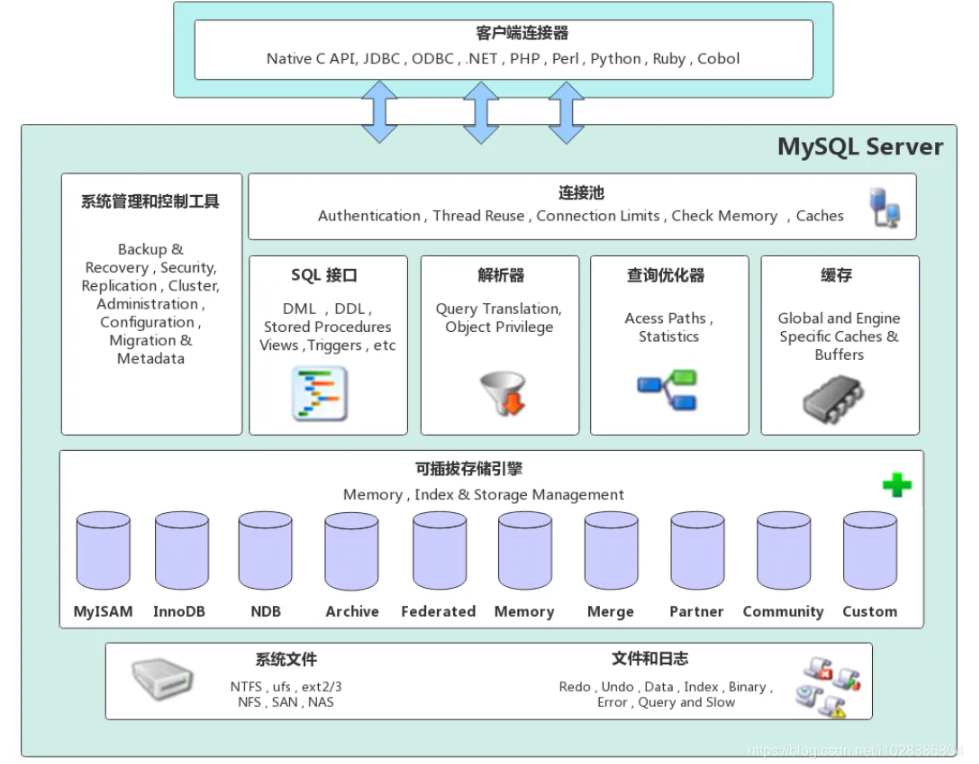

1、连接层

最上层是一些客户端和链接服务，包含本地sock 通信和大多数基于客户端/服务端工具实现的类似于TCP/IP的通信。主要完成一些类似于连接处理、授权认证、及相关的安全方案。在该层上引入了线程池的概念，为通过认证安全接入的客户端提供线程。同样在该层上可以实现基于SSL的安全链接。服务器也会为安全接入的每个客户端验证它所具有的操作权限。

2、服务层

第二层架构主要完成大多数的核心服务功能，如 SQL 接口，并完成缓存的查询，SQL 的分析和优化，部分内置函数的执行。所有跨存储引擎的功能也在这一层实现，如过程、函数等。在该层，服务器会解析查询并创建相应的内部解析树，并对其完成相应的优化如确定表的查询的顺序，是否利用索引等，最后生成相应的执行操作。如果是 select 语句，服务器还会查询内部的缓存，如果缓存空间足够大，这样在解决大量读操作的环境中能够很好的提升系统的性能。

3、引擎层

存储引擎层， 存储引擎真正的负责了 MySQL 中数据的存储和提取，服务器通过 API 和存储引擎进行通信。不同的存储引擎具有不同的功能，这样我们可以根据自己的需要，来选取合适的存储引擎。数据库中的索引是在存储引擎层实现的。

4、存储层

数据存储层， 主要是将数据(如: redolog、undolog、数据、索引、二进制日志、错误日志、查询日志、慢查询日志等)存储在文件系统之上，并完成与存储引擎的交互。

和其他数据库相比，MySQL有点与众不同，它的架构可以在多种不同场景中应用并发挥良好作用。主要体现在存储引擎上，插件式的存储引擎架构，将查询处理和其他的系统任务以及数据的存储提取分离。这种架构可以根据业务的需求和实际需要选择合适的存储引擎。

## 存储引擎介绍

存储引擎是 mysql 数据库的核心，我们需要在合适的场景选择合适的存储引擎

存储引擎就是存储数据、建立索引、**更新**/查询数据等技术的实现方式 。

- **存储引擎是基于表的**，而不是基于库的，所以存储引擎也可被称为**表类型**。
- 建表时如果没有指定，将**自动选择默认的存储引擎**

---
建表时指定存储引擎

```sql
CREATE TABLE 表名(
  ......
) ENGINE = 引擎名;
```

查询建表语句查看某张表的存储引擎

```sql
show create table account;
```


查询当前数据库支持的存储引擎

```sql
show engines;
```

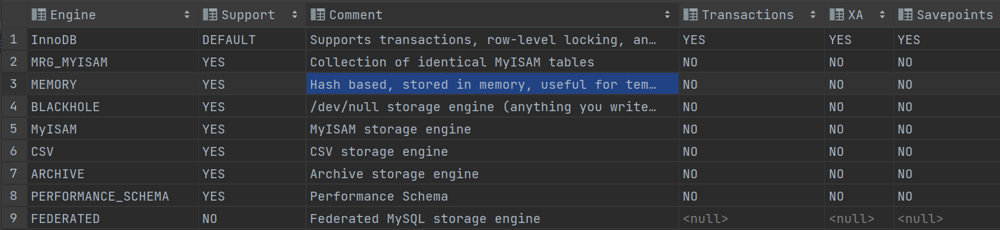

## 重点存储引擎

### InnoDB

MySQL 5.5 之后的**默认**存储引擎，是一种兼顾**高可靠性和高性能**的通用存储引擎

特点：

- DML 操作（增删改）遵循 ACID 模型，支持事务
- 支持行级锁，提高并发访问性能；
- 支持外键 FOREIGN KEY 约束，保证数据的完整性和正确性

#### ibd 文件 

`xxx.ibd`：xxx 代表的是表名，innoDB 引擎的每张表都会对应这样一个表空间文件，存储该表的**表结构**（frm-早期的 、sdi-新版的）、**数据和索引**

参数 `innodb_file_per_table` 如果开启了（8.0 默认开启），代表对于 InnoDB 引擎的表，每一张表都对应一个 ibd 文件，否则共用同一个 ibd 文件

```sql
# 查看是否开启变量
show variables like 'innodb_file_per_table'; 
```

#### 逻辑存储结构

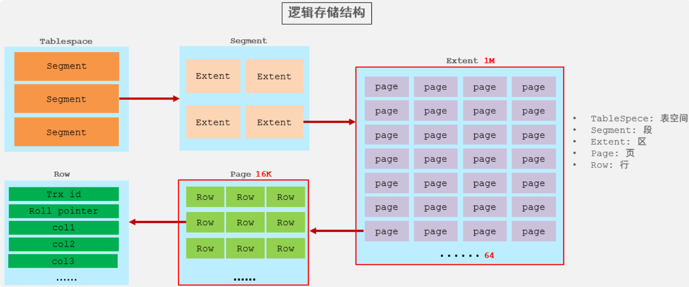

- 表空间 : InnoDB 存储引擎逻辑结构的最高层，ibd 文件其实就是表空间文件，在表空间中可以 包含多个 Segment 段。 
- 段 : 表空间是由各个段组成的， 常见的段有数据段、索引段、回滚段等。InnoDB 中对于段的管理，都是引擎自身完成，不需要人为对其控制，一个段中包含多个区。 
- 区 : 区是表空间的单元结构，每个区的大小为 1M。 默认情况下， InnoDB 存储引擎页大小为 16K， 即一个区中一共有 64 个连续的页。 
- 页 : 页是组成区的最小单元，页也是 InnoDB 存储引擎磁盘管理的最小单元，每个页的大小默 认为 16KB。为了保证页的连续性，InnoDB 存储引擎每次从磁盘申请 4-5 个区。 
- 行 : InnoDB 存储引擎是面向行的，也就是说数据是按行进行存放的，在每一行中除了定义表时 所指定的字段以外，还包含两个隐藏字段(后面会详细介绍)。

### MyISAM 

MyISAM 是 MySQL 早期（5.5之前）的默认存储引擎

特点：

- 不支持事务、外键 
- 支持表锁，不支持行锁 
- 访问速度快 

文件：

- `xxx.sdi`：存储表结构信息 
- `xxx.MYD`: 存储数据 
- `xxx.MYI`: 存储索引

### Memory 

Memory 引擎的表数据时存储在**内存**中的，由于受到硬件问题、或断电问题的影响，只能将这些表作为临时表或缓存使用

文件：`xxx.sdi`，存储表结构信息

### 对比

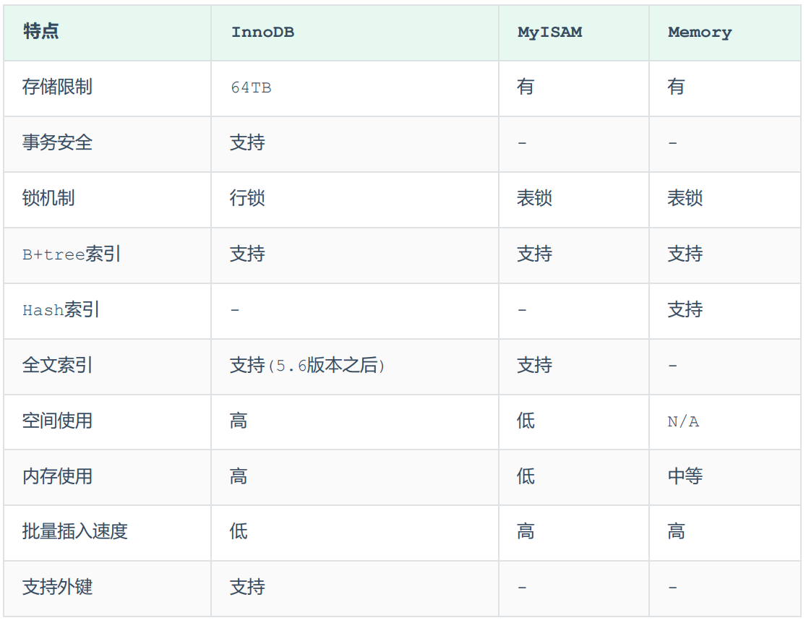

### 存储引擎选择

在选择存储引擎时，应该根据应用系统的特点选择合适的存储引擎。对于复杂的应用系统，还可以根据 实际情况选择多种存储引擎进行组合。 

- `InnoDB`：如果应用对事务的完整性有比较高的要求，在并发条件下要求数据的一致性，数据操作除了插入和查询之外，还包含很多的更新、删除操作

- `MyISAM`： 如果应用是以读操作和插入操作为主，只有很少的更新和删除操作，并且对事务的完整性、并发性要求不是很高

- `MEMORY`：将所有数据保存在内存中，访问速度快，通常用于临时表及缓存。缺陷就是对表的大小有限制，太大的表无法缓存在内存中，而且无法保障数据的安全性。

> 两个 nosql 数据库：MongoDB 取代 MyISAM，Redis 取代 MEMORY


# ---------- SQL 性能分析

### sql 执行频率

> `show [session|global] status` 命令可以提供服务器状态信息

通过如下指令，可以查看当前数据库的 INSERT、UPDATE、DELETE、SELECT 的访问频次：

```sql
SHOW STATUS LIKE 'Com_______'; -- 七个下划线
```

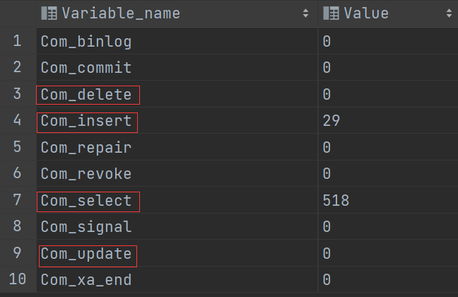

通过上述指令，我们可以查看到当前数据库到底是以查询为主，还是以增删改为主，从而为数据库优化提供参考依据。 

- 如果是以**增删改**为主，我们可以考虑不对其进行索引的优化。 
- 如果是以**查询**为主，那么就要考虑对数据库的索引进行优化了

### 慢查询日志

> linux看教程pdf，这里用的windows（[(9条消息) MySql慢查询日志设置_0店小二的博客-CSDN博客_mysql慢日志设置](https://blog.csdn.net/ljb825802164/article/details/106599827)）

慢查询日志记录了所有**执行时间超过指定参数**（`long_query_time`，单位：秒，默认10秒）的所有 SQL语句的日志

查询慢查询日志相关参数：

```sql
-- 查看慢查询日志是否开启
show variables like 'slow_query_log';

-- 开启慢日志
set global|session slow_query_log=1; 
-- 查看慢日志的时间
show global variables like 'long_query_time';

-- 设置慢查询时间，默认10s
set global|session long_query_time=5; 
```

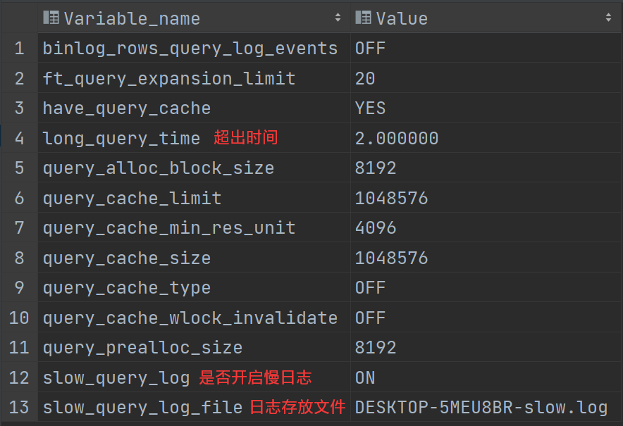

### profile 详情

通过 `show profiles` 能够在做 **SQL 优化**时帮助我们了解时间都耗费到哪里去了

```sql
-- 查看和 profiles相关的变量
show variables like '%profiling%';
```

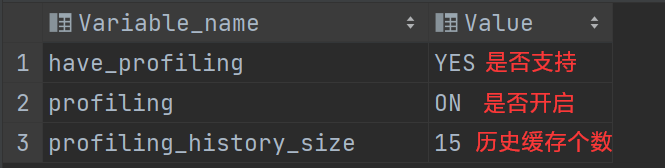

```sql
-- 查看当前MySQL是否支持profile操作
SELECT @@have_profiling; 
-- 查看是否开启
SELECT @@profiling ; 
-- 开启profile
SET profiling = 1; 

-- 随便执行点语句

-- 查看每一条SQL的耗时基本情况
show profiles;
-- 查看指定query_id的SQL语句各个阶段的耗时情况
show profile for query [query_id];
-- 查看指定query_id的SQL语句CPU的使用情况
show profile cpu for query [query_id];
```

### explain（常用）

`EXPLAIN` 或者 `DESC` 命令获取 MySQL 如何执行 SELECT 语句的信息，包括在 SELECT 语句执行过程中表如何连接和连接的顺序

```sql
-- 直接在select语句之前加上关键字 explain / desc
EXPLAIN SELECT... ;
```

Explain 执行计划中各个字段的含义：

- id：select 查询的序列号，表示查询中执行 select 子句或者是操作表的顺序 (id 相同，执行顺序从上到下；id 不同，值越大，越先执行)。
- select_type：表示 SELECT 的类型，常见的取值有 SIMPLE（简单表，即不使用表连接 或者子查询）、PRIMARY（主查询，即外层的查询）、 UNION（UNION 中的第二个或者后面的查询语句）、 SUBQUERY（SELECT/WHERE 之后包含了子查询）等
- type：表示连接类型，性能由好到差的连接类型为 NULL、system、const、 eq_ref、ref、range、 index、all
- **possible_key**：显示可能应用在这张表上的索引，一个或多个。
- **key**： 实际使用的索引，如果为 NULL，则没有使用索引
- **key_len**：表示索引中使用的字节数，该值为索引字段最大可能长度，并非实际使用长度，在不损失精确性的前提下， 长度越短越好 。
- rows：MySQL 认为必须要执行查询的行数，在 innodb 引擎的表中，是一个估计值， 可能并不总是准确的。
- filtered：表示返回结果的行数占需读取行数的百分比，filtered 的值越大越好

# ---------- 索引

## 索引概述

索引（index）是帮助 MySQL 高效获取数据的**数据结构 (有序)**。在数据之外，数据库系统还维护着满足特定查找算法的数据结构，这些数据结构以某种方式引用（指向）数据， 这样就可以在这些数据结构上实现高级查找算法，这种数据结构就是索引

优势：

- 提高数据**检索**的效率，降低数据库的 IO 成本。
- 通过索引列对数据进行**排序**，降低数据排序的成本，降低 CPU 的消耗。 

劣势：

- 索引列也是要**占用空间**的（不是个问题，磁盘的空间很大）
- 降低更新表的速度

> 执行 SQL 语句为 `select * from user where age = 45;`
> 
> - 无索引情况：需要从第一行开始扫描，一直扫描到最后一行，我们称之为**全表扫描**，性能很低
> - 有索引情况：假设索引结构是二叉树，会对 age 这个字段建立一个二叉树的索引结构
> 	- 只需要扫描三次就可以找到数据了，极大的提高的查询的效率
> 
> 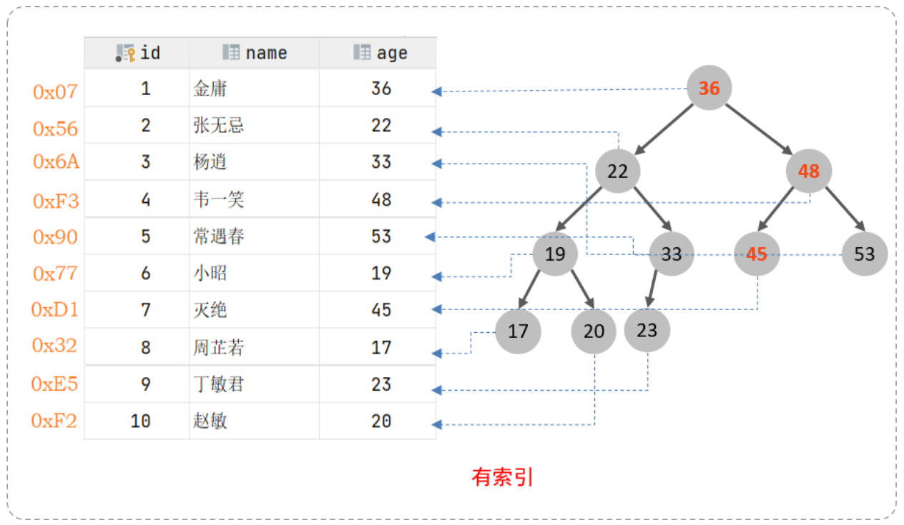
> 
> 注意：只是一个示意图，并不是索引的真实结构

## 索引结构

### 概述

MySQL 的索引是在**存储引擎层实现**的（不同的存储引擎有不同的索引结构），主要包含以下几种：

- `B+Tree`：最常见的索引类型，大部分引擎都支持 B+ 树索引 
- `Hash`：底层数据结构是用哈希表实现的, 只有精确匹配索引列的查询才有效, 不 支持范围查询 
- `R-tree`：空间索引，MyISAM 引擎的一个特殊索引类型，主要用于地理空间数据类 型，通常使用较少 
- `Full-text`：全文索引，一种通过建立倒排索引,快速匹配文档的方式。类似于 Lucene,Solr,ES

不同的存储引擎对于索引结构的支持情况：

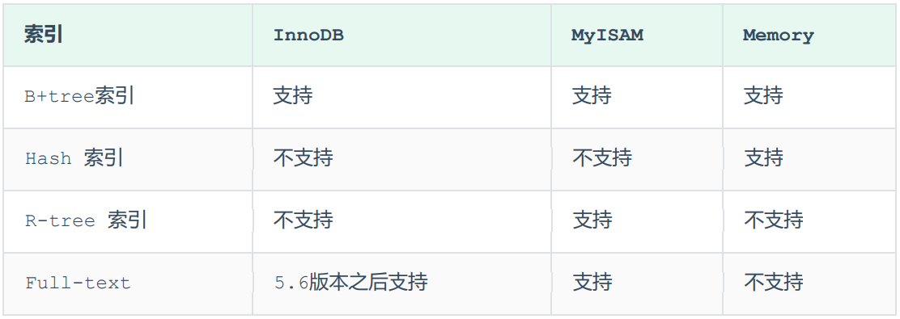

> 注意： 我们平常（面试）所说的索引，如果没有特别指明，都是指 **B+树**结构组织的索引

### BSTree & RBTree

1）为什么不能选择【二叉搜索树】作为索引结构？

- 顺序插入时，会形成一个链表，查询性能大大降低
- 二叉树，在大数据量的情况下，层级较深，检索速度慢

2）为什么不能选择【红黑树】作为索引结构？

- 二叉树，在大数据量的情况下，层级较深，检索速度慢

### Hash 

MySQL 中除了支持 B+Tree 索引，还支持一种 Hash 索引 

哈希索引就是采用一定的 hash 算法，将键值换算成新的 hash 值，映射到对应的槽位上，然后存储在 hash 表中

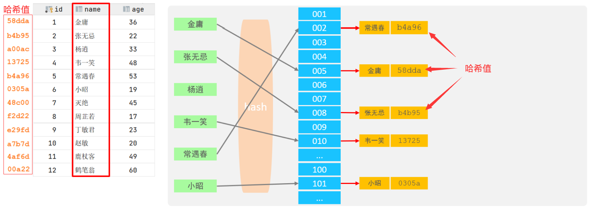

如果两个(或多个)键值，映射到一个相同的槽位上，他们就产生了 hash 冲突（也称为 hash 碰撞），可以通过链表来解决


Hash 索引特点：

- 只能用于对等比较（`=，in`），不支持范围查询（`between，>，< ，...`） 
- 无法利用索引完成排序操作 
- **查询效率高**，通常(不存在 hash 冲突的情况)只需要一次检索就可以了，效率通常要高于 B+tree 索引

> 存储引擎支持：在 MySQL 中，支持 hash 索引的是 Memory 存储引擎。 而 InnoDB 中具有自适应 hash 功能，hash 索引是 InnoDB 存储引擎根据 B+Tree 索引在指定条件下自动构建的

### B+Tree

B+Tree 是 B-Tree 的变种

> 以一颗 4 阶 b+tree 为例

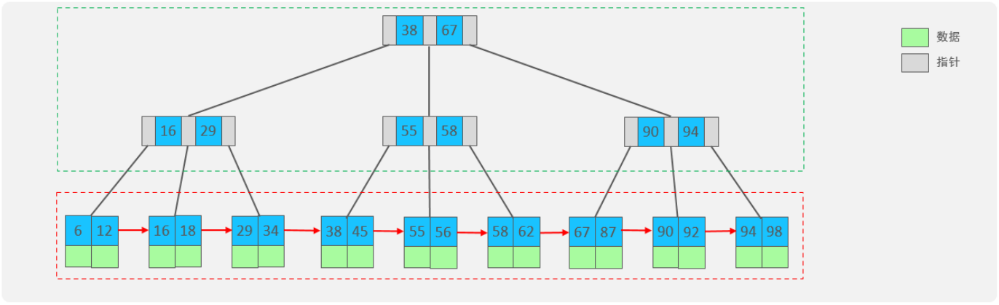

我们可以看到两部分： 

- 绿框是索引部分，仅仅起到索引数据的作用，不存储数据
- 红框是数据存储部分，在其叶子节点中要存储具体的数据

> 我们可以通过一个数据结构可视化的网站演示： https://www.cs.usfca.edu/~galles/visualization/BPlusTree.html

B+Tree 和 B-Tree 的区别： 

- 所有的数据都会出现在叶子节点，非叶子节点仅仅起到索引数据作用
- 叶子节点形成一个单向链表 

MySQL 索引数据结构在原 B+Tree 的基础上，增加一个指向相邻叶子节点的链表指针，就形成了带有顺序指针的 B+Tree，**提高区间访问的性能，利于排序**

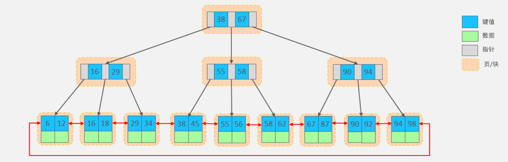

为什么 InnoDB 存储引擎选择使用 B+tree 索引结构? 

- 相对于二叉树（包括红黑树），层级更少，搜索效率高
- 对于 B-tree，无论是叶子节点还是非叶子节点，都会保存数据，这样导致一页中存储的键值减少，指针跟着减少，要同样保存大量数据，只能增加树的高度，导致性能降低
- 相对 Hash 索引，B+tree 支持范围匹配及排序操作

## 索引分类

### 按字段特性分类

在 MySQL 数据库，将索引的具体类型主要分为以下几类：主键索引、唯一索引、常规索引、全文索引

| 分类   | 含义                     | 特点                | 关键字         |
| ---- | ---------------------- | ----------------- | ----------- |
| 主键索引 | 列值唯一且非空值               | 建表时**默认**创建，只能有一个 | PRIMARY KEY |
| 唯一索引 | 列值唯一                   | 可以有多个             | UNIQUE      |
| 常规索引 | 快速定位特定数据               | 可以有多个             |             |
| 全文索引 | 用于查找文本中的关键词，而不是比较索引中的值 | 可以有多个             | FULLTEXT    |

### 按存储形式分类

在 InnoDB 存储引擎中，根据索引的存储形式，分为：

- *聚集索引*：将数据存储与索引放到了一块，索引结构的叶子节点保存了**行数据**
	- 特点：必须有且唯一
	- 选取规则：
		- 如果存在主键，**主键索引**就是聚集索引
		- 如果不存在主键，将使用第一个唯一（UNIQUE）索引作为聚集索引
		- 如果表没有主键，或没有合适的唯一索引，则 InnoDB 会自动生成一个 rowid 作为隐藏的聚集索引

- *非聚集索引*（二级索引）：将数据与索引分开存储，索引结构的叶子节点关联的是**对应的主键**
	- 特点：可以有多个

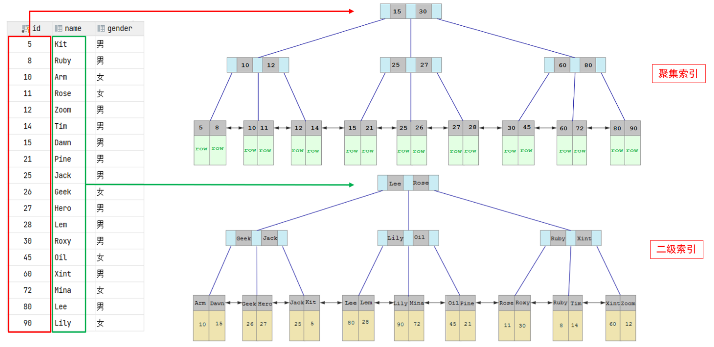

回表查询：先到二级索引中查找数据，找到主键值，然后再到聚集索引中根据主键值，获取数据的方式

> 具体分析 `select * from user where name='Arm';` 的执行：
> 
> - 先根据 `name='Arm'` 到 name 字段的二级索引中进行匹配查找。在二级索引中查找到 Arm 对应的主键值 10 
> - 根据主键值 10，到聚集索引中查找 10 对应的记录，拿到这一行的数据
> 
> 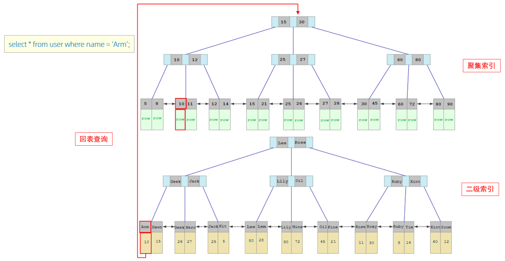


> 思考题： InnoDB主键索引的B+tree高度为多高呢？
>
> 
>
> 假设：
>
> - 一行数据大小为 1k
> - 一页中可以存储 16 行这样的数据，即一页 16KB
> - InnoDB 的指针占用 6 个字节的空间
> - 主键使用 bigint，占用字节数为 8
>
> 设一页中有 n 个 key，则有 n+1 个指针（看图）
>
> 在高度为2的情况下：`n * 8 + (n + 1) * 6 = 16 * 1024` , 算出 n 约为 1170，则指针有 1171 个，能指向 1171 页，一页 16 条，1171 页有 1171 * 16 = 18736 条记录，也就是说，如果树的高度为 2，则可以存储 18000 多条记录。
>
> 同理，高度为 3，能存 1171 * 1171 * 16 = 21939856 条记录
>
> 2200w 多万条的数据也只需要高度为 3 的 B+树（当然有很多棵树）

### 按索引字段个数分类

1. 单列索引：建立在单个列上的索引被称为单列索引。
2. 联合索引：建立在多个列上的索引被称为联合索引，又叫复合索引、组合索引。在 MySQL 中使用联合索引时要遵循**最左前缀匹配原则**

联合索引实际只会创建一颗 b+树，且优先保证左边字段的有序

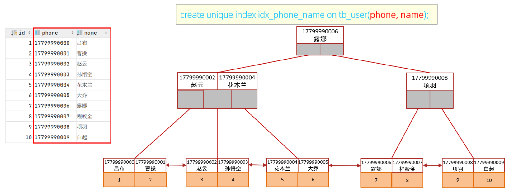

## 创建索引

查看索引

```sql
SHOW INDEX FROM table_name;
```

删除索引

```sql
DROP INDEX index_name ON table_name;
```

### 第一种方式：使用Alter创建索引

添加主键索引

```sql
ALTER TABLE tbl_name ADD PRIMARY KEY (col_list);
该语句添加一个主键，这意味着索引值必须是唯一的，且不能为NULL
```

添加唯一索引

```sql
ALTER TABLE tbl_name ADD UNIQUE index_name (col_list);
这条语句创建索引的值必须是唯一的。
```

添加普通索引

```sql
ALTER TABLE tbl_name ADD INDEX index_name (col_list);
添加普通索引，索引值可出现多次
```

添加全文索引

```sql
ALTER TABLE tbl_name ADD FULLTEXT index_name (col_list);
```

添加多列索引

```sql
ALTER TABLE 表名 ADD UNIQUE (col1, col2, ..., )
```

### 第二种方式：使用 Create 创建索引

创建索引

```sql
CREATE [ UNIQUE | FULLTEXT ] INDEX 索引名 ON 表名 (字段1,字段2,...);
```

> INDEX前：
> 
> - UNIQUE：唯一索引
> - FULLTEXT：全文索引
> - 不加就是普通索引
>
> 索引命名标准：idx_表名_字段名

---

操作实例：

```sql
-- name字段为姓名字段，该字段的值可能会重复，为该字段创建常规索引
CREATE INDEX idx_user_name ON tb_user(name);
-- phone手机号字段的值，是非空，且唯一的，为该字段创建唯一索引
CREATE UNIQUE INDEX idx_user_phone ON tb_user(phone);
-- 为 profession、age、status 创建联合索引
CREATE INDEX idx_user_pro_age_sta ON tb_user(profession,age,status);
-- 为email建立合适的索引来提升查询效率
CREATE INDEX idx_email ON tb_user(email);

SHOW INDEX FROM table_name;
```


### 两种创建索引方式的区别

- Alter 可以省略索引名，如果省略索引名，数据库会默认根据第一个索引列赋予一个名称。Create 必须指定索引名称
- Create 不能用于创建 Primary key 索引
- Alter 允许一条语句同时创建多个索引，Create 一次只能创建一个索引

## 索引使用

### 索引失效情况

#### 最左前缀法则

前提：是**联合索引**，就要遵守最左前缀法则

*最左前缀法则*：查询优先从联合索引的**最左列开始**，并且如果跳跃某一列，索引将会**部分失效**（后面的字段索引失效）

- 条件（**where**）编写的先后顺序任意（order by、group by 之类的就不行）

> 为什么要遵守最左前缀法则呢？
> 
> - 因为联合索引在构造 B+树的时候，会先按照左边的 key 进行排序，左边的 key 相同时再依次按照右边的 key 排序，所以右边 key 的有序是基于左边的

---

> 以 tb_user 表为例，为profession、age、status创建联合索引

```sql
-- 为profession、age、status创建联合索引
CREATE INDEX idx_user_pro_age_sta ON tb_user(profession,age,status);
```

下面的测试中，我们发现只要联合索引最左边的字段 profession 存在（和 where 字句中的顺序无关），索引就会生效，

> 而且可以推测出 profession 字段索引长度为 36、age 字段索引长度为 2、status 字段索引长度为 4

```sql
explain select * from tb_user where profession = '软件工程' and age = 31 and status = '0';
-- key_len:42

explain select * from tb_user where age = 31 and status = '0' and profession = '软件工程';
-- key_len:42

explain select * from tb_user where profession = '软件工程' and age = 31;
-- key_len:38

explain select * from tb_user where profession = '软件工程'; 
-- key_len:36
```

这两组测试索引不生效，因为联合索引最左边的字段 profession 不存在

```sql
explain select * from tb_user where age = 31 and status = '0';
explain select * from tb_user where status = '0';
```

存在 profession 字段，最左边的列是存在的，索引满足最左前缀法则的基本条件。但是查询时，跳过了 age 这个列，所以后面的列索引是不会使用的，也就是索引部分生效

```sql
explain select * from tb_user where profession = '软件工程' and status = '0';
-- key_len:36
```

#### 范围查询 

联合索引中，某个索引字段出现范围查询（`> , <`），其右侧的列索引失效

```sql
explain select * from tb_user where profession = '软件工程' and age > 30 and status= '0';
-- key_len:38
-- status字段没有走索引
```

在业务允许的情况下，**尽可能的使用**类似于 `>=` 或 `<=` 这类的范围查询

```sql
explain select * from tb_user where profession = '软件工程' and age >= 30 and status= '0';
-- key_len:40
-- 所有字段都走了索引
```

#### 索引列运算

在索引列上进行**运算**操作，索引将失效

```sql
explain select * from tb_user where substring(phone,10,2) = '15'; -- 失效
```

#### 字符串不加引号

> 类型不一致

字符串类型字段使用时，**不加引号**，数据库存在隐式类型转换，索引将失效

```sql
explain select * from tb_user where phone = '17799990015';
explain select * from tb_user where phone = 17799990015; -- 失效
```

#### 头部模糊查询 

头部模糊匹配，索引失效（尾部模糊匹配不会）

```sql
explain select * from tb_user where profession like '软件%'; -- key_len=36
explain select * from tb_user where profession like '%工程'; -- 索引失效
explain select * from tb_user where profession like '%工%'; -- 索引失效
```

#### or 连接条件 

or 连接的条件，左右两侧字段都有索引时，索引才会生效

```sql
-- age没有索引，id字段的主键索引失效
explain select * from tb_user where id = 10 or age = 23; 
```

#### 数据分布影响 

如果 MySQL 评估走全表扫描比索引更快，则不使用索引

```sql
-- 整张表都满足，不走索引
select * from tb_user where phone >= '17799990000'; 
-- 表中部分满足，走索引
select * from tb_user where phone >= '17799990020';
```

### SQL 提示

> 在 tb_user 表中分别为 profession 字段创建 单列索引 和 联合索引
> 
> ```sql
> create index idx_user_pro on tb_user(profession); -- 单列索引
> CREATE INDEX idx_user_pro_age_sta ON tb_user(profession,age,status); -- 联合索引
> ```
> 
> 测试下面的语句，`possible_keys` 中 `idx_user_pro_age_sta`、`idx_user_pro` 这两个索引都可能用到，最终 MySQL 选择了 `idx_user_pro_age_sta` 索引，这是 MySQL 自动选择的结果
> 
> ```sql
> explain select * from tb_user where profession ='软件工程';
> ```
> 
> 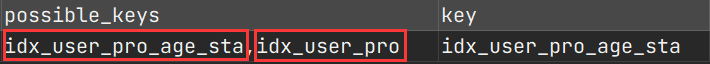

SQL 提示：是优化数据库的一个重要手段，简单来说，就是在 SQL 语句中**加入一些人为的提示**来达到优化操作的目的

- `use`：建议使用某个索引完成此次查询（只是建议，mysql 内部还会再次进行评估）
- `ignore`： 忽略指定的索引
- `force`： 强制使用索引

```sql
explain select * from tb_user [use|ignore|force] index(idx_user_pro) where profession = '软件工程';
```

### 前缀索引

> 当字段类型为字符串（varchar，text，longtext 等）时，有时候需要索引很长的字符串，这会让**索引变得很大**，查询时，浪费大量的磁盘 IO， 影响查询效率。

可以**只将字符串的一部分前缀，建立索引**，这样可以大大节约索引空间，从而提高索引效率

```sql
-- 建立前缀索引
create index idx_xxxx on [table_name]([column](n)) ;

-- 为tb_user表的email字段，建立长度为5的前缀索引
create index idx_email_5 on tb_user(email(5));
```

前缀长度的选择：可以根据索引的选择性来决定

- *选择性*：不重复的索引值的基数（集合的元素个数）和数据表的记录总数的**比值**， 索引选择性越高则查询效率越高

- 唯一索引的选择性是 1，性能是最好的

```sql
select count(distinct email) / count(*) from tb_user; -- 1
select count(distinct substring(email,1,5)) / count(*) from tb_user; -- 0.95
```

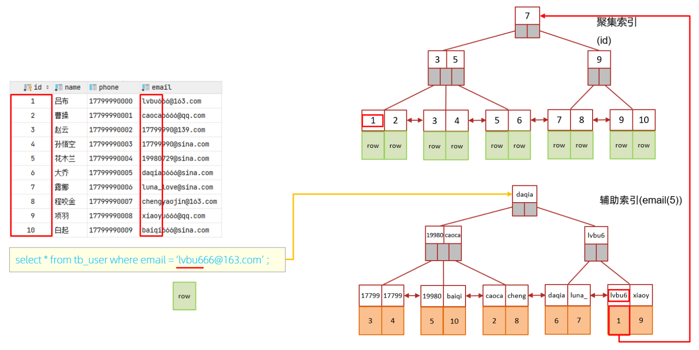


### 覆盖索引

覆盖索引：查询使用了索引，并且返回的列在该索引中已经全部能够找到

**尽量使用覆盖索引**，减少 `select *`，因为很容易造成**回表查询**（除非是根据主键查询，此时只会扫描聚集索引）

---

> 在 tb_user 表中有一个联合索引 `idx_user_pro_age_sta`，该索引关联了三个字段 profession、age、status

```sql
-- extra=Using index
explain select id, profession from tb_user where profession = '软件工程' and age = 31 and status = '0' ;

-- extra=Using index
explain select id,profession,age, status from tb_user where profession = '软件工程' and age = 31 and status = '0' ;

-- extra=NULL，name需要回表查询
explain select id,profession,age, status, name from tb_user where profession = '软件工程' and age = 31 and status ='0';

-- extra=NULL
explain select * from tb_user where profession = '软件工程' and age = 31 and status = '0';
```

- 联合索引叶子节点下面挂的是这一行的主键 id。 所以当我们查询返回的数据在 id、profession、age、status 之中，则直接走二级索引返回数据，不需要回表查询

> 不同的 mysql 版本对于 extra 的展示不同，我这里是 Using index 和 null

| Extra（额外的）               | 含义                     |
| ------------------------ | ---------------------- |
| Using where; Using Index | 查找使用了索引，需要的数据都在索引列中能找到 |
| Using index condition    | 查找使用了索引，但是需要回表查询数据     |

> 思考题： 
>
> 一张表有四个字段 (id, username, password, status)，由于数据量大，需要对以下 SQL 语句进行优化，该如何进行才是最优方案？
>
> ```sql
> select id,username,password from tb_user where username = 'itcast'; 
> ```
>
> 答案：针对于 username 和 password 建立联合索引，这样可以避免上述的 SQL 语句在查询的过程中出现回表查询
>
> ```sql
> create index idx_user_name_pass on tb_user(username,password); 
> ```

#### 联合索引的情况

在业务场景中，如果存在多个查询条件，考虑针对于查询字段建立索引时，建议**建立联合索引， 而非单列索引**

---

> 演示为什么要用联合索引？

```sql
explain select id,phone,name from tb_user where phone='17799990002' and name='赵云'; 
```

- 在 tb_user 表中，假如 phone、name 上都是有单列索引的。最终 mysql 只会选择一个索引，此时是会回表查询的

- 假如 phone 和 name 字段有联合索引，查询时走了联合索引，在联合索引中包含 phone、name 的信息，在叶子节点下挂的是对应的主键 id，所以查询是无需回表查询


## 索引设计原则

- *选择合适的字段*：
	- 数据量大、查询频繁
	- 条件 where、排序 order by、分组 group by 
	- 尽量选择**区分度高**的列：尽量建立唯一索引，区分度越高，使用索引的效率越高 
	- 尽量**不为 NULL** 的字段：如果索引列不能存储 NULL 值，请在创建表时使用 NOT NULL 约束它。当优化器知道每列是否包含 NULL 值时，它可以更好地确定哪个索引最有效地用于查询
- *前缀索引*：如果是字符串类型的字段，字段的长度较长，可以针对于字段的特点，建立前缀索引
- *尽量使用联合索引*，减少单列索引：可以**覆盖索引**，节省存储空间
- *要控制索引的数量*：索引并不是多多益善，索引越多，**维护索引结构**的代价也就越大，会影响 删改的效率

# ---------- SQL 优化

## 插入数据

### insert

如果需要一次性往表中插入多条记录，可以从以下三个方面进行优化

```sql
insert into tb_test values(1,'tom');
insert into tb_test values(2,'cat');
insert into tb_test values(3,'jerry');
```

1）批量插入

```sql
Insert into tb_test values(1,'Tom'),(2,'Cat'),(3,'Jerry');
```

2）手动控制事务

- 自动提交每执行完一句都会 commit

```sql
start transaction;
--- 插入
commit;
```

3）**主键顺序插入**，性能要高于乱序插入（原因后续讲解 #todo

### 大批量插入数据

如果一次性需要插入**大批量数据** (几百万)，使用 insert 语句插入性能较低，此时可以使用 MySQL 数据库提供的 load 指令进行插入


1）创建表结构

2）设置参数

```sql
-- 客户端连接服务端时，加上参数 -–local-infile
mysql –-local-infile -u root -p

-- 设置全局参数local_infile为1，开启从本地加载文件导入数据的开关
set global local_infile = 1;
```

3）执行 load 加载数据

```sql
-- 执行load指令将准备好的数据，加载到表结构中
-- fields terminated by ','：字段采用','分割
-- lines terminated by '\n'：每一行采用换行符分割
load data local infile '/root/sql1.log' into table tb_user fields terminated by ',' lines terminated by '\n' ;
```

## 主键优化

在 InnoDB 存储引擎中，表数据都是根据主键顺序组织存放的，这种存储方式的表称为索引组织表，行数据，都是存储在聚集索引的叶子节点上的

主键设计原则

- 满足业务需求的情况下，尽量降低主键的长度（二级索引可以少存储一些）
- 插入数据时，尽量选择**顺序插入**，选择使用 AUTO_INCREMENT **自增主键**（页分裂）
- 业务操作时，避免对主键的修改（重新维护顺序，聚集、二级索引）

> 为什么尽量不要使用 UUID 做主键或者是其他自然主键，如身份证号？
> 
> - 因为每次新插入都是无序的，而且长度较长）
>  
> 分布式系统咋整？

## order by 优化

MySQL 的排序，有两种方式：

- *Using filesort*：通过表的索引或全表扫描，读取满足条件的数据行，然后在排序缓冲区 sortbuffer 中完成排序操作，所有不是通过索引直接返回排序结果的排序都叫 FileSort 排序
- *Using index*：通过**有序索引顺序扫描直接返回有序数据**，这种情况即为 using index，不需要额外排序，操作效率高

Using index 的性能高，在优化排序操作时**尽量要优化为 Using index**

- 尽量使用覆盖索引
- 多字段排序，也遵循最左前缀法则（order 字段的顺序要和联合索引中的一致，且中间不能有跳过）
- 多字段排序，一个升序一个降序，此时需要注意联合索引在创建时的规则（ASC/DESC）
- 如果不可避免的出现 filesort，大数据量排序时，可以适当增大排序缓冲区大小 `sort_buffer_size` (默认 256k)
	- 缓冲区满了就会在磁盘文件中排序，效率低

---

> tb_user 表中，有一个 age 和 phone 字段的联合索引（先 age 后 phone）

```sql
-- 覆盖索引
create index idx_user_age_phone_aa on tb_user(age,phone);
-- Using index
explain select id,age,phone from tb_user order by age, phone;
-- 支持降序索引
explain select id,age,phone from tb_user order by phone,age;

-- 没满足最左前缀法则
-- Using filesort
explain select id,age,phone from tb_user order by age desc , phone desc;

-- 一个升序，一个降序 
create index idx_user_age_phone_ad on tb_user(age asc ,phone desc);
-- Using index
explain select id,age,phone from tb_user order by age asc , phone desc;
```

> 升序/降序联合索引结构图示


## group by 优化

- 在分组操作时，可以通过**索引**来提高效率
- 分组操作时，联合索引的使用也是**满足最左前缀法则**（order 字段的顺序要和联合索引的一致，且中间不能有跳过）

## limit 优化

> #todo 没搞懂

在数据量比较大时，如果进行 limit 分页查询，在查询时，越往后，分页查询效率越低

- 例如执行 `limit 2000000, 10` ，此时需要 MySQL 排序前 2000010 记录，扫描到 2000010行数据，返回 2000000 - 2000010 的记录，其他记录丢弃，查询排序的代价非常大

> #Bo 即便是 id 有序，找第 2000000 个 id 也得一个个扫描过去。聚集索引只是维护了 id 值，它也不知道第 2000000 个 id 值是多少


优化思路：覆盖索引+子查询

> 想办法不让他把前 2000000 万数据读出来

```sql
EXPLAIN SELECT * FROM tb_sku ORDER BY id LIMIT 5000000, 10; -- 时间: 16.925s


EXPLAIN SELECT
	t.* 
FROM
	tb_sku t,
	( SELECT id FROM tb_sku ORDER BY id LIMIT 5000000, 10 ) a 
WHERE
	t.id = a.id; -- 时间: 11.467s
```

## count 优化

`count()` 是一个聚合函数，对于返回的结果集，一行行地判断，如果 count 函数的参数不是NULL，累计值就加 1，否则不加，最后返回累计值


按照效率排序的话，`count(字段) < count(主键 id) < count(1) ≈ count(*)`，所以尽量使用 `count(*)`

## update 更新

InnoDB 的**行锁是针对索引加的锁**，不是针对记录加的锁，并且该**索引不能失效**，否则会从**行锁升级为表锁** 

---

```sql
-- 会锁定id为1这一行的数据，然后事务提交之后，行锁释放
update course set name = 'javaEE' where id = 1;

-- name字段没有索引，行锁升级为表锁
update course set name = 'SpringBoot' where name = 'PHP' ;
```

# ---------- 视图/存储过程/触发器

## 视图

视图（View）是一种虚拟存在的表。视图中的数据并不在数据库中实际存在，行和列数据来自定义视图的查询中使用的表，并且是在使用视图时动态生成的

通俗的讲，视图**只保存了查询的 SQL 逻辑，不保存查询结果**。所以我们在创建视图的时候，主要的工作就落在创建这条 SQL 查询语句上

### 语法

```sql
-- 创建
CREATE [OR REPLACE] VIEW 视图名称[(列名列表)] AS DQL语句 [ WITH [ CASCADED | LOCAL ] CHECK OPTION ]

-- 删除
DROP VIEW [IF EXISTS] 视图名称 [,视图名称] ...

-- 修改视图
-- 方式一：
CREATE [OR REPLACE] VIEW 视图名称[(列名列表)] AS SELECT语句 [ WITH [ CASCADED | LOCAL ] CHECK OPTION ]
-- 方式二：
ALTER VIEW 视图名称[(列名列表)] AS DQL语句 [ WITH [ CASCADED | LOCAL ] CHECK OPTION ]

-- 查看创建视图的语句
SHOW CREATE VIEW 视图名称;

-- 查看视图数据
SELECT * FROM 视图名称 ...... ;
```

示例

```sql
-- 创建视图
create or replace view stu_v_1 as select id,name from student where id <= 10;

-- 查询视图
show create view stu_v_1;
select * from stu_v_1;
select * from stu_v_1 where id < 3;

-- 修改视图
create or replace view stu_v_1 as select id,name,no from student where id <= 10;
alter view stu_v_1 as select id,name from student where id <= 10;

-- 删除视图
drop view if exists stu_v_1;
```

通过视图来插入、更新数据，会影响到原表数据

```sql
create or replace view stu_v_1 as select id,name from student where id <= 10 ;

insert into stu_v_1 values(6,'Tom');
insert into stu_v_1 values(17,'Tom22');

-- 指定的条件为 id<=10, id为17的数据，是不符合条件的，所以没有查询出来，但是这条数据确实是已经成功的插入到了基表中
select * from stu_v_1;

-- 删除 id<=10 的记录
delete from stu_v_1;
```

### 检查选项

当使用 `WITH CHECK OPTION` 子句创建视图时，MySQL 会**通过视图检查正在更改的每个行**，以使其符合视图的定义

MySQL 允许基于另一个视图创建视图，它还会检查依赖视图中的规则以保持一致性。为了确定检查的范围，mysql 提供了两个选项： CASCADED 和 LOCAL，默认值为 CASCADED

1）CASCADED 级联

比如，v2 视图是基于 v1 视图的，如果在 v2 视图创建的时候指定了检查选项为 cascaded，但是 v1 视图创建时未指定检查选项。 则在执行检查时，不仅会检查 v2，还会**级联检查** v2 的关联视图 v1


2）LOCAL 本地

比如，v2 视图是基于 v1 视图的，如果在 v2 视图创建的时候指定了检查选项为 local ，但是 v1 视图创建时未指定检查选项。 则在执行检查时，**只会检查 v2**，不会检查 v2 的关联视图 v1


### 视图的更新

要使视图可更新，视图中的行与基础表中的行之间必须存在**一对一**的关系。如果视图包含以下任何一项，则该视图**不可更新**：

- 聚合函数或窗口函数（`SUM()`、 `MIN()`、 `MAX()`、 `COUNT()` 等）
- DISTINCT
- GROUP BY
- HAVING
- UNION 或者 UNION ALL

### 视图的作用

1）简单

视图不仅可以简化用户对数据的理解，也可以简化他们的操作。那些被**经常使用的查询可以被定义为视图**，从而使得用户不必为以后的操作每次指定全部的条件

2）安全

数据库可以授权，但不能授权到数据库特定行和特定的列上。通过视图用户只能查询和修改他们所能见到的数据

3）数据独立

视图可帮助用户屏蔽真实表结构变化带来的影响

---
案例：

1）为了保证数据库表的安全性，开发人员在操作 tb_user 表时，只能看到的用户的基本字段，屏蔽手机号和邮箱两个字段

```sql
create view tb_user_view as select id,name,profession,age,gender,status,createtime from tb_user;

select * from tb_user_view;
```

2）查询每个学生所选修的课程（三张表联查），这个功能在很多的业务中都有使用到，为了简化操作，定义一个视图

```sql
create view tb_stu_course_view as select s.name student_name , s.no student_no , c.name course_name from student s, student_course sc , course c where s.id = sc.studentid and sc.courseid = c.id;

select * from tb_stu_course_view;
```

## 存储过程

存储过程是事先经过编译并存储在数据库中的**一段 SQL 语句的集合**，调用存储过程可以简化应用开发人员的很多工作，减少数据在数据库和应用服务器之间的传输，对于提高数据处理的效率是有好处的。

存储过程思想上很简单，就是数据库 SQL 语言层面的代码封装与重用。

特点：

- *封装，复用*：可以把某一业务 SQL 封装在存储过程中，需要用到的时候直接调用即可
- *可以接收参数，也可以返回数据*：在存储过程中，可以传递参数，也可以接收返回值
- *减少网络交互，效率提升*：如果涉及到多条 SQL，每执行一次都是一次网络传输。 而如果封装在存储过程中，我们只需要网络交互一次可能就可以了

#todo

## 存储函数

#todo

## 触发器

#todo

# ---------- 锁

## 介绍

锁是计算机协调多个进程或线程**并发访问某一资源的机制**。

> 在数据库中，除传统的计算资源（CPU、RAM、I/O）的争用以外，数据也是一种供许多用户共享的资源。如何保证数据并发访问的一致性、有效性是所有数据库必须解决的一个问题，锁冲突也是影响数据库并发访问性能的一个重要因素。从这个角度来说，锁对数据库而言显得尤其重要，也更加复杂。

MySQL 中的锁，按照锁的粒度分，分为以下三类：

- *全局锁*：锁定数据库中的所有表
- *表级锁*：每次操作锁住整张表
- *行级锁*：每次操作锁住对应的行数据

## 全局锁

全局锁就是对整个数据库实例加锁，加锁后整个实例就处于**只读状态**

- 后续的 DML 语句，DDL 语句，已经更新操作的事务提交语句都将被**阻塞**
- DQL 可以执行

其典型的使用场景是做**全库的逻辑备份**，对所有的表进行锁定，从而获取一致性视图，保证数据的完整性


### 语法

```sql
-- 加全局锁
flush tables with read lock ;

-- 数据备份
mysqldump -uroot –p1234 itcast > itcast.sql -- windows命令

-- 释放全局锁
unlock tables ;
```

### 特点

数据库中加全局锁，是一个比较重的操作，存在以下问题：

- 如果在主库上备份，那么在备份期间都不能执行更新，业务基本上就得停摆
- 如果在从库上备份，那么在备份期间从库不能执行主库同步过来的二进制日志（binlog），会导致主从延迟

在 InnoDB 引擎中，我们可以在备份时加上参数 --single-transaction 参数来完成不加锁的一致性数据备份

```
mysqldump --single-transaction -uroot –p123456 itcast > itcast.sql
```

## 表级锁

表级锁，每次操作锁住整张表。锁定粒度大，发生锁冲突的概率最高，并发度最低。应用在 MyISAM、InnoDB、BDB 等存储引擎中

对于表级锁，主要分为以下三类：

- 表锁
- 元数据锁（meta data lock，MDL）
- 意向锁

### 表锁

对于表锁，分为两类：

- 表共享读锁（read lock）
- 表独占写锁（write lock）

语法：

```sql
-- 加锁
lock tables 表名... read|write

-- 释放锁
unlock tables
-- 客户端断开连接也可以释放
```

1）表共享读锁


左侧客户端对指定表加了读锁，**不会影响其他客户端的读**，但是阻塞其他客户端的写

2）表独占写锁

其他客户端的读和写都会阻塞

### 元数据锁

MDL（meta data lock）, 元数据锁，MySQL5.5 引入的

- *系统自动控制*：在访问一张表的时候会自动加上

- *主要作用*：维护表元数据的数据一致性，在表上有活动事务的时候，==不可以对元数据进行写入操作==。为了==避免 DML 与 DDL 冲突==，保证读写的正确性

- *工作流程*：
	- 当对一张表 DML、DQL，加 **MDL 读锁** (共享)
	- 当对一张表 DDL，加 **MDL 写锁** (排他)

> 元数据可以简单理解为就是一张表的表结构。 也就是说，某一张表涉及到未提交的事务时，是不能够修改这张表的表结构的

### 意向锁

> 事务 A 对表 Table1 中的一行加上了行级锁，这时候这行记录就只能读不能写了。事务 B 申请对 Table1 增加了表级锁，如果他申请成功了，那么他就可以修改表中的任意一行记录。这就发生了冲突。
> 
> 那么，想要解决这个问题，就需要让事务 B 在对 Table1 增加表级锁的时候，先判断一下是不是有事务增加过行级锁。但是，事务 B 总不能遍历表中数据逐条判断是否有加锁吧？

InnoDB 中引入了意向锁，使得==表锁不用检查每行数据是否加锁==

意向锁是由数据引擎自己维护的，在为**数据行**加共享/排他锁之前，InooDB 会先获取数据表的对应意向锁

- *意向共享锁*（Intention Shared Lock，IS 锁）：事务有意向对表中的某些记录加共享锁（S 锁），加共享锁前必须先取得该表的 IS 锁
	- 由语句 `select ... lock in share mode` 添加 
- *意向排他锁*（Intention Exclusive Lock，IX 锁）：事务有意向对表中的某些记录加排他锁（X 锁），加排他锁之前必须先取得该表的 IX 锁
	- 由 `insert、update、delete、select...for update` 添加

意向锁之间是互相兼容的，意向锁和**表级**共享锁和排它锁互斥的情况如下：

|         | IS 锁 | IX 锁 |
| ------- | ---- | ---- |
| S 锁（表级） | 兼容   | 互斥   |
| X 锁（表级） | 互斥   | 互斥   |

## 行级锁

> mysql 8.0.26 版本

应用在 InnoDB 存储引擎中，通过==对索引上的索引项加锁==来实现的，而不是对记录加的锁

- 特点：锁定粒度最小，发生锁冲突的概率最低，并发度最高

行级锁主要分为以下三类：

1）*行锁*（Record Lock）：锁定单个**行记录**的锁，防止其他事务对此行进行 update 和 delete。

- 在 RC、RR 隔离级别下都支持


2）*间隙锁*（Gap Lock）：锁定索引**记录间隙**（不含该记录），确保索引记录间隙不变，防止其他事务在这个间隙进行 insert，产生幻读

- 在 RR 隔离级别下都支持


3）*临键锁*（Next-Key Lock）：行锁和间隙锁**组合**，同时锁住数据，并锁住数据**前面**的间隙 Gap。

- 在 RR 隔离级别下支持


---

默认情况下，InnoDB 在 RR 事务隔离级别运行，加锁规则：

- 前提：InnoDB 的行锁是针对于索引加的锁，不通过索引条件检索数据，升级为**表锁**

- 加锁的基本单位：**临键锁**

- 索引上的等值查询（唯一索引）
	- 对已存在的记录加锁时，优化为**行锁** `X,REC_NOT_GAP`
	- 对不存在的记录加锁时，优化为**间隙锁** `X,GAP`

- 索引上的等值查询（非唯一普通索引），向右遍历时最后一个值不满足查询需求时，临键锁 退化为**间隙锁** `X`

- 索引上的范围查询（唯一索引），会访问到不满足条件的第一个值为止

> 最后一条没看懂，不唯一索引不也是这么加的吗？

| LOCK_MODE     | LOCK_DATA | 锁范围                 |
| :------------ | :-------- | :------------------ |
| X,REC_NOT_GAP | 15        | 15 那条数据的行锁          |
| X,GAP         | 15        | 15 那条数据之前的间隙，不包含 15 |
| X             | 15        | 15 那条数据之前的间隙，包含 15  |

### 行锁

- 共享锁（S）：允许一个事务去读一行，阻止其他事务获得相同数据集的排它锁
- 排他锁（X）：允许获取排他锁的事务更新数据，阻止其他事务获得相同数据集的共享锁和排他锁

两种行锁的兼容情况：

|     | S 锁 | X 锁 |
| --- | --- | --- |
| S 锁 | 兼容  | 互斥  |
| X 锁 | 互斥  | 互斥  |

SQL 语句执行时加的行锁：


---

> 演示

```sql
-- 查看意向锁及行锁的加锁情况
select object_schema,object_name,index_name,lock_type,lock_mode,lock_data from performance_schema.data_locks;
```

```sql
-- select...lock in share mode，加共享锁，共享锁与共享锁之间兼容。
START TRANSACTION;
SELECT * from stu where id=11 lock in share mode;

-- 另一个事务
START TRANSACTION;
SELECT * from stu where id=11 lock in share mode;

-- 查看意向锁及行锁的加锁情况
heima_learn	stu		TABLE	IS	
heima_learn	stu	PRIMARY	RECORD	S	11
heima_learn	stu		TABLE	IS	
heima_learn	stu	PRIMARY	RECORD	S	11
```

### 间隙锁 & 临键锁

间隙锁可以共存，一个事务采用的间隙锁不会阻止另一个事务在同一间隙上采用间隙锁

---

> 演示

索引上的等值查询（唯一索引），对不存在的记录加锁时，优化为**间隙锁** `X,GAP`


索引上的等值查询（非唯一普通索引），向右遍历至==最后一个值不满足查询需求==时，临键锁 退化为**间隙锁** `X`

> 假如，我们要根据二级索引查询值为 18 的数据，并加上共享锁，我们是只锁定 18 这一行就可以了吗？ 并不是，因为是非唯一索引，这个结构中可能有多个 18 的存在，所以，在加锁时会继续往后找，找到一个不满足条件的值（当前案例中也就是 29）。此时会==对 18 加临键锁，并对 29 之前的间隙加锁。==


索引上的范围查询(唯一索引)会访问到不满足条件的第一个值为止


# ---------- InnoDB 引擎

## 逻辑存储结构


- 行，InnoDB 存储引擎数据是按行进行存放的。
	- Trx_id：每次对某条记录进行改动时，都会把对应的**事务 id** 赋值给 trx_id 隐藏列。
	- Rol_pointer：每次对某条引记录进行改动时，都会==把旧的版本写入到 undo 日志中==，然后这个隐藏列就相当于一个指针，可以通过它来找到该记录修改前的信息

## 架构

左侧为内存结构，右侧为磁盘结构

### 内存架构

*Buffer Pool*：缓冲池是主内存中的一个区域，里面可以缓存磁盘上经常操作的真实数据，在执行**增删改查**操作时，先操作缓冲池中的数据(若缓冲池没有数据，则从磁盘加载并缓存)，然后再==以一定频率刷新到磁盘，从而减少磁盘 IO==，加快处理速度

- 缓冲池==以 Page 页为单位==，底层采用链表数据结构管理 Page。
- 根据状态，将 Page 分为三种类型：
	- free page：空闲 page，未被使用。
	- clean page：被使用 page，数据没有被修改过。
	- dirty page：脏页，被使用 page，数据被修改过，也中数据与磁盘的数据产生了不一致

*change Buffer*：更改缓冲区(针对于**非唯一的二级索引页**)，在执行 DML 语句时，如果这些数据 Page 没有在 Buffer Pool 中，不会直接操作磁盘，而会将数据变更存在更改缓冲区 Change Buffer 中，在==未来数据被读取时，再将数据合并恢复到 Buffer Pool 中==，再将合并后的数据刷新到磁盘中。

- change Buffer 的意义是什么？与聚集索引不同，二级索引通常是非唯一的，并且以相对随机的顺序插入二级索引。同样，删除和更新可能会影响索引树中不相邻的二级索引页，如果每一次都操作磁盘，会造成大量的磁盘 IO。有了 Change Buffer 之后，我们可以在缓冲池中进行合并处理，减少磁盘 IO。

*Adaptive Hash Index*：自适应 hash 索引，用于优化对 Buffer Pool 数据的查询。InnoDB 存储引擎会监控对表上各索引页的查询，如果观察到 hash 索引可以提升速度，则建立 hash 索引，称之为自适应 hash 索引。
- 自适应哈希索引，无需人工干预，是系统根据情况自动完成。
- 参数：`adaptive_hash_index`

*Log Buffer*：日志缓冲区，用来保存要写入到磁盘中的 log 日志数据(redolog、undolog)，默认大小为 16MB，日志缓冲区的日志会定期刷新到磁盘中。如果需要更新、插入或删除许多行的事务，增加日志缓冲区的大小可以节省磁盘 IO。
- `innodb_log_buffer_size`：缓冲区大小
- `innodb_flush_log_at_trx_commit`：日志刷新到磁盘时机，参数:
	- 1：日志在每次事务提交时写入并刷新到磁盘
	- 0：每秒将日志写入并刷新到磁盘一次。
	- 2：日志在每次事务提交后写入，并每秒刷新到磁盘一次。

## 磁盘结构


System Tablespace：
- 系统表空间，是更改缓冲区的存储区域。
- 如果表是在系统表空间而不是 每个表文件 或 通用表空间 中创建的，它也可能包含表和索引数据。(在MySQL5.x版本中还包含InnoDB数据字典、undolog等)
- 参数：innodb_data_file_path


## 事务原理

事务的四大特性，实际上分为两个部分。 

- 原子性、一致性、持久性 是由 InnoDB 中的两份日志来保证的，一份是 redo log 日志，一份是 undo log 日志
- 隔离性 是通过数据库的锁，加上 MVCC 来保证的


### redo log

*重做日志*，记录的是事务提交时数据页的物理修改，是用来实现事务的持久性

该日志文件由两部分组成：

- *重做日志缓冲*（redo log buffer）
- *重做日志文件*（redo logfile）

前者是在内存中，后者在磁盘中。当==事务提交之后==会把所有修改信息都存到 redo log 中，用于刷新脏页到磁盘，发生错误时，进行数据恢复使用

我们知道，在 InnoDB 引擎中的内存结构中，主要的内存区域就是缓冲池，在缓冲池中缓存了很多的数据页。 当我们在一个事务中，执行多个增删改的操作时，InnoDB 引擎会==先操作缓冲池中的数据==，如果缓冲区没有对应的数据，会通过后台线程将磁盘中的数据加载出来，存放在缓冲区中，然后将缓冲池中的数据修改，修改后的数据页我们称为脏页。 

脏页会在一定的时机，通过后台线程刷新到磁盘中，从而保证缓冲区与磁盘的数据一致。 而缓冲区的脏页数据并不是实时刷新的，而是一段时间之后将缓冲区的数据刷新到磁盘中，假如刷新到磁盘的过程出错了，而提示给用户事务提交成功，而数据却没有持久化下来，这就出现问题了，没有保证事务的持久性。


# ---------- MySQL 管理


# -------------------- 运维篇