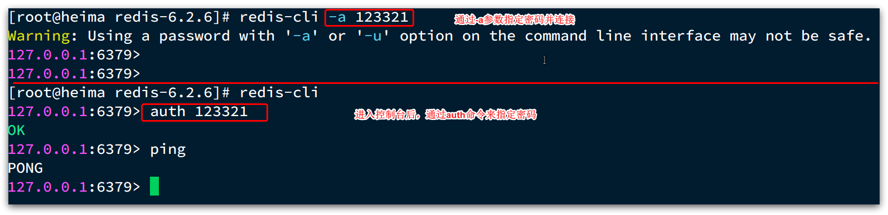
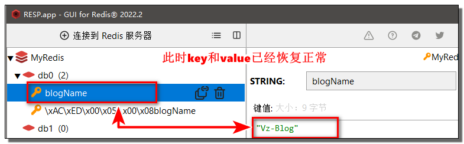
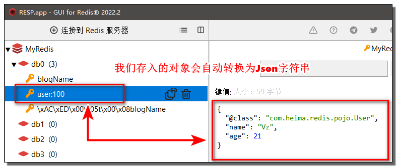
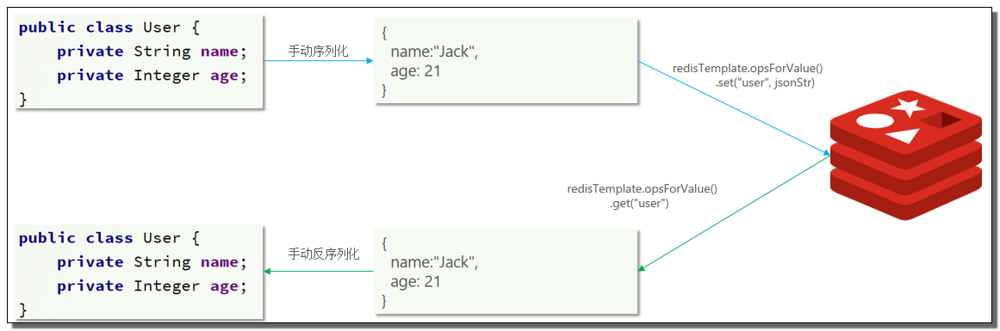
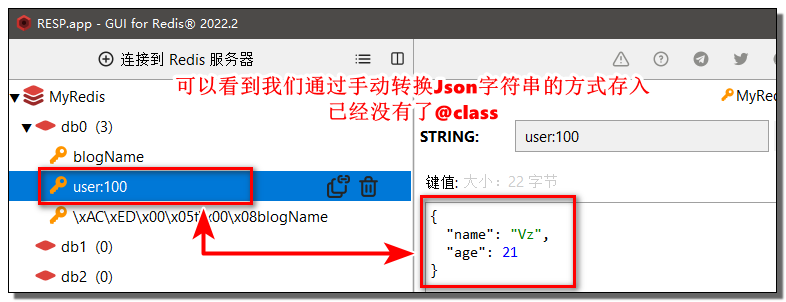

# -------------------- 入门篇

> 学习教程：
> 黑马程序员Redis入门到实战教程，深度透析redis底层原理+redis分布式锁+企业解决方案+黑马点评实战项目

# ---------- Redis 介绍与安装

## NoSQL

什么是 NoSQL？

- NoSQL 仅仅是一个概念，泛指**非关系型**的数据库
- 区别于关系数据库，它们不保证关系数据的 ACID 特性
- 常见的 NoSQL 数据库有：`Redis`、`MemCache`、`MongoDB` 等

> NoSQL 最常见的解释是 "non-relational"， 很多人也说它是"**_Not Only SQL_**"

---

NoSQL 与 SQL 的差异：

| <br /> | **SQL** | **NoSQL** |
| --- | --- | --- |
| **数据结构** | 结构化 | 非结构化 |
| **数据关联** | 关联的 | 无关联的 |
| **查询方式** | SQL查询 | 非SQL |
| **事务特性** | ACID | BASE |
| **存储方式** | 磁盘 | 内存 |
| **扩展性** | 垂直 | 水平 |
| **使用场景** | 1）数据结构固定<br />2）相关业务对数据安全性、一致性要求较高 | 1）数据结构不固定<br />2）对一致性、安全性要求不高<br />3）对性能要求 |

## 介绍

> Redis 诞生于 2009 年全称是 Remote Dictionary Server，远程词典服务器，是一个**基于内存的键值型** NoSQL 数据库。

特征：

- *键值*（key-value）型：value 支持多种不同数据结构，功能丰富
- *单线程*：每个命令具备原子性，中途不会执行其他命令
	- 命令处理始终是单线程，自 6.x 起改为多线程接收网络请求
- *低延迟，速度快*：基于内存、IO多路复用、良好的编码
- *持久化*
- *集群*：支持主从、分片集群
- *支持多语言客户端*

## 安装与启动

> [Docker安装最新Redis6（redis-6.2.7）（参考官方文档）_docker安装redis6_大白有点菜的博客-CSDN博客](https://blog.csdn.net/u014282578/article/details/128223953?ops_request_misc=%257B%2522request%255Fid%2522%253A%2522169331447916777224475827%2522%252C%2522scm%2522%253A%252220140713.130102334..%2522%257D&request_id=169331447916777224475827&biz_id=0&utm_medium=distribute.pc_search_result.none-task-blog-2~all~sobaiduend~default-2-128223953-null-null.142^v93^insert_down28v1&utm_term=Docker%E5%AE%89%E8%A3%85Redis6&spm=1018.2226.3001.4187)

Redis的启动方式有很多种，例如：前台启动、后台启动、开机自启

### 前台启动（不推荐）

> 会阻塞整个会话窗口，窗口关闭或者按下 `CTRL + C` 则 Redis 停止。不推荐使用。

安装完成后，在任意目录输入 `redis-server` 命令即可启动 Redis 


### 后台启动

> 必须修改Redis配置文件

-  修改 `redis.conf` 文件中的一些配置 

> 0.0.0.0 已经不是一个真正意义上的 IP 地址了。它表示的是这样一个集合：所有不清楚的主机和目的网络

```properties
# 允许访问的地址，默认是127.0.0.1，会导致只能在本地访问。修改为0.0.0.0则可以在任意IP访问，生产环境不要设置为0.0.0.0
bind 0.0.0.0
# 守护进程，修改为yes后即可后台运行
daemonize yes 
# 密码，设置后访问Redis必须输入密码
requirepass 1325
```

-  **Redis其他常用配置** 
```shell
# 监听的端口
port 6379
# 工作目录，默认是当前目录，也就是运行redis-server时的命令，日志、持久化等文件会保存在这个目录
dir .
# 数据库数量，设置为1，代表只使用1个库，默认有16个库，编号0~15
databases 1
# 设置redis能够使用的最大内存
maxmemory 512mb
# 日志文件，默认为空，不记录日志，可以指定日志文件名
logfile "redis.log"
```

-  **启动Redis** 
```shell
# 进入redis安装目录 
cd /usr/local/src/redis-6.2.6
# 启动
redis-server redis.conf
```

-  **停止Redis服务** 
```shell
# 通过kill命令直接杀死进程
kill -9 redis进程id
```

### 开机自启
> **我们也可以通过配置来实现开机自启**

-  **首先，新建一个系统服务文件** 
```shell
vi /etc/systemd/system/redis.service
```

-  **将以下命令粘贴进去** 
```nginx
[Unit]
Description=redis-server
After=network.target

[Service]
Type=forking
ExecStart=/usr/local/bin/redis-server /usr/local/src/redis-6.2.6/redis.conf
PrivateTmp=true

[Install]
WantedBy=multi-user.target
```

-  然后重载系统服务 
```shell
systemctl daemon-reload
```

-  现在，我们可以用下面这组命令来操作redis了 
```shell
# 启动
systemctl start redis
# 停止
systemctl stop redis
# 重启
systemctl restart redis
# 查看状态
systemctl status redis
```

-  执行下面的命令，可以让redis开机自启 
```shell
systemctl enable redis
```

## 层级 key

Redis 的 key 允许有多个单词形成层级结构，多个单词之间用":"隔开

> 例如：`项目名:业务名:类型:id`
> 
> 格式不固定，可根据需求删除或添加词条
> 
> 例如：项目名称叫 `heima`，有 `user` 和 `product` 两种不同类型的数据
> 
> - `heima:user:1`
> - `heima:product:1`

## 序列化存储

如果 Value 是一个 Java 对象，则可以将对象序列化为 JSON 字符串后存储

| KEY               | VALUE                                     |
| ----------------- | ----------------------------------------- |
| `heima:user:1`    | `{"id":1, "name": "Jack", "age": 21}`     |
| `heima:product:1` | `{"id":1, "name": "小米11", "price": 4999}` |

```bash
set heima:user:1 '{"id":1, "name": "Jack", "age": 21}'
set heima:user:2 '{"id":2, "name": "Jack2", "age": 22}'
```


# ---------- Redis 数据结构

Redis 是一个 key-value 的数据库，key 一般是 String 类型，**value 的类型多种多样**


## 通用命令

> 不用记，忘了就查
> 
> - **Redis的中文文档**：[http://www.redis.cn/commands.html](http://www.redis.cn/commands.html)
> - 菜鸟教程官网：[https://www.runoob.com/redis/redis-keys.html](https://www.runoob.com/redis/redis-keys.html)
> - `redis-cli help` 查看，`help [command]` 查看一个命令的具体用法！

通用指令不分数据类型的，都可以使用

- `set key value`
- `keys [pattern]` 模糊搜索
	- 性能较差，生产环境(尤其是主节点)不建议使用
- `del key...`
- `exists key` 判断 key 是否存在
- `expire key` 设置过期时间，过期自动删除（默认永久）
- `ttl key` 查询剩余存活时间（未设置过期时间则为 -1）

## String

根据字符串的格式分为 3 类：

- `string`：普通字符串
- `int`：整数类型，可以做自增、自减操作
- `float`：浮点类型，可以做自增、自减操作

> 底层都是“字节数组”形式存储，只是编码方式不同。字符串类型的最大空间不能超过 512m

| **KEY** | **VALUE**   |
| ------- | ----------- |
| msg     | hello world |
| num     | 10          |
| score   | 92.5        |

String 的 常见命令

| **命令**          | **描述**               |     |
| --------------- | -------------------- | --- |
| `SET k v`       | 添加或者修改               |     |
| `SETEX k v`     | 添加，并指定有效期            |     |
| `SETNX k v`     | 添加，前提是 key 不存在，否则不执行 |     |
| `GET k`         | 根据 key 获取  value     |     |
| `MSET`          | 批量添加                 |     |
| `MGET`          | 批量获取                 |     |
| `INCR k`        | 让一个整型的 key 自增1       |     |
| `INCRBY k 步长`   | 让一个整型的 key 自增并指定步长   |     |
| `INCRBYFLOAT k` | 让一个浮点类型的数字自增并指定步长    |     |

## Hash

> value 一个无序字典，类似于 Java 中的 `HashMap` 结构。

可将对象中的每个字段独立存储，可以**针对单个字段做 CRUD**（如果保存为 json 字符串就不可以）


Hash 的常见命令：

| **命令**                 | **描述**                                    |
| ---------------------- | ----------------------------------------- |
| `HSET key field value` | 添加或修改 key 的 field 的 value                 |
| `HSETNX`               | 添加，前提是 field 不存在，否则不执行                    |
| `HGET key field`       | 获取 key 的 field 的 value                    |
| ~~`HMSET`~~            | ~~hmset 和 hset 效果相同 ，4.0 之后 hmset 可以弃用了~~ |
| `HMGET`                | 批量获取                                      |
| `HGETALL k`            | 获取 key 中的所有的 field 和 value                |
| `HKEYS k`              | 获取 key 中的所有 field                         |
| `HVALS k`              | 获取 key 中的所有 value                         |
| `HINCRBY k f 步长`       | 让 key 的 field 自增并指定步长                     |

## List

> 类似 Java 中的 `LinkedList` 双向链表。既可以支持正向检索和也可以支持反向检索。

常用来存储有序数据，特征也与 LinkedList 类似：

- 有序
- 元素可以重复
- 插入和删除快
- 查询速度一般

> 例如：朋友圈点赞列表，评论列表等

List 的常见命令：

| **命令**               | **描述**                      |
| -------------------- | --------------------------- |
| `LPUSH k v ...`      | 向列表左侧插入一个或多个元素              |
| `LPOP k`             | 移除并返回列表左侧的第一个元素，没有元素则返回 nil |
| `BLPOP k TIMEOUT`    | 与 LPOP 类似，没有元素时可指定等待时间      |
| `LRANGE k start end` | 返回一段角标范围内的所有元素              |
| `RPUSH k v ...`      | 右侧                          |
| `RPOP key`           | 右侧                          |
| `BRPOP`              | 右侧                          |


思考问题

- List 模拟**栈**?
	- 先进后出，入口和出口在同一边
-  List 模拟**队列**?
	- 先进先出，入口和出口在不同边
-  List 模拟**阻塞队列**?
	- 入口和出口在不同边
	- 出队时采用 `BLPOP` 或 `BRPOP`

## Set

> 与 Java 中的 `HashSet` 类似，可以看做是一个 value 为 null 的 HashMap。因为也是一个 hash 表

特征：

- 无序
- 元素不可重复
- 查找快
- 支持交集、并集、差集等功能

Set 的常见命令：

| **命令**             | **描述**            |
| ------------------ | ----------------- |
| `SADD k v ...`     | 添加一个或多个元素         |
| `SREM k v ...`     | 移除指定元素            |
| `SCARD k`          | 返回 元素个数           |
| `SISMEMBER k v`    | 判断元素是否存在          |
| `SMEMBERS`         | 获取所有元素            |
| `SINTER k1 k2 ...` | 求 key1 与 key2 的交集 |
| `SDIFF k1 k2 ...`  | 求 key1 与 key2 的差集 |
| `SUNION k1 k2 ...` | 求 key1 和 key2 的并集 |

> 交集、差集、并集
> 
> 

## SortedSet 类型

> 与 Java 中的 `TreeSet` 有些类似，但底层数据结构却差别很大

可排序的 set 集合

- 每一个元素都带有一个 score 属性，**基于 score 对元素排序**
- 底层的实现是一个跳表（SkipList）加 hash 表

特性：

- 可排序
- 元素不重复
- 查询速度快

> 因为 SortedSet 的可排序特性，经常被用来实现排行榜这样的功能。

SortedSet 的常见命令：

| **命令**                    | **描述**                       |
| ------------------------- | ---------------------------- |
| `ZADD k score v`          | 添加一个或多个元素，如果已经存在则更新 score    |
| `ZREM k v`                | 删除一个 v                       |
| `ZSCORE k v`              | 获取 v 的 score                 |
| `ZRANK k v`               | 获取 v 的排名                     |
| `ZCARD k`                 | 获取 v 个数                      |
| `ZCOUNT k min max`        | 统计 score 在 `min max` 内的 v 个数 |
| `ZINCRBY k increment v`   | 为 v 的 score 加上增量 increment   |
| `ZRANGE k min max`        | 获取指定 排名 范围内的 v               |
| `ZRANGEBYSCORE k min max` | 获取指定 score 范围内的 v            |
| `ZDIFF`、`ZINTER`、`ZUNION` | 求差集、交集、并集                    |

注意：所有的排名默认升序，要降序在命令的 Z 后面添加 `REV` 即可

> 例如 `ZREVRANK`

# ---------- Redis 客户端

## 命令行客户端

自带的命令行客户端：`redis-cli`，使用方式如下： 
 
```shell
redis-cli [options] [commonds]
```

常见的 `options` 有： 

   - `-h 127.0.0.1`：指定要连接的 redis 节点的 IP 地址，默认是 127.0.0.1
   - `-p 6379`：指定要连接的 redis 节点的端口，默认是6379
      - 注意：搭建了集群后这里别忘了
   - `-a 132537`：指定 redis 的访问密码

 `commonds` 就是 Redis 的操作命令，例如： 

   - `ping`：与 redis 服务端做心跳测试，服务端正常会返回 pong
   - 不指定 commond，会进入 `redis-cli` 的交互控制台



## 图形化客户端

> 下载地址：[https://pan.baidu.com/s/1sxQTOt-A5MCvVZnlgDf0eA?pwd=1234](https://pan.baidu.com/s/1sxQTOt-A5MCvVZnlgDf0eA?pwd=1234)

RESP、QuickRedis

## Java 客户端

> 可以在 Redis 官网查看所有客户端以及推荐的客户端：[https://redis.io/docs/clients](https://redis.io/docs/clients)

对于 Java，主要推荐以下 3 种：

1. Jedis：和原生 redis 命令行的命令一致，学习成本最低（注意它是线程不安全的，通常配合连接池使用）
2. lettuce：和 Spring 兼容最好（Spring Data Redis 默认集成）
3. Redission：提供了和 Java 集合用法一致的分布式集合，适用于**更复杂的业务场景**

.png)

### Jedis 使用

#### 快速入门

> Jedis的官网地址： [https://github.com/redis/jedis](https://github.com/redis/jedis)

引入依赖

```xml
<!--引入Jedis依赖-->
<dependency>
  <groupId>redis.clients</groupId>
  <artifactId>jedis</artifactId>
  <version>4.2.0</version>
</dependency>

<!--引入单元测试依赖-->
<dependency>
  <groupId>org.junit.jupiter</groupId>
  <artifactId>junit-jupiter</artifactId>
  <version>5.8.2</version>
  <scope>test</scope>
</dependency>
```

建立连接、操作数据、释放资源

```java
public class JedisTest {
    private Jedis jedis;

    /**
     * 被test注解修饰的方法每次执行其他方法前自动执行
     * 1、建立连接
     */
    @BeforeEach
    void setUp() {
        // 1. 获取连接
        jedis = new Jedis("192.168.111.154", 6379);
        // 2. 设置密码
        jedis.auth("990117");
        // 3. 选择库（默认是下标为0的库）
        jedis.select(0);
    }

    /**
     * 2、操作数据
     */
    @Test
    public void testString() {
        // 1、操作String
        String result = jedis.set("url", "https://www.oz6.cn");
        System.out.println("result = " + result);
        String url = jedis.get("url");
        System.out.println("url = " + url);
	    // result = OK
	    // url = https://www.oz6.cn

		// 2、操作hash
        jedis.hset("user:1", "name", "Jack");
        jedis.hset("user:1", "age", "21");
        Map<String, String> map = jedis.hgetAll("user:1");
        System.out.println("map = " + map);
    }

    /**
     * 被该注解修饰的方法会在每次执行其他方法后执行
     * 3、释放资源
     */
    @AfterEach
    void tearDown() {
        if (jedis != null) {
            jedis.close();
        }
    }
}
```

#### Jedis 连接池

Jedis 本身是**线程不安全**的，并且频繁的创建和销毁连接会有性能损耗，因此推荐使用 Jedis 连接池代替 Jedis 的直连方式

> 多线程情况下让每个线程有自己独立的 jedis 实例，可变为线程安全

```java
public class JedisConnectionFactory {
    private static final JedisPool jedisPool;

    static {
        // 配置连接池
        JedisPoolConfig jedisPoolConfig = new JedisPoolConfig();
        // 最大连接
        jedisPoolConfig.setMaxTotal(8);
        // 最大空闲连接
        jedisPoolConfig.setMaxIdle(8);
        // 最小空闲连接
        jedisPoolConfig.setMinIdle(0);
        // 最长等待时间
        jedisPoolConfig.setMaxWaitMillis(200);
        // 创建连接池对象
        jedisPool = new JedisPool(
            jedisPoolConfig,
            "192.168.111.154",
            6379,
            1000,
            "990117");
    }

    public static Jedis getJedis() {
        return jedisPool.getResource();
    }
}
```
```java
@BeforeEach
void setUp() {
//        // 1. 获取连接
//        jedis = new Jedis("192.168.111.154", 6379);
//        // 2. 设置密码
//        jedis.auth("990117");
//        // 3. 选择库（默认是下标为0的库）
//        jedis.select(0);
    jedis = JedisConnectionFactory.getJedis();
}
```

# ---------- Spring Data Redis
## 介绍

Spring Data 是 Spring 中数据操作的模块，包含对各种数据库的集成，其中对 Redis 的集成模块就叫做 Spring Data Redis
`
> 官网地址：[https://spring.io/projects/spring-data-redis](https://spring.io/projects/spring-data-redis)

- 整合 Redis 客户端 **Lettuce（默认） 和 Jedis**
- RedisTemplate 统一 API 操作 Redis
- 支持 Redis 的 发布订阅模型
- 支持 Redis 哨兵 和  Redis 集群
- 支持基于 Lettuce 的响应式编程
- 支持基于 JDK、JSON、字符串、Spring 对象的数据*序列化及反序列化*
- 支持基于 Redis 的 JDKCollection 实现

.png)

RedisTemplate 工具类封装了各种对 Redis 的操作，并且将不同数据类型的操作 API 封装到了不同的类型中：


## 快速入门

> SpringBoot 已经提供了对 Spring Data Redis 的支持

引入依赖（连接池）

```xml
<dependency>
  <groupId>org.springframework.boot</groupId>
  <artifactId>spring-boot-starter-data-redis</artifactId>
</dependency>

<!--
连接池依赖
spring-boot-starter-data-redis里的commons-pool2设置了<optional>true</optional>
所以还要引入
-->
<dependency>
  <groupId>org.apache.commons</groupId>
  <artifactId>commons-pool2</artifactId>
</dependency>
```

配置文件

```yaml
spring:
   redis:
     host: 192.168.230.88 #指定redis所在的host
     port: 6379  #指定redis的端口
     password: 132537  #设置redis密码
     lettuce:
       pool:
         max-active: 8 #最大连接数
         max-idle: 8 #最大空闲数
         min-idle: 0 #最小空闲数
         max-wait: 100ms #连接等待时间
```

```yaml
spring:
  data:
    redis:
      host: 192.168.111.154
      password: 990117
      port: 6379
      lettuce:
        pool:
          max-active: 8
          max-idle: 8
          min-idle: 0
          max-wait: 100ms
```

测试

```java
@SpringBootTest
class Redis02SpringdataredisApplicationTests {
    @Resource
    private RedisTemplate redisTemplate;

    @Test
    void testString() {
        // redisTemplate.opsForValue().set("name","虎哥");
        // Object name = redisTemplate.opsForValue().get("name");
        ValueOperations ops = redisTemplate.opsForValue();
        ops.set("name","虎哥2");
        Object name = ops.get("name");
        System.out.println(name);
    }
}
```

## RedisSerializer（序列化）

> 实际开发中，RedisTemplate 通常是 `<String, Object>` 这种泛型

RedisTemplate 可以接收任意 Object 作为 value 写入 Redis，只不过写入前会把 Object 序列化为【字节形式】

> RedisTemplate 默认序列化方式是 jdk 的（可读性差、内存占用较大），所以我们存入的 Object 要实现序列化接口，不然会报错，但在实际开发中我们并不想用这种序列化方式，我们都会采用 JSON 方式的序列化。


RedisTemplate 的两种 json 序列化实践方案，两种方案各有优缺点

方案一：

1. 自定义 RedisTemplate
2. 修改 RedisTemplate 的序列化器为 `GenericJackson2JsonRedisSerializer`

方案二：

1. 使用 StringRedisTemplate
2. 写 Redis ，**手动**把对象**序列化**为 JSON
3. 读 Redis ，**手动**把读取到的 JSON **反序列化**为对象

### 自定义 RedisTemplate 序列化

> 这里没有引入 springmvc，所以要手动导入 json 的包

```xml
<!-- Jackson依赖 -->
<dependency>
    <groupId>com.fasterxml.jackson.core</groupId>
    <artifactId>jackson-databind</artifactId>
</dependency>
```

配置类自定义 RedisTemplate

```java
@Configuration
public class RedisConfig {
    @SuppressWarnings("all") // connectionFactory爆红，但是能运行
    @Bean
    public RedisTemplate<String, Object> redisTemplate(RedisConnectionFactory connectionFactory) {
        // 1.创建RedisTemplate对象
        RedisTemplate<String, Object> template = new RedisTemplate<>();
        // 2.设置连接工厂
        template.setConnectionFactory(connectionFactory);
        // 3.创建序列化工具
        GenericJackson2JsonRedisSerializer jsonRedisSerializer = new GenericJackson2JsonRedisSerializer();
        // 4.设置key和hashKey采用String的序列化方式
        template.setKeySerializer(RedisSerializer.string());
        template.setHashKeySerializer(RedisSerializer.string());
        // 5.设置value和hashValue采用json的序列化方式
        template.setValueSerializer(jsonRedisSerializer);
        template.setHashValueSerializer(jsonRedisSerializer);
        return template;
    }
}
```

已经将 RedisTemplate 的 key 设置为 String 序列化，value 设置为 Json 序列化的方式，因此可以直接向 redis 中插入一个对象

```java
@SpringBootTest
class Redis02SpringdataredisApplicationTests {
    @Resource
    private RedisTemplate<String, Object> redisTemplate;

    @Test
    void testSaveUser() {
        ValueOperations ops = redisTemplate.opsForValue();
        // 序列化
        ops.set("user:100", new User("虎哥",21));
        // 反序列化
        User user = (User) ops.get("user:100");
        System.out.println(user);
    }
}
```





为了在**反序列化**时知道对象的类型，JSON 序列化器会**将类的 class 类型写入 json 结果中**，存入 Redis，会带来**额外的内存开销**

> 通过下文的 `StringRedisTemplate` 可以解决这个问题

反序列化的时候可以向下转型为 User 对象

.png)

### StringRedisTemplate

统一使用 String 序列化器处理 value，只能存储 **String 类型的 key 和 value**。当需要存储 Java 对象时，手动完成对象的序列化和反序列化。



Spring 默认提供了一个 StringRedisTemplate 类，它的 key 和 value 的序列化方式默认就是 String 方式

---
使用 StringRedisTemplate
`
```java
@SpringBootTest
class Redis02SpringdataredisApplicationTests {
    @Resource
    private StringRedisTemplate stringRedisTemplate;

    private static final ObjectMapper mapper = new ObjectMapper();

    @Test
    void testSaveUser2() throws JsonProcessingException {
		// ValueOperations<String, String> ops = stringRedisTemplate.opsForValue();
        User user = new User("虎哥", 21);
        String json = mapper.writeValueAsString(user);
        stringRedisTemplate.opsForValue().set("user:200", json);
        String jsonUser = stringRedisTemplate.opsForValue().get("user:200");
        System.out.println(jsonUser);
    }
}
```



# -------------------- 实战篇


前端启动：在nginx目录里开个终端

```bash
start nginx.exe
```

# ---------- Redis 共享 Session 登录

## 基于 Session 实现

基于 Session 实现的登录/注册成功后，**不需要返回登录凭证**的，

> 每个 Session 都一个唯一的 SessionId，会保存到 Cookie 里，客户端每次请求都会携带 SessionId，获取 Session 对象

.png)

.png)

## 基于 Redis 实现

多台 tomcat 不共享 session 存储空间


Redis 独立于 tomcat 服务器，基于 Redis 实现共享 Session 登录

.png)


注意事项：

1. 存入 Redis 的数据一定要设置保存时间
2. 存入 Redis 的数据尽量保证精简和安全，比如存入用户信息时可以移除密码等敏感数据

### 短信验证码登录

1、发送验证码

> 路径：`@PostMapping("code")`

```java
@Override
public Result sendCode(String phone) {
	// 校验手机号
    if (RegexUtils.isPhoneInvalid(phone)) {
        return Result.fail("手机号格式错误！");
    }
    String code = RandomUtil.randomNumbers(6);
    // 设置TTL
    stringRedisTemplate.opsForValue()
            .set(LOGIN_CODE_KEY + phone, code, LOGIN_CODE_TTL, TimeUnit.MINUTES);
    // 模拟发送验证码
    log.info("发送短信验证码成功，验证码：{}", code);
    return Result.ok();
}
```

2、短信验证码登录、注册

采用 hash 代替 json 字符串 存储用户信息

```java
@Override
public Result login(LoginFormDTO loginForm) {
	// 校验手机号
    String phone = loginForm.getPhone();
    if (RegexUtils.isPhoneInvalid(phone)) {
        return Result.fail("手机号格式错误！");
    }
    
    // ---------- 校验验证码
    String cacheCode = stringRedisTemplate.opsForValue().get(LOGIN_CODE_KEY + phone);
    // ！！！这里不能用 cacheCode != loginForm.getCode()
    if (cacheCode == null || !cacheCode.equals(loginForm.getCode())) {
        return Result.fail("验证码错误！");
    }
    
    // ---------- db：手机号查询用户是否存在
    User user = query().eq("phone", phone).one();
    if (user == null) {
	    // 不存在创建新用户
        user = createUserWithPhone(phone);
    }
    
    // ---------- Redis存入用户信息
    // 1、key=token
    String token = UUID.randomUUID().toString();
    String tokenKey = LOGIN_USER_KEY + token;
    // 2、value=userMap
    // 用户信息脱敏，User --> UserDTO
    UserDTO userDTO = BeanUtil.copyProperties(user, UserDTO.class);
	// 采用 hash 代替 json字符串 存储用户信息。UserDTO --> Map
    Map<String, Object> userMap = BeanUtil.beanToMap(
		    // BeanUtil是hutool工具包
            userDTO,
            new HashMap<>(),
            CopyOptions.create()
                    // 是否忽略空字段
                    .setIgnoreNullValue(true)
                    // 自定义属性值转换规则
                    // userDTO的id是Long类型，String序列化会报错
                    .setFieldValueEditor((fieldName, fieldValue) -> fieldValue.toString())
    );
    stringRedisTemplate.opsForHash().putAll(tokenKey, userMap);
    stringRedisTemplate.expire(tokenKey, LOGIN_USER_TTL, TimeUnit.MINUTES);
    
    // ---------- token 返回给前端用户
    return Result.ok(token);
}
```

### 校验登录状态

已登录用户访问系统（任何路径）后，要刷新 token 的 TTL

不是所有路径都需要校验登录状态（登录注册页面、首页 不需要）

所以分开设置 **token 刷新拦截器**和**登录校验拦截器（设置排除的路径）**

.png)

请求-->token 刷新拦截器-->登录拦截器

```java
// token 刷新拦截器
public class RefreshTokenInterceptor implements HandlerInterceptor {  
    StringRedisTemplate stringRedisTemplate;  
  
    public RefreshTokenInterceptor(StringRedisTemplate srt) {  
        this.stringRedisTemplate = srt;  
    }  
  
    @Override  
    public boolean preHandle(HttpServletRequest req, HttpServletResponse res, Object handler) {  
        // 获取token  
        String token = req.getHeader("authorization");  
        if (StrUtil.isEmpty(token)) {  
            // return str == null || str.length() == 0;  
            // 没有token，放行  
            return true;  
        }  
        // redis取出用户信息  
        String key  = LOGIN_USER_KEY + token;  
        Map<Object, Object> userMap = stringRedisTemplate.opsForHash().entries(key);  
        if (userMap.isEmpty()) {  
            // 过期 或 假token，放行  
            return true;  
        }  
        UserDTO userDTO = BeanUtil.fillBeanWithMap(userMap, new UserDTO(), false);  
        // 保存到ThreadLocal  
        UserHolder.saveUser(userDTO);  
        // 刷新token TTL  
        stringRedisTemplate.expire(key, LOGIN_USER_TTL, TimeUnit.MINUTES);  
        return true;  
    }  
  
    @Override  
    public void afterCompletion(HttpServletRequest request, HttpServletResponse response, Object handler, Exception ex) throws Exception {  
        // 移除用户  
        UserHolder.removeUser();  
    }  
}
```

```java
// 登录校验拦截器  
public class LoginInterceptor implements HandlerInterceptor {  
    @Override  
    public boolean preHandle(HttpServletRequest req, HttpServletResponse res, Object handler) throws Exception {  
        if (UserHolder.getUser() == null) {  
            res.sendError(401);  
            // 拦截  
            return false;  
        }  
        return true;  
    }  
}
```

配置拦截器

```java
@Configuration
public class MvcConfig implements WebMvcConfigurer {
    @Resource
    StringRedisTemplate stringRedisTemplate;

    @Override
    public void addInterceptors(InterceptorRegistry registry) {
        // token刷新拦截器
        registry
                .addInterceptor(new RefreshTokenInterceptor(stringRedisTemplate))
                .addPathPatterns("/**")
                .order(0);
        // 登录校验拦截器
        registry
                .addInterceptor(new LoginInterceptor())
                // 登录校验排除路径
                .excludePathPatterns(
                        "/shop/**",
                        "/shop-type/**",
                        "/blog/hot",
                        "/user/code",
                        "/user/login"
                )
                .order(1);
    }
}
```

前端通过 axios 的拦截器，将 token 存到请求头里，key 为 authorization

.png)

# 缓存

缓存就是数据交换的缓冲区(称作 cache)，是存储数据的临时地方，一般读写性能较高

.png)

缓存的作用（优点）：

1. 降低后端负载
2. 提高读写效率，降低响应时间

缓存的成本（缺点）

1. 保证数据一致性
2. 额外开发和解决缓存带来的问题，增加代码成本
3. 额外引入中间件，增加运维成本

## 添加 Redis 缓存

.png)

给商铺查询添加缓存

> 请求路径：`@GetMapping("/{id}")`

```java
@Resource
StringRedisTemplate stringRedisTemplate;

@Override
public Result queryShopById(Long id) {
    // 1 查询缓存
    String shopKey = CACHE_SHOP_KEY + id;
    String shopJson = stringRedisTemplate.opsForValue().get(shopKey);
    if (StrUtil.isNotBlank(shopJson)) {
	     // 2 命中直接返回
        Shop shop = JSONUtil.toBean(shopJson, Shop.class);
        return Result.ok(shop);
    }
    // 3 未命中查数据库
    Shop shop = getById(id);
    if (shop == null) {
		// 不存在，返回404
        return Result.fail("商户不存在");
    }
    // 写入Redis
    stringRedisTemplate.opsForValue().set(shopKey,JSONUtil.toJsonStr(shop));
    // 返回商铺信息
    return Result.ok(shop);
}
```

## 缓存更新策略


缓存更新策略的最佳实践方案

- 低一致性需求：使用 Redis 自带的内存淘汰机制
- 高一致性需求：**主动更新**，并以**超时剔除作为兜底**方案

### 主动更新策略

> 主动更新策略 也叫 缓存读写策略

主动更新策略中，Cache Aside Pattern（旁路缓存模式） 企业里最常用

- 读操作
   - 缓存命中则直接返回
   - 未命中则查询 db，写入缓存，设定 TTL
- 写操作
   - 先写 db，再删除缓存


操作缓存和数据库时有三个问题需要考虑

1）删除 or 更新 缓存?

- ❌更新缓存：每次更新数据库都更新缓存，**无效写操作较多**
- ✔️删除缓存：更新数据库时让缓存失效，查询时再更新缓存

2）如何保证缓存与数据库的操作的 同时成功或失败?

- 单体系统：将缓存和数据库操作放在一个事务里
- 分布式系统：TCC 等分布式事务方案

3）先操作 缓存 or 数据库?

都可能发生“线程安全”问题，导致缓存和数据库**不一致**的问题

- 先删缓存，后更新数据库：发生的**概率高**
- 先更新数据库，后删缓存：发生的概率很低，因为**缓存的速度高于数据库很多**

> 方案一不一致的情况：线程 2 删除缓存 --> 在线程 1 查询数据库写入缓存 --> 线程 2 更新数据库
> 
> 方案二不一致的情况：（刚好缓存失效）线程 1 查询缓存未命中，查数据库 --> 线程 2 更新数据库，删除缓存 --> 线程 1 写入缓存


### shop 缓存案例

给查询商铺的缓存添加“超时剔除”和“主动更新”的策略

1）id 查询店铺：db 查询结果写入缓存，添加**设置 TTL**

```java
// 存在商铺，写入Redis，返回商铺信息
// 超时剔除
stringRedisTemplate.opsForValue()
        .set(shopKey, JSONUtil.toJsonStr(shop), CACHE_SHOP_TTL, TimeUnit.MINUTES);
```

2）id 修改店铺：先修改数据库，再删除缓存，要**添加事务！**

> /shop

```java
@Override
@Transactional
public Result updateShop(Shop shop) {
    Long shopId = shop.getId();
    if (shopId == null) {
        return Result.fail("店铺id不能为空");
    }
    // 更新数据库
    updateById(shop);
    // 删除缓存
    stringRedisTemplate.delete(CACHE_SHOP_KEY + shopId);
    return Result.ok();
}
```

无前台页面，后台测试


## 缓存穿透

客户端请求的数据在**缓存和数据库中都不存在**，这样缓存永远不生效，请求都会打到数据库里

常见的解决方案：

- 缓存空对象✔️
   - 优点：简单
   - 缺点：
      - 额外的内存消耗（解决：设置TTL）
      - 短期的数据不一致（解决：真正插入的时候覆盖）

- 布隆过滤
   - 优点：内存占用少，没有多余key
   - 缺点：
      - 实现复杂
      - 存在误判可能

> 上面都是一些被动的解决方案，主动的解决方案（预防）：
> 
> - 增强 id 的复杂度
> - 增强对请求数据的格式校验
> - 增强用户权限校验
> - 热点参数限流

.png)

### shop 查询案例

.png)

id 查询商铺

```java
@Override
public Result queryShopById(Long id) {
    // 查询缓存
    String shopKey = CACHE_SHOP_KEY + id;
    String shopJson = stringRedisTemplate.opsForValue().get(shopKey);
    if (StrUtil.isNotBlank(shopJson)) {
	    // 命中直接返回
        Shop shop = JSONUtil.toBean(shopJson, Shop.class);
        return Result.ok(shop);
    }
    // 【缓存穿透】，命中为空值""，返回错误
    if(shopJson!=null){
        return Result.fail("商户不存在");
    }
    // 未命中查数据库
    Shop shop = getById(id);
    if (shop == null) {
        // 【缓存穿透】，将空值""写入Redis，设置TTL
        stringRedisTemplate.opsForValue()
                .set(shopKey, "", CACHE_NULL_TTL, TimeUnit.MINUTES);
        return Result.fail("商户不存在");
    }
    // 存在商铺，写入Redis
    // 【超时剔除】
    stringRedisTemplate.opsForValue()
            .set(shopKey, JSONUtil.toJsonStr(shop), CACHE_SHOP_TTL, TimeUnit.MINUTES);
    // 返回商铺信息
    return Result.ok(shop);
}
```

测试：`http://localhost:8081/shop/0`

## 缓存雪崩

在同一时段大量的缓存 key 同时失效 或者 Redis 服务宕机 导致大量请求到达数据库

解决方案：

- 给不同 key 的 TTL 添加随机值
- Redis 集群（针对宕机）
- 给缓存业务添加降级限流策略（缓存全崩完了）
- 业务添加多级缓存（浏览器缓存、nginx 缓存、jvm 本地缓存）

## 缓存击穿

也叫热点 Key 问题，一个**被高并发访问**并且缓存重建业务较复杂（重建时间较长）的 key 突然失效了（过期），无数的请求会瞬间给数据库带来巨大的压力

.png)

解决方案（根据需求选择）：

1）*互斥锁*：

缓存未命中，先获取互斥锁，查询 db 重建缓存数据后，再释放互斥锁。保证**只有一个请求会落到数据库上**

- 优点：
	- **保证一致性**
- 缺点：
	- 线程要等待，性能受影响
	- 有死锁风险

2）*互斥锁+逻辑过期*

key 是永久的，由后端添加一个 expire 字段（LocalDateTime 实现）表示过期时间；

发现逻辑过期后，获取锁成功的线程，另开一个线程异步重建缓存，获取锁失败的线程直接返回过期数据

- 优点：
	- 线程无需等待，**性能较好**
- 缺点
	- 不保证一致性
	- 有额外的内存开销

.png)

### 互斥锁案例

.png)

 利用命令 `SETNX` 实现互斥锁，对应 StringRedisTemplate 的方法如下

```java
Boolean setIfAbsent(K key, V value, long timeout, TimeUnit unit);
```

> SETNX：添加一个 String 类型的键值对，前提是这个 key 不存在，否则不执行
 
```java
@Override
public Result queryShopById(Long id) {
    Shop shop = queryWithMutex(id);
    if (shop == null) {
        return Result.fail("商铺不存在");
    }
    return Result.ok(shop);
}

/**  
 * id查询商铺——缓存击穿解决——互斥锁  
 */  
public Shop queryWithMutex(Long id) {  
    // 查询缓存  
    String shopKey = CACHE_SHOP_KEY + id;  
    String shopJson = stringRedisTemplate.opsForValue().get(shopKey);  
    if (StrUtil.isNotBlank(shopJson)) {  
        // 命中直接返回  
        Shop shop = JSONUtil.toBean(shopJson, Shop.class);  
        return shop;  
    }  
    if (shopJson != null) {  
        // 【缓存穿透】 命中为空值""  
        return null;  
    }  
    // 未命中，查询 db    String lockKey = LOCK_SHOP_KEY + id;  
    Shop shop = null;  
    try {  
        // 获取【互斥锁】  
        boolean isLock = tryLock(lockKey);  
        if (!isLock) {  
            // 获取失败，等待缓存数据重建，递归调用  
            Thread.sleep(50);  
            return queryWithMutex(id);  
        }  
        shop = getById(id);  
        Thread.sleep(200); // 模拟重建的延迟  
        if (shop == null) {  
            // 【缓存穿透】 创建无效key  
            stringRedisTemplate.opsForValue()  
                    .set(shopKey, "", CACHE_NULL_TTL, TimeUnit.MINUTES);  
            return null;  
        }  
        // 写入缓存，【超时剔除】  
        stringRedisTemplate.opsForValue()  
                .set(shopKey, JSONUtil.toJsonStr(shop), CACHE_SHOP_TTL, TimeUnit.MINUTES);  
    } catch (InterruptedException e) {  
        throw new RuntimeException(e);  
    } finally {  
        // 释放【互斥锁】  
        unLock(lockKey);  
    }  
    return shop;  
}

/**
 * 获取锁
 */
private boolean tryLock(String key) {
    Boolean flag = stringRedisTemplate.opsForValue().setIfAbsent(key, "1", 10, TimeUnit.SECONDS);
    // 直接返回flag，自动拆箱可能会空指针
    return BooleanUtil.isTrue(flag);
}

/**
 * 释放锁
 */
private void unLock(String key) {
    stringRedisTemplate.delete(key);
}
```

测试：`http://localhost:8081/shop/3`

.png)

### 逻辑过期案例

> 需要把数据提前写入Redis，不然永远命中不了

.png)

提前插入过期数据

```java
@Test
public void testSaveShopToRedis() throws InterruptedException {
    // saveShopToRedis是ShopServiceImpl的新方法
    // 插入一条10s过期的测试数据
    shopService.saveShopToRedis(1L, 10L);
}
```

业务逻辑

```java
// 线程池
private static final ExecutorService CACHE_REBUILD_EXECUTOR = Executors.newFixedThreadPool(10);

/**
 * id查询商铺——缓存击穿解决——逻辑过期
 *
 * @param id
 * @return
 */
public Shop queryWithLogicalExpire(Long id) {
    String shopKey = CACHE_SHOP_KEY + id;
    // # 查询缓存
    String shopJson = stringRedisTemplate.opsForValue().get(shopKey);
    // ## 未命中，返回空
    if (StrUtil.isBlank(shopJson)) {
        return null;
    }
    // # 命中，判断缓存是否过期
    RedisData redisData = JSONUtil.toBean(shopJson, RedisData.class);
    Shop shop = JSONUtil.toBean((JSONObject) redisData.getData(), Shop.class);
    // 获取逻辑过期时间
    LocalDateTime expireTime = redisData.getExpireTime();
    // ## 未过期，返回shop
    if (expireTime.isAfter(LocalDateTime.now())) {
        return shop;
    }
    // # 过期，获取互斥锁
    boolean isLock = tryLock(LOCK_SHOP_KEY + id);
    // ## 获取到锁，开启独立线程重建缓存
    if (isLock) {
        CACHE_REBUILD_EXECUTOR.submit(() -> {
            try {
                // 缓存重建
                this.saveShopToRedis(id, 20L);
            } catch (InterruptedException e) {
                throw new RuntimeException(e);
            } finally {
                // 释放锁
                unLock(LOCK_SHOP_KEY + id);
            }
        });
    }
    // ## 没获取到锁，返回过期shop
    return shop;
}

// 重建缓存
public void saveShopToRedis(Long id, Long expireSeconds) throws InterruptedException {
    // # 查询shop
    Shop shop = getById(id);
    // 模拟延时
    Thread.sleep(200);
    // # 封装逻辑过期时间
    RedisData redisData = new RedisData();
    redisData.setData(shop);
    redisData.setExpireTime(LocalDateTime.now().plusSeconds(expireSeconds));
    // # 写入Redis，不要设置TTL
    stringRedisTemplate.opsForValue().set(CACHE_SHOP_KEY + id, JSONUtil.toJsonStr(redisData));
}

/**
 * 获取锁
 */
private boolean tryLock(String key) {
    Boolean flag = stringRedisTemplate.opsForValue().setIfAbsent(key, "1", 10, TimeUnit.SECONDS);
    // 不要直接返回flag，flag自动拆箱可能会空指针异常
    return BooleanUtil.isTrue(flag);
}

/**
 * 释放锁
private void unLock(String key) {
    stringRedisTemplate.delete(key);
}
```
## 缓存工具封装

> [https://www.bilibili.com/video/BV1cr4y1671t/?p=46&spm_id_from=pageDriver&vd_source=2c36db3ac89c0a3fdac39c4e8a1068fa](https://www.bilibili.com/video/BV1cr4y1671t/?p=46&spm_id_from=pageDriver&vd_source=2c36db3ac89c0a3fdac39c4e8a1068fa)

基于 StringRedisTemplate 封装一个缓存工具类 CacheClient，满足下列需求：

- 方法 1：将**对象**序列化为 json 并写入缓存，可设置 TTL 
- 方法 2：方法 1 的基础上，可以设置“逻辑过期”时间
- 方法 3：根据 key 查询缓存，并**反序列化**；利用“缓存空值”解决【缓存穿透】
- 方法 4：根据 key 查询缓存，并**反序列化**；利用“逻辑过期”解决【缓存穿透】

技术点：泛型、函数式编程

---
工具类

```java
@Slf4j
@Component
public class CacheClient {
    @Resource
    private StringRedisTemplate stringRedisTemplate;

    // 线程池
    private static final ExecutorService CACHE_REBUILD_EXECUTOR = Executors.newFixedThreadPool(10);

    /**
     * Java对象序列化为json并存储在string类型的key中，并且可以设置TTL过期时间
     *
     * @param key
     * @param value
     * @param time
     * @param unit
     */
    public void set(String key, Object value, Long time, TimeUnit unit) {
        stringRedisTemplate.opsForValue().set(key, JSONUtil.toJsonStr(value), time, unit);
    }

    /**
     * 将任意]ava对象序列化为ison并存储在string类型的key中
     * 并且可以设置逻辑过期时间，用于处理缓存击穿问题
     *
     * @param key
     * @param value
     * @param time
     * @param unit
     */
    public void setWithLogicalExpire(String key, Object value, Long time, TimeUnit unit) {
        RedisData redisData = new RedisData();
        redisData.setData(value);
        redisData.setExpireTime(LocalDateTime.now().plusSeconds(unit.toSeconds(time)));
        stringRedisTemplate.opsForValue().set(key, JSONUtil.toJsonStr(redisData));
    }

    /**
     * 根据指定的key查询缓存，并反序列化为指定类型
     * 利用缓存空值的方式解决缓存穿透问题
     *
     * @param keyPrefix
     * @param id
     * @param type       返回值类型
     * @param dbFallback id查询数据库逻辑，需实现dbFallback接口
     * @param time       缓存保存时间
     * @param unit       时间单位
     * @param <R>
     * @param <ID>
     * @return
     */
    public <R, ID> R queryWithPassThrough(
            String keyPrefix,
            ID id,
            Class<R> type,
            Function<ID, R> dbFallback,
            Long time, TimeUnit unit) {

        // # Redis查询缓存
        String key = keyPrefix + id;
        String json = stringRedisTemplate.opsForValue().get(key);
        // ## 命中且值非空，直接返回
        if (StrUtil.isNotBlank(json)) {
            return JSONUtil.toBean(json, type);
        }
        // ## 命中为空值""，返回null
        if (json != null) {
            return null;
        }
        // # 未命中查数据库
        R r = dbFallback.apply(id);
        // ## 不存在，返回null
        if (r == null) {
            // 将空值""写入Redis
            stringRedisTemplate.opsForValue()
                    .set(key, "", CACHE_NULL_TTL, TimeUnit.MINUTES);
            return null;
        }
        // # 存在商铺，写入Redis，返回商铺信息
        // 超时剔除策略兜底
        this.set(key, r, time, unit);
        return r;
    }


    public <R, ID> R queryWithLogicalExpire(
            String keyPrefix,
            ID id,
            Class<R> type,
            Function<ID, R> dbFallback,
            Long time, TimeUnit unit) {

        String key = keyPrefix + id;
        // # 查询缓存
        String json = stringRedisTemplate.opsForValue().get(key);
        // ## 未命中，返回空
        if (StrUtil.isBlank(json)) {
            return null;
        }
        // # 命中，判断缓存是否过期
        RedisData redisData = JSONUtil.toBean(json, RedisData.class);
        R r = JSONUtil.toBean((JSONObject) redisData.getData(), type);
        // 获取逻辑过期时间
        LocalDateTime expireTime = redisData.getExpireTime();
        // ## 未过期，返回r
        if (expireTime.isAfter(LocalDateTime.now())) {
            return r;
        }
        // # 过期，获取互斥锁
        String lockKey = LOCK_SHOP_KEY + id;
        boolean isLock = tryLock(lockKey);
        // ## 获取到锁，开启独立线程重建缓存
        if (isLock) {
            CACHE_REBUILD_EXECUTOR.submit(() -> {
                try {
                    // 查数据库
                    R r1 = dbFallback.apply(id);
                    // 存入Redis
                    this.setWithLogicalExpire(key, r1, time, unit);
                } catch (Exception e) {
                    throw new RuntimeException(e);
                } finally {
                    // 释放锁
                    unLock(lockKey);
                }
            });
        }
        // ## 没获取到锁，返回过期r
        return r;
    }

    /**
     * 获取锁
     *
     * @param key
     * @return
     */
    private boolean tryLock(String key) {
        Boolean flag = stringRedisTemplate.opsForValue().setIfAbsent(key, "1", 10, TimeUnit.SECONDS);
        // 不要直接返回flag，flag自动拆箱可能会空指针异常
        return BooleanUtil.isTrue(flag);
    }

    /**
     * 释放锁
     *
     * @param key
     */
    private void unLock(String key) {
        stringRedisTemplate.delete(key);
    }
}

```

使用工具类

```java
@Override
public Result queryShopById(Long id) {
    // 解决缓存穿透
    Shop shop = cacheClient.queryWithPassThrough(
            CACHE_SHOP_KEY,
            id,
            Shop.class,
            // shopId -> getById(shopId),
            this::getById,
            CACHE_SHOP_TTL,
            TimeUnit.MINUTES
    );

    // 逻辑过期解决缓存击穿
//        Shop shop = cacheClient.queryWithLogicalExpire(  
//                CACHE_SHOP_KEY,  
//                id,  
//                Shop.class,  
//                // shopId -> getById(shopId),  
//                this::getById,  
//                CACHE_SHOP_TTL,  
//                TimeUnit.MINUTES  
//        );

    if (shop == null) {
        return Result.fail("商铺不存在");
    }
    return Result.ok(shop);
}
```

# 优惠券秒杀（分布式锁）

## 全局唯一 ID

当用户抢购时，就会生成订单并保存到 tb_voucher_order 这张表中，而订单表如果使用数据库自增 ID 就存在一些问题：

- id 的规律性太明显，容易透露给用户信息（比如一天产生了多少单）
- 受单表数据量的限制，每天产生的订单都很多，分多张表存储，ID 会重复

全局 ID 生成器：一种在分布式系统下用来生成全局唯一 ID 的工具，一般要满足以下特性：

- 唯一性
- 高可用：任何时候都不能挂
- 高性能：生成速度要快
- 递增性：要确保全局逐渐增大，有利于数据库创建索引，提高插入的速度
- 安全性：id 规律性不能太明显

> 一些全局 ID 生成策略：
> 
> - UUID（16 进制字符串，缺少单调递增的特性）
> - Redis 自增
> - snowflake 算法（比较依赖时钟）
> - 数据库自增（专门弄一张表来自增，性能不如 Redis 自增）

为了增加 ID 的安全性，我们可以不直接使用 Redis 自增的数值，而是拼接一些其他信息

思想：时间戳+计数器

ID 的组成部分：

- 符号位：1bit，永远为0
- 时间戳：31bit，以秒为单位，可以使用69年
- 序列号：32bit，秒内的计数器，支持每秒产生2^32个不同ID


使用 Redis 的 `Incr` 命令，可以实现后 32 位的原子性递增。<br />Redis的key设计为`icr:业务前缀:当前日期`，每天都会从1开始生成序列号，每天一个key方便统计订单量<br />单key设计可能会出现生成序列号数溢出 2^32 的情况，多key的话单日不可能超过2^32次方个订单
```java
@Component
public class RedisIdWorker {
    private static final long BEGIN_TIMESTAMP = 1672531200L;

    @Resource
    private StringRedisTemplate stringRedisTemplate;

    private static final int COUNT_BITS = 32;

    public long nextId(String keyPrefix) {
        // # 生成时间戳
        LocalDateTime now = LocalDateTime.now();
        long nowSecond = now.toEpochSecond(ZoneOffset.UTC);
        long timeStamp = nowSecond - BEGIN_TIMESTAMP;
        // # 生成序列号
        // ## 获取当前日期
        String date = now.format(DateTimeFormatter.ofPattern("yyyy:MM:dd"));
        // ## 序列号自增长
        Long count = stringRedisTemplate.opsForValue().increment("icr:" + keyPrefix + ":" + date);
        // # 拼接
        return timeStamp << COUNT_BITS | count;
    }

    public static void main(String[] args) {
        // 生成起始时间
        LocalDateTime time = LocalDateTime.of(2023, 1, 1, 0, 0, 0);
        long second = time.toEpochSecond(ZoneOffset.UTC);
        System.out.println("second=" + second);
    }
}
```
```java
@SpringBootTest
@RunWith(SpringRunner.class)
public class HmDianPingApplicationTests {
    @Resource
    private RedisIdWorker redisIdWorker;

    private ExecutorService es = Executors.newFixedThreadPool(500);

    @Test
    public void testRedisIdWorker() throws InterruptedException {
        CountDownLatch latch = new CountDownLatch(300);

        Runnable task = () -> {
            for (int i = 0; i < 100; i++) {
                long id = redisIdWorker.nextId("testOrder");
                System.out.println("id=" + id);
            }
            // 减少计数器
            latch.countDown();
        };

        long begin = System.currentTimeMillis();
        // 共生成30k个全局id
        for (int i = 0; i < 300; i++) {
            es.submit(task);
        }
        // 挂起线程，计数器为0的时候恢复线程
        latch.await();
        long end = System.currentTimeMillis();
        System.out.println("time=" + (end - begin));
    }
}
```

## 优惠券秒杀下单实现

每个店铺都可以发布优惠券，分为平价券和特价券。平价券可以任意购买，而**特价券**需要秒杀抢购

.png)

> 优惠券相关表:
> 
> - `tb voucher`：基本信息，优惠金额、使用规则等
> - `tb seckill voucher`：库存、开始抢购时间，结束抢购时间。
> 	- 特价优惠券才需要

数据库插入一条秒杀券的数据 `http://localhost:8081/voucher/seckill`

```json
{
    "shopId":1,
    "title":"100元代金券",
    "subTitle":"周一至周五均可使用",
    "rules":"全场通用\\n无需预约\\n可无限叠加\\不兑现、不找零\\n仅限堂食",
    "payValue":8000,
    "actualValue":10000,
    "type":1,
    "stock":100,
    "beginTime":"2023-09-10T10:09:17",
    "endTime":"2023-12-26T12:09:04"
}
```

下单时要判断两点：

1. 秒杀是否开始或者结束
2. 库存是否充足

.png)

```java
@Service
public class VoucherOrderServiceImpl extends ServiceImpl<VoucherOrderMapper, VoucherOrder> implements IVoucherOrderService {

    @Resource
    private ISeckillVoucherService voucherService;
    @Resource
    private RedisIdWorker redisIdWorker;

    @Override
    public Result seckillVoucher(Long voucherId) {
        // # db 查询优惠券
        SeckillVoucher voucher = voucherService.getById(voucherId);
        // # 秒杀是否 开始 或 结束
        if (voucher.getBeginTime().isAfter(LocalDateTime.now())) {
            return Result.fail("时间未开始");
        }
        if (voucher.getEndTime().isBefore(LocalDateTime.now())) {
            return Result.fail("时间已结束");
        }
        // # 判断库存是否充足
        if (voucher.getStock() < 1) {
            return Result.fail("库存不足");
        }
        // # 扣减库存
        voucher.setStock(voucher.getStock() - 1);
        voucherService.updateById(voucher);
        // # 创建订单
        VoucherOrder voucherOrder = new VoucherOrder();
        long orderId = redisIdWorker.nextId("order");
        voucherOrder.setId(orderId);
        voucherOrder.setUserId(UserHolder.getUser().getId());
        voucherOrder.setVoucherId(voucherId);
        save(voucherOrder);

        return Result.ok(orderId);
    }
}
```

## 超卖问题（乐观锁）

.png)
 
超卖问题是典型的多线程安全问题，针对这一问题的常见解决方案就是加锁

- 乐观锁：不加锁，在更新时判断是否有其他线程修改
	- 性能好，存在成功率低的问题

- 悲观锁：添加同步锁，让线程串行执行
	- 简单粗暴，性能一般


乐观锁的关键是判断之前查询得到的数据是否又被修改过，常见的方式有两种

1. 版本号法
2. CAS 法（直接将 stock 做为版本号）

.png)

.png)

CAS 法解决超卖问题

```java
// 判断库存是否充足
if (voucher.getStock() < 1) {
    return Result.fail("库存不足");
}
// 扣减库存
boolean success = seckillVoucherService.update()
        .setSql("stock=stock-1")
        .eq("voucher_id", voucherId)
        // 乐观锁，大于0
        .gt("stock",0).update(); 
if (!success) {
    return Result.fail("库存不足");
}
```

## 一人一单（悲观锁）

### 单机实现

同一个特惠优惠券，一个用户只能下一单

.png)

以上方案存在线程安全问题，可能**同一个用户多个线程都未创建过订单**，并行执行判断订单是否存在，结果是都不存在，出现一人多单

解决方案：加锁

- synchronized 将 userId 作为同步对象，**给每个用户加锁**
	- Long 的 `toString()` 内部还是会返回一个新的字符串对象
	- `userId.toString().intern()` 作为同步对象，可以确保返回的都是同一个 String 对象

- 确保事务提交了之后，才释放锁！
	- Spring 的事务是通过 `VoucherOrderServiceImpl` 的“代理对象”操作的，直接在方法内部调用 `@Transactional` 方法会使事务失效（因为使用 this 调用，而不是代理对象调用）
	- 获取到代理对象调用 `@Transactional` 方法

> `intern()` 会去字符串常量池里找和当前字符串一样的字符串对象的引用，并返回

```java
synchronized (userId.toString().intern()) {
    return createOrder(voucherId);
}
```

允许暴露代理对象

```xml
<!--aspectJ-->
<dependency>
    <groupId>org.aspectj</groupId>
    <artifactId>aspectjweaver</artifactId>
</dependency>
```

```java
@EnableAspectJAutoProxy(exposeProxy = true) // 是否暴露代理对象
@MapperScan("com.hmdp.mapper")
@SpringBootApplication
public class HmDianPingApplication {
    public static void main(String[] args) {
        SpringApplication.run(HmDianPingApplication.class, args);
    }
}
```

完整实现

```java
@Service
public class VoucherOrderServiceImpl extends ServiceImpl<VoucherOrderMapper, VoucherOrder> implements IVoucherOrderService {

    @Resource
    private ISeckillVoucherService seckillVoucherService;
    @Resource
    private RedisIdWorker redisIdWorker;

    /**  
     * 秒杀下单_单机实现  
     */  
    public Result singleSeckillVoucher(Long voucherId) {  
        // 查询优惠券  
        SeckillVoucher voucher = seckillVoucherService.getById(voucherId);  
        // 判断秒杀是否开始或结束  
        if (voucher.getBeginTime().isAfter(LocalDateTime.now())) {  
            return Result.fail("时间未开始");  
        }  
        if (voucher.getEndTime().isBefore(LocalDateTime.now())) {  
            return Result.fail("时间已结束");  
        }  
        // 优惠券库存是否充足  
        if (voucher.getStock() < 1) {  
            return Result.fail("库存不足");  
        }  
  
        // 给每个用户上锁，订单创建完，事务提交了才释放锁  
        
        Long userId = UserHolder.getUser().getId();  
        synchronized (userId.toString().intern()) {  
            // 获取代理对象（事务）  
            IVoucherOrderService proxy = (IVoucherOrderService) AopContext.currentProxy();  
            return proxy.createVoucherOrder(voucherId);  
        }  
    }  
  
    @Transactional  
    public Result createVoucherOrder(Long voucherId) {  
        Long userId = UserHolder.getUser().getId();  
        // 一人一单，判断当前用户是否有订单记录  
        int count = query()  
                .eq("user_id", userId)  
                .eq("voucher_id", voucherId)  
                .count();  
        if (count > 0) {  
            log.info("用户已经购买过一次");  
            return Result.fail("用户已经购买过一次");  
        }  
        // 扣减库存  
        boolean success = seckillVoucherService.update()  
                .setSql("stock=stock-1")  
                .eq("voucher_id", voucherId)  
                .gt("stock", 0).update(); // CAS  
        if (!success) {  
            return Result.fail("库存不足");  
        }  
        // 创建订单  
        VoucherOrder voucherOrder = new VoucherOrder();  
        long orderId = redisIdWorker.nextId("order");  
        voucherOrder.setId(orderId);  
        voucherOrder.setUserId(userId);  
        voucherOrder.setVoucherId(voucherId);  
        save(voucherOrder);  
          
        return Result.ok(orderId);  
    }

}
```

### 分布式或集群模式下的问题

.png)

访问 `http://localhost:8080/api/voucher/list/1`，nginx 负载均衡转发给 8081 和 8082 的服务，同一个用户请求不同的服务，都能拿到锁

Synchronized 只对单个 JVM 有效，多机部署时不同的 JVM 的锁已经不一样了（8080 和 8081 的线程可以同时获取锁）

.png)

### 分布式锁

满足 分布式系统 或 集群模式 下多进程可见并且互斥的锁

特性：

- 多进程可见
- 互斥
- 高可用
- 高性能
- 安全性：服务挂了锁没释放、死锁

常见的分布式锁实现


### Redis 实现分布式锁

1）获取锁

- 利用 `SETNX` 的互斥性，`SET lock v EX time NX`
- 非阻塞：尝试一次，成功返回 true，失败返回 false

对应 RedisTemplate 的方法 `Boolean setIfAbsent(K key, V value, long timeout, TimeUnit unit)`

2）释放锁

- 手动释放，`DEL lock`
- 超时释放，获取锁时添加超时时间（服务宕机）

.png)

### 锁过期导致误删锁

> 解决方法：线程标识、lua保证原子性

1）业务阻塞时间过长，手动释放锁之前，锁过期

- 线程 1 获取锁，因为业务阻塞时间过长，导致 锁过期
- 线程 2 获取锁，线程 1 执行完业务后 误放 线程 2 的锁，**线程 3 又能获取锁执行业务**
	- 因为是同一个用户的多个线程，锁的 key 是一样的


解决方案：线程标识

- 获取锁时，将 value 设置为**当前线程标识**
	- 隐患：两个 JVM 的线程 id 可能会冲突
		- 解决：UUID + 线程 id
- 释放锁时，锁的 value 和 当前线程 一致，才释放

.png)

.png)

2）判断锁标识和释放锁的原子性

- 线程 1 判断锁标识和当前线程一致后，出现业务阻塞（gc 垃圾回收），锁过期
- 线程 2 成功获取锁，执行业务，线程 1 又把线程 2 的锁释放了，**线程 3 又能获取锁执行业务**


解决方案：

- Redis 提供了 Lua 脚本功能，在一个脚本中编写多条 Redis 命令，确保多条命令执行时的原子性

> Lua 是一种编程语言，基本语法参考: [https://www.runoob.com/lua/lua-tutorial.html](https://www.runoob.com/lua/lua-tutorial.html) 

%201.png)


lua 脚本实现锁的业务流程

 

RedisTemplate 调用 lua 脚本的 api


### 完整实现

1）Redis 分布式锁实现类

```java
public class SimpleRedisLock implements ILock {

    private String name;
    private StringRedisTemplate stringRedisTemplate;

    private static final String KEY_PREFIX = "lock:";
    private static final String THREAD_ID_PREFIX = UUID.randomUUID().toString(true) + '-';
    private static final DefaultRedisScript<Long> UNLOCK_SCRIPT;

    static {
        UNLOCK_SCRIPT = new DefaultRedisScript<>();
        UNLOCK_SCRIPT.setLocation(new ClassPathResource("unlock.lua"));
        UNLOCK_SCRIPT.setResultType(Long.class);
    }

    public SimpleRedisLock(String name, StringRedisTemplate stringRedisTemplate) {
        this.name = name;
        this.stringRedisTemplate = stringRedisTemplate;
    }

    @Override
    public boolean tryLock(long timeoutSec) {
        // 获取线程标识
        String threadId = THREAD_ID_PREFIX + Thread.currentThread().getId();
        // 获取锁
        Boolean success = stringRedisTemplate.opsForValue()
                .setIfAbsent(KEY_PREFIX + name, threadId, timeoutSec, TimeUnit.SECONDS);
        // 避免空指针
        return BooleanUtil.isTrue(success);
    }

    @Override
    public void unLock() {
        // 调用lua脚本
        stringRedisTemplate.execute(
                UNLOCK_SCRIPT,
                Collections.singletonList(KEY_PREFIX + name),
                THREAD_ID_PREFIX + Thread.currentThread().getId()
        );
    }

//    @Override
//    public void unLock() {
//        // 获取线程标识
//        String threadId = THREAD_ID_PREFIX + Thread.currentThread().getId();
//        // 获取锁的线程标识
//        String id = stringRedisTemplate.opsForValue().get(KEY_PREFIX + name);
//        // 判断标识是否一致
//        if (threadId.equals(id)) {
//            // 释放锁
//            stringRedisTemplate.delete(KEY_PREFIX + name);
//        }
//    }
}
```

2）业务逻辑

```java
@Override
public Result seckillVoucher(Long voucherId) {
    // 查询优惠券
    SeckillVoucher voucher = seckillVoucherService.getById(voucherId);
    // 判断秒杀时间是否开始/结束
    if (voucher.getBeginTime().isAfter(LocalDateTime.now())) {
        return Result.fail("时间未开始");
    }
    if (voucher.getEndTime().isBefore(LocalDateTime.now())) {
        return Result.fail("时间已结束");
    }
    // 判断库存是否充足
    if (voucher.getStock() < 1) {
        return Result.fail("库存不足");
    }
    
    // 分布式锁实现
    Long userId = UserHolder.getUser().getId();
    SimpleRedisLock lock = new SimpleRedisLock("order:" + userId,stringRedisTemplate);
    // 获取锁
    boolean isLock = lock.tryLock(12000);
    if (!isLock){
        return Result.fail("不允许重复下单");
    }
    // 执行业务
    try {
        IVoucherOrderService proxy = (IVoucherOrderService) AopContext.currentProxy();
        return proxy.createVoucherOrder(voucherId);
    }finally {
	    // 释放锁
        lock.unLock();
    }
}
```

# Redission

## 介绍/能解决的问题

除了误删之外，现在的分布式锁实现还存在以下几个问题：

- 不可重入：同一个线程无法多次获取同一把锁（递归调用或调用的子函数抢同一把锁时就会出现死锁）
- 不可重试：获取锁只尝试一次就返回 false，没有重试机制
- 超时释放：虽然可以避免死锁，但如果是业务执行耗时较长，也会导致锁释放，存在安全隐患
- 主从一致性：Redis 提供了主从集群，主从同步存在延迟，主节点设置锁成功，还未及时同步到从节点，这时主节点宕机，从节点被选为主节点。但此时从节点还没有锁，仍可以抢锁成功。

Redisson 是一个在 Redis 的基础上实现的 Java 驻内存数据网格 (In-Memory Data Grid)。它不仅提供了一系列的分布式的 Java 常用对象，还提供了许多分布式服务，其中就包含了各种分布式锁的实现。

.png)

> 官网地址：[https://redisson.org](https://redisson.orgGitHub)
> 
> GitHub地址：[https://github.com/redisson/redisson](https://github.com/redisson/redisson)

## 基本使用

不建议引入 springboot-starter，因为可能会和 springboot 内置的 redis 整合冲突


## 实现原理

> 没细看

Redisson 分布式锁原理

- 可重入：利用 hash 结构记录线程 id 和重入次数
- 可重试：利用信号量和 Pubsub 功能实现等待、唤醒，获取锁失败的重试机制
- 超时续约：利用 watchDog，每隔一段时间 (releaseTime/3)，重置超时时间

获取锁 api

- `waitTime`：在等待时间内不断重试
- `leaseTime`：在锁失效时间内自动释放

.png)

### 可重入

保证同一个线程可以多次获取同一把锁

通过 Redis 的哈希结构实现

- `field`：线程标识
- `value`：重入次数

.png)

实现原理


获取锁的 lua 脚本


释放锁的 lua 脚本


测试可重入锁，导包 junit5

```java
@SpringBootTest
@Slf4j
public class RedissionTest {
    @Resource
    private RedissonClient redissonClient;

    private RLock lock;

    @BeforeEach
    public void setUp() {
        lock = redissonClient.getLock("order");
    }

    @Test
    public void method1() {
//        boolean isLock = lock.tryLock();
//        lock = redissonClient.getLock("order");
        boolean isLock = lock.tryLock();
        if (!isLock) {
            log.error("获取锁失败1");
            return;
        }
        try {
            log.info("获取锁成功1");
            method2();
            log.info("开始执行业务1");
        } finally {
            log.warn("准备释放锁1");
            lock.unlock();
        }
    }

    public void method2() {
//        boolean isLock = lock.tryLock();
//        lock = redissonClient.getLock("order");
        boolean isLock = lock.tryLock();
        if (!isLock) {
            log.error("获取锁失败2");
            return;
        }
        try {
            log.info("获取锁成功2");
            log.info("开始执行业务2");
        } finally {
            log.warn("准备释放锁2");
            lock.unlock();
        }
    }
}
```

2）可重试和超时续约


## 主从一致性问题

主节点负责写操作，从结点只负责读操作，主节点挂了以后选取一个从结点作为主节点，但还没来得及同步锁


解决方法：多个独立的Redis节点，必须在所有节点都获取重入锁，才算获取锁成功（可以不设置主从）

利用 Redisson的 multiLock（联锁）可以实现，联锁可以看做是多个 Redis 可重入锁的集合

<br />使用方法：<br />1）配置多个`RedissionClient`<br /><br />2）创建联锁<br /><br />3）获取锁和释放锁的方式和之前一样

## 总结
> 全都用lua脚本保证原子性

1）不可重入Redis分布式锁<br />原理：利用setnx的互斥性；利用ex避免死锁；释放锁时判断线程标示<br />缺陷：不可重入、无法重试、锁超时失效<br />2）可重入的Redis分布式锁<br />原理：利用hash结构，记录线程标示和重入次数；利用watchDog延续锁时间；利用信号量控制锁重试等待<br />缺陷：redis宕机引起锁失效问题<br />3）Redisson的multiLock<br />原理：多个独立的Redis节点，必须在所有节点都获取重入锁，才算获取锁成功<br />缺陷：运维成本高、实现复杂

# Redis优化秒杀（消息队列）

用户响应速度不够

优化思路：

1. 串行改并行：原本由 1 个线程的操作改为由 2 个或多个线程同时操作，比如 1 个线程负责判断秒杀资格，1 个线程负责减库存 + 创建订单（写）
2. 同步改异步：判断完秒杀资格后，就可以返回订单 id 给前端；其余的写库操作可以异步执行。
3. 提高判断秒杀资格的性能：读 DB 改为读 Redis


优化后的流程<br />1）将秒杀券库存信息提前存入Redis，用set记录用户是否已下单<br />2）基于Lua脚本，判断秒杀库存、一人一单。仅在Redis中实现用户资格判断<br />3）确认有秒杀资格后，将订单等信息传递给阻塞队列，单个独立线程串行从队列中取出信息并异步下单<br />
> 具体实现没有细看

阻塞队列可以用 JDK 原生的 BlockingQueue 实现，记得指定队列容量。

## Redis消息队列
消息队列 (Message Queue)，字面意思就是存放消息的队列。最简单的消息队列模型包括3个角色

1. 消息队列：存储和管理消息，也被称为消息代理(Message Broker)
2. 生产者：发送消息到消息队列
3. 消费者：从消息队列获取消息并处理消息
> 可以看做是一个快递箱


JDK 阻塞队列可能存在哪些问题？

1. 服务器宕机，内存队列中的订单信息全部丢失
2. 线程处理错误，已取出单个订单信息，但没有入库
3. 受单 JVM 内存限制

Redis消息队列的优势

1. 独立于jvm，不受jvm内存限制
2. 消息队列会做持久化，避免服务器宕机数据丢失
3. 消息投递后需要消费者确认，重复投递知道确认位置


Redis提供了三种不同的方式来实现消息队列

1. list结构：基于List结构模拟消息队列
2. Pubsub：基本的点对点消息模型
3. stream：比较完善的消息队列模型

1）基于list实现的消息队列<br />Redis的list数据结构是一个双向链表，很容易模拟出队列效果。<br />队列是入口和出口不在一边，因此我们可以利用:LPUSH结合RPOP、或者RPUSH结合LPOP来实现不过要注意的是，当队列中没有消息时RPOP或LPOP操作会返回null，并不像VM的阻塞队列那样会阻塞并等待消息，因此这里应该使用BRPOP或者BLPOP来实现阻塞效果。<br /><br />优点:

- 利用Redis存储，不受限于JVM内存上限
- 基于Redis的持久化机制，数据安全性有保证可以满足消息有序性

缺点:

- 无法避免消息丢失。服务取出消息后挂了，POP会直接移除消息，其他消费者也拿不到消息
- 只支持单消费者。无法实现一条消息被多个消费者消费

2）基于Pubsub实现的消息队列<br />Pubsub(发布订阅)是Redis2.0版本引入的消息传递模型。顾名思义，消费者可以订阅一个或多个channel，生产老向对应channel发送消息后，所有订阅者都能收到相关消息

- SUBSCRIBE channelchannell：订阅一个或多个频道
- PUBLISH channel msg：向一个频道发送消息
- PSUBSCRIBE pattern[pattern]：订阅与pattern格式匹配的所有频道


优点:

- 采用发布订阅模型，支持多生产、多消费

缺点:

- 不支持数据持久化。
- 无法避免消息丢失。如果发出的消息没有被订阅，直接就丢失了
- 消息堆积有上限，超出时数据丢失

### 基于Stream的消息队列
Stream是Redis5.0引入的一种新数据类型，可以实现一个功能非常完善的消息队列。<br />


<br />STREAM类型消息队列的XREAD命令特点

- 消息可回溯
- 一个消息可以被多个消费者读取
- 可以阻塞读取
- 有消息漏读的风险

**消费者组(Consumer Group)**<br />将多个消费者划分到一个组中，监听同一个队列。具备下列特点:

1. 队列中的消息会分流给组内的不同消费者，而不是重复消费，从而加快消息处理的速度（同一个组内消费者处于竞争关系，抢消息）
2. 消费者组会维护一个标示，记录最后一个被处理的消息哪怕消费者宕机重启，还会从标示之后读取消息。**确保每一个消息都会被消费，按顺序消费**
3. 消费者获取消息后，消息处于pending状态，并存入一个pending-list。当处理完成后需要通过XACK来确认消息，标记消息为已处理，才会从pendingList移除。

> 跳过，太枯燥，而且用不到


# 达人探店（SortedSet）

## 发布探店笔记

探店笔记类似点评网站的评价，往往是图文结合。对应的表有两个

1. tb_blog：探店笔记表，包含笔记中的标题、文字、图片等
2. tb_blog_comments：其他用户对探店笔记的评价

已实现发布、查看


## 点赞

> blog：探店笔记、liked：点赞数

完善 blog 点赞功能：

- 显示点赞数
- 一个用户只能点赞一次 ，点赞/取消点赞
- 如果当前用户已经点赞，则点赞按钮高亮显（前端已实现，判断字段 Blog 类的 isLike 属性）

点赞功能实现步骤：

- 利用 Redis 的 **set 集合**判断是否点赞过，未点赞 liked+1，已点赞 liked-1
	- kv 设计：**key=blogId，value 存储点赞过的 userId**
	- `SISMEMBER k v` 判断 userId 是否在集合里存在
		- `RedisTemplate.opsForSet().isMember(k,v)`

- Blog 类添加一个 isLike 字段，标识是否被当前用户点赞
	- id 查询 blog，判断当前登录用户是否点赞过，赋值给 isLike 字段
	- 修改分页查询 Blog 业务，判断当前登录用户是否点赞过，赋值给 isLike 字段

---
添加字段

```java
/**
 * 是否点赞过了
 */
@TableField(exist = false)
private Boolean isLike;
```

点赞实现

```java
/**
 * 点赞
 */
@Override
public Result likeBlog(Long blogId) {
    // Set，判断当前用户是否点赞过
    Long userId = UserHolder.getUser().getId();
    String key = BLOG_LIKED_KEY + blogId;
    Boolean isMember = stringRedisTemplate.opsForSet().isMember(key, userId.toString());
    if (BooleanUtil.isFalse(isMember)) {
        // 没点赞，liked+1
        boolean isSuccess = update().setSql("liked = liked + 1").eq("id", blogId).update();
        // Set添加userId
        if (isSuccess) {
            stringRedisTemplate.opsForSet().add(key, userId.toString());
        }
    } else {
        // 点赞了，liked-1
        update().setSql("liked = liked - 1").eq("id", blogId).update();
        // Set移除userId
        stringRedisTemplate.opsForSet().remove(key, userId.toString());
    }
    return Result.ok();
}
```

## 点赞排行榜

需求：按照点赞时间先后返回Top5的用户

.png)

选择一种合适的数据结构：能排序、查找速度快、可去重 ——> SortedSet

.png)

SortedSet 命令：  


实现思路：

1）每个 blog 点赞的用户存入了 Redis 的 Set 集合里，改为存入 SortedSet 集合中，并将时间戳作为 score 排序

- `zadd  k score v` 添加 userId 到集合中

```java
stringRedisTemplate.opsForZSet().add(key, userId.toString(), System.currentTimeMillis());
```

- `ZSCORE k v` 查询集合里是否存在用户，存在返回 score

```java
Double score = stringRedisTemplate.opsForZSet().score(key, userId.toString());
```

2）`ZRANGE` 获取 top5的 userId

```java
@Override
    public Result queryBlogLikes(Long blogId) {
        // 1 查询top5的用户
        String key = BLOG_LIKED_KEY + blogId;
        Set<String> top5 = stringRedisTemplate.opsForZSet().range(key, 0, 4);
        if (top5 == null || top5.isEmpty()) {
            return Result.ok(Collections.emptyList());
        }
        // 2 解析userId
        List<Long> ids = top5.stream().map(Long::valueOf).collect(Collectors.toList());
        String strIds = StrUtil.join(",", ids);
        // 3 userId查询user信息
        // 注意：mysql的in不保证有序性，用order by field(id, id1, id2 ...) 保证有序
        List<UserDTO> userDTOS = userService
                .query().in("id", ids).last("ORDER BY FIELD(id," + strIds + ")").list()
                .stream()
                .map(user -> BeanUtil.copyProperties(user, UserDTO.class))
                .collect(Collectors.toList());
        // 4 返回用户信息
        return Result.ok(userDTOS);
    }
```

# 好友关注（SortedSet）
## 关注和取关
<br />关注是User之间多对多的关系，需要一张表来维护关注关系<br />

关注和取关实现
```java
/**
 * 关注和取关
 *
 * @param followUserId
 * @param isFollow     是否关注了
 * @return
 */
@Override
public Result follow(Long followUserId, Boolean isFollow) {
    // 1 获取登录用户
    Long userId = UserHolder.getUser().getId();
    // 2 关注，新增关注数据
    if (isFollow) {
        Follow follow = new Follow();
        follow.setUserId(userId);
        follow.setFollowUserId(followUserId);
        save(follow);
    } else {
        // 3 取关，删除关注数据
        remove(new QueryWrapper<Follow>()
                .eq("user_id", userId)
                .eq("follow_user_id", followUserId));
    }
    return Result.ok();
}
```

## 共同关注


实现思路：<br />1）关注用户以后，把关注用户id存入redis的Set集合<br />2）借助Redis的Set集合求交集功能，求共同关注（两个用户各自的关注用户Set集合求交集）
```java
// 2 求关注交集
Set<String> intersectIds = stringRedisTemplate.opsForSet().intersect(key, key2);
```

查找共同关注实现
```java
/**
     * 查找共同关注
     *
     * @param userId2
     * @return
     */
    @Override
    public Result followCommon(Long userId2) {
        // 1 获取当前user
        Long userId = UserHolder.getUser().getId();
        String key = "follows:" + userId;
        String key2 = "follows:" + userId2;
        // 2 求关注交集
        Set<String> intersectIds = stringRedisTemplate.opsForSet().intersect(key, key2);
        // 2.1 无交集
        if (intersectIds == null || intersectIds.isEmpty()) {
            // 无交集
            return Result.ok(Collections.emptyList());
        }
        // 3 有交集，解析id交集
        List<Long> ids = intersectIds.stream().map(Long::valueOf).collect(Collectors.toList());
        // 4 查询用户并封装
        List<UserDTO> userDTOS = userService.listByIds(ids).stream()
                .map(user -> BeanUtil.copyProperties(user, UserDTO.class))
                .collect(Collectors.toList());
        // 5 返回
        return Result.ok(userDTOS);
    }
}
```

## 关注推送


Feed流产品有两种常见模式:<br />1）Timeline<br />不做内容筛选，简单的按照内容发布时间排序，常用于好友或关注。例如朋友圈

- 优点：信息全面，不会有缺失。并且实现也相对简单
- 缺点：信息噪音较多，用户不一定感兴趣，内容获取效率低

2）智能排序<br />利用智能算法屏蔽掉违规的、用户不感兴趣的内容。推送用户感兴趣信息来吸引用户

- 优点：投喂用户感兴趣信息，用户粘度很高，容易沉迷
- 缺点：如果算法不精准，可能起到反作用

本例中的个人页面，是基于关注的好友来做Feed流，因此采用Timeline的模式。该模式的实现方案有三种：<br />**1）拉模式**<br />也叫读扩散<br /><br />缺点：读取+排序耗时时间久

**2）推模式**<br />也叫写扩散<br /><br />缺点：发消息以后，每个粉丝都会收到消息，粉丝很多的情况下特别耗费空间

**3）推拉结合**<br />也叫读写混合<br />普通人（粉丝少）发消息，直接采用推模式发送到收件箱<br />大V（粉丝多）发消息，对于活跃粉丝采用推模式，普通粉丝采用拉模式<br />

三种方案的对比

<br />微博、抖音都有类似的功能，关注页面下拉刷新

**基于推模式实现关注推送功能**<br />实现思路：<br />1）收件箱满足可以根据时间戳排序，用Redis的`SortedSet`实现<br />key为前缀+userId，value为blogId，score为时间戳<br />2）修改新增探店blog的业务，在保存blog到数据库的同时，推送到粉丝的收件箱<br />3）查询收件箱数据时，可以实现分页查询，滚动分页

Feed流的分页问题<br /><br />**滚动分页**<br />lastId记录每次当前页查询到的最后一条数据的时间戳（类似游标）。查询下一页时，从当前时间戳的下一条开始查询即可<br />查询指令：`zrevrangebyscore key max min [WITHSCORES] [LIMIT offset count]`

- 从大到小排序
- max：分数最大值，<=，每次取上次查询的分数最小值。
- min：分数最小值（不变，始终是0）。
- offset：起始角标，取在上一次的结果中与最小值一样的元素个数
- count：查询数量

<br />关注推送实现
```java
/**
 * 查询关注列表里，关注用户的最新博文，下拉（滚动）刷新
 *
 * @param max    最大的时间戳
 * @param offset 偏移量，从第几条开始查
 * @return
 */
@Override
public Result queryBlogOfFollow(long max, Integer offset) {
    // 1 获取当前用户
    Long userId = UserHolder.getUser().getId();
    // 2 查询收件箱
    String key = FEED_KEY + userId;
    Set<ZSetOperations.TypedTuple<String>> typedTuples = stringRedisTemplate.opsForZSet().reverseRangeByScoreWithScores(key, 0, max, offset, 2);
    // 3 非空判断
    if (typedTuples == null || typedTuples.isEmpty()) {
        return Result.ok();
    }
    // 4 解析收件箱数据
    // zset={5,5,5,5,3,3,2}
    // 第一次：max=6, offset=0, res={5,5}, offset=2,
    // 第二次：
    long minTime = 0;
    int os = 1;
    List<Long> blogIds = new ArrayList<>(typedTuples.size());
    for (ZSetOperations.TypedTuple<String> typedTuple : typedTuples) {
        // 4.2 获取分数（时间戳）
        long time = typedTuple.getScore().longValue();
        // 4.1 获取blogId
        blogIds.add(Long.valueOf(typedTuple.getValue()));
        // 获取最小时间戳、偏移量
        if (time == minTime) {
            os++;
        } else {
            minTime = time;
            os = 1;
        }
    }
    // 5 根据id查询blog
    String strIds = StrUtil.join(",", blogIds);
    List<Blog> blogs = query().in("id", blogIds).last("ORDER BY FIELD(id," + strIds + ")").list();
    // 6 查询笔记的用户信息，被点赞信息
    for (Blog blog : blogs) {
        queryBlogUser(blog);
        isBlogLiked(blog);
    }
    // 7 封装返回
    ScrollResult r = new ScrollResult();
    r.setList(blogs);
    r.setOffset(os);
    r.setMinTime(minTime);
    return Result.ok(r);
}
```

# 附近商铺（GEO）
## GEO
GEO就是Geolocation的简写形式，代表地理坐标。Redis在3.2版本中加入了对GEO的支持，允许存储地理坐标信息，帮助我们根据经纬度来检索数据。常见的命令有:<br />
> 示例：
> 
> 
> 
> 
> 
> 


## 附近商户搜索
<br />实现流程<br />1）导入商铺信息到GEO<br />按照商户类型做分组，类型相同的商户作为同一组，以typeld为key存入同一个GEO集合中即可<br />
```java

  /**
     * 将店铺地理信息存入Redis
     */
    @Test
    public void loadShopData() {
        // 1 查询店铺信息
        List<Shop> shopList = shopService.list();
        // 2 店铺按照typeId分组
        Map<Long, List<Shop>> shopMap = shopList.stream().collect(Collectors.groupingBy(Shop::getTypeId));
        // 3 分批写入Redis，同一类型商铺一批
        for (Map.Entry<Long, List<Shop>> entry : shopMap.entrySet()) {
            // 获取商铺类型id
            Long typeId = entry.getKey();
            // 获取同一类型的全部商铺
            List<Shop> shops = entry.getValue();
            // 将商铺的地理坐标存起来
            List<RedisGeoCommands.GeoLocation<String>> locations = new ArrayList<>(shops.size());
            for (Shop shop : shops) {
                locations.add(new RedisGeoCommands.GeoLocation<String>(
                        shop.getId().toString(),
                        new Point(shop.getX(), shop.getY())
                ));
            }
            String key = "shop:geo:" + typeId;
            stringRedisTemplate.opsForGeo().add(key, locations);
        }
    }
```
 2）根据坐标查询附近商铺<br />`GEOSEARCH`查出坐标(x,y)附近的商铺
```java
GEOSEARCH key [FROMMEMBER member] [FROMLONLAT longitude latitude] [BYRADIUS radius m|km|ft|mi] [BYBOX width height m|km|ft|mi] [ASC|DESC] [COUNT count [ANY]] [WITHCOORD] [WITHDIST] [WITHHASH]
```


# 用户签到（BitMap）
## BitMap
  <br /> <br />bitmap用法<br /><br /><br /> 
## 签到功能
<br />实现流程：<br />1）获取用户、签到的年月<br />2）存入Redis的BitMap结构
```java
help setbit

SETBIT key offset value
```

   - key：前缀+userId+年月
   - value：1

业务实现
```java
/**
 * 用户签到
 * @return
 */
@Override
public Result sign() {
    // 1 获取当前登录用户
    Long userId = UserHolder.getUser().getId();
    // 2 获取日期
    LocalDateTime now = LocalDateTime.now();
    // 3 拼接key：前缀+userId+年月
    String keySuffix = now.format(DateTimeFormatter.ofPattern(":yyyyMM"));
    String key = USER_SIGN_KEY + userId + keySuffix;
    // 4 获取今天是本月的第几天
    int dayOfMonth = now.getDayOfMonth();
    // 5 写入Redis：SETBIT key offset 1
    stringRedisTemplate.opsForValue().setBit(key, dayOfMonth - 1, true);
    return Result.ok();
}
```

## 签到统计
<br />1）连续签到天数：从最后一次签到开始向前统计，直到遇到第一次未签到为止，计算总的签到次数，就是连续签到天数

2）如何得到本月到今天的所有签到数据？<br />`BITFIELD`：操作(查询、修改、自增)BitMap中bit数组中的指定位置 (offset)的值
```java
help BITFIELD

BITFIELD key [GET type offset]
```
下面是最常规的做法，循环获取redis key中的偏移值，但是这种写法看着确实不太优雅....
```java
long offset = 0;
for (int i = 0; i < 10; i++) {
    redisTemplate.opsForValue().getBit("key", offset);
}
```
spring-boot-starter-data-redis早就考虑到了这一点，所以为我们提供了一种批量执行命令的方式。我们需要使用`BitFieldSubCommands`

3）如何获取连续签到天数？<br />Redis返回的是10进制数<br />与1做与运算可以得到最后一个bit位<br />循环：右移，直到某一天与运算结果为0停止

完整实现
```java
/**
     * 统计签到天数
     * @return
     */
    @Override
    public Result signCount() {
        // 1 获取当前登录用户
        Long userId = UserHolder.getUser().getId();
        // 2 获取日期
        LocalDateTime now = LocalDateTime.now();
        // 3 拼接key：前缀+userId+年月
        String keySuffix = now.format(DateTimeFormatter.ofPattern(":yyyyMM"));
        String key = USER_SIGN_KEY + userId + keySuffix;
        // 4 获取今天是本月的第几天
        int dayOfMonth = now.getDayOfMonth();
        // 5 获取本月截止到今天的所有签到记录，返回的是一个10进制数字
        // BITFIELD sign:5:202203 GET u14
        List<Long> result = stringRedisTemplate.opsForValue().bitField(
                key,
                BitFieldSubCommands.create() // 这里采用批量执行命令的方式
                        .get(BitFieldSubCommands.BitFieldType.unsigned(dayOfMonth)) // 无符号、截止到dayOfMonth
                        .valueAt(0) // 从角标0开始
        );
        if (result == null || result.isEmpty()) {
            // 没有签到结果
            return Result.ok(0);
        }
        Long num = result.get(0);
        if (num == null || num == 0) {
            // 十进制0代表没签到
            return Result.ok(0);
        }
        // 6 获取连续签到天数
        int count = 0;
        while (true) {
            // 和1做与运算，得到数字最后一个bit位
            if ((num & 1) == 0) {
                // 最后一位为0，改天未签到
                break;
            } else {
                count++;
            }
            // 右移，到前一天
            num >>>= 1;
        }
        return Result.ok(count);
    }
```

# UV统计（HyperLogLog）
## HyperLogLog用法

1. UV：全称Unique Visitor，也叫独立访客量，是指通过互联网访问、浏览这个网页的自然人。1天内同一个用户多次问该网站，只记录1次。
2. PV：全称Page View，也叫页面访问量或点击量，用户每访问网站的一个页面，记录1次PV，用户多次打开页面，则记录多次PV。往往用来衡量网站的流量。

UV统计在服务端做会比较麻烦，因为要判断该用户是否已经统计过了，需要将统计过的用户信息保存。但是如果每个访问的用户都保存到Redis中，数据量会非常恐怖。

Hyperloglog(HLL)是从Loglog算法派生的概率算法，用于确定非常大的集合的基数，而不需要存储其所有值。相关算法原理可以参考: <br />[HyperLogLog 算法的原理讲解以及 Redis 是如何应用它的 - 掘金](https://juejin.cn/post/6844903785744056333#heading-0Redis)<br />Redis中的HLL是基于string结构实现的，单个HLL的内存永远小于16kb，内存占用低的令人发指！作为代价，其测量结果是概率性的，有小于0.81%的误差。不过对于UV统计来说，这完全可以忽略。

<br />重复元素只记录一次<br />

## UV统计实现
向HyperLogLog中添加100万条数据，看内存占用和统计效果
```java
 @Test
    public void testHyperLogLog() {
        String[] users = new String[1000];
        // 数组角标
        int index = 0;
        for (int i = 1; i <= 1000000; i++) {
            users[index++] = "user_" + i;
            if (i % 1000 == 0) {
                index = 0;
                stringRedisTemplate.opsForHyperLogLog().add("hll1", users);
            }
        }
        Long size = stringRedisTemplate.opsForHyperLogLog().size("hll1");
        System.out.println("size=" + size);
    }
```
1）输出：`size=997593`，和100万差距很小<br />2）内存占用前后对比，`info memory`查看内存占用情况<br />只占用了14KB
```
used_memory:1527480
used_memory_human:1.46M

used_memory:1541896
used_memory_human:1.47M
```


# -------------------- 高级篇

单点Redis的问题：

1. 数据丢失问题：Redis是内存存储，服务重启可能会丢失数据
   1. 实现数据持久化
2. 并发能力问题：单节点Redis并发能力虽然不错，但也无法满足如618这样的高并发场景
   1. 搭建主从集群，实现读写分离
3. 故障恢复问题：如果Redis宕机，则服务不可用，需要一种自动的故障恢复手段
   1. 利用Redis哨兵，实现健康监测和自动回复
4. 存储能力问题：Redis基于内存，单节点能存储的数据量难以满足海量数据需求
   1. 搭建分片集群，利用插槽机制实现动态扩容

# Redis持久化
## RDB持久化
### 使用和配置
RDB全称Redis Database Backup file (Redis数据备份文件)，也被叫做Redis数据快照。简单来说就是把内存中的所有数据都记录到磁盘中。当Redis实例故障重启后，从磁盘读取快照文件，恢复数据

---

修改redis.conf文件，将其中的持久化模式改为默认的RDB模式，AOF保持关闭状态。
```properties
# 开启RDB
# save ""
save 3600 1
save 300 100
save 60 10000

# 关闭AOF
appendonly no
```

---

快照文件称为RDB文件，默认是保存在当前运行目录<br />两种执行RDB的方式<br />

Redis停机时会自动执行一次RDB，但如果遇到宕机的情况，会造成数据丢失<br />

Redis内部有触发RDB的机制，在Redis.conf文件中配置
```bash
# 禁用rdb
# save ""

# 900s内，如果至少有一个key被修改，则执行bgsave
save 900 1
save 300 10
save 60 10000
```
其他配置
```bash
# 是否压缩，建议不开启，压缩也会消耗cpu，磁盘不值钱
rdbcompression yes

# RDB文件名称
dbfilename dump.rdb

# 文件保存路径
dir ./
```

### fork原理
bgsave开始时会fork主进程得到子进程，子进程共享主进程的内存数据。完成fork后读取内存数据并写入RDB 文件。异步持久化

- 当主进程执行读操作时，访问共享内存
- 当主进程执行写操作时，则会拷贝一份数据，执行写操作


### 总结
1）RDB方式bgsave的基本流程?

- fork主进程得到一个子进程，共享内存空间
- 子进程读取内存数据并写入新的RDB
- 文件用新RDB文件替换旧的RDB文件

2）RDB会在什么时候执行？save 60 1000代表什么含义？

- 默认是服务停止时
- 代表60秒内至少执行1000次修改则触发RDB

3）RDB的缺点?

- RDB执行间隔时间长（短了可能第一次RDB还没结束，就开始第二次RDB了），两次RDB之间写入数据有丢失的风险
- fork子进程、压缩、写出RDB文件都比较耗时


## AOF
### 使用
AOF全称为Append 0nly File (追加文件)。Redis处理的每一个写命令都会记录在AOF文件，可以看做是命令日志文件

AOF默认是关闭的，需要修改redis.conf开启
```bash
# 是否开启AOF，默认是no
appendonly yes

# AOF文件的名称
appendfilename "appendonly.aof"
```
AOF的命令记录的频率也可以通过redis.conf文件来配
```bash
# 每执行一次写命令，立即记录到AOF文件
appendfsync always

# 默认方案，写命令执行完先放入AOF缓冲区，然后表示每隔1秒将缓冲区数据写到AOF文件
appendfsync everysec

# 写命令执行完先放入AOF缓冲区，由操作系统决定何时将缓冲区内容写回磁盘
appendfsync no
```


### aof文件重写
因为是记录命令，AOF文件会比RDB文件大的多。而且AOF会记录对同一个key的多次写操作，但只有最后一次写操作才有意义。通过执行`**bgrewriteaof**`命令，可以让AOF文件执行重写功能，用最少的命令达到相同效果。<br /><br /><br />  Redis也会在触发闯值时自动去重写AOF文件。闻值也可以在redis.conf中配置
```bash
# aof文件比上次文件，增长超过多少百分比则触发重写
auto-aof-rewrite-percentage 100
# aof文件触发重写的最小体积
auto-aof-rewrite-min-size 64mb
```

## RDB和AOF对比
RDB和AOF各有自己的优缺点，如果对数据安全性要求较高，在实际开发中往往会结合两者使用<br />

# Redis主从
 单节点Redis的并发能力是有上限的，要进一步提高Redis的并发能力，就需要搭建主从集群，实现读写分离<br />
## 搭建主从架构
我们搭建的主从集群结构如图：共包含三个节点，一个主节点，两个从节点。<br />7001端口作为master，7002和7003作为slave

1）配置文件<br />统一使用rdb
```properties
# 开启RDB
# save ""
save 3600 1
save 300 100
save 60 10000

# 关闭AOF
appendonly no
```
修改三个端口号为7001、7002、7003<br />虚拟机本身有多个IP，为了避免将来混乱，我们需要在redis.conf文件中指定每一个实例的绑定ip信息，格式如下：
```properties
# redis实例的声明 IP
replica-announce-ip 192.168.111.154
```

2）docker搭建集群
```bash
docker run --name redis7001 -p 7001:7001 \
-v /mydata/redis/7001/conf/:/usr/local/etc/redis \
-v /mydata/redis/7001/data/:/data \
-d redis:6.2.7 redis-server /usr/local/etc/redis/redis.conf

docker run --name redis7002 -p 7002:7002 \
-v /mydata/redis/7002/conf/:/usr/local/etc/redis \
-v /mydata/redis/7002/data/:/data \
-d redis:6.2.7 redis-server /usr/local/etc/redis/redis.conf

docker run --name redis7003 -p 7003:7003 \
-v /mydata/redis/7003/conf/:/usr/local/etc/redis \
-v /mydata/redis/7003/data/:/data \
-d redis:6.2.7 redis-server /usr/local/etc/redis/redis.conf
```
进入Redis客户端
```bash
docker exec -it redis7001 redis-cli -p 7001
docker exec -it redis7002 redis-cli -p 7002
docker exec -it redis7003 redis-cli -p 7003
```

3）开启主从关系<br />有临时和永久两种模式：

-  修改配置文件（永久生效） 
   - 在redis.conf中添加一行配置：`slaveof <masterip> <masterport>`
-  使用redis-cli客户端连接到redis服务，执行slaveof命令（重启后失效）： 
```properties
slaveof <masterip> <masterport>

# 7002和7003执行
SLAVEOF 192.168.111.154 7001
```
`info replication`查看集群状态信息
> **注意**：在5.0以后新增命令replicaof，与salveof效果一致。


4）测试<br />主节点执行`set num 666`，从节点`get num`都能获取到<br />从结点`set num`会失败<br />实现了读写分离

## 主从数据同步原理
### 全量同步
Redis主从同步的第一次同步是**全量同步**

1. 第一阶建立连接，完成了初步沟通，保存版本信息
2. 第二阶段master执行`bgsave`，生成RDB，发送给slave；同时记录生成rdb期间的所有命令到`repl_baklog`
3. master将`repl_baklog`中的命令发送给slave


在第一阶段涉及到两个概念

1. `Replication ld`: 简称replid，是数据集的标记，id一致则说明是同一数据集。每一个master都有唯一的replid，slave则会继承master节点的replid。（第一次master会把replid给slave）
2. `offset`：偏移量，随着记录在repl_baklog中的数据增多而逐渐增大。slave完成同步时也会记录当前同步的offset。如果slave的offset小于master的offset，说明slave数据落后于master，需要更新。  

因此slave做数据同步，必须向master声明自己的replication id 和offset，master才可以判断到底需要同步哪些数据<br /> <br />**master如何判断slave是不是第一次来同步数据? **<br />replid不一样就是第一次

**全量同步的流程**

1. slave节点请求增量同步
2. master节点判断replid，发现不一致，拒绝增量同步
3. master将完整内存数据生成RDB，发送RDB到slave
4. slave清空本地数据，加载master的RDB
5. master将RDB期间的命令记录在repl baklog，并持续将log中的命令发送给slave
6. slave执行接收到的命令，保持与master之间的同步

### 增量同步
 主从第一次同步是全量同步，但如果slave重启后同步，则执行增量同步<br /><br />repl_baklog大小有上限，写满后会覆盖最早的数据。如果slave断开时间过久致尚未备份的数据被覆盖，则无法基于log做增量同步，只能再次全量同步。

 可以从以下几个方面来优化Redis主从就集群

- 提高全量同步的性能
   - 在master中配置repl-diskless-sync yes启用无磁盘复制，避免全量同步时的磁盘IO
   - Redis单节点上的内存占用不要太大，减少RDB导致的过多磁盘IO
- 减少、避免全量同步
   - 适当提高repl baklog的大小，发现slave宕机时尽快实现故障恢复
- 限制一个master上的slave节点数量，如果实在是太多slave，则可以采用主-从-从链式结构，减少master压力

<br /> 
### 总结
简述全量同步和增量同步区别?

- 全量同步：master将完整内存数据生成RDB，发送RDB到slave。后续命令则记录在repl_baklog，逐个发送给slave
- 增量同步：slave提交自己的offset到master，master获取repl baklog中从offset之后的命令给slave

什么时候执行全量同步?

- slave节点第一次连接master节点时
- slave节点断开时间太久，repl baklog中的offset已经被覆盖时

什么时候执行增量同步?

- slave节点断开又恢复，并且在repl_baklog中能找到offset时

# Redis哨兵
slave节点宕机恢复后可以找master节点同步数据，那master节点宕机怎么办?
## 哨兵的作用和原理
1）Redis提供了哨兵(Sentinel)机制来实现主从集群的自动故障恢复。哨兵的结构和作用如下

- 监控：Sentinel 会不断检查您的master和slave是否按预期工作
- 自动故障恢复（故障转移）：如果master故障，Sentinel会将一个slave提升为master。当故障实例恢复后也以新的master为主
- 通知：Sentinel充当Redis客户端的服务发现来源，当集群发生故障转移时，会将最新信息推送给Redis的客户端

<br />2）Sentinal如何判断一个Redis实例是否健康？<br />Sentinel基于心跳机制监测服务状态，每隔1秒向集群的每个实例发送ping命令：

- 主观下线：如果某sentinel节点发现某实例未在规定时间响应，则认为该实例主观下线。
- 客观下线（挂了）：若**超过指定数量(quorum)的sentinel都认为该实例主观下线**，则该实例客观下线。quorum值最好超过Sentinel实例数量的一半


3）一旦发现master故障，sentinel需要在salve中选择一个作为新的master，**选择依据**是：

- 首先会判断slave节点与master节点断开时间长短，如果超过指定值(down-after-milliseconds*10)则会排除该slave节点
- 然后判断slave节点的slave-priority值，越小优先级越高，如果是0则永不参与选举
- 如果slave-prority一样，则判断slave节点的offset值，越大说明数据越新，优先级越高
- 最后是判断slave节点的运行id大小，越小优先级越高。

4）当选中了其中一个slave为新的master后(例如slave1)，**故障的转移的步骤**如下：

- sentinel给备选的slave节点发送`slaveof no one`命令，让该节点成为master
- sentinel给所有其它slave发送`slaveof 192.168.150.101 7002`命令，让这些slave成为新master的从节点，开始从新的master上同步数据。
- 最后，sentinel将故障节点标记为slave（强行修改配置文件），当故障节点恢复后会自动成为新的master的slave节点


## 搭建哨兵集群
[docker环境搭建redis sentinel哨兵集群_docker redis sentinel_抹香鲸之海的博客-CSDN博客](https://blog.csdn.net/u010797364/article/details/122561349)

1）配置文件sentinel-27001.conf，其他两个节点同理，把sentinel实例的端口号改了就行（别把主节点的改了）
```properties
# sentinel实例的端口
port 27001
sentinel announce-ip 192.168.111.154
# 输出日志目录
dir "/home/redis_sentinel/log"
logfile "/home/redis_sentinel/log/27001.log"
# 指定主节点信息
#   mymaster:主节点名称，任意写
#   2:选举master时的quorum值
sentinel monitor mymaster 192.168.111.154 7001 2
sentinel down-after-milliseconds mymaster 5000
sentinel failover-timeout mymaster 60000
sentinel parallel-syncs mymaster 1
```
2）Docker创建哨兵
```bash
docker run -p 27001:27001 --restart=always --name sentinel-27001 \
-v /mydata/redis/sentinel/sentinel-27001/conf/sentinel-27001.conf:/etc/redis/sentinel.conf \
-v /mydata/redis/sentinel/sentinel-27001/data/:/data \
-v /mydata/redis/sentinel/sentinel-27001/log/:/home/redis_sentinel/log \
-d redis:6.2.7 redis-sentinel /etc/redis/sentinel.conf

docker run -p 27002:27002 --restart=always --name sentinel-27002 \
-v /mydata/redis/sentinel/sentinel-27002/conf/sentinel-27002.conf:/etc/redis/sentinel.conf \
-v /mydata/redis/sentinel/sentinel-27002/data/:/data \
-v /mydata/redis/sentinel/sentinel-27002/log/:/home/redis_sentinel/log \
-d redis:6.2.7 redis-sentinel /etc/redis/sentinel.conf

docker run -p 27003:27003 --restart=always --name sentinel-27003 \
-v /mydata/redis/sentinel/sentinel-27003/conf/sentinel-27003.conf:/etc/redis/sentinel.conf \
-v /mydata/redis/sentinel/sentinel-27003/data/:/data \
-v /mydata/redis/sentinel/sentinel-27003/log/:/home/redis_sentinel/log \
-d redis:6.2.7 redis-sentinel /etc/redis/sentinel.conf
```

<br />7002日志<br /><br />7003日志<br />

## RedisTemplate的哨兵模式
在Sentinel集群监管下的Redis主从集群，其节点会因为自动故障转移而发生变化，Redis的客户端必须感知这种变化及时更新连接信息。Spring的RedisTemplate底层利用lettuce实现了节点的感知和自动切换。

使用流程<br />1）依赖
```xml
<dependency>
    <groupId>org.springframework.boot</groupId>
    <artifactId>spring-boot-starter-data-redis</artifactId>
</dependency>
```
2）配置sentinal相关信息
```yaml
spring:
  redis:
    sentinel:
      master: mymaster
      nodes:
        - 192.168.111.154:27001
        - 192.168.111.154:27002
        - 192.168.111.154:27003
```
3）配置读写分离，在任意配置类中，这里以主启动类
```java
@SpringBootApplication
public class RedisDemoApplication {

    public static void main(String[] args) {
        SpringApplication.run(RedisDemoApplication.class, args);
    }

    @Bean
    public LettuceClientConfigurationBuilderCustomizer clientConfigurationBuilderCustomizer() {
        // return new LettuceClientConfigurationBuilderCustomizer() {
        //     @Override
        //     public void customize(LettuceClientConfiguration.LettuceClientConfigurationBuilder clientConfigurationBuilder) {
        //         clientConfigurationBuilder.readFrom(ReadFrom.REPLICA_PREFERRED);
        //     }
        // };
        return clientConfigurationBuilder -> clientConfigurationBuilder.readFrom(ReadFrom.REPLICA_PREFERRED);
    }
}
```
这里的ReadFrom是配置Redis的读取策略，是一个枚举，包括下面选择:

- `MASTER`：从主节点读取
- `MASTER PREFERRED`：优先从master节点读取，master不可用才读取replica
- `REPLICA`：从slave (replica)节点读取
- `REPLICA PREFERRED（推荐）`：优先从slave (replica)节点读取，所有的slave都不可用才读取master

# Redis分片集群
主从和哨兵可以解决高可用、高并发读的问题。但是依然有两个问题没有解决

1. 海量数据存储问题
2. 高并发写的问题

使用分片集群可以解决上述问题，分片集群特征

- 集群中有多个master，每个master保存不同数据
- 每个master都可以有多个slave节点
- master之间通过ping监测彼此健康状态 
- 客户端请求可以访问集群任意节点，最终都会被转发到正确节点


## 搭建分片集群
搭建的分片集群结构：3个master节点，每个master包含一个slave节点<br />

| **IP** | **PORT** | **角色** |
| --- | --- | --- |
| 192.168.111.154 | 7001 | master |
| 192.168.111.154 | 7002 | master |
| 192.168.111.154 | 7003 | master |
| 192.168.111.154 | 8001 | slave |
| 192.168.111.154 | 8002 | slave |
| 192.168.111.154 | 8003 | slave |


1）配置文件，端口号要修改<br />
```
port 7001

# 开启集群功能（重要）
cluster-enabled yes

cluster-announce-ip 192.168.111.154
cluster-announce-port 7001
# 集群间通信端口
cluster-announce-bus-port 17001

# 集群的配置文件名称，不需要我们创建，由redis自己维护
cluster-config-file nodes.conf

# 节点心跳失败的超时时间
cluster-node-timeout 5000

# 持久化文件存放目录
# dir /tmp/6379

# 绑定地址
bind 0.0.0.0

# 让redis后台运行（千万别）
# daemonize yes

# 注册的实例ip
replica-announce-ip 192.168.111.154

# 保护模式
protected-mode no

# 数据库数量
databases 1

# 日志
logfile "redis.log"
```

2）docker创建Redis节点<br />-p开启两个端口映射，一个外网交互，一个集群间通信
```bash
docker run --name redis7001 -p 7001:7001 -p 17001:17001 \
-v /mydata/redis/sharding/7001/conf/:/usr/local/etc/redis \
-v /mydata/redis/sharding/7001/data/:/data \
-d redis:6.2.7 redis-server /usr/local/etc/redis/redis.conf

docker run --name redis7002 -p 7002:7002 -p 17002:17002 \
-v /mydata/redis/sharding/7002/conf/:/usr/local/etc/redis \
-v /mydata/redis/sharding/7002/data/:/data \
-d redis:6.2.7 redis-server /usr/local/etc/redis/redis.conf

docker run --name redis7003 -p 7003:7003 -p 17003:17003 \
-v /mydata/redis/sharding/7003/conf/:/usr/local/etc/redis \
-v /mydata/redis/sharding/7003/data/:/data \
-d redis:6.2.7 redis-server /usr/local/etc/redis/redis.conf

docker run --name redis7004 -p 7004:7004 -p 17004:17004 \
-v /mydata/redis/sharding/7004/conf/:/usr/local/etc/redis \
-v /mydata/redis/sharding/7004/data/:/data \
-d redis:6.2.7 redis-server /usr/local/etc/redis/redis.conf

docker run --name redis7005 -p 7005:7005 -p 17005:17005 \
-v /mydata/redis/sharding/7005/conf/:/usr/local/etc/redis \
-v /mydata/redis/sharding/7005/data/:/data \
-d redis:6.2.7 redis-server /usr/local/etc/redis/redis.conf

docker run --name redis7006 -p 7006:7006 -p 17006:17006 \
-v /mydata/redis/sharding/7006/conf/:/usr/local/etc/redis \
-v /mydata/redis/sharding/7006/data/:/data \
-d redis:6.2.7 redis-server /usr/local/etc/redis/redis.conf
```

3）创建集群
```powershell
# 进入容器
#  docker exec -it 容器id /bin/sh，因为redis容器里没有/bin/bash
docker exec -it redis7001 /bin/sh

redis-cli --cluster create --cluster-replicas 1 192.168.111.154:7001 192.168.111.154:7002 192.168.111.154:7003 192.168.111.154:7004 192.168.111.154:7005 192.168.111.154:7006
```

- `redis-cli --cluster`或者`./redis-trib.rb`：代表集群操作命令
- `create`：代表是创建集群
- `--replicas 1`或者`--cluster-replicas 1` ：指定集群中每个master的副本个数为1，此时`节点总数 ÷ (replicas + 1)` 得到的就是master的数量。因此节点列表中的前n个就是master，其它节点都是slave节点，随机分配到不同master

日志：
```bash
>>> Performing hash slots allocation on 6 nodes...
Master[0] -> Slots 0 - 5460
Master[1] -> Slots 5461 - 10922
Master[2] -> Slots 10923 - 16383
Adding replica 192.168.111.154:7005 to 192.168.111.154:7001
Adding replica 192.168.111.154:7006 to 192.168.111.154:7002
Adding replica 192.168.111.154:7004 to 192.168.111.154:7003
>>> Trying to optimize slaves allocation for anti-affinity
[WARNING] Some slaves are in the same host as their master
M: 4a36e8ea09638830252f8fd893f1074f25330504 192.168.111.154:7001
   slots:[0-5460] (5461 slots) master
M: 6651dc848be04e1077fb6004549a79489b4e160e 192.168.111.154:7002
   slots:[5461-10922] (5462 slots) master
M: d52926c51a321c9c888d1fb17d4f1167e5595cef 192.168.111.154:7003
   slots:[10923-16383] (5461 slots) master
S: bce0b3c7c108c35e828cb492d21c55c8336471f7 192.168.111.154:7004
   replicates 6651dc848be04e1077fb6004549a79489b4e160e
S: 125bcf993d5116579585cea096bccfeda212ed49 192.168.111.154:7005
   replicates d52926c51a321c9c888d1fb17d4f1167e5595cef
S: 89bc73e6141056cff2b161feac94637be0c40b4f 192.168.111.154:7006
   replicates 4a36e8ea09638830252f8fd893f1074f25330504
Can I set the above configuration? (type 'yes' to accept): yes
>>> Nodes configuration updated
>>> Assign a different config epoch to each node
>>> Sending CLUSTER MEET messages to join the cluster
Waiting for the cluster to join
..
>>> Performing Cluster Check (using node 192.168.111.154:7001)
M: 4a36e8ea09638830252f8fd893f1074f25330504 192.168.111.154:7001
   slots:[0-5460] (5461 slots) master
   1 additional replica(s)
M: d52926c51a321c9c888d1fb17d4f1167e5595cef 192.168.111.154:7003
   slots:[10923-16383] (5461 slots) master
   1 additional replica(s)
S: 125bcf993d5116579585cea096bccfeda212ed49 192.168.111.154:7005
   slots: (0 slots) slave
   replicates d52926c51a321c9c888d1fb17d4f1167e5595cef
S: bce0b3c7c108c35e828cb492d21c55c8336471f7 192.168.111.154:7004
   slots: (0 slots) slave
   replicates 6651dc848be04e1077fb6004549a79489b4e160e
S: 89bc73e6141056cff2b161feac94637be0c40b4f 192.168.111.154:7006
   slots: (0 slots) slave
   replicates 4a36e8ea09638830252f8fd893f1074f25330504
M: 6651dc848be04e1077fb6004549a79489b4e160e 192.168.111.154:7002
   slots:[5461-10922] (5462 slots) master
   1 additional replica(s)
[OK] All nodes agree about slots configuration.
>>> Check for open slots...
>>> Check slots coverage...
[OK] All 16384 slots covered.
```

4）查看集群状态<br />随便进入一个结点`cluster nodes`
```bash
127.0.0.1:7002> cluster nodes
6651dc848be04e1077fb6004549a79489b4e160e 192.168.111.154:7002@17002 myself,master - 0 1696948517000 2 connected 5461-10922
89bc73e6141056cff2b161feac94637be0c40b4f 192.168.111.154:7006@17006 slave 4a36e8ea09638830252f8fd893f1074f25330504 0 1696948518179 1 connected
125bcf993d5116579585cea096bccfeda212ed49 192.168.111.154:7005@17005 slave d52926c51a321c9c888d1fb17d4f1167e5595cef 0 1696948517000 3 connected
4a36e8ea09638830252f8fd893f1074f25330504 10.1.1.5:7001@17001 master,fail - 1696947232298 1696947232200 1 connected 0-5460
d52926c51a321c9c888d1fb17d4f1167e5595cef 192.168.111.154:7003@17003 master - 0 1696948516666 3 connected 10923-16383
bce0b3c7c108c35e828cb492d21c55c8336471f7 192.168.111.154:7004@17004 slave 6651dc848be04e1077fb6004549a79489b4e160e 0 1696948517170 2 connected
```

## 散列插槽
Redis会把每一个master节点映射到0~16383共16384个插槽(hash slot)上，查看集群信息时就能看到:
```bash
M: 4a36e8ea09638830252f8fd893f1074f25330504 192.168.111.154:7001
   slots:[0-5460] (5461 slots) master
   1 additional replica(s)
M: d52926c51a321c9c888d1fb17d4f1167e5595cef 192.168.111.154:7003
   slots:[10923-16383] (5461 slots) master
   1 additional replica(s)
M: 6651dc848be04e1077fb6004549a79489b4e160e 192.168.111.154:7002
   slots:[5461-10922] (5462 slots) master
   1 additional replica(s)
```
数据key不是与节点绑定，而是与插槽绑定。redis会根据key的有效部分计算插槽值，分两种情况:

- key中包含"{}”，且“0”中至少包含1个字符，“{}”中的部分是有效部分
- key中不包含“{}”，整个key都是有效部分p

例如: key是num，那么就根据num计算，如果是{itcast}num，则根据itcast计算。计算方式是利用CRC16算法得到一个hash值，然后对16384取余，得到的结果就是slot值。

## 集群伸缩


## 故障转移


## RedisTemplate 访问分片集群


# -------------------- 原理篇


